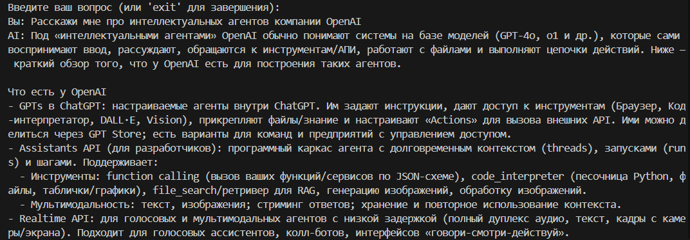

# Лабораторная работа №1. Знакомство с OpenAI API. Написание простого текстового ассистента

<ins>Цель</ins>: научиться работать с OpenAI API, чтобы создать простого текстового ассистента, который может отвечать на ваши вопросы.



---

## План

1. Настройка окружения;
2. Обращение к OpenAI Responses API;
3. Главный цикл;
4. Troubleshooting;
5. Задания.

---

## 1. Настройка окружения

Сначала создаём виртуальное окружение:

```bash
python -m venv venv
```

Активируем его:

```bash
venv\Scripts\activate
```

Теперь установим библиотеку OpenAI:

```bash
pip install openai
```

Создадим файл `requirements.txt` и скопируем в него список установленных библиотек.
```bash
pip freeze > requirements.txt
```

Чтобы хранить API-ключ безопасно, создаём файл **`.env`** в корне
проекта:

```plaintext
OPENAI_API_KEY=your-api-key-here
```

**Важно!** Добавьте `.env` в `.gitignore`, чтобы не загрузить ключ в
репозиторий.

### Полезные советы:

1.  API-ключ берём [в личном кабинете
    OpenAI](https://platform.openai.com/api-keys).
2.  Никому не передавайте свой ключ!
3.  Создайте файл `requirements.txt`, чтобы сохранить список
    зависимостей:

```bash
pip freeze > requirements.txt
```

## 2. Обращение к OpenAI Responses API

Создаём файл **`main.py`** и пишем базовый код:

```python
import sys
from openai import OpenAI
from dotenv import load_dotenv
import os

load_dotenv()

api_key = os.getenv("OPENAI_API_KEY")

client = OpenAI(api_key=api_key)

def get_response(text: str, client: OpenAI):
    response = client.responses.create(model="gpt-5", input=text)
    return response
```

Что здесь происходит:

- **Импорты**:

  - `sys` - работа с системными функциями.
  - `OpenAI` - основной класс для API.
  - `load_dotenv` - загружает переменные из `.env`.
  - `os` - для доступа к переменным окружения.

- **Настройка окружения**: Загружаем `.env` и достаём API-ключ:

  ```python
  load_dotenv()
  api_key = os.getenv("OPENAI_API_KEY")
  ```

- **Создаём клиента OpenAI**:

  ```python
  client = OpenAI(api_key=api_key)
  ```

- **Функция для запроса к API**:

  ```python
  def get_response(text: str, client: OpenAI):
      response = client.responses.create(model="gpt-5", input=text)
      return response
  ```

---

## 3. Главный цикл

Теперь добавляем интерактивное общение:

```python
if __name__ == "__main__":
    print("Введите ваш вопрос (или 'exit' для выхода):")
    while True:
        question = input("Вы: ")
        if question.lower() == "exit":
            print("Завершение программы.")
            break
        answer = get_response(question, client)
        print("AI:", answer.output_text)
```

Как это работает:

- Программа запустится, только если её вызвать напрямую;
- Показываем пользователю подсказку;
- Запускаем бесконечный цикл общения;
- Если введено `exit` - выходим;
- Иначе отправляем запрос в API и выводим ответ.

---

## 4. Troubleshooting

### Ошибка авторизации

    openai.error.AuthenticationError: Incorrect API key provided

Проверьте ключ в `.env` и его путь.

### Модуль не найден

    ModuleNotFoundError: No module named 'openai'

Активируйте виртуальное окружение и установите библиотеку.

### Ошибка сети

    openai.error.APIConnectionError: Connection timeout

Проверьте интернет, брандмауэр, попробуйте VPN (скорее всего проблема в отсутствии VPN :-D).

### Ошибка запроса

    openai.error.InvalidRequestError

Проверьте:

- Название модели;
- Длину текста;
- Формат данных.

### Превышен лимит запросов

    openai.error.RateLimitError

Проверьте лимиты и добавьте задержку при повторных запросах.

---

## 5. Задание

1. Реализовать использование `системного промпта` через переменную окружения .env, либо через ручной ввод/выбор промпта и его сохраниение в базу данных при выборе соответствующей опции в терминале;
2. Поиграться с параметром `temperature` в настройках языковой модели, проанализировать поведение языковой модели, результат отразить в отчёте;
3. Реализовать ведение истории диалога (контекста переписки с ассистентом), чтобы ИИ помнил, о чём пользователь с ним разговаривал. Длину истории сообщений ограничить до 6 последних сообщений (3 пользовательских, 3 ИИшных).

---
