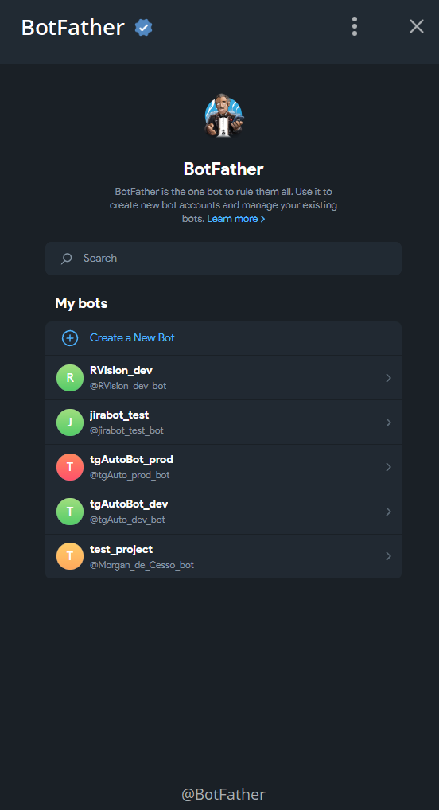
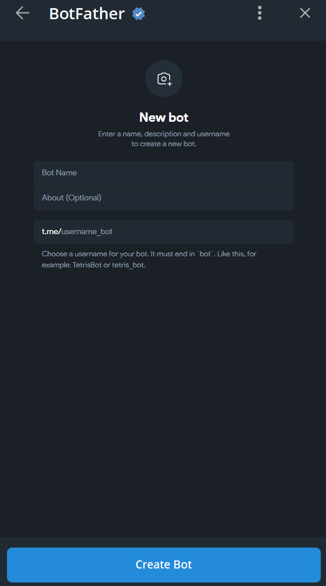
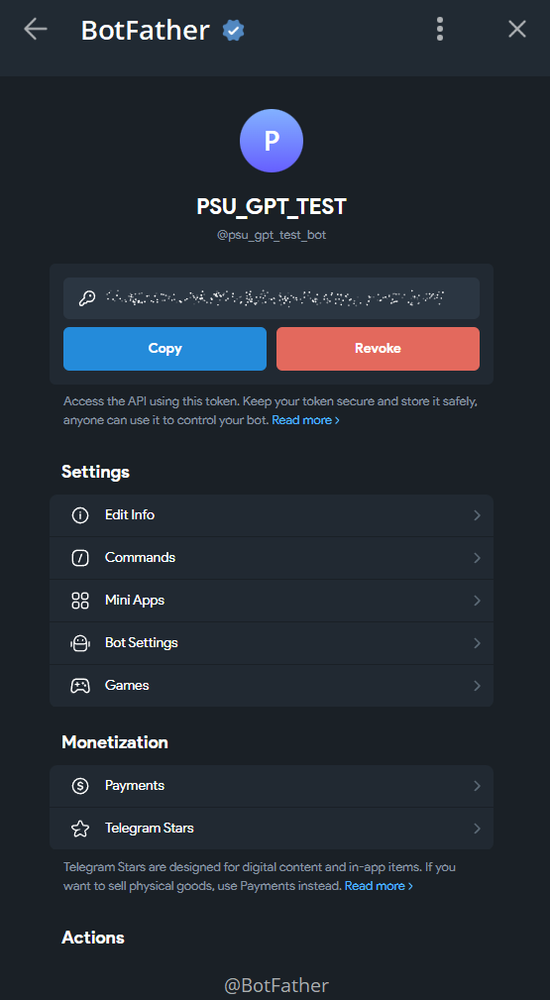
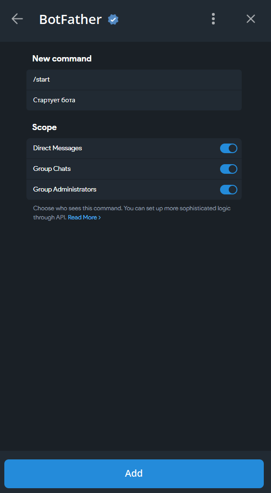

# Лабораторная работа №2. Простейший чат-бот в Telegram

<ins>Цель</ins>: получение навыков работы с библиотекой Aiogram, связка API OpenAI и написанного бота.

## План

1. Настройка окружения;
2. Написание основных функций бота;
3. Задания.

---

## 1. Настройка окружения

При начале разработки абсолютно любого бота первым делом необходимо получить токен бота. Для этого необходимо зайти в [BotFather](https://t.me/botfather) и выполнить следующие действия:

1. Нажать на кнопку `Start`;
2. Открыть меню по кнопке `Open`;



3. Нажать на кнопку `Create new bot`;



4. Ввести имя бота и его адрес (опционально можно задать описание и фото). Адрес обязательно должен кончаться на `bot`;
5. Нажать на кнопку `Create bot`;

6. В окне с информацией о боте получить токен бота;



7. Создадим базовую команду `/start`. Для этого в меню бота перейдем во вкладку `Commands` и заполним обязательные поля, после чего нажмем на кнопку `Add`;



Создав бота и получив токен, можно приступать к формированию файла с переменными окружения. В папке проекта создайте файл `.env` и скопируйте в него токен бота. Из прошлой лабораторной работы мы знаем, что для создания ассистента нам нужен API-ключ от OpenAI. Внесите его в файл `.env`.
```plaintext
BOT_TOKEN=your-bot-token-here
OPENAI_API_KEY=your-api-key-here
```

По аналогии с предыдущей лабораторной работой создадим виртуальное окружение и установим библиотеки.
```bash
python -m venv venv
```
```bash
venv\Scripts\activate
```
```bash
pip install aiogram openai python-dotenv
```

Создадим файл `requirements.txt` и скопируем в него список установленных библиотек.
```bash
pip freeze > requirements.txt
```

**Важно!** Добавьте `.env` в `.gitignore`, чтобы не загрузить токен с API-ключом в репозиторий.

---

## 2. Написание основных функций бота

Первым делом создадим файл `config.py`. В него мы будем добавлять переменные окружения.

```python
from dotenv import load_dotenv
import os

load_dotenv()

TOKEN = os.getenv("BOT_TOKEN")
OPENAI_API_KEY = os.getenv("OPENAI_API_KEY")
```

В папке проекта создадим две папки: `handlers` и `utils`. В первой будут храниться обработчики событий, во второй - вспомогательные функции. В обоих создадим файлы `__init__.py` - файлы, необходимые для работы папок как пакетов. В папке `utis` создадим файл `loader.py` со следующим содержимым:

```python
from aiogram import Bot, Dispatcher
from aiogram.client.default import DefaultBotProperties
from aiogram.enums import ParseMode
from config import TOKEN

dp = Dispatcher()
bot = Bot(token=TOKEN, default=DefaultBotProperties(parse_mode=ParseMode.HTML))
```

Как видно, мы импортируем библиотеки, загружаем переменные окружения и создаем бота и диспетчер. Бот - это объект, который будет отвечать за взаимодействие с пользователем. Диспетчер - это объект, который будет отвечать за обработку событий. Также мы устанавливаем HTML-парсинг, чтобы можно было использовать HTML-теги в сообщениях.

Создадим в этой же папке файл `gpt.py` со следующим содержимым:

```python
from openai import AsyncOpenAI
from config import OPENAI_API_KEY
import logging

client = AsyncOpenAI(api_key=OPENAI_API_KEY)

async def get_response(message: str, client: AsyncOpenAI) -> str:
    try:
        response = await client.responses.create(
            model="gpt-4o-mini",
            input=message
        )
        return response.output_text
    except Exception as e:
        logging.error(f"Error occurred: {e}")
        return "Произошла ошибка при получении ответа"
```

Обратите внимание, что мы используем асинхронные функции, так как бот будет работать в асинхронном режиме. Код выше, за исключением обозначенного ранее, полностью аналогичен коду из прошлой лабораторной работы.

В файле `__init__.py` добавим следующий код:
```python
from . import loader

__all__ = ['loader'] 
```

Данный код позволяет импортировать модули из папки `utils` в другие модули.

Перейдем к папке `handlers` и создадим там два новых файла: `commands.py` и `messages.py`. В первом будут храниться обработчики команд, во втором - обработчики сообщений.

В файле `commands.py` добавим следующий код:

```python
from utils.loader import dp
import logging
from aiogram.filters import CommandStart
from aiogram.types import Message

@dp.message(CommandStart())
async def command_start_handler(message: Message) -> None:
    try:
        await message.answer(f"Привет, {message.from_user.full_name}, я твой бот-ассистент! Можешь задавать мне вопросы, и я буду отвечать на них. \
            Пожалуйста, помни про свой баланс на счету аккаунта в OpenAI и не ддось меня без необходимости)")
    except Exception as e:
        logging.error(f"Error occurred: {e}")
    
```

Как можно заметить, данный код выполняет функцию базовой команды `/start`. В случае успешного выполнения, бот отправляет пользователю сообщение с приветствием. В случае ошибки, бот отправляет в логгер сообщение об ошибке.

В файле `messages.py` добавим следующий код:

```python
from utils.loader import dp
import logging
from aiogram.types import Message
from utils.gpt import get_response, client

@dp.message()
async def message_handler(message: Message) -> None:
    try:
        response = await get_response(message.text, client)
        await message.answer(response)
    except Exception as e:
        logging.error(f"Error occurred: {e}")
        await message.answer("Произошла ошибка при получении ответа")
```

Данный код выполняет функцию обработки сообщений. В случае успешного выполнения, бот отправляет пользователю ответ от ассистента. В случае ошибки, бот отправляет пользователю сообщение об ошибке.

В файле `__init__.py` добавим следующий код:

```python
from .commands import dp
from .messages import dp

__all__ = ['dp']
```

Данный код позволяет импортировать модули из папки `handlers` в другие модули.

Наконец, создадим файл `main.py` со следующим содержимым:

```python
import asyncio
import logging
import sys
from handlers import dp
from utils.loader import bot

async def main():
    try:
        await dp.start_polling(bot)
    except Exception as e:
        logging.error(f"Error occurred: {e}")

if __name__ == "__main__":
    logging.basicConfig(level=logging.INFO, stream=sys.stdout)
    asyncio.run(main())
```

Что делает данный код? Диспатчер запускает процесс поллинга - цикл, который слушает входящие сообщения и обрабатывает их. По сути это эдакий echo-function. Конструкция if __name__ == "__main__" позволяет запустить код только в случае, если файл запускается напрямую, а не импортируется в другой файл. Внутри мы устанавливаем уровень логирования и запускаем процесс поллинга посредством библиотеки asyncio.

Запустите бота с помощью команды:

```bash
python main.py
```

---

## 3. Задания

1. Добавьте к ассистенту системный промпт;
2. Сделайте так, чтобы бот знал имя пользователя и при ответе обращался к нему по имени;
3. Добавьте хранение сообщений (добавьте базу данных);
4. Добавьте поддержку контекста диалога (используйте базу данных из задания 3);
4. Добавьте команду `/reset-context`, которая будет сбрасывать контекст диалога;
5. Добавьте поддержку отправки изображений (без их обработки нейронкой, в реплае просто текстом отвечайте, что "Вы отправили картинку!").

---