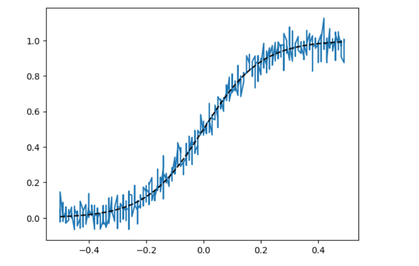
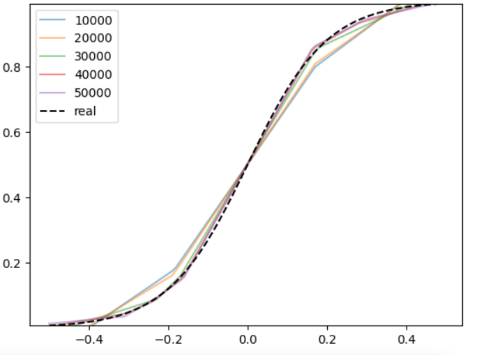
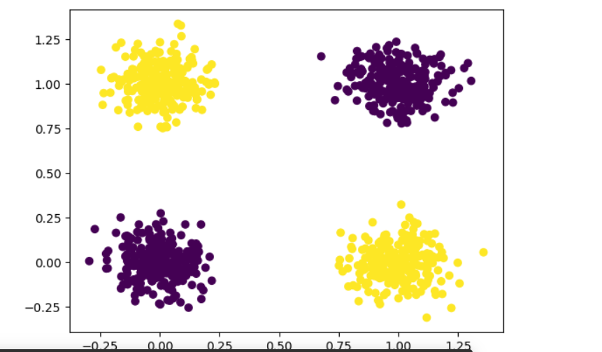
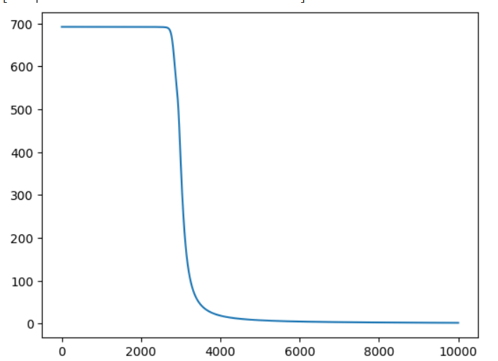
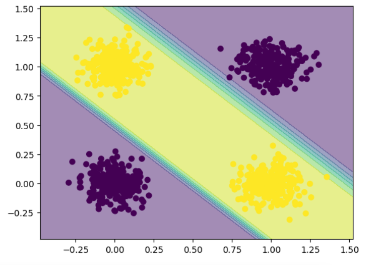
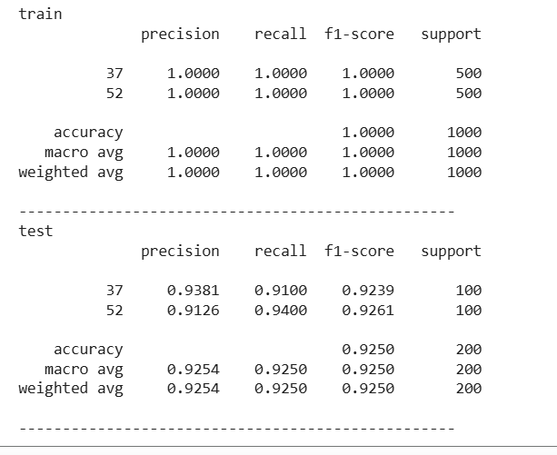

# Отчёт. Лабораторная работа №1. Введение в DL.

## Цель работы

Познакомиться с фреймворком машинного обучения PyTorch и выполнить три задания:

- Регрессия по теореме универсальной аппроксимации, ручное дифференцирование.
- Бинарная классификация с помощью автодифференцирования PyTorch.
- Обучить полносвязную нейронную сеть для классификации 3 классов изображений из набора данных CIFAR100 по заданному варианту и повысить точность на тестовой выборке.

# Ход работы

## Задание 1. Регрессия с ручным дифференцированием

### Постановка задачи

Требуется провести обучение простейшей нейронной сети (многослойного перцептрона с одним скрытым слоем и функцией активации ReLU) для задачи аппроксимации зашумлённой сигмоидальной функции. Вычисление градиентов реализуется вручную.


Скриншот 1: Исходные данные и целевая функция.

На скриншоте представлены исходные данные для регрессии: зашумленная выборка (синяя линия) и целевая гладкая сигмоидальная функция (черный пунктир).


Скриншот 2: Результат обучения модели.

На представленном графике видно, что обученная модель  успешно восстановила целевую сигмоидальную функцию, эффективно отфильтровав шум исходных данных. Этот результат является наглядной иллюстрацией принципа универсальной аппроксимации.

## Задание 2. Бинарная классификация с автодифференцированием PyTorch

### Постановка задачи

Требуется решить задачу бинарной классификации для синтетических данных с использованием нейронной сети.
Для примера решения задач использовалась задача XOR.



На скриншоте представлен синтетический датасет для бинарной классификации. Точки двух классов окрашены в разные цвета, видна их нелинейная разделимость.

- Однослойный персептрон не способен решить данную задачу, ввиду своей линейности, в отличии от многослойного персептрона.

Процесс обучения заключается в минимизации функции потерь. Данная задача была выполнена, что подтверждает следующее изображение.



Результат классификации и разделяющая граница:



## Задание 3

### Постановка задачи

Финальным задание была классификация изображений из выборки CIFAR100. Классификация изображений CIFAR-100 — это задача компьютерного зрения, в которой модель должна определить, к какому из 100 классов относится изображение.

Согласно варианту, были выбраны 3 класса из набора данных CIFAR-100:
Класс № [Номер группы + 11] = [Название класса]
Класс № [Номер варианта + 37] = [Название класса]
Класс № [Произвольный третий класс] = [Название класса]

```
GROUP = 26
VARIANT = 15
# Классы по условию: номер группы + 11, номер варианта + 37
CLASSES = [GROUP + 11, VARIANT + 37]
```

Пример изображения из выборки CIFAR100:


### Архитектура базовой модели

Была создана полносвязная нейронная сет со следующей архитектурой:
```
   
    nn.Linear(32*32*3, hidden_size * 2),
    nn.BatchNorm1d(hidden_size * 2),
    nn.ReLU(),
    nn.Dropout(0.25),
        
    
    nn.Linear(hidden_size * 2, hidden_size),
    nn.BatchNorm1d(hidden_size),
    nn.ReLU(),
    nn.Dropout(0.25),
        
      
    nn.Linear(hidden_size, hidden_size // 2),
    nn.BatchNorm1d(hidden_size // 2),
    nn.ReLU(),
    nn.Dropout(0.2),
        
      
    nn.Linear(hidden_size // 2, classes)
```


Сравнение результатов:



модель демонстрирует хорошую эффективность на обучающей выборке, однако на тестовых данных наблюдается снижение качества, что требует дополнительного анализа и, возможно, корректировки модели для улучшения обобщающей способности.
# Вывод

В ходе выполнения лабораторной работы была изучена библиотека PyTorch, предназначенная для создания и обучения нейронных сетей. Кроме того, исследован датасет CIFAR100, который, в отличие от MNIST, состоит из полноцветных (RGB) изображений реальных объектов, что усложняет задачу классификации.