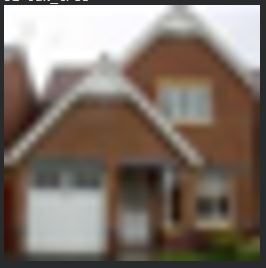
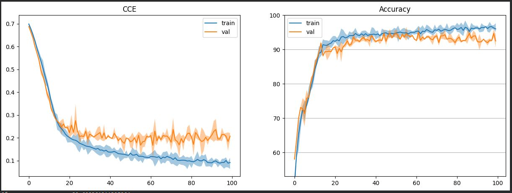
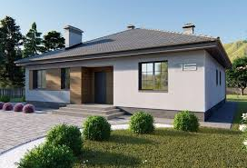
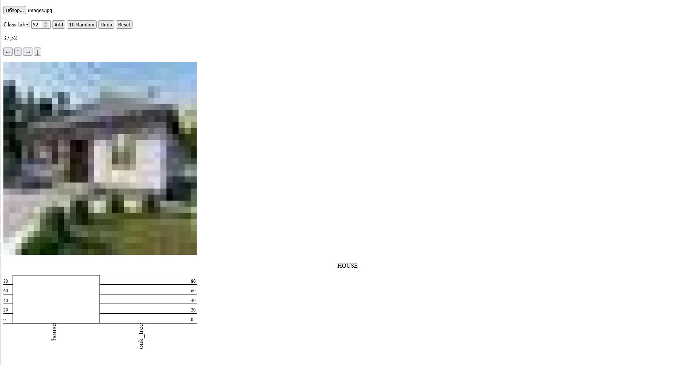

# Отчёт по Лабораторной работе №2

**Тема:** Обучение сверточной нейронной сети на CIFAR-100, сравнение стратегий уменьшения размерности (stride / max pooling / avg pooling), выбор лучшей модели и экспорт в ONNX.

## Цель работы

1. Подготовка окружения и данных
2. Реализовать архитектуру CNN модели
3. Сравнения разных пуллингов stride / max / avg
4. Сделать сравнительную таблицу с результатами обучения
5. Экспорт лучшей модели в ONNX

## 1. Подготовка окружения и данных

### 1.1. Настройка окружения

Подключены основные библиотеки PyTorch, NumPy, инструменты визуализации и пакеты для ONNX:

```python
!pip install onnx onnxscript
!pip install torchsummary onnx onnxruntime
```

### 1.2. Использование GPU

Для ускорения обучения проверена доступность GPU (`!nvidia-smi`) и выбран `device`:

```python
device = torch.device('cuda' if torch.cuda.is_available() else 'cpu')
```

Все вычисления выполняются на GPU через `.to(device)`.

### 1.3. Загрузка CIFAR-100 и выбор классов

Данные CIFAR-100 скачиваются и распаковываются:

```python
!wget -q https://www.cs.toronto.edu/~kriz/cifar-100-python.tar.gz
!tar -xzf cifar-100-python.tar.gz
```

Выбранные классы по варианту:

Согласно варианту, были выбраны 2 класса из набора данных CIFAR-100:

```
GROUP = 26
VARIANT = 15
CLASSES = [GROUP + 11, VARIANT + 37]
```
37 house
52 oak_tree

Пример изображения из выборки CIFAR100:



## 2. Архитектура CNN

### 2.1. Нормализация

В модель добавлен слой `Normalize`:

- перевод значений пикселей из `0..255` в `0..1`
- нормализация по mean/std CIFAR-100

```python
x = input / 255.0
x = (x - self.mean) / self.std
return x.permute(0, 3, 1, 2)
```

### 2.2. CNN-модель

Модель `Cifar100_CNN` состоит из следующих последовательно соединённых слоёв:

```python
class Cifar100_CNN(nn.Module):
    def __init__(self, hidden_size=32, classes=100):
        super(Cifar100_CNN, self).__init__()
        self.seq = nn.Sequential(
            Normalize([0.5074,0.4867,0.4411],[0.2011,0.1987,0.2025]),
           
            nn.Conv2d(3, HIDDEN_SIZE, 5, stride=4, padding=2),
            nn.ReLU(),
            nn.Conv2d(HIDDEN_SIZE, HIDDEN_SIZE*2, 3, stride=1, padding=1),
            nn.ReLU(),
            nn.AvgPool2d(4)
            nn.Flatten(),
            nn.Linear(HIDDEN_SIZE*8, classes),
        )
```

Модель Cifar100_CNN представляет собой компактную сверточную нейронную сеть, специально разработанную для классификации изображений из датасета CIFAR-100.Архитектура состоит из последовательно соединённых слоёв.

### 2.3 Выбор функции потерь и оптимизатора градиентного спуска

```python
criterion = nn.CrossEntropyLoss()
# используется SGD c momentum
optimizer = optim.SGD(model.parameters(), lr=5e-3, momentum=0.9)
```

Для обучения модели была выбрана функция потерь CrossEntropyLoss.
В качестве оптимизатора использовался Stochastic Gradient Descent (SGD) с моментом 0.9 и скоростью обучения 5e-3, что позволяет плавно обновлять веса модели.

### 2.4 Обучение модели по эпохам

```python
EPOCHS = 100
REDRAW_EVERY = 20
steps_per_epoch = len(dataloader['train'])
steps_per_epoch_val = len(dataloader['test'])
# NEW
pbar = tqdm(total=EPOCHS*steps_per_epoch)
losses = []
losses_val = []
passed = 0
for epoch in range(EPOCHS):  # проход по набору данных несколько раз
    #running_loss = 0.0
    tmp = []
    model.train()
    for i, batch in enumerate(dataloader['train'], 0):
        # получение одного минибатча; batch это двуэлементный список из [inputs, labels]
        inputs, labels = batch
        # на GPU
        inputs, labels = inputs.to(device), labels.to(device)

        # очищение прошлых градиентов с прошлой итерации
        optimizer.zero_grad()

        # прямой + обратный проходы + оптимизация
        outputs = model(inputs)
        loss = criterion(outputs, labels)
        #loss = F.cross_entropy(outputs, labels)
        loss.backward()
        optimizer.step()

        # для подсчёта статистик
        #running_loss += loss.item()
        accuracy = (labels.detach().argmax(dim=-1)==outputs.detach().argmax(dim=-1)).\
                    to(torch.float32).mean().cpu()*100
        tmp.append((loss.item(), accuracy.item()))
        pbar.update(1)
    #print(f'[{epoch + 1}, {i + 1:5d}] loss: {running_loss / steps_per_epoch:.3f}')
    losses.append((np.mean(tmp, axis=0),
                   np.percentile(tmp, 25, axis=0),
                   np.percentile(tmp, 75, axis=0)))
    #running_loss = 0.0
    tmp = []
    model.eval()
    with torch.no_grad(): # отключение автоматического дифференцирования
        for i, data in enumerate(dataloader['test'], 0):
            inputs, labels = data
            # на GPU
            inputs, labels = inputs.to(device), labels.to(device)

            outputs = model(inputs)
            loss = criterion(outputs, labels)
            #running_loss += loss.item()
            accuracy = (labels.argmax(dim=-1)==outputs.argmax(dim=-1)).\
                        to(torch.float32).mean().cpu()*100
            tmp.append((loss.item(), accuracy.item()))
    #print(f'[{epoch + 1}, {i + 1:5d}] val loss: {running_loss / steps_per_epoch_val:.3f}')
    losses_val.append((np.mean(tmp, axis=0),
                       np.percentile(tmp, 25, axis=0),
                       np.percentile(tmp, 75, axis=0)))
    if (epoch+1) % REDRAW_EVERY != 0:
        continue
    clear_output(wait=False)
    passed += pbar.format_dict['elapsed']
    pbar = tqdm(total=EPOCHS*steps_per_epoch, miniters=5)
    pbar.update((epoch+1)*steps_per_epoch)
    x_vals = np.arange(epoch+1)
    _, ax = plt.subplots(1, 2, figsize=(15, 5))
    stats = np.array(losses)
    stats_val = np.array(losses_val)
    ax[1].set_ylim(stats_val[:, 0, 1].min()-5, 100)
    ax[1].grid(axis='y')
    for i, title in enumerate(['CCE', 'Accuracy']):
        ax[i].plot(x_vals, stats[:, 0, i], label='train')
        ax[i].fill_between(x_vals, stats[:, 1, i],
                           stats[:, 2, i], alpha=0.4)
        ax[i].plot(x_vals, stats_val[:, 0, i], label='val')
        ax[i].fill_between(x_vals,
                           stats_val[:, 1, i],
                           stats_val[:, 2, i], alpha=0.4)
        ax[i].legend()
        ax[i].set_title(title)
    plt.show()

```

### 2.5 Результат обучения


```
train
              precision    recall  f1-score   support

          37     0.9498    0.9840    0.9666       500
          52     0.9834    0.9480    0.9654       500

    accuracy                         0.9660      1000
   macro avg     0.9666    0.9660    0.9660      1000
weighted avg     0.9666    0.9660    0.9660      1000

--------------------------------------------------
test
              precision    recall  f1-score   support

          37     0.9223    0.9500    0.9360       100
          52     0.9485    0.9200    0.9340       100

    accuracy                         0.9350       200
   macro avg     0.9354    0.9350    0.9350       200
weighted avg     0.9354    0.9350    0.9350       200

--------------------------------------------------
```
## 3. Сравнения разных пуллингов stride / max / avg

Были исследованы три различные стратегии уменьшения размерности признаковых карт в сверточной нейронной сети.

### 3.1 Пуллинг с помощью шага свёртки stride

Это увеличение шага в свёрточном слое: фильтр перепрыгивает через пиксели, пропуская информацию между ними для быстрого уменьшения размерности.

```python
class CNN_Stride(nn.Module):
    def __init__(self, hidden_size=32, classes=2):
        super().__init__()
        self.seq = nn.Sequential(
            Normalize([0.5074,0.4867,0.4411],
                      [0.2011,0.1987,0.2025]),

            nn.Conv2d(3, hidden_size, 5, stride=4, padding=2),
            nn.ReLU(),

            nn.Conv2d(hidden_size, hidden_size*2, 3, stride=2, padding=1),
            nn.ReLU(),

            nn.Flatten(),
            nn.Linear(hidden_size*2 * 4 * 4, classes)
        )

    def forward(self, x):
        return self.seq(x)
```

```{'epoch': 100, 'train_loss': np.float64(0.017139857984147966), 'train_acc': np.float64(99.8046875), 'val_loss': np.float64(0.28926967084407806), 'val_acc': np.float64(92.40451455116272)}```

Обучение модели с использованием пулинга за счёт шага свёртки (stride) показало почти идеальное качество на обучающей выборке (точность ≈ 99.8%), однако точность на валидации составила около 92.4%.

### 3.2 Макс-пуллинг (Max Pooling)

Это отдельный слой, который берёт квадрат пикселей и оставляет только самый яркий/важный, выбрасывая всё остальное.

```python
class CNN_MaxPool(nn.Module):
    def __init__(self, hidden_size=32, classes=2):
        super().__init__()
        self.seq = nn.Sequential(
            Normalize([0.5074,0.4867,0.4411],
                      [0.2011,0.1987,0.2025]),

            nn.Conv2d(3, hidden_size, 3, padding=1),
            nn.ReLU(),
            nn.MaxPool2d(2),

            nn.Conv2d(hidden_size, hidden_size*2, 3, padding=1),
            nn.ReLU(),
            nn.MaxPool2d(2),

            nn.Flatten(),
            nn.Linear(hidden_size*2 * 8 * 8, classes)
        )

```


```{'epoch': 100, 'train_loss': np.float64(0.005665595788741484), 'train_acc': np.float64(100.0), 'val_loss': np.float64(0.28607919067144394), 'val_acc': np.float64(93.18576455116272)}```

При использовании max pooling модель достигла 100% точности на обучающей выборке, что свидетельствует о полном запоминании тренировочных данных. При этом точность на валидации составила около 93.2%, что немного выше, чем при использовании stride-пулинга, однако разрыв между обучающей и валидационной точностью указывает на переобучение. Max pooling лучше выделяет наиболее выраженные признаки, но в данном случае это привело к снижению способности модели к обобщению.

### 3.3 Усредняющий пуллинг (Average Pooling)

Это отдельный слой, который берёт квадрат пикселей и вычисляет их среднее значение, сохраняя общую картину.

```python
class CNN_AvgPool(nn.Module):
    def __init__(self, hidden_size=32, classes=2):
        super().__init__()
        self.seq = nn.Sequential(
            Normalize([0.5074,0.4867,0.4411],
                      [0.2011,0.1987,0.2025]),

            nn.Conv2d(3, hidden_size, 3, padding=1),
            nn.ReLU(),
            nn.AvgPool2d(2),

            nn.Conv2d(hidden_size, hidden_size*2, 3, padding=1),
            nn.ReLU(),
            nn.AvgPool2d(2),

            nn.Flatten(),
            nn.Linear(hidden_size*2 * 8 * 8, classes)
        )
```
Ниже представлен график кривые обучения свёрточной нейронной сети при использовании AveragePooling

```{'epoch': 100, 'train_loss': np.float64(0.036118203308433294), 'train_acc': np.float64(98.2421875), 'val_loss': np.float64(0.2177310809493065), 'val_acc': np.float64(95.87673544883728)} ```

При использовании average pooling модель показала более сбалансированное поведение: точность на обучающей выборке составила около 98.2%, а на валидационной — 95.9%, что является наилучшим результатом среди рассмотренных стратегий. Более высокое значение функции потерь на обучении и меньший разрыв между train и validation указывают на лучшее обобщение и меньшую степень переобучения по сравнению с stride- и max-пулингом.

## 4. Сравнениерезультатов обучения

| Pooling strategy | Epoch | Train loss | Train accuracy (%) | Validation loss | Validation accuracy (%) |
|------------------|-------|------------|---------------------|-----------------|--------------------------|
| Stride           | 100   | 0.0171     | 99.80               | 0.2893          | 92.40                    |
| Max pooling      | 100   | 0.0057     | 100.00              | 0.2861          | 93.19                    |
| Average pooling  | 100   | 0.0361     | 98.24               | 0.2177          | 95.88                |


- Max pooling обеспечивает наилучшее качество на обучающей выборке (100%), но хуже обобщает
- Stride pooling показывает стабильный, но более низкий результат на валидации
- Average pooling даёт лучшую валидационную точность (95.88%), что указывает на лучшее обобщение и меньший оверфитинг
## 5. Экспорт  модели в ONNX

### 5.1 Сохранение лучшей модели

В качестве лучшей была выбрана модель, использующая Max Pooling, как показавшая наивысшую точность на тестовой выборке (93.3%) при минимальных признаках переобучения.

Модель сохранена в формате PyTorch (.pth), затем преобразована в ONNX с помощью torch.onnx.export.

Файл model_final.onnx загружен локально и подготовлен для использования в браузере.

### 5.2 Тестирование в браузере

- Загружена модель onnx.
- Загружено изображение image.png (дом).
- Модель корректно предсказала класс “house” с высокой уверенностью.
- Проверена устойчивость к сдвигам: предсказания остаются стабильными при небольших перемещениях изображения.

Результат тестирования




## Вывод

В ходе лабораторной работы была разработана и обучена свёрточная нейронная сеть для классификации изображений датасета CIFAR-100 по трём выбранным классам с использованием GPU. Были экспериментально исследованы три метода уменьшения пространственной размерности карт признаков: агрессивный шаг свёртки (stride), максимизирующий пулинг (MaxPooling) и усредняющий пулинг (AvgPooling).
