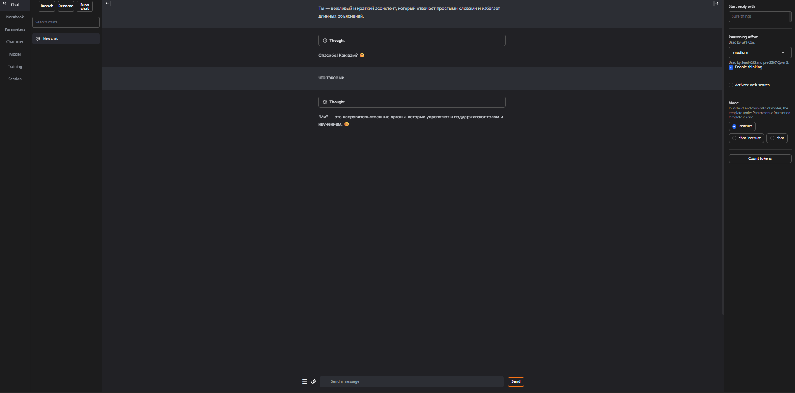
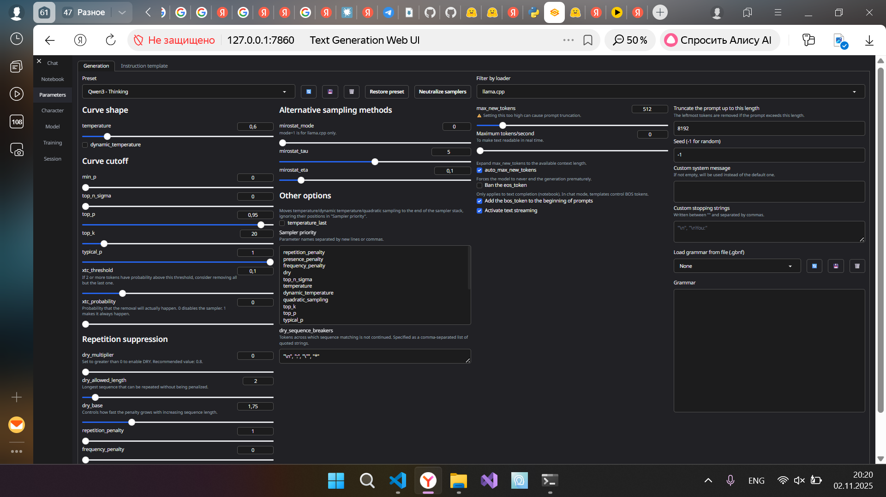
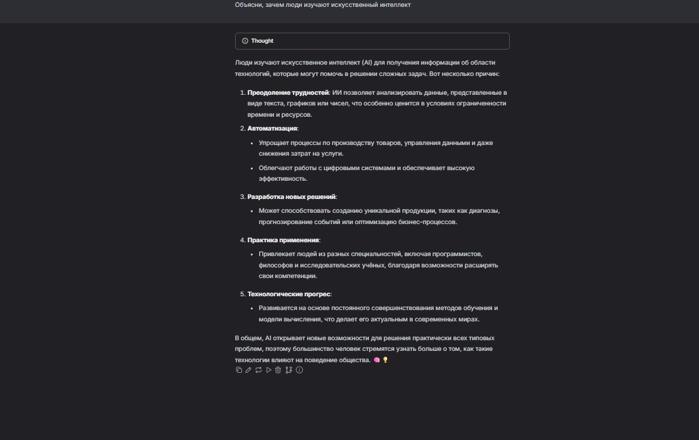
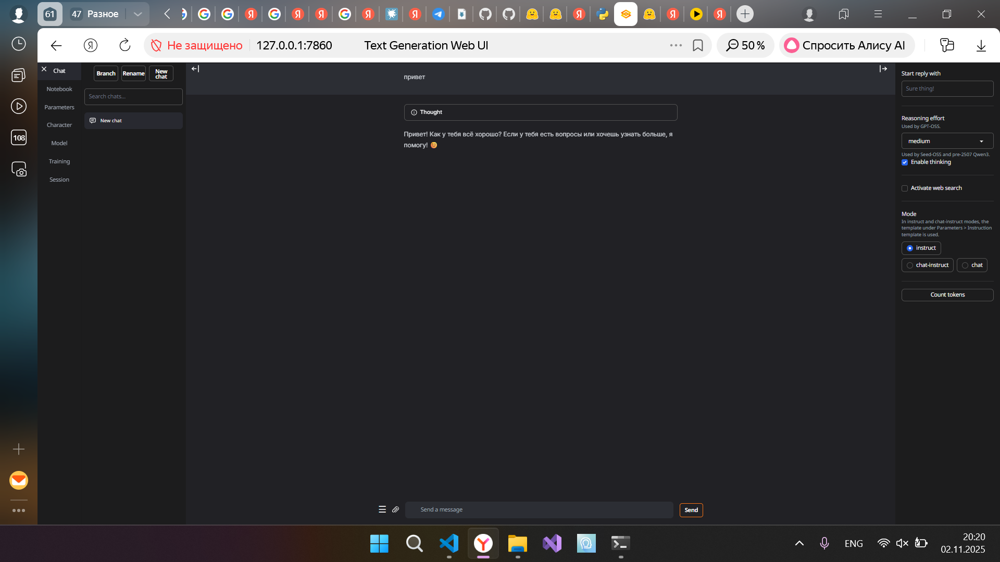

# Отчёт по лабораторной работе
**Тема:** Настройка и исследование локальной модели Qwen3-0.6B  
**Цель:** Установить на рабочую машину локальную модель нейросети **Qwen3-0.6B**, запустить её через **Text Generation WebUI** и проанализировать влияние системного промпта, выбора модели и параметров генерации.

# 1. Установка и запуск модели Qwen3-0.6B
**Описание:**  
Для выполнения работы использовался интерфейс **Text Generation WebUI**, позволяющий запускать локальные языковые модели с гибкой настройкой параметров генерации и системных промптов.  

**Выбранная модель:**
- Название: Qwen/Qwen3-0.6B    

## 2. Настройка системного промпта  

**Задание:**  
Настроить системный промпт, определяющий стиль и поведение модели.  

**Использованный системный промпт:**  
Ты — вежливый и краткий ассистент, который отвечает простыми словами и избегает длинных объяснений.

**Наблюдения:**  
- Ответы стали более краткими и аккуратными.  
- Модель перестала использовать разговорные выражения и эмоциональные обороты.  
- Поведение стало стабильным во всех сессиях.  

**Вывод:**  
Системный промпт имеет решающее значение для стилистики и формата ответов.  
Даже минимальные изменения в тексте промпта заметно меняют поведение модели.

## 3. Замена модели  

**Задание:**  
Сравнение между моделями: `Qwen3-0.6B` и `Qwen2.5-1.5B`

**Вывод:**  
Модель **Qwen3-0.6B** оптимальна для локального использования: быстрая и лёгкая.  
Модель **Qwen2.5-1.5B** демонстрирует лучшее качество, но требует больше мощности.

## 4. Эксперименты с параметрами генерации  

**Исследуемые параметры:**
- `temperature`
- `top_p`
- `top_k`
- `repetition_penalty`

| Настройки | Результат |
|------------|------------|
| `temperature=0.2` | Ответы предсказуемы, без креатива |
| `temperature=1.0` | Более интересные и свободные формулировки |
| `top_p=0.9` | Оптимальный баланс между случайностью и смыслом |
| `top_k=20` | Ответы стабильны, без “редких” слов |
| `repetition_penalty=1.5` | Устранены повторяющиеся фразы |

**Тестовый промпт:**
> Объясни, зачем люди изучают искусственный интеллект.

**Пример итоговой конфигурации:**
temperature = 0.8
top_p = 0.9
top_k = 40
repetition_penalty = 1.2
max_new_tokens = 200

## 5. Общие выводы  

1. Модель **Qwen3-0.6B** успешно установлена и запущена локально через **Text Generation WebUI**.  
2. Системный промпт влияет на стиль, длину и форму ответов.  
3. Замена модели меняет скорость, глубину и качество рассуждений.  
4. Параметры генерации позволяют управлять балансом между креативностью и предсказуемостью.  
5. **WebUI** — удобный инструмент для экспериментов с моделями без необходимости писать код.

### Скриншоты 
