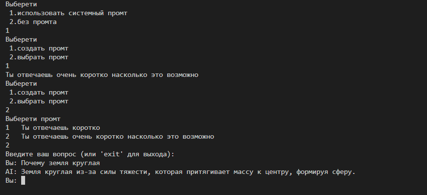
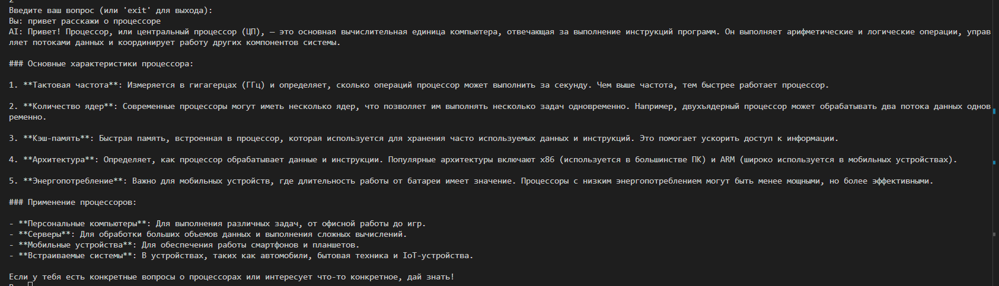
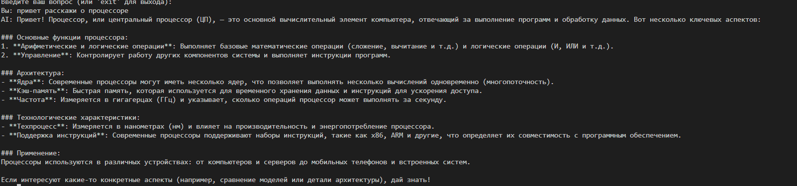
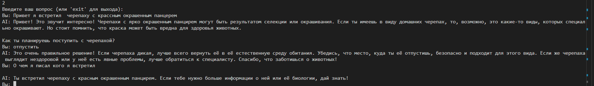

# **Лабораторная работа №1**

## **Тема:** Ознакомление с OpenAI API и создание текстового ассистента

### **Цель работы**

Главная задача данной лабораторной работы — понять, как работать с API OpenAI, и создать базового текстового ассистента, который сможет вести диалог с пользователем, учитывая контекст и настройки модели.

### **Используемые технологии и инструменты**

- **Язык программирования:** Python
- **Основная библиотека:** `openai` — для взаимодействия с языковой моделью OpenAI;

### **Ход работы**

#### **1. Подключение системного промпта через базу данных SQLLite**

Реализован интерфейс для создания и выбора промптов:
***Создание нового промпта:**
```python
if(cmd == "1"):
    text = input()
    cursor.execute("INSERT INTO promt (text) VALUES (?)", (text,))
    con.commit()
```
***Выбор существуещего промпта:**
```python
cursor.execute("SELECT * FROM promt")
pomt_db = cursor.fetchall()
for p in pomt_db:
    print(ii, " ", p[1])
    ii += 1
num = int(input())
sytem_promt = pomt_db[num-1][1]

***Интеграция промпта в диалог**
```python
if(sytem_promt):
    history.append({"role": "system", "content": sytem_promt})
```

**Результат выполнения:**
Программа протестированна на следующем промте "Ты отвечаешь очень коротко насколько это возможно"



- Модель действительно дает максимально краткие ответы
- Промпт эффективно влияет на поведение AI
- Система успешно применяет выбранный промпт


#### **2. Эксперимент с параметром `temperature`**

В дальнейшем код был дополнен возможностью изменения параметра `temperature`, отвечающего за степень вариативности ответов модели.


```python
def get_response(text, client: OpenAI, temperature=0.7):
    response = client.responses.create(model="gpt-4o-mini", input=text,temperature=temperature)
    return response
```

**Ход эксперимента:**

- При `temperature = 0.1` модель выдавала устойчивые и предсказуемые ответы.  
  

- При увеличении температуры до `1.0` наблюдалось появление креативность.
  

#### **3. Ведение истории диалога (контекста переписки)**

Для обеспечения возможности модели помнить предыдущие сообщения была реализована система ведения истории диалога. Контекст переписки ограничивался шестью последними сообщениями (по три от пользователя и от ассистента). Это позволяло улучшить качество ответов и точность взаимодействия.

Пример кода:

```python
hh+=2
history.append({"role": "user", "content": question})
answer = get_response(history, client)

history.append({"role": "assistant", "content": answer.output_text})
if(hh==6):
    #print(history)
    print(sytem_promt)
    hh=0
    history = []
    if(sytem_promt):
        history=[{"role": "system", "content": sytem_promt}]
```

**Результат работы:**



#### **3. Вывод**

В ходе выполнения лабораторной работы была успешно достигнута поставленная цель: освоены принципы взаимодействия с OpenAI API и реализован текстовый ассистент, способный вести осмысленный диалог с пользователем.