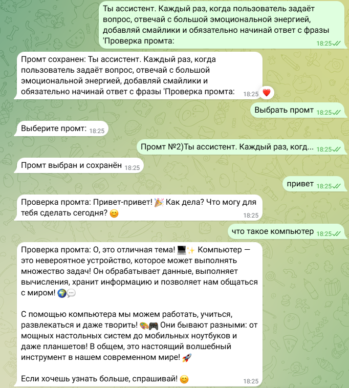
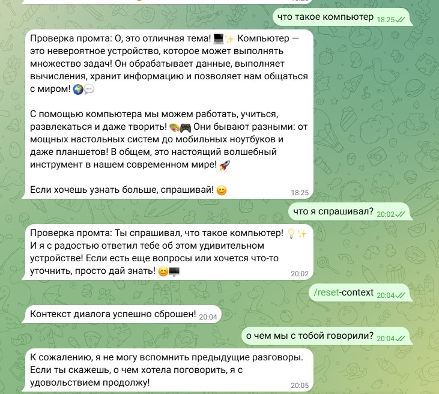
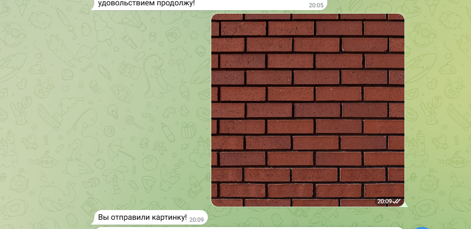

# Лабораторная работа №2: Простейший чат-бот в Telegram

## Цель работы

Цель лабораторной работы — получение навыков работы с библиотекой Aiogram, связка API OpenAI и написанного бота.
  
## Реализованные задачи

В коде были реализованы следующие задачи:

1. **Добавление  системного промпта**:
    
```
@dp.message(lambda message: message.text == "Выбрать промт")
async def get_choose_promt(message: Message):
    user_id = str(message.from_user.id)

    with get_session() as session:
        prompts = (
            session.query(Prompt)
            .filter_by(user_id=user_id)
            .order_by(Prompt.id.desc())
            .all()
        )

    if not prompts:
        await message.answer("У вас пока нет сохранённых промтов")
        return

    keyboard = ReplyKeyboardMarkup(keyboard=[], resize_keyboard=True)

    for p in prompts:
        short = p.text[:30] + "..." if len(p.text) > 30 else p.text
        btn = KeyboardButton(text=f"Промт №{p.id}){short}")
        keyboard.keyboard.append([btn])

    keyboard.keyboard.append([KeyboardButton(text="Отмена")])
    await message.answer("Выберите промт:", reply_markup=keyboard)

```
Код создаёт обработчик для команды "Выбрать промт", который извлекает все сохранённые промты пользователя из базы, формирует для них кнопки с обрезанным текстом и отправляет сообщение с клавиатурой для выбора промта или отмены.

**Результат работы:**
Бот генерирует ответы, используя системный контекст.



2. **Добавление функции обращения к пользователю по имени**:
Для того чтобы бот знал имя пользователя, используем атрибут message.from_user.full_name
    
   

3. **Добавление хранения сообщений и поддержку контекста диалога**:
```
async def message_handler(message: Message):
    user_id = str(message.from_user.id)
    user_text = message.text

    try:
        with get_session() as session:
            dialog = (
                session.query(Dialog)
                .filter_by(user_id=user_id)
                .order_by(Dialog.id.asc())
                .first()
            )

            if not dialog:
                dialog = Dialog(user_id=user_id, data="[]")
                session.add(dialog)
                session.commit()

            obj_data = dialog.data

            try:
                messages = json.loads(obj_data) if obj_data else []
                if isinstance(messages, dict):
                    messages = [messages]
            except:
                messages = []

            messages.append({"role": "user", "content": user_text})

            assistant_text = await get_response(messages, client)

            messages.append({"role": "assistant", "content": assistant_text})

            dialog.data = json.dumps(messages, ensure_ascii=False)
            print(dialog.data)
            session.commit()

        await message.answer(assistant_text)
```
  Этот код добавляет обработку сообщений с сохранением истории диалога и поддержкой контекста: он получает текст пользователя, загружает из базы историю сообщений (Dialog) или создаёт новую, добавляет сообщение пользователя в историю, отправляет весь контекст в get_response для генерации ответа ассистента, добавляет ответ в историю, сохраняет обновлённый диалог в базе и отправляет ответ пользователю.

  Для упрощения задачи и быстрого прототипирования я решил использовать SQLite для хранения истории сообщений и подключаться к нему, что позволяет эффективно управлять данными без необходимости использования более сложных баз данных. Это обеспечило простоту реализации и ускорение процесса разработки, что идеально подходит для учебного прототипа.

4. **Добавление команды /resetcontext, которая будет сбрасывать контекст диалога**
```
@dp.message(Command("reset-context"))
async def reset_context(message: Message):
    user_id = str(message.from_user.id)
    try:
        with get_session() as session:
            dialog = (
                session.query(Dialog)
                .filter_by(user_id=user_id)
                .order_by(Dialog.id.asc())
                .first()
            )

            if not dialog:
                await message.answer("Диалог не найден")
                return

            dialog.data = json.dumps([], ensure_ascii=False)
            session.commit()

        await message.answer(
            "Контекст диалога успешно сброшен!",
            reply_markup=keyboard_choose
        )

    except Exception as e:
        logging.error(f"Error occurred while resetting context: {e}")
        await message.answer("Произошла ошибка при сбросе контекста")
```
   Этот код добавляет команду /reset-context, которая очищает историю диалога пользователя: он ищет запись Dialog по user_id, если диалог найден — сбрасывает его данные в пустой список, сохраняет изменения в базе и уведомляет пользователя об успешном сбросе контекста, иначе сообщает, что диалог не найден, а при ошибках логирует их и информирует пользователя.



4. **Добавление поддержки отправки изображений (без их обработки нейронкой).**
```
@dp.message(F.content_type == ContentType.PHOTO)
async def handle_photo(message: Message):
    await message.answer("Вы отправили картинку!")
```


## Вывод
В ходе лабораторной работы был создан Telegram-бот с использованием библиотеки `Aiogram` и интеграцией с `API OpenAI`. Бот поддерживает системный промпт для задания контекста общения, обращается к пользователю по имени и запоминает историю диалогов с помощью базы данных. Реализована команда `/resetcontext` для сброса истории, а также обработка изображений. В результате работы были получены навыки работы с асинхронным программированием, Telegram API и хранением данных, а также реализована поддержка контекста и взаимодействие с пользователем на более персонализированном уровне.
