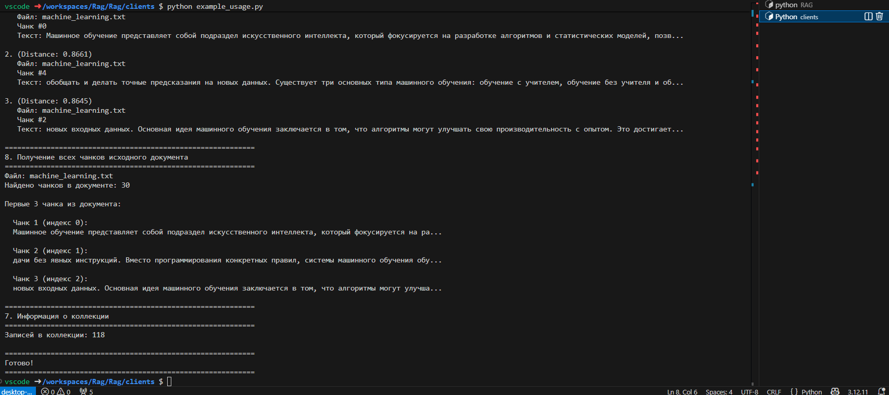
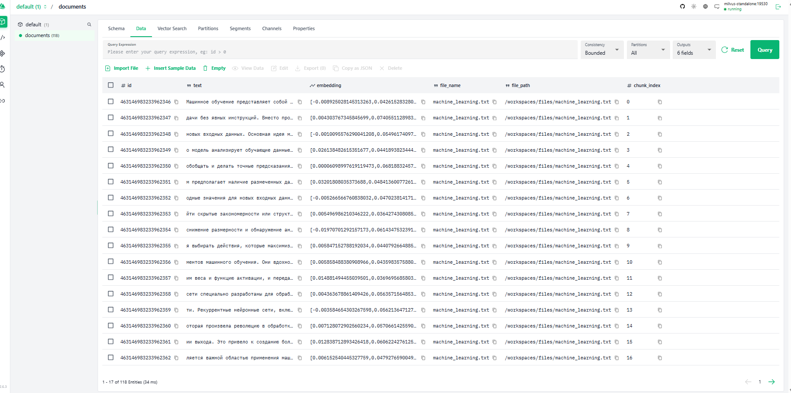
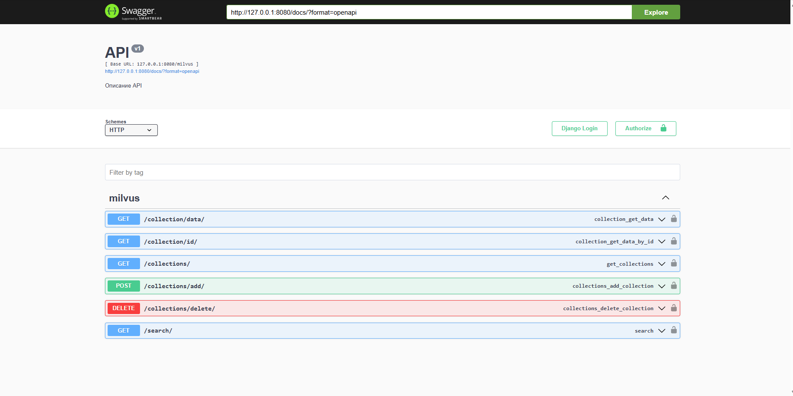
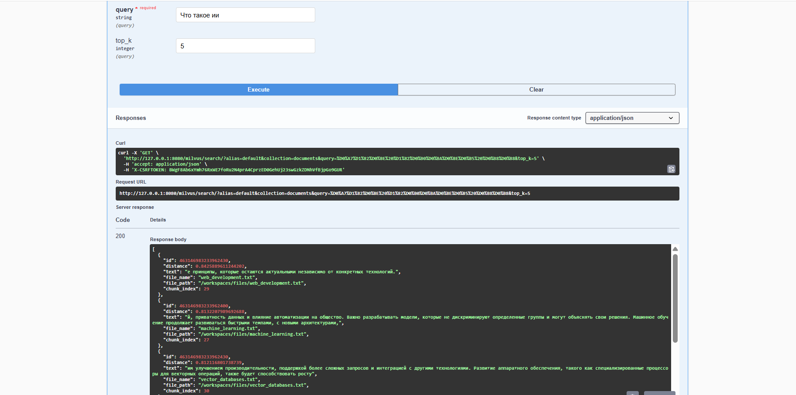

# Лабораторная работа №3. Векторные базы данных и семантический поиск

## Цель

Целью работы было научиться использовать векторные базы данных и семантический поиск для обработки текстовых данных и потенциальной интеграции с LLM (Large Language Models).

## План

1. Настройка окружения;
2. Создание модуля для работы с Milvus;
3. Парсинг текстовых файлов;
4. Задания.

## Ход работы

В ходе лабораторной работы была исследована векторная база данных, предназначенная для хранения и обработки текстовой информации, а также использован интерфейс пользователя, подключенный к этой базе.

На первом этапе работы было запущено окружение в формате dev container. Благодаря использованию предоставленных конфигурационных файлов и инструментов VS Code, этот процесс был выполнен оперативно.

После запуска окружения, для продолжения выполнения заданий, потребовалось заполнить базу данных данными из подготовленных текстовых файлов. Это было реализовано с помощью запуска скрипта example_usage.py, который автоматически обрабатывает текстовые файлы: преобразует информацию в векторные представления, разделяет текст на фрагменты (чанки) и загружает их в базу данных.



### Задание 1

Рабочая область была подготовлена, после чего docker-compose файл настроили для поддержки GPU. Путём раскомментирования параметра gpus: all была добавлена возможность использовать ресурсы видеокарты через CUDA для генерации эмбеддингов.


```yaml
app:
  build:
    context: ..
    dockerfile: .devcontainer/Dockerfile
  container_name: milvus-lab-app
  working_dir: /workspaces
  volumes:
    - ../:/workspaces
  command: sleep infinity
  gpus: all
  depends_on:
    - standalone
  networks:
    - internal-network
```
### Задание 2
Реализовано полноценное API для работы с векторной базой данных Milvus с использованием Django Rest Framework.

Созданы следующие методы контроллера MilvusController:

1) get_data — Получение всех данных из указанной коллекции Milvus.

2) get_data_by_id — Поиск записи в коллекции по её уникальному идентификатору.

3) get_collections — Получение списка всех доступных коллекций в Milvus.

4) search — Семантический поиск по коллекции с использованием эмбеддингов. Принимает текстовый запрос, преобразует его в вектор и находит наиболее похожие документы.

5) add_collection — Загрузка документа в систему. Файл сохраняется в объектное хранилище MinIO, его текст обрабатывается (разбивается на фрагменты), преобразуется в векторные эмбеддинги и сохраняется в новую или существующую коллекцию Milvus.

6) delete_collection — Удаление всех данных из указанной коллекции.

Все методы API оснащены автоматической документацией с использованием drf-yasg (Swagger) и имеют корректную обработку ошибок подключения к Milvus.

Метод search


### Вывод:
В ходе работы была настроена система на основе Milvus и Attu для работы с векторными данными. Через интерфейс Attu успешно проведён поиск по коллекциям, что подтвердило работоспособность системы. Настроено использование GPU для ускорения генерации эмбеддингов. Для взаимодействия с системой реализован REST API. В результате создана эффективная платформа для семантического поиска.