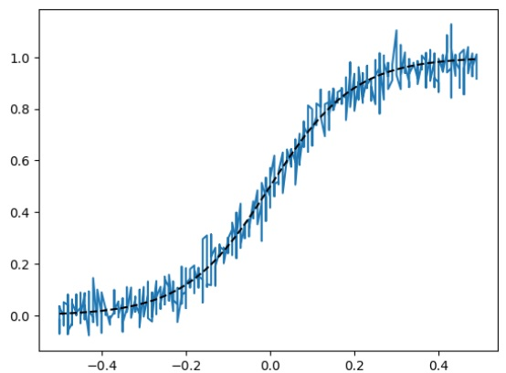
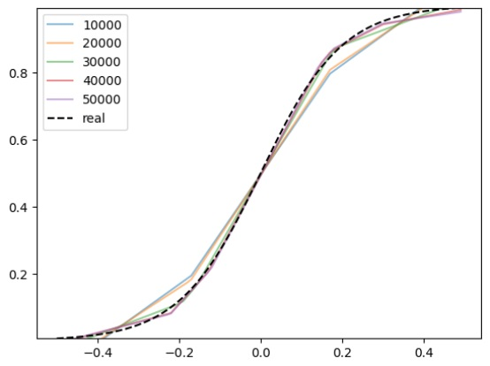
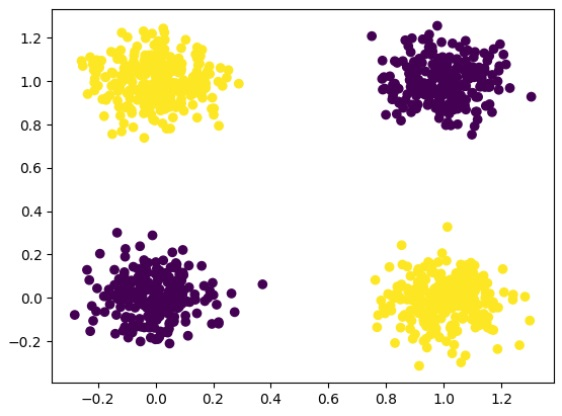
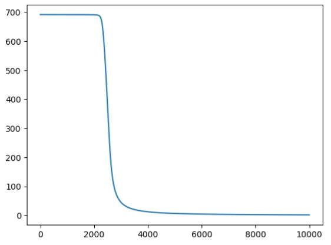

# Отчёт. Лабораторная работа №1. Введение в глубокое обучение

## Задание

Цель работы — познакомиться с фреймворком PyTorch и выполнить несколько заданий:

- Регрессия с использованием теоремы универсальной аппроксимации и ручного дифференцирования.
- Бинарная классификация с автодифференцированием в PyTorch.
- Обучение полносвязной нейронной сети для классификации изображений из набора данных CIFAR-100.

## Задание №1. Регрессия с использованием теоремы универсальной аппроксимации и ручного дифференцирования

Теорема универсальной аппроксимации утверждает, что нейронная сеть с одним скрытым слоем и достаточным количеством нейронов способна аппроксимировать любую непрерывную функцию с заданной точностью.

Задача в этом упражнении заключалась в обучении нейронной сети для предсказания непрерывных значений, то есть решения задачи регрессии. Для обучения использовался градиентный спуск, который требует вычислений производных.

Ручное дифференцирование включает вычисление производных функции потерь по весам сети. В этом случае применялось правило цепочки для многослойных сетей.

После подготовки данных и настройки нейронной сети, вычисления проводились с использованием библиотеки PyTorch, а для отображения результатов использовалась библиотека matplotlib.

### Результат обучения:

На первом графике изображен процесс подготовки данных, а на втором — как ошибка модели снижается в ходе обучения нейронной сети, позволяя ей успешно аппроксимировать сигмоидальную функцию и устранять шум.

Каждые 10,000 эпох веса нейронной сети обновляются, и модель становится всё более точной. На графике это видно - по мере обучения линия предсказаний приближается к истинной сигмоидальной функции. С каждым обновлением ошибка уменьшается, и модель всё точнее аппроксимирует сигмоид.

## Задание №2. Бинарная классификация с использованием автодифференцирования в PyTorch

В этом разделе мы решали задачу бинарной классификации, в которой модель должна была определить один из двух классов (например, 0 или 1).

После подготовки данных, основанных на искусственной выборке с двумя классами, была обучена нейронная сеть с использованием автодифференцирования, применяя метод градиентного спуска и подходящую для бинарной классификации функцию потерь.

Для улучшения результатов была выбрана новая функция активации, которая оказалась более эффективной в данной задаче.

### Результат обучения:

Когда функция потерь начала существенно уменьшаться, мы оценили результаты. Модель научилась различать два класса — жёлтые и фиолетовые точки, что подтвердило успешность её обучения.

На графике показан процесс изменения функции потерь. В ходе обучения модели на протяжении 10,000 итераций. Ось X отображает количество итераций (шагов обучения), от 0 до 10,000. Ось Y показывает значение функции потерь, которая измеряет различие между истинными метками и предсказаниями модели. В начале обучения функция потерь резко снижается, что говорит о значительном улучшении модели, после чего график плавно выравнивается и продолжает снижаться, что свидетельствует о постепенном улучшении предсказаний модели. Это типичная картина для обучения нейронной сети, где на первых этапах модель быстро достигает улучшений, а на более поздних шагах коррекции становятся менее заметными.

## Задание №3. Классификация изображений CIFAR-100

Задача классификации изображений из набора CIFAR-100 заключается в том, чтобы модель определила, к какому из 100 классов относится данное изображение.

Датасет CIFAR-100 включает 60 000 цветных изображений размером 32×32 пикселя, которые равномерно распределены между 100 классами. Для классификации мы выбрали два класса (33, 70).

После подготовки и загрузки данных была построена модель многослойного перцептрона (MLP) с одним скрытым слоем. В процессе обучения использовался оптимизатор градиентного спуска, а для вычисления ошибки применялась кросс-энтропийная функция потерь.
Исходная модель демонстрировала определённую точность, и задача состояла в её улучшении путём изменения архитектуры сети, подбора гиперпараметров и методов обучения.

### Результаты обучения:

Модель обучается решать задачу классификации изображений из набора данных CIFAR-100. Мы обучаем её различать два выбранных класса: класс 33 и класс 70.
В первоначальном варианте (файл Копия_блокнота__Lab1_ipynb_) была реализована простая MLP-модель со следующей архитектурой:

Входной слой: 3072 нейрона (32x32x3 пикселя).

Скрытый слой: 10 нейронов с функцией активации ReLU.

Выходной слой: 3 нейрона (соответствует двум выбранным классам: 33, 70).

Модель обучалась с использованием оптимизатора SGD (learning rate = 0.005) и функции потерь CrossEntropyLoss. Количество эпох — 250.
(./7.jpg)
(./6.jpg)
Для повышения точности в новой версии (файл ЛБ1Ь.ipynb) были внесены следующие изменения:

Усложнение архитектуры сети:

Увеличено количество нейронов в скрытом слое до 60.

Добавлены дополнительные скрытые слои: после первого скрытого слоя (60 нейронов) добавлен слой с 30 нейронами, затем с 10 нейронами.

Использована функция активации ReLU после каждого скрытого слоя.

Итоговая архитектура: 3072 → 60 → 30 → 10 → 2 (выходных нейрона для двух классов).

Другие параметры: Количество эпох обучения сокращено до 150, что, вероятно, было достаточным для сходимости более сложной модели. Размер батча увеличен (128->256). Оптимизатор и скорость обучения остались прежними (SGD, lr=0.005).

(./10.jpg)
(./6.jpg)

Как видно, точность классификации возросла с 91.5% до 95.0%. На графике динамики функции потерь видно плавное снижение как обучающей, так и валидационной ошибки, что свидетельствует о корректном обучении.

5. Выводы
Проделанная работа позволила значительно улучшить качество классификации изображений CIFAR-100. Основными факторами успеха стали:

Увеличение сложности модели: добавление дополнительных скрытых слоёв позволило сети выявлять более сложные нелинейные зависимости в данных.

Увеличение ёмкости сети: рост числа нейронов в слоях способствовал лучшему запоминанию признаков.

Корректный подбор гиперпараметров: выбранные параметры обучения обеспечили стабильную сходимость.

Полученная точность 95% на тестовой выборке подтверждает эффективность предложенных улучшений и возможность применения многослойных персептронов для решения задач классификации изображений.
