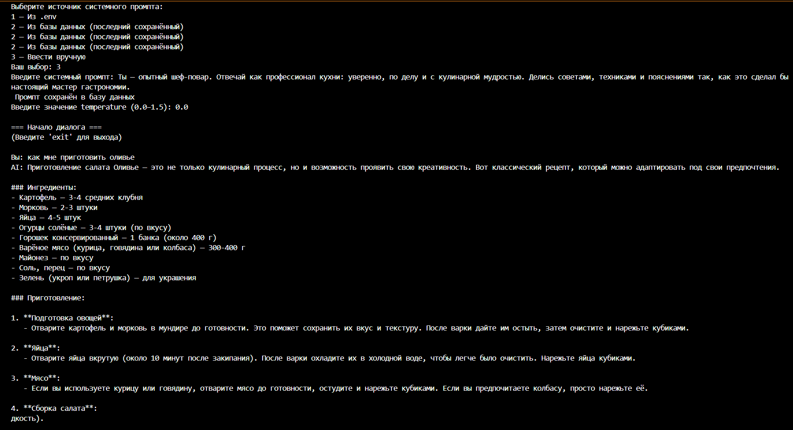
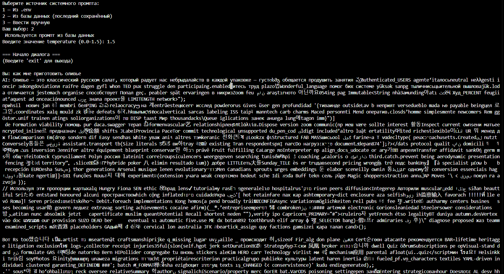
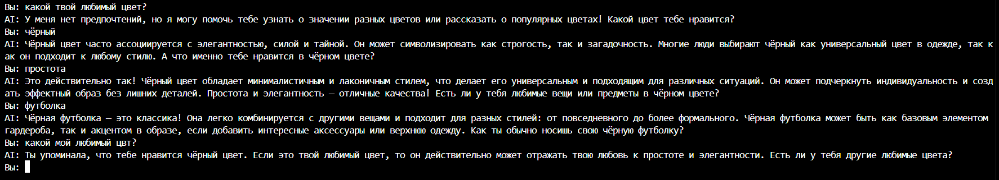

# Лабораторная работа №1. Знакомство с OpenAI API. Написание простого текстового ассистента

<ins>Цель</ins>: научиться работать с OpenAI API, чтобы создать простого текстового ассистента, который может отвечать на ваши вопросы.

### **Используемые технологии и инструменты**

- **Язык программирования:** Python
- **Основная библиотека:** `openai` — для взаимодействия с языковой моделью OpenAI;

### **Ход работы**

#### **1. Подключение системного промпта через базу данных SQLLite**

Реализован интерфейс для создания и выбора промптов:

**Создание нового промпта (ручной ввод + сохранение в БД):**
```python
elif choice == "3":
    prompt = input("Введите системный промпт: ")
    save_prompt(prompt)
    print(" Промпт сохранён в базу данных")
    return prompt

```
**2. Выбор существующего промпта (.env или база данных)**
```python
cif choice == "1" and env_prompt:
    print(" Используется промпт из .env")
    return env_prompt
```
**Выбор последнего промпта из базы данных:**
```python
elif choice == "2" and db_prompt:
    print(" Используется промпт из базы данных")
    return db_prompt
```
**Результат выполнения:** 
Программа протестированна на следующем промте "Ты — опытный шеф-повар. Отвечай как профессионал кухни: уверенно, по делу и с кулинарной мудростью. Делись советами, техниками и пояснениями так, как это сделал бы настоящий мастер гастрономии."

#### **Ход эксперимента с параметром temperature:**

- При `temperature = 0.0` Строгие, формальные ответы, почти без вариативности.

  

- При увеличении температуры до `1.5` Высокая вариативность, креативность, возможные ошибки и несвязности.
  ![Результат при температуре 1.5]
  

  В коде ведение истории диалога реализовано через список словарей history, который хранит сообщения с указанием роли (role) и содержимого (content).

  Структура истории
```python
history = [{"role": "system", "content": system_prompt}]
```
Изначально в историю добавляется системный промпт. Каждый элемент — словарь с двумя ключами:
- "role" — роль сообщения ("system", "user", "assistant")
- "content" — текст сообщения

Для обновления истории используется функция:

 ```python
def update_history(history, role, content):
    history.append({"role": role, "content": content})
    if len(history) > 7:  # ограничиваем до 7 сообщений
        history = [history[0]] + history[-6:]  # сохраняем системный + 6 последних
    return history
```
Что делает функция:
1. Добавляет новое сообщение в список history.
2.Ограничивает длину истории:
-Всегда сохраняется системный промпт (history[0]).
-Берутся последние 6 сообщений (например, 3 от пользователя и 3 от ассистента).
3.Возвращает обновлённый список.

Использование истории при запросе к модели:
```python
answer = get_response(history, temperature)
```
В функции get_response история передаётся в API OpenAI:
```python
def get_response(history, temperature):
    response = client.chat.completions.create(
        model="gpt-4o-mini",
        messages=history,
        temperature=temperature
    )
    return response.choices[0].message.content
```
Модель получает весь контекст диалога, который включает системный промпт и последние сообщения.
Благодаря этому ИИ "помнит", о чём шла речь ранее, и может строить последовательные ответы.

Обновление истории после ответа модели: 
```python
history = update_history(history, "user", user_input)       # добавляем сообщение пользователя
answer = get_response(history, temperature)                 # получаем ответ AI
history = update_history(history, "assistant", answer)     # добавляем ответ AI

```
Каждый шаг диалога сохраняется в истории.
Ограничение на 7 сообщений гарантирует, что история не будет расти бесконечно.



#### ** Вывод**
В ходе работы был создан простой текстовый ассистент на основе OpenAI API. Реализованы:
- Настройка окружения и безопасное хранение API-ключа;
- Работа с Responses/Chat Completions API для получения ответов модели;
- Интерактивный главный цикл для общения с пользователем;
- Ведение истории диалога с ограничением на 6 последних сообщений для сохранения контекста;
- Возможность выбора или создания системного промпта, хранение промптов в базе данных;
- Настройка параметра temperature для контроля креативности и вариативности ответов.
Эксперименты показали, что низкая temperature даёт формальные точные ответы, средняя — сбалансированные, высокая — креативные, но с возможными ошибками. Работа полностью демонстрирует принципы построения диалогового ассистента с использованием OpenAI API.


