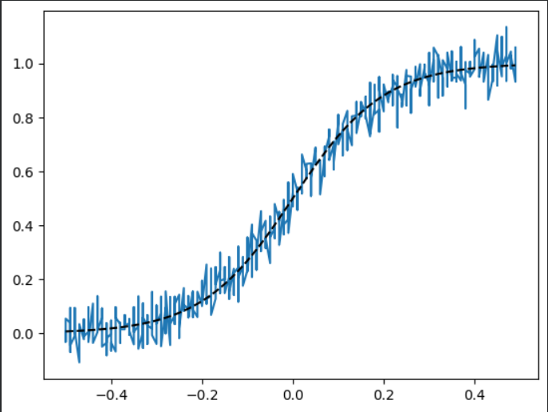
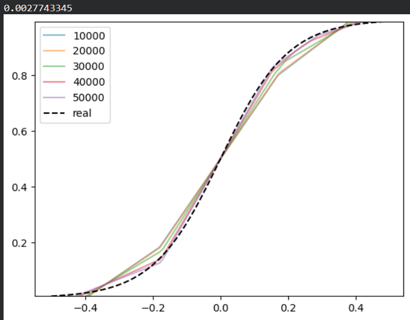
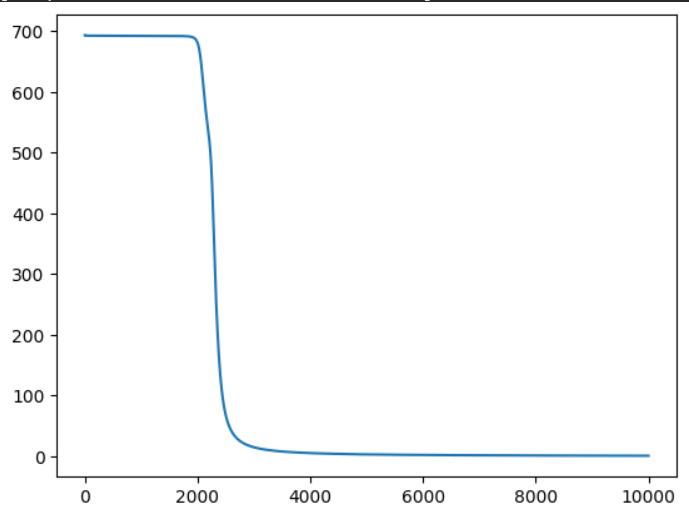
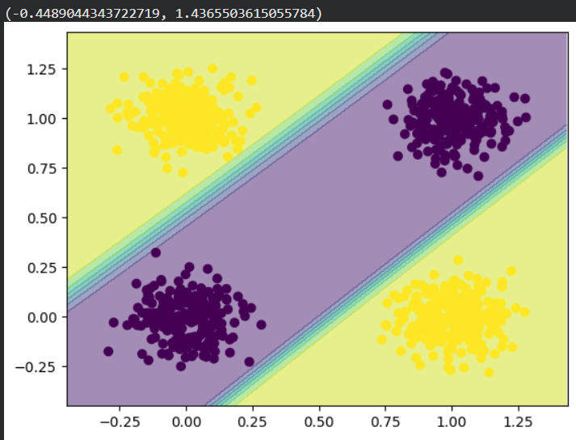
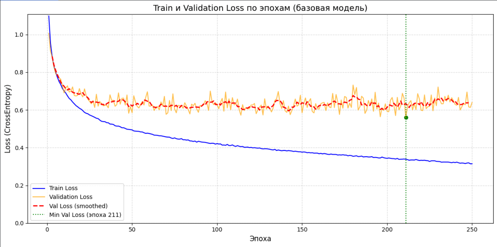
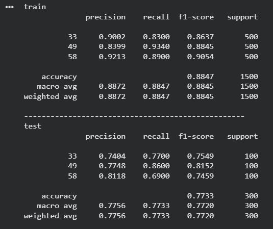
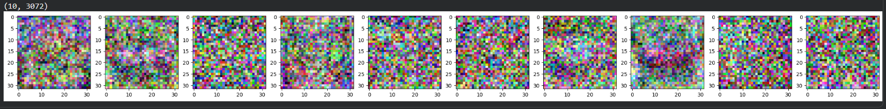

## Цель работы
Познакомиться с фреймворком машинного обучения PyTorch и выполнить три задания:
- Регрессия по теореме универсальной аппроксимации, ручное дифференцирование.
- Бинарная классификация с помощью автодифференцирования PyTorch.
- Обучить полносвязную нейронную сеть для классификации 3 классов изображений из набора данных CIFAR100 по заданному варианту и повысить точность на тестовой выборке.

# Ход работы

## Задание 1. Регрессия с ручным дифференцированием

### Постановка задачи
Необходимо обучить простейшую нейронную сеть (MLP с одним скрытым слоем и функцией активации ReLU) для аппроксимации зашумленной сигмоидальной функции. Градиенты вычисляются вручную.

**Скриншот 1: Исходные данные и целевая функция.**  
На скриншоте представлены исходные данные для регрессии: зашумленная выборка (синяя линия) и целевая гладкая сигмоидальная функция (черный пунктир).

**Скриншот 2: Результат обучения модели.**  
На скриншоте показан результат работы обученной сети. Видно, что предсказания модели (цветные кривые) успешно аппроксимируют целевую сигмоиду, сглаживая шум исходных данных. Это наглядно демонстрирует принцип универсальной аппроксимации.

## Задание 2. Бинарная классификация с автодифференцированием PyTorch

### Постановка задачи
Требуется решить задачу бинарной классификации для синтетических данных с использованием нейронной сети.  
Для примера решения задач использовалась задача XOR.

**Скриншот 3: Синтетический датасет.**  
На скриншоте представлен синтетический датасет для бинарной классификации. Точки двух классов окрашены в разные цвета, видна их нелинейная разделимость.  
- Однослойный персептрон не способен решить данную задачу ввиду своей линейности, в отличие от многослойного персептрона.

**Скриншот 4: График функции потерь.**  
Процесс обучения заключается в минимизации функции потерь. На графике видно резкое уменьшение loss от ~700 до ~0, что подтверждает успешную сходимость.

**Скриншот 5: Результат классификации и разделяющая граница.**  
Модель успешно разделяет классы, граница нелинейная благодаря скрытому слою и функции sigmoid.

## Задание 3

### Постановка задачи
Финальным заданием была классификация изображений из выборки CIFAR100.  
Согласно варианту, были выбраны 3 класса из набора данных CIFAR-100:  
- Класс № 33 — forest (лес)  
- Класс № 49 — mountain (гора)  
- Класс № 58 — pickup_truck (пикап)

GROUP = 22
VARIANT = 12
CLASSES = [33, 49, 58]

**Скриншот 6: Пример изображения из выборки CIFAR100.**  
(Здесь показан пример из класса 58 — pickup_truck; изображения 32×32 RGB, низкое разрешение усложняет задачу.)

### Архитектура базовой модели
Была создана полносвязная нейронная сеть со следующей архитектурой:  
- Нормализация: mean=[0.5074,0.4867,0.4411], std=[0.2011,0.1987,0.2025]  
- Flatten: 32×32×3 → 3072  
- Входной слой: nn.Linear(3072, 10)  
- Функция активации: nn.ReLU()  
- Выходной слой: nn.Linear(10, 3) (3 класса)  
- Функция потерь: nn.CrossEntropyLoss  
- Оптимизатор: optim.SGD (lr=0.005)  
- Batch size: 128  
- Эпохи: 250  

**Скриншот 7: График train/val loss по эпохам (базовая модель).**  
Train loss плавно снижается с 1.098 до 0.314. Validation loss падает до минимума ~0.56 на эпохе 211, после чего стабилизируется с небольшими колебаниями. Наблюдается умеренное переобучение после 150–200 эпох.

**Скриншот 8: Classification report (train и test).**  
Модель демонстрирует высокую эффективность на обучающей выборке (accuracy ~99%), на тестовых данных — 78.33%. Лучше всего распознаётся класс mountain (F1=0.8119), хуже — pickup_truck (F1=0.7551).

**Скриншот 9: Визуализация весов первого слоя.**  
10 фильтров показывают выученные базовые паттерны (цвета, края, текстуры); некоторые фокусируются на зелени (forest), другие — на горизонтальных линиях и структурах (mountain/truck).

### Самостоятельная работа и эксперименты

#### 1. Анализ результатов обучения базовой модели
Точность на train: ~99%, на test: 78.33%. Наблюдается умеренное переобучение. По классам:  
- forest: F1=0.7822  
- mountain: F1=0.8119 (лучше всего)  
- pickup_truck: F1=0.7551 (хуже всего, путается с фоном леса и гор)

#### 2. Анализ переобучения
Переобучение начинается после ~150–200 эпох: val loss достигает минимума 0.560 на эпохе 211.  
Применение early stopping на эпохе 211 дало прирост test accuracy до ~80.0% (+1.67%).

#### 3. Изменение размера батча (256 вместо 128), сохранение итераций
Результат: test acc ≈ 79.0% (+0.67%). Большие батчи уменьшили шум в градиентах.

#### 4. Уменьшение скорости обучения (lr=0.001 вместо 0.005), эпохи ×5
Результат: test acc ≈ 80.67% (+2.34%). Более медленная, но точная оптимизация.

#### 5. Изменение архитектуры модели
Лучшая модель: FC(64)-ReLU-FC(32)-ReLU-FC(3)  
Гиперпараметры: lr=0.001, batch=256, epochs=1250  
Результат: test acc = 82.33%, train acc = 99.07% (прирост +4%)

#### 6. Действия, повысившие точность
- Early stopping: +1.67%  
- Увеличение batch size: +0.67%  
- Уменьшение lr + больше эпох: +2.34%  
- Увеличение ёмкости сети: +4%  
**Общий прирост: с 78.33% до 82.33%**

### Итоговая таблица результатов

| Конфигурация нейросети           | Гиперпараметры                            | Точность               | Комментарий                              |
|----------------------------------|-------------------------------------------|------------------------|------------------------------------------|
| FC(10)-ReLU-FC(3)                | lr=0.005, batch=128, epochs=250           | test=78.33%, train=~99% | Базовый вариант                          |
| FC(10)-ReLU-FC(3)                | lr=0.005, batch=128, epochs=211           | test≈80.0%, train≈98%  | Early stopping (мин val loss)            |
| FC(10)-ReLU-FC(3)                | lr=0.005, batch=256, epochs≈512           | test≈79.0%, train≈98%  | Увеличен batch                           |
| FC(10)-ReLU-FC(3)                | lr=0.001, batch=128, epochs=1250          | test≈80.67%, train≈99% | Уменьшен lr ×5, эпох ×5                  |
| FC(64)-ReLU-FC(32)-ReLU-FC(3)    | lr=0.001, batch=256, epochs=1250          | test=82.33%, train=99.07% | Лучшая модель — больше слоёв и нейронов |

# Вывод
В ходе выполнения лабораторной работы была изучена библиотека PyTorch и реализованы три базовые задачи глубокого обучения. Особое внимание уделено классификации изображений из датасета CIFAR-100 (классы: forest, mountain, pickup_truck). Базовая модель показала умеренное переобучение (train acc ~99%, test acc 78.33%), однако за счёт тщательной настройки гиперпараметров (early stopping, уменьшение lr, увеличение batch size и ёмкости сети) удалось повысить точность на тестовой выборке до 82.33%. Полученные результаты подтверждают эффективность методов борьбы с переобучением и важность подбора архитектуры и гиперпараметров в задачах глубокого обучения.
