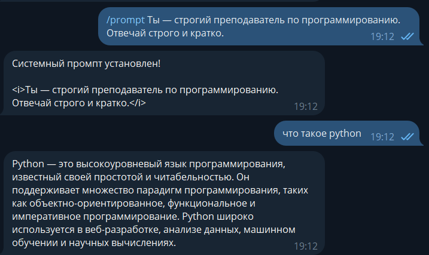
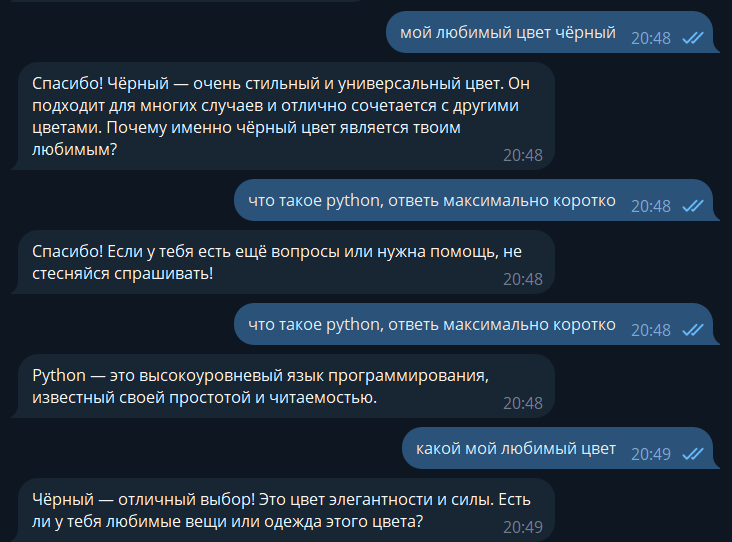
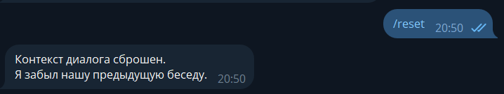

# Отчёт по лабораторной работе №2

## Простейший чат-бот в Telegram на Aiogram + OpenAI

---

##  Цель работы

Получить навыки работы с библиотекой **Aiogram**, API **OpenAI** и интеграции их в Telegram-бота.

---

##  План

1. Настройка окружения
2. Написание основных функций бота
3. Выполнение заданий


##  Структура проекта

```
2lab/
├── .env
├── .gitignore
├── main.py
├── config.py
├── requirements.txt
├── chat_bot.db
├── db/
│ ├── base.py
│ ├── models.py
│ └── context_service.py
├── handlers/
│ ├── init.py
│ ├── commands.py
│ ├── messages.py
│ └── images.py
└── utils/
├── init.py
└── gpt.py
```
# Выполнение заданий

---

## 1️ Системный промпт

В проекте реализована поддержка **системного промпта**, который определяет поведение ассистента.  
Промпт хранится в базе данных как сообщение с ролью `system` и всегда передаётся первым в контексте диалога.

### Команда:
/prompt [текст]

Позволяет пользователю динамически изменить поведение бота.

### Фрагмент кода (`handlers/commands.py`):

```python
@router.message(Command("prompt"))
async def command_prompt_handler(message: Message):
    prompt_text = message.text.replace("/prompt", "", 1).strip()
    add_message(message.from_user.id, "system", prompt_text)
```
## 2️ Обращение к пользователю по имени

Бот получает имя пользователя из Telegram и использует его при формировании запросов к OpenAI.


Реализация (handlers/messages.py):
```python
user_name = message.from_user.first_name
```
Имя пользователя добавляется в сообщение и сохраняется в базе данных.

## 3️ Хранение сообщений в базе данных

Для хранения данных в проекте используется **ORM SQLAlchemy**, которая обеспечивает
объектно-реляционное отображение и упрощает работу с базой данных.

В качестве системы управления базой данных используется **SQLite**,
доступ к которой осуществляется исключительно через ORM,
без написания SQL-запросов вручную.

В базе данных сохраняются:
- сообщения пользователей
- ответы ассистента
- системные промпты
- контекст текущего диалога

Каждое сообщение хранится с указанием роли (`system`, `user`, `assistant`)
и связано с конкретным пользователем Telegram.

## 4️ Поддержка контекста диалога

Бот поддерживает контекст диалога, что позволяет ему помнить предыдущие сообщения пользователя.



Контекст хранится в базе данных через ORM SQLAlchemy
и передаётся в OpenAI при каждом новом запросе.

Перед отправкой запроса используется ограничение на количество сообщений,
чтобы не превышать лимит контекста модели.

Пример логики (utils/gpt.py):

```python
context = get_context(user_id) or []

context.append({
    "role": "user",
    "content": message
})

response = client.chat.completions.create(
    model="gpt-4o-mini",
    messages=context,
    temperature=0.7
)
```
## 5️ Команда /reset

В боте реализована команда /reset, которая полностью очищает контекст диалога пользователя.



После выполнения команды бот «забывает» предыдущую историю общения.

Пример реализации (handlers/commands.py):
```python
@router.message(Command("reset"))
async def reset_context(message: Message):
    clear_context(message.from_user.id)
    await message.answer("Контекст диалога успешно сброшен!")
```

## 6️ Поддержка отправки изображений
Бот корректно обрабатывает отправку изображений.


При получении изображения бот отвечает текстовым сообщением,
сообщая пользователю, что изображение получено.

Пример обработчика (handlers/images.py):
```python
@router.message(F.photo)
async def photo_handler(message: Message):
    await message.answer("Вы отправили картинку!")
```
## Команды бота
Доступные команды Telegram-бота:

/start — запуск бота

/prompt <текст> — установить системный промпт

/reset — сбросить контекст диалога

## Вывод

В ходе лабораторной работы был разработан Telegram-бот с использованием библиотеки Aiogram и API OpenAI.
В результате работы были реализованы следующие возможности:

1.Интеграция с OpenAI GPT (модель gpt-4o-mini)

2.Поддержка системного промпта

3.Учет имени пользователя

4.Хранение данных через ORM SQLAlchemy

5.Поддержка контекста диалога

6.Команда сброса контекста

7.Обработка изображений

Разработанный бот демонстрирует практическое применение современных AI-технологий
и может служить основой для создания более сложных интеллектуальных Telegram-ассистентов.

