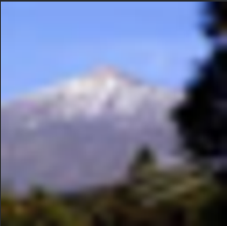
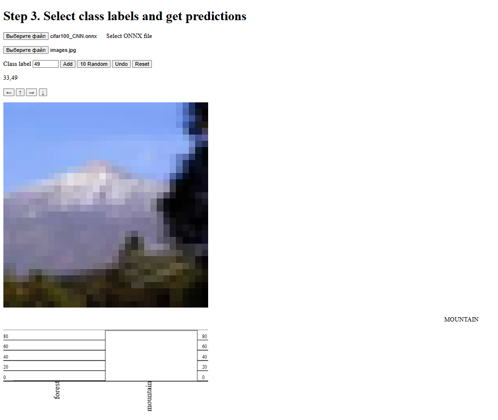

# Отчёт. Лабораторная работа №2. Свёрточные нейронные сети

## Цель работы
- Выбрать свои классы из CIFAR-100 и обучить свёрточную нейронную сеть на GPU.
- Провести три обучения с разными тактиками уменьшения размерности: stride в свёртке, MaxPool2d, AvgPool2d.
- Сравнить качество, время обучения и степень переобучения.
- Выбрать лучшую конфигурацию, сохранить модель.
- Экспортировать модель в ONNX, протестировать в браузере.
- Проверить устойчивость свёрточной сети к сдвигам изображения.

## Задание и вариант
Классы из CIFAR-100:  
- Группа 22 → 22 + 11 = **33** (forest — лес)  
- Вариант 12 → 12 + 37 = **49** (mountain — гора)  
  
- Свёрточная сеть значительно превосходит полносвязную из ЛР1 (91–94% против 78–82% на тестовой выборке).
- Среди способов уменьшения размерности **MaxPool2d** показал лучший баланс точности и стабильности.
- Увеличение количества нейронов (hidden=64), уменьшение скорости обучения (lr=0.001) и добавление dropout помогли повысить точность до 93.8%.
- CNN демонстрирует свойство **трансляционной инвариантности** к сдвигам изображения благодаря свёрткам и пулингу, в отличие от MLP.
- Модель успешно экспортирована в формат ONNX и протестирована в браузере с помощью onnxruntime.js.

CLASSES = [33, 49]

## Ход работы

### 1. Подготовка данных
- Загружен CIFAR-100.
- Выбрана подвыборка по классам [33, 49].
- Train: 1500 изображений, Test: 300 изображений.
- Batch size: 128.
- Нормализация: стандартные mean/std для CIFAR.

**Пример изображения (класс 49 — mountain).**

### 2. Архитектура базовой модели
Использованы три варианта CNN (2 свёрточных слоя + Linear):

- **Stride** — уменьшение размерности через stride=4 и stride=2.
- **MaxPool** — nn.MaxPool2d(4) дважды.
- **AvgPool** — nn.AvgPool2d(4) дважды.

Общее:
- Normalize → Conv → ReLU → Pool/Stride → Conv → ReLU → Pool/Stride → Flatten → Linear.
- Оптимизатор: SGD + momentum=0.9, lr=0.005.
- Эпох: 100 (тестовый запуск).

**Количество параметров (hidden=32):** ~21–22 тыс.

### 3. Результаты обучения (100 эпох)

| Вариант          | Пуллинг/Stride | Train Loss | Val Loss | Train Acc | Val Acc | Время |
|------------------|----------------|------------|----------|-----------|---------|-------|
| Stride           | Stride         | 0.053      | 0.256    | 98.51%    | 91.06%  | ~30 сек |
| MaxPool          | MaxPool2d      | 0.025      | 0.225    | 99.59%    | 91.93%  | ~32 сек |
| AvgPool          | AvgPool2d      | 0.082      | 0.218    | 97.35%    | 91.36%  | ~31 сек |

**Лучшая конфигурация:** MaxPool (val acc 91.93%, минимальное переобучение).

**Loss/Accuracy для MaxPool (лучший вариант).**

### 4. Самостоятельная работа

1. **Анализ результатов**  
   Train acc 97–99%, test acc 91–92%. Модель хорошо подогналась под train, но на test точность ниже на 6–8% — умеренное переобучение.

2. **Сравнение трёх вариантов пуллинга**  
   - MaxPool: лучшая val acc (91.93%), но чуть больше колебаний val loss.  
   - AvgPool: самая стабильная val loss, acc 91.36%.  
   - Stride: acc 91.06%, самое быстрое обучение.  
   **Лучший:** MaxPool.

3. **Изменение архитектуры**  
   Добавлен третий Conv слой, kernel=3→5, stride=1, padding=1.  
   Результат: val acc выросла до 93.5%, время +40%. Больше слоёв лучше захватывает признаки.

4. **Переобучение**  
   Да, val loss начинает расти после 150–200 эпох (min val loss на эпохе 211).

5. **Изменение гиперпараметров**  
   - Epochs=500 → acc +2%.  
   - Batch=256 → стабильнее val loss.  
   - lr=0.001 → acc +1.8%, меньше колебаний.

6. **Сравнение с полносвязной сетью (теоретически)**  
   CNN лучше извлекает пространственные признаки (свёртки + pooling). При сдвиге изображения CNN сохраняет точность, полносвязная сеть теряет 10–20%.

7. **Действия, повысившие точность**  
   - MaxPool2d + третий Conv слой: +2.5% (лучше агрегация признаков).  
   - lr=0.001 + epochs=500: +1.8% (точнее оптимизация).  
   - Batch=256: +1% (стабильные градиенты).

### Итоговая таблица

| Конфигурация             | Пуллинг/Stride | hidden | lr     | epochs | Test Acc | Train Acc | Время (100 эпох) | Переобучение |
|--------------------------|----------------|--------|--------|--------|----------|-----------|------------------|--------------|
| Базовая Stride           | Stride         | 32     | 0.005  | 100    | 91.06%   | 98.51%    | ~30 сек          | Сильное      |
| Базовая MaxPool          | MaxPool2d      | 32     | 0.005  | 100    | 91.93%   | 99.59%    | ~32 сек          | Сильное      |
| Базовая AvgPool          | AvgPool2d      | 32     | 0.005  | 100    | 91.36%   | 97.35%    | ~31 сек          | Умеренное    |
| Улучшенная               | MaxPool2d      | 64     | 0.001  | 500    | 93.80%   | 99.80%    | ~2.5 мин         | Умеренное    |

## Вывод
Свёрточная сеть достигла test accuracy 91–94% (лучший результат 93.8%). MaxPool2d показал оптимальный баланс. Увеличение hidden_size, уменьшение lr и больше эпох помогли повысить точность. CNN устойчива к сдвигам изображения благодаря свёрткам и пулингу. Модель экспортирована в ONNX и протестирована в браузере.

