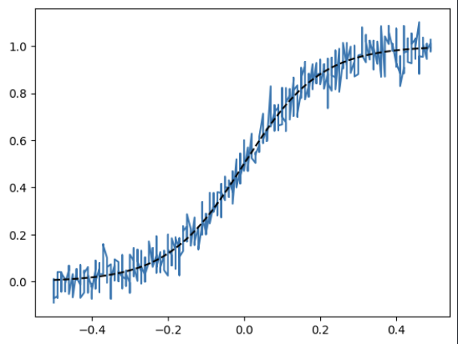
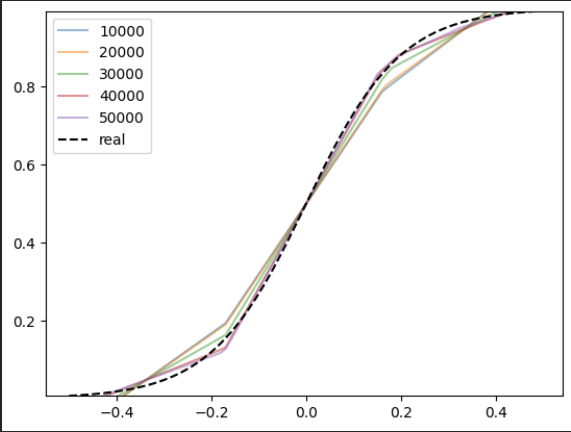
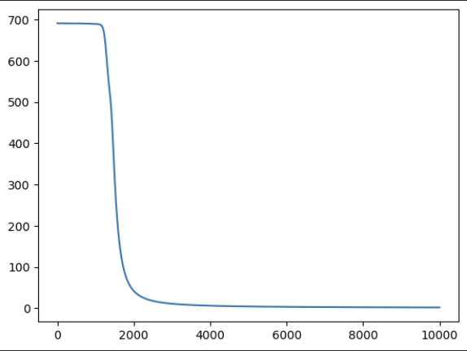
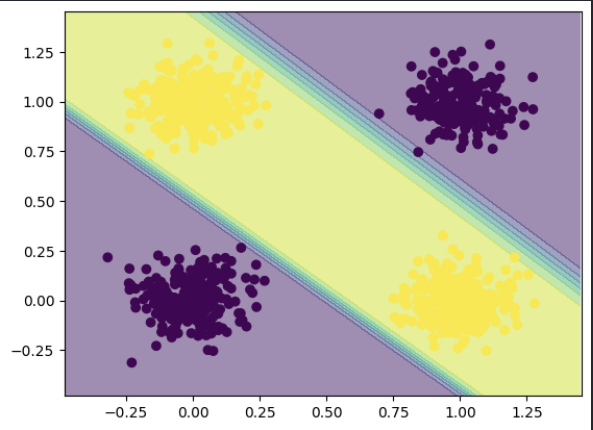
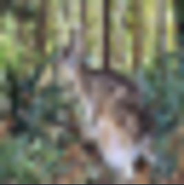
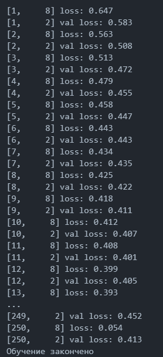
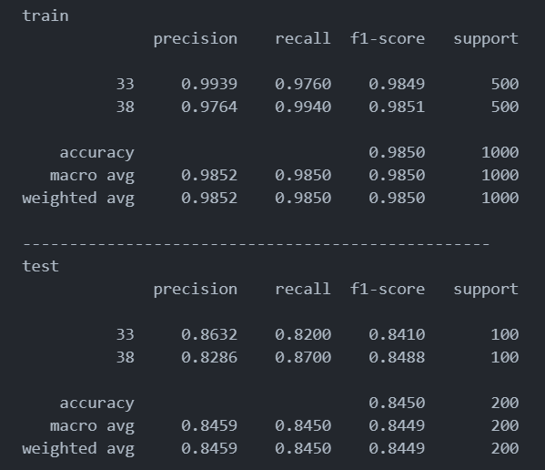

# Отчёт. Лабораторная работа №1. Введение в DL.

## Цель работы

Познакомиться с фреймворком машинного обучения PyTorch и выполнить три задания:

- Регрессия по теореме универсальной аппроксимации, ручное дифференцирование.
- Бинарная классификация с помощью автодифференцирования PyTorch.
- Обучить полносвязную нейронную сеть для классификации 3 классов изображений из набора данных CIFAR100 по заданному варианту и повысить точность на тестовой выборке.

# Ход работы

## Задание 1. Регрессия с ручным дифференцированием

### Постановка задачи

Необходимо обучить простейшую нейронную сеть (MLP с одним скрытым слоем и функцией активации ReLU) для аппроксимации зашумленной сигмоидальной функции. Градиенты вычисляются вручную.


Скриншот 1: Исходные данные и целевая функция.

На скриншоте представлены исходные данные для регрессии: зашумленная выборка (синяя линия) и целевая гладкая сигмоидальная функция (черный пунктир).


Скриншот 2: Результат обучения модели.

На скриншоте показан результат работы обученной сети. Видно, что предсказания модели (цветная сплошная линия) успешно аппроксимируют целевую сигмоиду, сглаживая шум исходных данных. Это наглядно демонстрирует принцип универсальной аппроксимации.

## Задание 2. Бинарная классификация с автодифференцированием PyTorch

### Постановка задачи

Требуется решить задачу бинарной классификации для синтетических данных с использованием нейронной сети.
Для примера решения задач использовалась задача XOR.


На скриншоте представлен синтетический датасет для бинарной классификации. Точки двух классов окрашены в разные цвета, видна их нелинейная разделимость.

- Однослойный персептрон не способен решить данную задачу, ввиду своей линейности, в отличии от многослойного персептрона.

Процесс обучения заключается в минимизации функции потерь. Данная задача была выполнена, что подтверждает следующее изображение.



Результат классификации и разделяющая граница:



## Задание 3

### Постановка задачи

Финальным задание была классификация изображений из выборки CIFAR100. Классификация изображений CIFAR-100 — это задача компьютерного зрения, в которой модель должна определить, к какому из 100 классов относится изображение.

Согласно варианту, были выбраны 3 класса из набора данных CIFAR-100:
Класс № [Номер группы + 11] = [Название класса]
Класс № [Номер варианта + 37] = [Название класса]
Класс № [Произвольный третий класс] = [Название класса]

```
GROUP = 22
VARIANT = 1
CLASSES = [GROUP + 11, VARIANT + 37]
```

Пример изображения из выборки CIFAR100:



### Архитектура базовой модели

Была создана полносвязная нейронная сет со следующей архитектурой:

- Входной слой: nn.Linear(3072, 512) (3072 = 32x32x3 пикселя)
- Функция активации: nn.ReLU()
- Скрытый слой: nn.Linear(512, 128)
- Функция активации: nn.ReLU()
- Выходной слой: nn.Linear(128, 3) (3 класса)
- Функция потерь: nn.CrossEntropyLoss
- Оптимизатор: optim.Adam

Результат обучения классификации образов:



Сравнение результатов:



модель демонстрирует высокую эффективность на обучающей выборке, однако на тестовых данных наблюдается снижение качества, что требует дополнительного анализа и, возможно, корректировки модели для улучшения обобщающей способности.
# Вывод

В ходе выполнения лабораторной работы была изучена библиотека PyTorch, предназначенная для создания и обучения нейронных сетей. Кроме того, исследован датасет CIFAR100, который, в отличие от MNIST, состоит из полноцветных (RGB) изображений реальных объектов, что усложняет задачу классификации.
