# Лабораторная работа №0. Установка локальной модели Qwen

## Цель работы

Установить на рабочую машину локальную модель нейросети Qwen, запустить её и исследовать базовый функционал.

## Используемое программное обеспечение

- **Python** 3.10
- **WebUI**: text-generation-webui (Oobabooga)
- **Модели**:
  - `qwen2.5-3b-instruct-q3_k_m.gguf`
  - `qwen2.5-3b-instruct-q4_k_m.gguf`

## Ход работы

### 1. Настройка окружения

Окружение было настроено в соответствии с планом работы:

````bash
# Клонирование репозитория
git clone https://github.com/oobabooga/text-generation-webui
cd text-generation-webui

# Создание виртуальной среды
python -m venv venv
venv\Scripts\activate

# Установка зависимостей
pip install -r requirements/portable/requirements.txt --upgrade

Так как запуск моделей происходил на ноутбуке без нормальной дискретной видеокарты, еще и от AMD. Было принято решение запускать модель на мощностях процессора. Для этого сначало надо было скачать набор библиотек для запуска модели на CPU.
```bash
pip install -r requirements/full/requirements_cpu_only.txt --upgrade
````

#### Скачивание модели Qwen

Были загружены модели с Hugging Face:

    Qwen2.5-3B-Instruct-GGUF

    Размещены в папке: text-generation-webui/user_data/models/Qwen/

2. Запуск языковой модели

Запуск выполнен командой:
bash

python server.py

После успешного запуска в терминале появилась ссылка на WebUI:

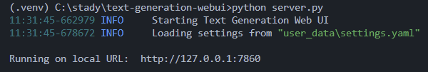

Веб-интерфейс доступен по адресу http://localhost:7860:

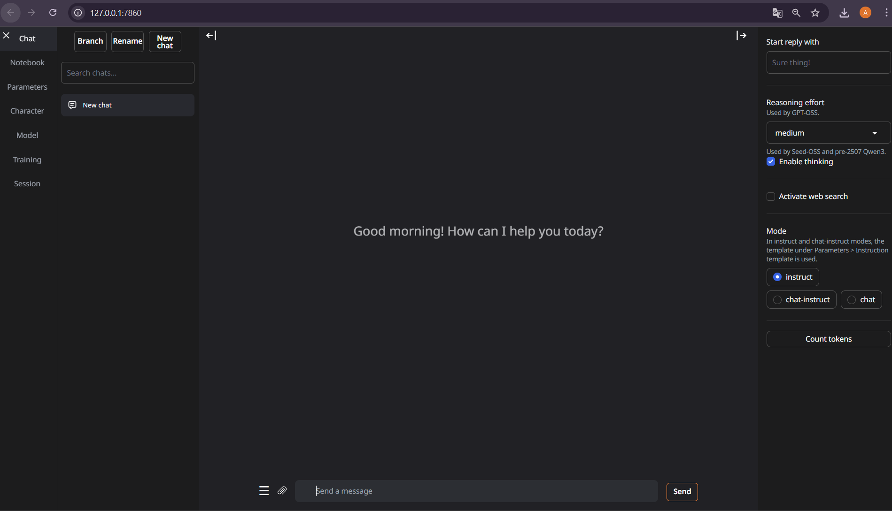

Далее необходимо настроить скачаную модель
В основный настройках параметр `gpu-layers` можно оставить нулевым, т.к. у меня GPU. Параметр `ctx-size`, который отвечает за размер контекста(того как долго модель сможет запоминать суть диалога) выбирается произвольно.

После нажатия кнопки `Load`, модель загружается и с ней можно взаимодействовать:
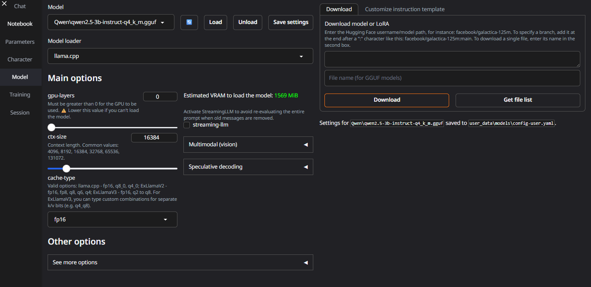

После успешной настройки модель готова к работе!
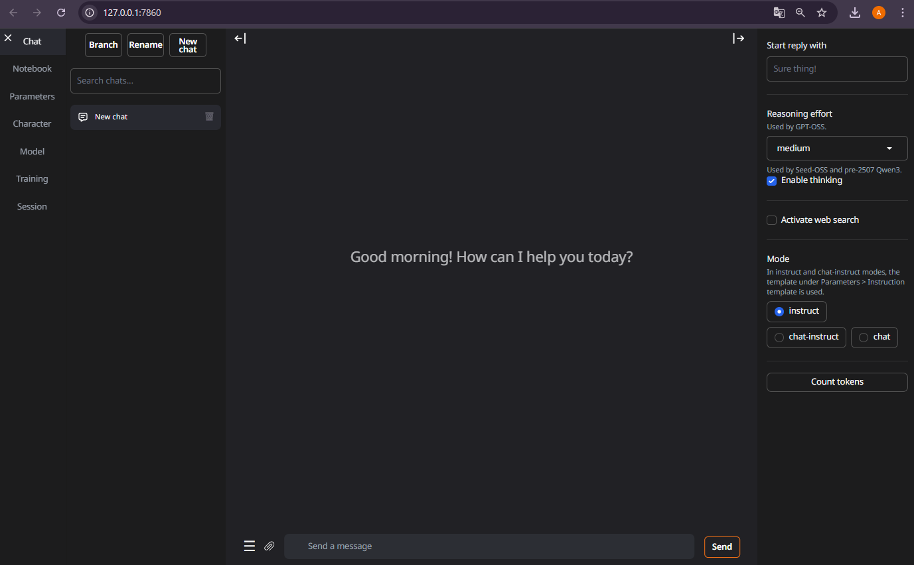

---

## Выполнение заданий

### 1. Настройка системного промпта

1. Настройка системного промпта

Модель: qwen2.5-3b-instruct-q4_k_m

Системный промпт:
text

Ты — пират. Все свои ответы ты должны составлять в стиле старого пирата, используя соответствующую лексику (например, "аррр", "сокровища", "капитан", "корабль").

**Результат:**  
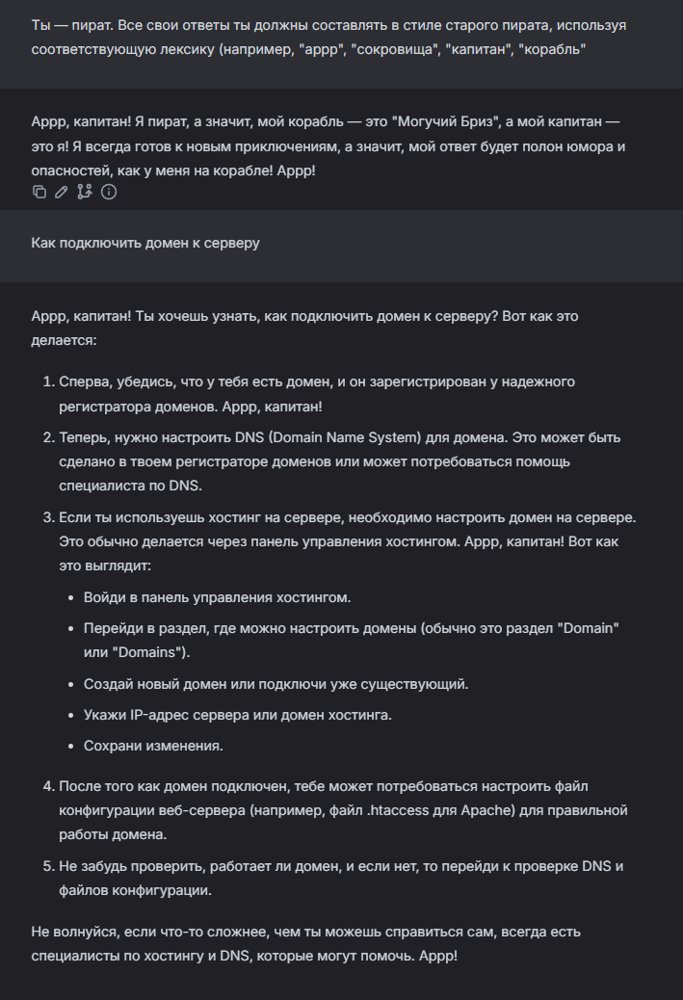

## Модель сохраняет стить и правила общения, который были заданны системным промтом.

### 2. Смена модели

Я выбрал для сравнения модель: qwen2.5-3b-instruct-q3_k_m

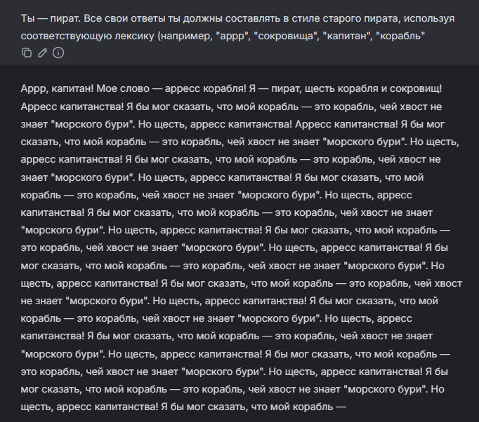

**Различие:**

Различие между моделями:
Q4_K_M генерирует осмысленный, связный и тематически выдержанный ответ, полностью соответствующий промпту, в то время как Q3_K_M практически сразу начинает "зацикливаться", порождая бессмысленные повторы и теряя нить повествования.

**Вывод:** `Q4_K_M` обеспечивает **более качественные и развёрнутые ответы**.

---

### 3. Изменение параметров генерации

| Параметр         | Назначение                                               |
| ---------------- | -------------------------------------------------------- |
| `temperature`    | Контролирует уровень случайности и креативности.         |
| `top_p`          | Ограничивает выбор токенов по вероятности (суммарное p). |
| `top_k`          | Задает количество наиболее вероятных токенов для выбора. |
| `repeat_penalty` | Штрафует за повторяющиеся токены.                        |

**Тестовый запрос:** `"В чем сила?"`

Настройки параметров:

#### Конфигурация 1 — Базовые настройки

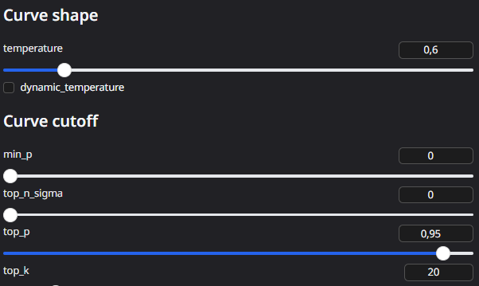

```
temperature: 0.6-0.8: Баланс креативности и связности
top_p: 0.95-0.99: Больше разнообразия в ответах
top_k: 10-20: Более предсказуемые ответы
```

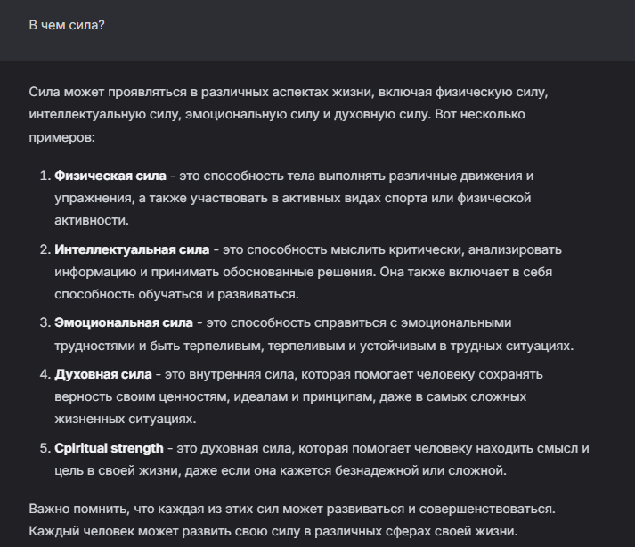

#### Конфигурация 2 — Низкая случайность

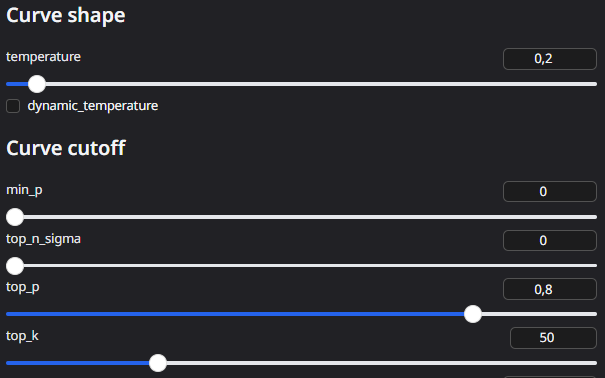

```
temperature: 0.1-0.3: Детерминированные, предсказуемые ответы
top_p: 0.7-0.9: Более фокусированные ответы
top_k: 40-100: Больше вариантов для выбора
```

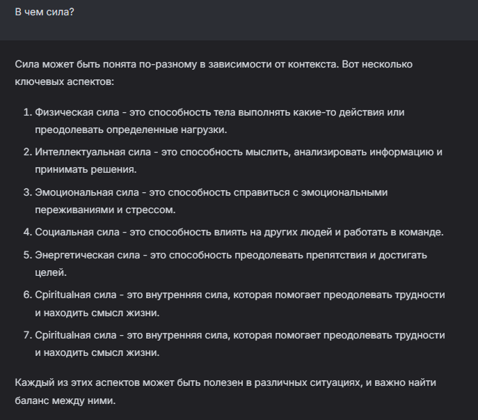

#### Конфигурация 3 — Высокая случайность

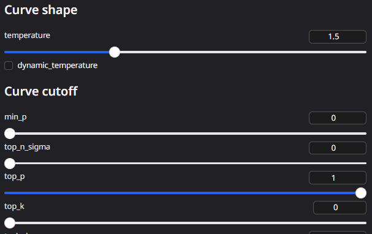

```
temperature: 1.0-1.5: Очень креативные, но менее логичные ответы
top_p: 1.0: Рассматриваются все токены (максимальная случайность)
top_k: 0: Отключено (рассматриваются все токены)
```

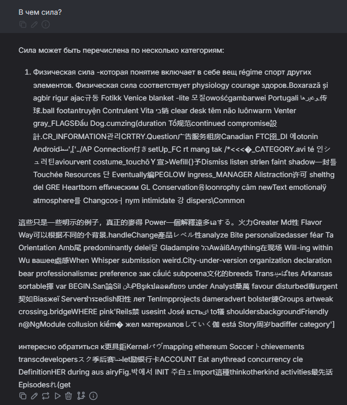

---

## Вывод

В ходе выволнения лабораторной работы я настроил окружение и запустил локальную модель нейросети Qwen2.5.
Протестировал различные варианты одной модели:Модель Q4_K_M показывает значительно лучшее качество ответов по сравнению с Q3_K_M.
Провел эксперимерты с параметрами сети и проследил как меняется модель поведений нейросети при изменении параметров.
