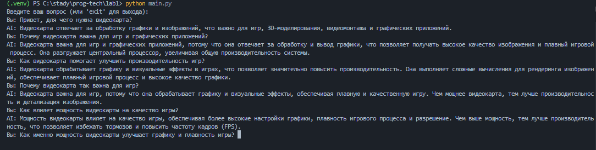
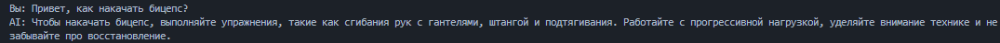
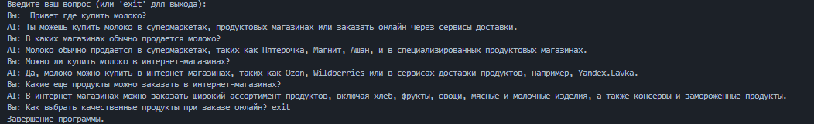

# **Лабораторная работа №1**

## **Тема:** Ознакомление с OpenAI API и создание текстового ассистента

### **Цель работы**

Основная цель лабораторной работы — освоить принципы взаимодействия с OpenAI API и реализовать простой текстовый помощник, способный вести диалог с пользователем, используя контекст и параметры модели.

---

### **Используемые технологии и инструменты**

- **Язык программирования:** Python
- **Основные библиотеки:**
  - `openai` — для взаимодействия с языковой моделью OpenAI;
  - `dotenv` — для загрузки конфигурации и ключей из файла окружения `.env`.

---

### **Описание выполненных задач**

#### **1. Подключение системного промпта через файл `.env`**

В ходе выполнения работы была создана функция `get_response`, отправляющая запрос к API с системным промптом и пользовательским вводом.

Пример кода:

```python
import json
from openai import OpenAI
from config import api_key, prompt, model

client = OpenAI(api_key=api_key)

def get_response(text: str):
    response = client.responses.create(
        model="gpt-4o-mini",
        input=[
            {"role": "system", "content": prompt},
            {"role": "user", "content": f'"answer-user": {text}'}
        ]
    )
    return response.output_text
```

**Назначение функции:**  
Запрос передаётся в модель вместе с системным промптом, а результат — текстовый ответ — возвращается пользователю.

**Содержимое промпта:**

```
PROMPT='Ты — умный и дружелюбный ассистент. Отвечай кратко и по существу. Результат возвращай в формате JSON с двумя полями: "answer-gpt" — ответ модели, и "answer-user" — встречный вопрос к пользователю. Перед отправкой убедись, что структура корректна и может быть преобразована через json.loads().'
```

**Результат выполнения:**



---

#### **2. Эксперимент с параметром `temperature`**

В дальнейшем код был дополнен возможностью изменения параметра `temperature`, отвечающего за степень вариативности ответов модели.

Пример обновлённого кода:

```python
from openai import OpenAI
from config import api_key, prompt, model, temperature

client = OpenAI(api_key=api_key)

def get_response(text: str):
    response = client.responses.create(
        model="gpt-4o-mini",
        input=[
            {"role": "system", "content": prompt},
            {"role": "user", "content": f'"answer-user": {text}'}
        ],
        temperature=float(temperature)
    )
    return response.output_text
```

**Ход эксперимента:**

- При `temperature = 0.1` модель выдавала устойчивые и предсказуемые ответы.  
  

- При стандартном значении `temperature = 1.0` поведение модели оставалось сбалансированным.  
  

- При увеличении температуры до `2.0` наблюдалось появление хаотичных и не связанных по смыслу ответов — иногда даже на других языках.

---

#### **3. Ведение истории диалога (контекста переписки)**

Для обеспечения возможности модели помнить предыдущие сообщения была реализована система ведения истории диалога. Контекст переписки ограничивался шестью последними сообщениями (по три от пользователя и от ассистента). Это позволяло улучшить качество ответов и точность взаимодействия.

Пример кода:

```python
dialogs = []

def get_response(text: str):
    global dialogs
    dialogs.append({"role": "user", "content": text})
    if len(dialogs)+1 > 6:
        dialogs = dialogs[2:6]

    messages = [{"role": "system", "content": prompt}] + dialogs
    response = client.responses.create(
        model=model,
        input=messages,
        temperature=float(temperature)
    )
    answer = response.output_text
    dialogs.append({"role": "assistant", "content": answer})
    return response.output_text
```

**Результат работы:**



---

#### **4. Итоговый код**

```python
import json
from openai import OpenAI
from config import api_key, prompt, model, temperature

client = OpenAI(api_key=api_key)

dialogs = []

def get_response(text: str):
    global dialogs
    dialogs.append({"role": "user", "content": text})
    if len(dialogs)+1 > 6:
        dialogs = dialogs[2:6]

    messages = [{"role": "system", "content": prompt}] + dialogs
    response = client.responses.create(
        model=model,
        input=messages,
        temperature=float(temperature)
    )
    answer = response.output_text
    dialogs.append({"role": "assistant", "content": answer})
    return response.output_text


if __name__ == "__main__":
    print("Введите ваш вопрос (или 'exit' для выхода):")
    dialog_start = False
    user_answer = ""

    while True:
        question = input(f"Вы: {user_answer} ")

        if question.lower() == "exit":
            print("Завершение программы.")
            with open("dialogs.json", "w", encoding="utf-8") as f:
                json.dump({"dialog": dialogs}, f, ensure_ascii=False, indent=4)
            break

        answer = get_response(user_answer + question)
        change_answer = "{" + answer.split("{")[1].split("}")[0] + "}"
        data = json.loads(change_answer)
        user_answer = data.get("user")
        gpt_answer = data.get("assistant")
        print("AI:", gpt_answer)
```

#### **3. Вывод**

В ходе выполнения лабораторной работы была успешно достигнута поставленная цель: освоены принципы взаимодействия с OpenAI API и реализован текстовый ассистент, способный вести осмысленный диалог с пользователем.
