# Отчёт по лабораторной работе №2

## Простейший чат-бот в Telegram на Aiogram + OpenAI

---

## 📌 Цель работы

Получить навыки работы с библиотекой **Aiogram**, API **OpenAI** и интеграции их в Telegram-бота.

---

## 📌 План

1. Настройка окружения
2. Написание основных функций бота
3. Выполнение заданий

# 2. Основные функции бота

## 📁 Структура проекта

```
lab2/
│
├── main.py
├── requirements.txt
├── .env
├── docker-compose.yml
├── alembic.ini
├── config.py
├── dialog.json
│
├── database/
│   ├── dao.py
│   ├── dependency.py
│   ├── models.py
│   └── migrations/
│
├── handlers/
│   ├── commands.py
│   ├── keyboard.py
│   ├── messages.py
│   └── states.py
│
├── utils/
│   ├── loader.py
│   ├── gpt.py
│   └── prompt.py
│
└── images/
```

---

# 3. Выполнение заданий

## ✔️ 1. Добавлен системный промпт

Добавлен через параметр.

## 🔹 utils/prompt.py

```python
def get_dialog_prompt(list_messages: list, username: str):
    prompt = '''
Ты - AI-ассистент, который ведёт диалог с пользователем. Отвечай на любые вопросы вежливо и полезно.

КРИТИЧЕСКИ ВАЖНО:
- Ответ ДОЛЖЕН быть валидным JSON
- НИКАКОГО текста вне JSON структуры
- НИКАКИХ комментариев, примечаний или пояснений
- Только структура {"role": "assistant", "content": "текст ответа"}

Формат ответа:
{"role": "assistant", "content": "Твой ответ пользователю"}

Требования к содержанию:
- Будь полезным и информативным
- Отвечай на вопросы точно и по делу
- Если не знаешь ответа - честно признайся
- Сохраняй вежливый и профессиональный тон
- Учитывай историю диалога для точности
- Используй имя пользователя при формировании ответа
''' + f"Имя пользователя: {username}" + "\nИстория переписки: " + str(list_messages)
    return prompt
```

## ✔️ 2. Бот знает имя пользователя

В этом задании необходимо было реализовать, чтобы бот знал имя пользователя и использовал его в дальнейших сообщениях.  
Для этого была добавлена логика с использованием **машины состояний (FSM)** в Aiogram.

---

## 🔧 Реализация

### 1️⃣ Шаг 1 — Кнопка начать Диалог

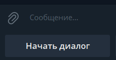

#### Когда нажимают кнопку диалог начинается, бот спрашивает имя:

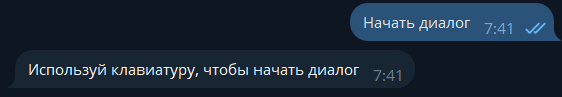

#### Бот переводит пользователя в состояние **ожидания имени**.

```python
@dp.message(lambda message: message.text == start_dialog, StateFilter(UserState.waiting))
async def user_init(message: Message, state: FSMContext):
    async with AsyncSessionLocal() as session:
        user = await UserDAO.find_one_or_none(db=session, telegram_id=str(message.from_user.id))
        dialogs = await DialogsDAO.find_all(db=session, user_id=user.id, is_active=True)
        if dialogs:
            update_data = [{"id": dialog.id, "is_active": False}
                           for dialog in dialogs]
            await DialogsDAO.update_many(db=session, updates=update_data)

    await message.answer("Напишите, как мне к тебе обращаться")
    await state.set_state(UserState.name)
```

---

### 2️⃣ Шаг 2 — подтверждение имени

#### После получения имени бот просит подтвердить его:

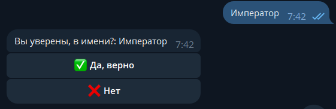

#### Имя сохраняется во времённое состояние FSM.

```python
@dp.message(UserState.name)
async def activate_testing(message: Message, state: FSMContext):
    name = message.text
    await message.answer(f"Вы уверены, в имени?: {name}", reply_markup=inline_sure())
    await state.update_data(name=message.text)
    await state.set_state(UserState.sure)
```

---

### 3️⃣ Шаг 3 — обработка кнопок

Обработка Коллбеков inline кнопок

После подтверждения имя сохраняется в базе данных, и далее бот может обращаться к пользователю по имени.

```python
@dp.callback_query(UserState.sure)
async def handle_callback_interaction(query: CallbackQuery, state: FSMContext):
    await query.answer()
    data: dict = await state.get_data()
    name = data.get('name')
    telegram_id = data.get('telegram_id')

    if query.data == btn_yes_sure_callback:
        await query.message.answer(f"Отлично, <i>{name}</i>! Теперь можем начать диалог.", reply_markup=reply_active_dialog())
        async with AsyncSessionLocal() as session:
            user = await UserDAO.find_one_or_none(db=session, telegram_id=telegram_id)
            await DialogsDAO.add(db=session, username=name, user_id=user.id)
        await state.clear()
        await state.set_state(DialogState.active)

    elif query.data == btn_not_sure_callback:
        await state.set_state(UserState.name)
        await query.message.answer(f"Напишите, как мне к тебе обращаться")
```

#### Если «Да»:

- Бот поздравляет пользователя.
- Имя сохраняется в базе.
- Создаётся новый активный диалог.
- Состояние сбрасывается.
- FSM переходит в DialogState.active.

####

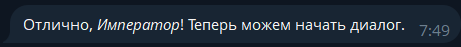

#### Если «Нет»:

- FSM возвращается к вводу имени.

####

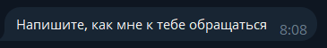

## ✔️ 3. Хранение сообщений

## Реализация базы данных для хранения сообщений

### Архитектура базы данных

Для хранения сообщений и пользовательских данных была разработана реляционная база данных на PostgreSQL с использованием SQLAlchemy ORM.

#### Docker Compose конфигурация

```yaml
version: "3.8"

services:
  ProgTech-bd:
    image: postgres
    container_name: progtech-bd
    restart: unless-stopped
    environment:
      POSTGRES_USER: ${DB_USER}
      POSTGRES_PASSWORD: ${DB_PASSWORD}
      POSTGRES_DB: ${DB_NAME}
    ports:
      - "9700:5432"
    volumes:
      - progtech-bd-data:/var/lib/postgresql/data
    env_file:
      - .env

volumes:
  progtech-bd-data:
```

### Модели данных

#### Модель Users (Пользователи)

Таблица users хранит информацию о пользователях Telegram:

- **id** - уникальный идентификатор пользователя в системе (UUID)
- **username** - имя пользователя в Telegram (строка до 255 символов, обязательное поле)
- **telegram_id** - уникальный идентификатор пользователя в Telegram (строка до 10 символов, обязательное поле с уникальным ограничением)
- **full_name** - полное имя пользователя (строка до 255 символов, обязательное поле)
- **created_at** - дата и время регистрации пользователя
- **updated_at** - дата и время последнего обновления информации о пользователе

#### Модель Dialogs (Диалоги)

Таблица dialogs хранит информацию о диалогах пользователей с ботом:

- **id** - уникальный идентификатор диалога (UUID)
- **is_active** - флаг активности диалога (по умолчанию True)
- **username** - имя пользователя для быстрого доступа
- **user_id** - внешний ключ, связывающий диалог с пользователем (с каскадным удалением при удалении пользователя)
- **list_messages** - массив JSON объектов для хранения истории сообщений в диалоге (по умолчанию пустой список)
- **created_at** - дата и время создания диалога
- **updated_at** - дата и время последнего обновления диалога
- **user** - отношение к модели Users, позволяющее легко получать информацию о пользователе

### Настройка зависимостей базы данных

#### Файл: database/dependency.py

```python
from sqlalchemy.ext.asyncio import AsyncSession, create_async_engine
from sqlalchemy.orm import sessionmaker
from config import database_url
engine = create_async_engine(database_url, echo=True)
AsyncSessionLocal = sessionmaker(
    bind=engine,
    class_=AsyncSession,
    autocommit=False,
    autoflush=False,
    expire_on_commit=False,
    future=True
)
```

---

## ✔️ 4. Поддержка контекста

## Реализация

Система контекста диалога реализована через хранение полной истории сообщений в базе данных PostgreSQL.

```python
user = await UserDAO.find_one_or_none(db=session, telegram_id=str(message.from_user.id))
dialog: Dialogs = await DialogsDAO.find_one_or_none(db=session, user_id=user.id, is_active=True)
dialog.list_messages.append({"role": "user", "content": user_message})
prompt = get_dialog_prompt(dialog.list_messages, username=dialog.username)
```

**1 строка** Поиск пользователя в БД по Telegram ID
**2 строка** Поиск активного диалога пользователя
**3 строка** Добавление сообщения пользователя в историю диалога
**4 строка** Формирование промпта с полной историей беседы

```python
@dp.message(DialogState.active)
async def activate_testing(message: Message, state: FSMContext):
    user_message = message.text
    async with AsyncSessionLocal() as session:
        user = await UserDAO.find_one_or_none(db=session, telegram_id=str(message.from_user.id))
        dialog: Dialogs = await DialogsDAO.find_one_or_none(db=session, user_id=user.id, is_active=True)
        dialog.list_messages.append({"role": "user", "content": user_message})
        prompt = get_dialog_prompt(
            dialog.list_messages, username=dialog.username)
        answer = await get_response(prompt, client)
        assistant_answer = json.loads(
            "{"+answer[answer.find("{")+1:answer.rfind("}")]+"}")
        dialog.list_messages.append(assistant_answer)
        await DialogsDAO.update(db=session, model_id=dialog.id, list_messages=dialog.list_messages)
    await message.answer(assistant_answer.get("content"), reply_markup=reply_active_dialog())

```

### Пример диалога

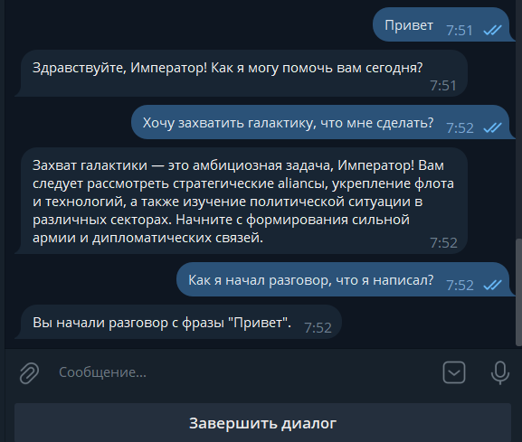

## ✔️ 5. Команда `/reset-context`

### Добавлена кнопка "Завершить диалог":

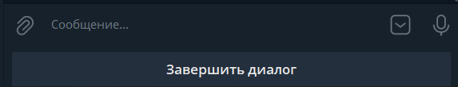

### Код реализации:

```python
@dp.message(lambda message: message.text == end_dialog, StateFilter(DialogState.active))
async def create_bot(message: Message, state: FSMContext):
    await state.clear()

    async with AsyncSessionLocal() as session:
        user = await UserDAO.find_one_or_none(db=session, telegram_id=str(message.from_user.id))
        dialog = await DialogsDAO.find_one_or_none(db=session, user_id=user.id, is_active=True)
        await DialogsDAO.update(db=session, model_id=dialog.id, is_active=False)

    await state.set_state(UserState.waiting)
    await state.update_data(telegram_id=str(message.from_user.id))
    await message.answer(f"Вы завершили диалог", reply_markup=reply_not_dialog())
```

### Завершение диалога

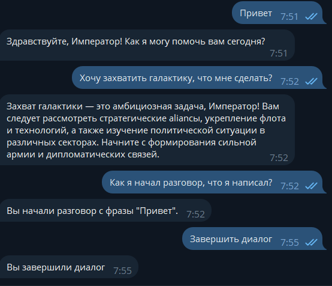

### Добавлена кнопка "Мои диалоги"

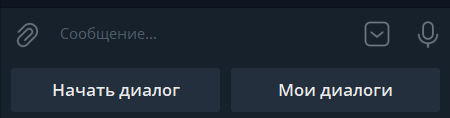

```python
@dp.message(lambda message: message.text == my_dialogs, StateFilter(UserState.waiting))
async def user_init(message: Message, state: FSMContext):
    async with AsyncSessionLocal() as session:
        user = await UserDAO.find_one_or_none(db=session, telegram_id=str(message.from_user.id))
        dialogs = await DialogsDAO.find_all(db=session, user_id=user.id)
    await message.answer(f"У вас всего {len(dialogs)} диалогов", reply_markup=inline_dialogs(dialogs))
```

При нажатии на кнопку открывается история всех диалогов пользователя в формате inline кнопок
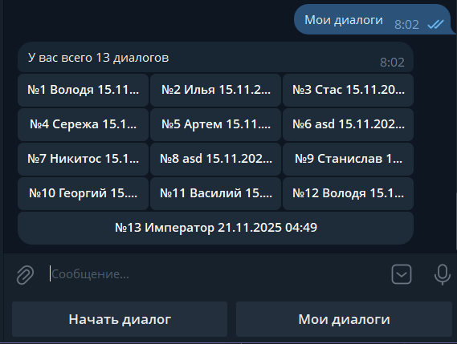

Создана коллбек функциия обработки нажатии на кнопок диалогов:

```python
@dp.callback_query(UserState.waiting)
async def handle_callback_interaction(query: CallbackQuery, state: FSMContext):
    await query.answer()
    data: dict = await state.get_data()
    telegram_id = data.get('telegram_id')
    dialog_index = int(query.data.replace("dialog_", ""))

    async with AsyncSessionLocal() as session:
        user = await UserDAO.find_one_or_none(db=session, telegram_id=telegram_id)
        print(user)
        print(telegram_id)
        dialogs = await DialogsDAO.find_all(db=session, user_id=user.id)

    dialog: Dialogs = dialogs[dialog_index-1]
    create_at = dialog.created_at.strftime("%d.%m.%Y %H:%M")
    update_at = dialog.created_at.strftime("%d.%m.%Y %H:%M")
    count_messages = len(dialog.list_messages)

    message_text = f"""
<b>💬 Диалог #{dialog_index}</b>

<b>Пользователь:</b> {dialog.username}
<b>Сообщений:</b> {count_messages}
<b>Начало:</b> {create_at}
<b>Завершение:</b> {update_at}

<u>📝 История диалога:</u>
"""
    for i, msg in enumerate(dialog.list_messages, 1):
        role_name = dialog.username if msg.get(
            "role") == "user" else "Ассистент"
        content = msg.get("content", "").replace('\n', ' ')
        message_text += f"\n - <b>{role_name}:</b> {content}"

    await query.message.answer(message_text)
```

При нажатии на кнопку с диалогом открывается детальная история диалога
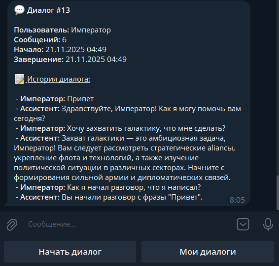

## ✔️ 6. Поддержка изображений

Обработка при отправки изображений

```python
@dp.message(F.photo)
async def handle_photo(message: Message):
    await message.answer("Вы отправили картинку!")
```


---

# Вывод

#### В ходе лабораторной работы был успешно разработан и реализован телеграм-бот с интеграцией OpenAI API, обладающий функционалом контекстного диалога, хранением истории сообщений в PostgreSQL базе данных, возможностью сброса контекста и базовой обработкой изображений, что позволило создать интеллектуального ассистента, способного поддерживать осмысленную беседу с пользователем и сохранять состояние диалога между сессиями.
