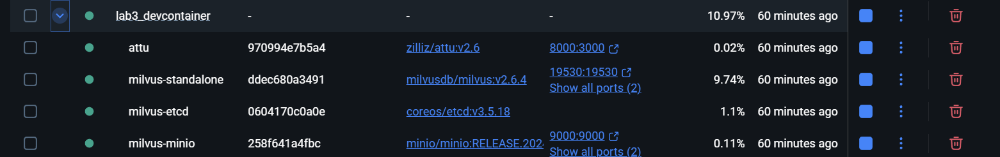
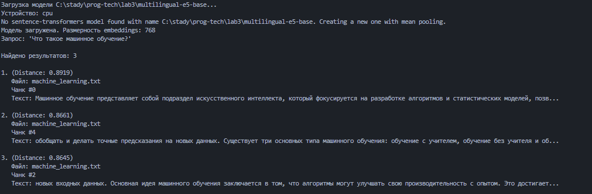
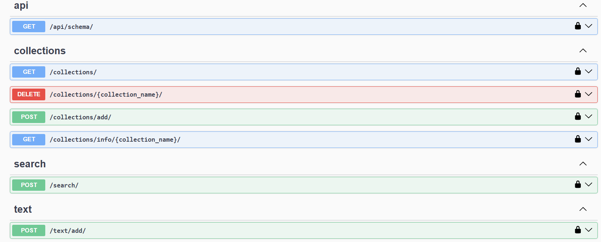

# Лабораторная работа №3

## Векторные базы данных и семантический поиск

---

## Цель работы

Целью лабораторной работы является изучение принципов работы векторных баз данных и семантического поиска, а также получение практических навыков по их использованию для обработки текстовых данных и потенциальной интеграции с LLM (Large Language Models).

---

## План работы

1. Настройка окружения;
2. Создание модуля для работы с Milvus;
3. Парсинг текстовых файлов;
4. Задания.

---

## 1. Настройка окружения

В отличие от предыдущих лабораторных работ, данная работа выполнялась в **devcontainer**.  
Devcontainer — это Docker-контейнер с заранее подготовленным окружением, который позволяет работать в изолированной среде и избегать конфликтов зависимостей.

### Используемые компоненты

- **Python 3.12**
- **Milvus** — векторная база данных
- **Attu** — веб-интерфейс для управления Milvus



Конфигурация devcontainer располагается по пути:
intfloat/multilingual-e5-base

Преимущества модели:

- Поддержка нескольких языков (включая русский)
- Совместимость с семантическим поиском
- Размерность embeddings — **768**

## 2. Создание векторной базы данных

После настройки окружения был запущен контейнер с работающим **Milvus** и **Attu**. Для начала был инициализирован модуль для работы с **Milvus**, который установил подключение к серверу:

```python
from pymilvus import connections, Collection, CollectionSchema, FieldSchema, DataType, utility

class MilvusClient:
    def __init__(self, host: str = "standalone", port: int = 19530, alias: str = "default"):
        self.host = host
        self.port = port
        self.alias = alias
        self._connect()

    def _connect(self):
        try:
            connections.connect(host=self.host, port=self.port)
            print(f"Подключение к Milvus установлено ({self.host}:{self.port})")
        except Exception as e:
            print(f"Ошибка подключения к Milvus: {e}")
            raise
```

Метод для подключения был написан, и подключение к **Milvus** было успешно установлено.

Далее был реализован метод для создания коллекции в базе данных с параметрами: имя коллекции, размерность векторов, описание коллекции и тип метрики:

```python
def create_collection(self, collection_name: str, dimension: int, metric_type: str = "COSINE"):
    fields = [
        FieldSchema(name="id", dtype=DataType.INT64, is_primary=True, auto_id=True),
        FieldSchema(name="embedding", dtype=DataType.FLOAT_VECTOR, dim=dimension)
    ]
    schema = CollectionSchema(fields=fields)
    collection = Collection(name=collection_name, schema=schema)
    collection.create_index(field_name="embedding", index_params={"metric_type": metric_type, "index_type": "IVF_FLAT", "params": {"nlist": 128}})
    return collection
```

Этот метод создал коллекцию в **Milvus** с указанными параметрами и индексом для векторного поля. После этого была реализована функция для вставки данных в коллекцию:

```python
def insert_data(self, collection_name: str, texts: List[str], embeddings: List[List[float]]):
    collection = Collection(collection_name)
    collection.insert([texts, embeddings])
    collection.flush()
```

Метод позволил вставлять данные в коллекцию, после проверки на наличие коллекции и соответствие размерности эмбеддингов.

Также был реализован метод для поиска похожих векторов в коллекции:

```python
def search(self, collection_name: str, query_vectors: List[List[float]], top_k: int = 5):
    collection = Collection(collection_name)
    results = collection.search(query_vectors, anns_field="embedding", limit=top_k)
    return results
```

Поиск выполнялся с использованием метрики **cosine similarity**, но также была предусмотрена возможность использования других метрик, таких как **L2** или **IP**.

## 3. Парсинг текстовых файлов

После настройки работы с **Milvus** был создан класс **TextParser** для парсинга текстовых файлов с разбиением на чанки.

```python
import re
import os
from typing import List

class TextParser:
    """Парсер текстовых файлов с разбиением на чанки."""

    def __init__(self, chunk_size: int = 256, chunk_overlap: int = 64):
        if chunk_overlap >= chunk_size:
            raise ValueError("chunk_overlap должен быть меньше chunk_size")
        self.chunk_size = chunk_size
        self.chunk_overlap = chunk_overlap
        self.step_size = chunk_size - chunk_overlap
```

Класс позволил нормализовать текст, удаляя лишние пробелы и переносы строк:

```python
def normalize_text(self, text: str) -> str:
    text = re.sub(r'\s+', ' ', text)
    return text.strip()
```

Текст делился на чанки с перекрытием, что позволяло сохранить контекст между частями текста:

```python
def chunk_text(self, text: str) -> List[str]:
    text = self.normalize_text(text)
    chunks = []
    start = 0
    while start < len(text):
        end = start + self.chunk_size
        chunk = text[start:end].strip()
        if chunk:
            chunks.append(chunk)
        start += self.step_size
    return chunks
```

Метод разделил текст на чанки, что обеспечило эффективную работу с большими объемами данных и контекстуальность каждого чанка.

После парсинга текстов был использован метод для обработки файлов и их преобразования в чанки:

```python
def parse_file(self, file_path: str, encoding: str = "utf-8") -> List[str]:
    text = self.read_file(file_path, encoding)
    chunks = self.chunk_text(text)
    return chunks
```

Метод вернул список чанков из текстового файла, готовых для загрузки в **Milvus**.

### Запуск example_usage.py



## 4. Задания.

**Реализация API**

## Реализованные эндпоинты

### 1. Получение списка коллекций

**Endpoint:**  
`GET /collections/`

**Описание:**  
Возвращает список всех коллекций, существующих в Milvus, вместе с дополнительной информацией.

**Логика работы:**

- Выполняется запрос к Milvus через `list_collections(with_info=True)`
- Результат возвращается в формате JSON

---

### 2. Создание коллекции

**Endpoint:**  
`POST /collections/add/`

**Описание:**  
Создает новую коллекцию в Milvus с заданными параметрами.

**Параметры запроса:**

- `collection_name` — имя коллекции
- `dimension` — размерность embeddings (по умолчанию 768)
- `description` — описание коллекции
- `metric_type` — тип метрики (COSINE / L2 / IP)

---

### 3. Удаление коллекции

**Endpoint:**  
`DELETE /collections/<collection_name>/`

**Описание:**  
Удаляет коллекцию по имени.

---

### 4. Получение информации о коллекции

**Endpoint:**  
`GET /collections/info/<collection_name>/`

**Описание:**  
Возвращает подробную информацию о коллекции:

- Количество записей
- Описание схемы
- Поля и их параметры

---

### 5. Добавление текста в коллекцию

**Endpoint:**  
`POST /text/add/`

**Описание:**  
Добавляет текст в коллекцию Milvus с автоматическим:

- чанкированием
- генерацией embeddings
- сохранением данных в БД

**Параметры запроса:**

- `collection_name`
- `text`

**Ответ содержит статистику:**

- Количество чанков
- Количество вставленных записей
- Имя коллекции

---

### 6. Семантический поиск

**Endpoint:**  
`POST /search/`

**Описание:**  
Выполняет семантический поиск по коллекции на основе текстового запроса.

**Параметры запроса:**

- `collection_name`
- `query`

**Алгоритм работы:**

1. Генерация embedding запроса с префиксом `query:`
2. Выполнение поиска в Milvus (`top_k = 3`)
3. Формирование человекочитаемого ответа

**Результат поиска содержит:**

- Значение расстояния (Cosine Similarity)
- Имя файла
- Индекс чанка
- Фрагмент текста

---

### Эндпоинты



## Вывод

В ходе лабораторной работы были изучены и практически реализованы основные компоненты системы семантического поиска на основе векторной базы данных Milvus. Было разработано полноценное REST API с использованием Django REST Framework, позволяющее управлять коллекциями, загружать и обрабатывать текстовые данные, а также выполнять семантический поиск.
