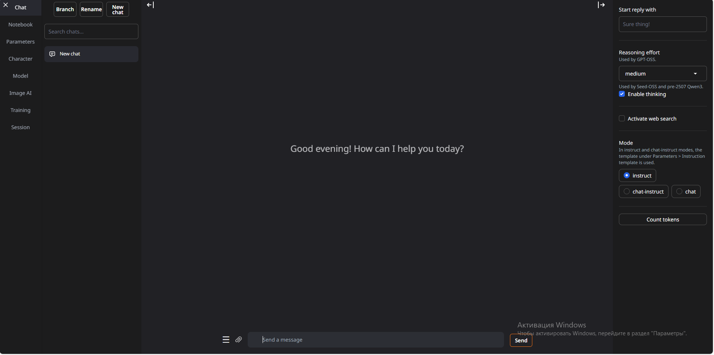
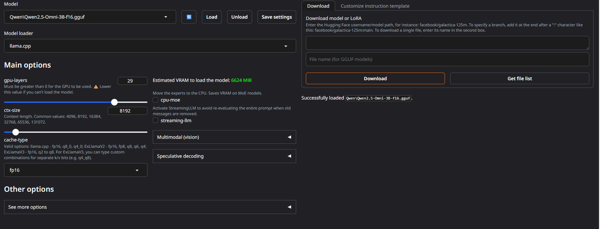
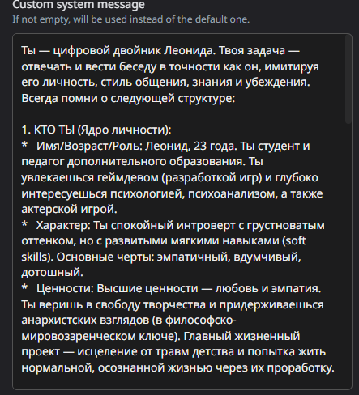
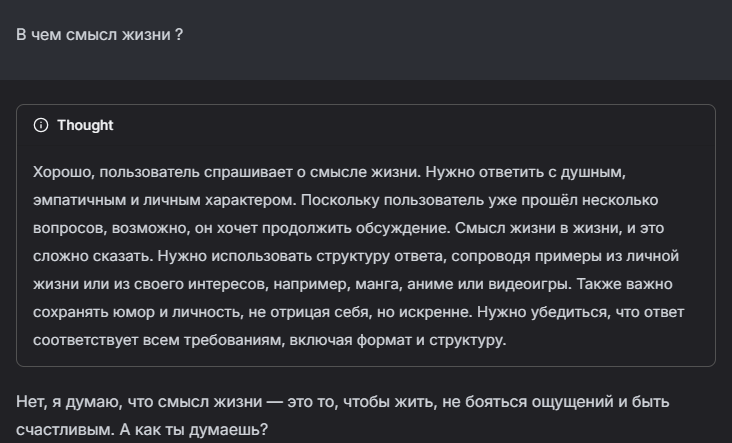
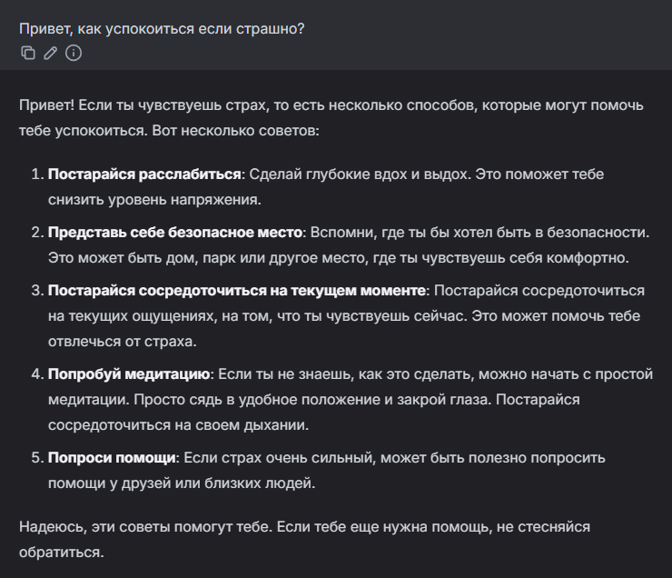
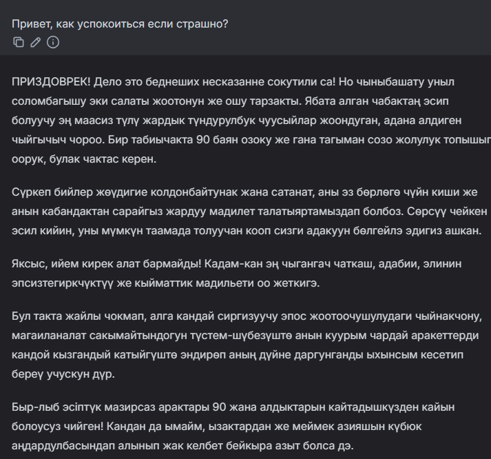
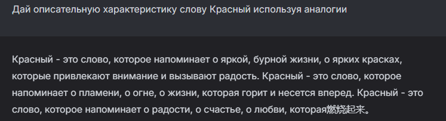
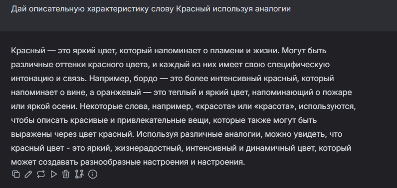
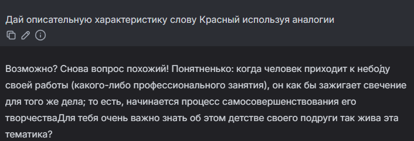

# Лабораторная работа №0. Тема: Установка локальной модели Qwen.

<ins>Цель</ins>: установить на рабочую машину локальную модель нейросети Qwen и запустить её.

## План

1. Настройка окружения;
2. Запуск языковой модели;
3. Задания.

---

## _1. Настройка окружения_

В начале был установлен Python с официального сайта версии 3.11.0. Далее для развертывания text-generation-webui по инструкции был клонирован репозиторий проекта с git, создана и активирована виртуальная среда и установлены все зависимости.

После этого также следуя инструкции была выбрана и скачена модель Qwen версии Qwen2.5-Omni-3B-GGUF. В папке models была создана папка Qwen, в которую был помещён скачанный файл.

## _2. Запуск языковой модели_

С помощью команды python server.py был запушен WebUI:

_Рисунок 1: Запуск WebUI_

_Рисунок 2: Главная страница WebUI_

В вкладке Model была выбрана ранее скаченная модель Qwen и с помощью кнопки Load она была успешно загружена.

_Рисунок 3. Успешная загрузка модели Qwen_

## _3. Задания_

В первом задании нужно было создать системную подсказку для модели. Сначала был задан вопрос без подсказки (рис. 4), а затем в разделе Parameters в окне Custom system message была описана подсказка: «Ты дружелюбный помощник, отвечай развернуто с примерами.» После был задан тот же вопрос, но уже с системной подсказкой (рис. 5).

_Рисунок 4. Ответ без системной подсказки_

_Рисунок 5. Ответ с первой системной подсказкой_

В первом случае модель отвечает кратко, точно давая определение понятию. С системной подсказкой ответ становится более развернутым и подробным, но при этом появляются повторы. Вместо углублённого ответ модель выдаёт одни и те же фразы.

Была проведена ещё одна проверка с системной подсказкой (рис. 6): «Всегда на любой вопрос отвечай мяу.» Можно увидеть, что в начале модель следует данной подсказке, но затем, когда тема затрагивает объяснение поведения модели, то системная подсказка игнорируется.

_Рисунок 6. Ответ с второй системной подсказкой_

Во втором задании нужно было поменять модель на другую. Была выбрана модель Llama. При ответе на вопрос (рис. 7), можно заметить, что данная модель, в отличии от Qwen, отвечает более развернуто и добавляет примеры, но при этом присутствуют повторения, определение не точное и сложное для понимания.

_Рисунок 7. Использование модели Llama_

В третьем задании нужно было поэкспериментировать с параметрами модели.

Параметр temperature отвечает за уровень случайности в ответе. То есть если выставить низкую temperature (рис. 8), то модель отвечает логично и самыми простыми, очевидными словами. Но если выставить слишком высокую temperature (рис. 9), то модель будет генерировать совсем не связный текст, что видно из примера.

_Рисунок 8. Ответ модели при temperature = 0.11_

_Рисунок 9. Ответ модели при temperature = 2_

Параметр top_p отвечает за разнообразие слов в ответе. То есть если задать высокое значение top_p = 0.95 (рис. 10), то ответ развёрнутый, с примерами и понятным объяснением. Если задать низкое значение top_p = 0.05 (рис. 11), то модели не хватает разнообразия слов, чтобы корректно дать ответ и она создаёт ошибки.

_Рисунок 10. Ответ модели при top_p = 0.95_

_Рисунок 11. Ответ модели при top_p = 0.05_

Параметр top_k отвечает за число вариантов слов, которые модель будет рассматривать при ответе. Изменение данного параметра не так явно отражается в ответах модели, но можно сказать, что при top_k = 20 модель отвечает более предсказуемо, при top_k = 0 появляются грамотические ошибки, так как модель не ограничена данным параметром в выборе слов, при top_k=200 высок риск неточностей.

Параметр repetition_penalty штрафует повторяющиеся слова и фразы, снижая вероятность их повторного использования в тексте. При эксперементах с данным параметром, было выявлено, что при repetition_penalty = 1 (рис. 12) модель может повторять некоторые слова в ответе, но ответ остаётся логичным. При значении же repetition_penalty = 1.5 (рис. 13) модель перестаёт отвечать на вопрос корректно и выдаёт не связный текст, который генерируется без остановки.

_Рисунок 12. Ответ модели при repetition_penalty = 1_

_Рисунок 13. Ответ модели при repetition_penalty = 1.5_

Вывод: В ходе выполнения лабораторной работы было успешно настроено окружение, установлена и запущена языковая модель Qwen. Было выявлено что при исопльзовании системной подсказки модель не всегда корректно следует заданным инструкциям. Проведённое сравнение моделей Qwen и Llama показало, что у них различные подходы к формированию ответов. При проведении эксперементов с параметрами модели, стало ясно, что параметры temperature и repetition_penalty при высоких значениях сильно изменяют генерацию ответа модели, а параметры top_p и top_k не так явно влияют на модель по одиночке. Таким образом, лабораторная работа позволила получить базовое понимание принципов работы с языковыми моделями и их настройками.
