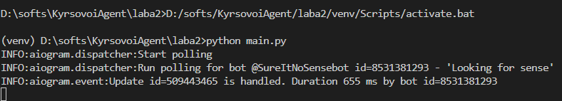
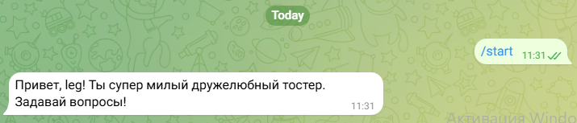
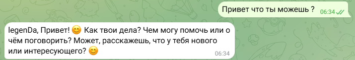
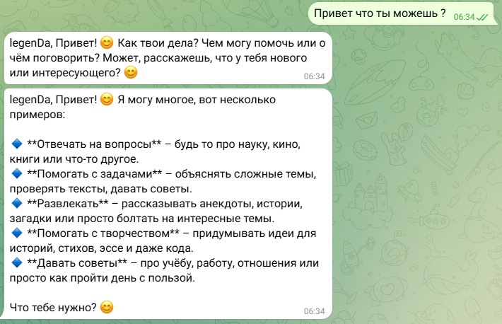
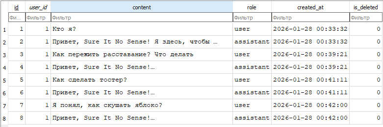
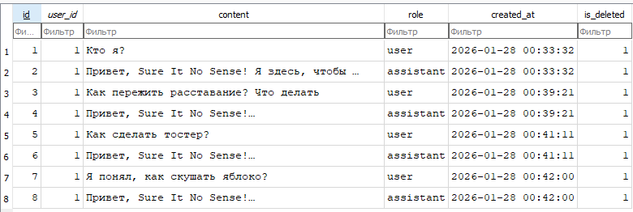
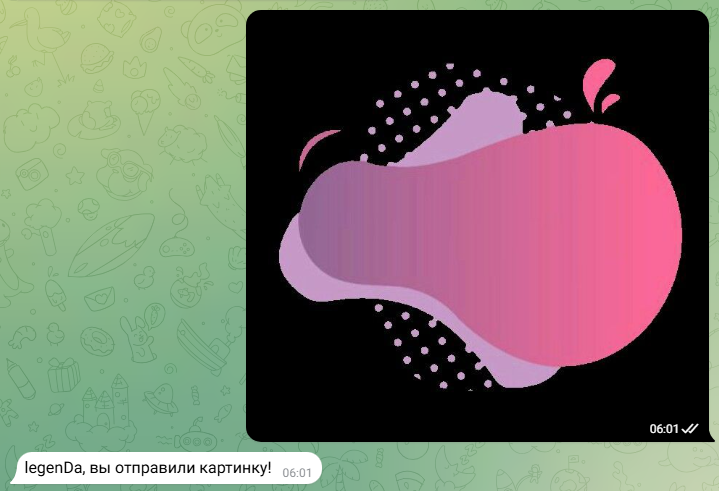

# Лабораторная работа №2. Тема: Простейший чат-бот в Telegram

<ins>Цель</ins>: получение навыков работы с библиотекой Aiogram, связка API OpenAI и написанного бота.

## План

1. Настройка окружения;
2. Написание основных функций бота;
3. Задания.

---

## _1. Настройка окружения_

Следуя инструкции, в BotFather был создан бот с именем Laba3 и адресом @SureItNoSensebot. Создана команда /start и файл .env с токеном бота. Также было создано виртуальное окружение, установлены нужные библитеки и скопированы в файл requirements.txt.

## _2. Написание основных функций бота_

Написание основных функций происходило по исторукции, но с некоторыми изменениями. Для работы бота, как и в предыдущей лабораторной работе, использовался Mistral AI. Ниже представлены изменённые файлы:

- Файл config.py:

```python
from dotenv import load_dotenv
import os

load_dotenv()

TOKEN = os.getenv("BOT_TOKEN")
MISTRAL_API_KEY = os.getenv("MISTRAL_API_KEY")
TEMPERATURE = os.getenv("TEMPERATURE")
SYSTEM_PROMPT = os.getenv("SYSTEM_PROMPT")
```

- Файл mistral.py:

```python
from mistralai import Mistral
from config import MISTRAL_API_KEY, SYSTEM_PROMPT, TEMPERATURE

client = Mistral(api_key=MISTRAL_API_KEY)
```

- Немного изменён файл commands.py, здесь инициированы две команды бота:

```python
from utils.loader import dp, bot
import logging
from aiogram.filters import Command
from aiogram.types import Message
from sqlalchemy.orm import Session
from database import get_db
from models import User, Message
from aiogram import F

@dp.message(Command("start"))
async def command_start_handler(message: Message) -> None:
    try:
        db: Session = next(get_db())
        
        # Проверяем существование пользователя
        user = db.query(User).filter(User.telegram_id == message.from_user.id).first()
        
        if not user:
            # Создаем нового пользователя
            user = User(
                telegram_id=message.from_user.id,
                username=message.from_user.username,
                first_name=message.from_user.first_name,
                last_name=message.from_user.last_name
            )
            db.add(user)
            db.commit()
            db.refresh(user)
        
        # Приветственное сообщение с именем пользователя
        name = message.from_user.first_name or message.from_user.username or "друг"
        await message.answer(
            f"Привет, {name}! 👋\n\n"
            f"Я твой бот-ассистент с искусственным интеллектом!\n"
            f"Можешь задавать мне вопросы, и я буду отвечать на них.\n\n"
            f"📝 <b>Доступные команды:</b>\n"
            f"/reset-context - очистить историю диалога\n\n"
            f"⚠️ Пожалуйста, помни про свой баланс на счету в OpenAI и не ддось меня без необходимости 😊"
        )
    except Exception as e:
        logging.error(f"Error in command_start_handler: {e}")
        await message.answer("Произошла ошибка при запуске бота")

@dp.message(Command("reset-context"))
async def command_reset_context_handler(message: Message) -> None:
    try:
        db: Session = next(get_db())
        
        # Находим пользователя
        user = db.query(User).filter(User.telegram_id == message.from_user.id).first()
        
        if user:
            # Мягкое удаление всех сообщений пользователя
            db.query(Message).filter(Message.user_id == user.id).update(
                {"is_deleted": True}
            )
            db.commit()
        
        # Удаляем сообщения в Telegram (последние 100 сообщений)
        try:
            await bot.delete_message(message.chat.id, message.message_id)
        except:
            pass  # Игнорируем ошибки удаления
        
        name = message.from_user.first_name or message.from_user.username or "друг"
        response_msg = await message.answer(
            f"✅ Контекст диалога успешно очищен, {name}!\n"
            f"Теперь мы начинаем новый разговор."
        )
        
        # Удаляем и это сообщение через 5 секунд
        import asyncio
        await asyncio.sleep(5)
        await bot.delete_message(response_msg.chat.id, response_msg.message_id)
        
    except Exception as e:
        logging.error(f"Error in command_reset_context_handler: {e}")
        await message.answer("Произошла ошибка при сбросе контекста")
```

- В файле messages.py прописана логика взаимодействия с базой данных:

```python
from utils.loader import dp
import logging
from aiogram.types import Message, ContentType
from utils.mistral import get_response, client
from sqlalchemy.orm import Session
from aiogram import F 
from database import get_db
from models import User, Message as MessageModel
from typing import List, Dict

@dp.message(F.content_type == ContentType.PHOTO)
async def photo_handler(message: Message) -> None:
    """
    Обработчик для изображений
    """
    try:
        await message.answer("Вы отправили картинку!")
    except Exception as e:
        logging.error(f"Error in photo_handler: {e}")

@dp.message()
async def message_handler(message: Message) -> None:
    """
    Обработчик для текстовых сообщений
    """
    try:
        db: Session = next(get_db())
        
        # Проверяем/создаем пользователя
        user = db.query(User).filter(User.telegram_id == message.from_user.id).first()
        if not user:
            user = User(
                telegram_id=message.from_user.id,
                username=message.from_user.username,
                first_name=message.from_user.first_name,
                last_name=message.from_user.last_name
            )
            db.add(user)
            db.commit()
            db.refresh(user)
        
        # Получаем имя пользователя для обращения
        user_name = message.from_user.first_name or message.from_user.username
        
        # Получаем историю сообщений (не удаленные, последние 10)
        context_messages = db.query(MessageModel).filter(
            MessageModel.user_id == user.id,
            MessageModel.is_deleted == False
        ).order_by(MessageModel.created_at.desc()).limit(10).all()
        
        # Форматируем контекст для Mistral
        formatted_context = []
        for msg in reversed(context_messages):  # Восстанавливаем порядок
            formatted_context.append({
                "role": msg.role,
                "content": msg.content
            })
        
        # Получаем ответ от Mistral
        response = await get_response(message.text, formatted_context, user_name)
        
        # Сохраняем сообщение пользователя
        user_message = MessageModel(
            user_id=user.id,
            content=message.text,
            role="user"
        )
        db.add(user_message)
        
        # Сохраняем ответ ассистента
        assistant_message = MessageModel(
            user_id=user.id,
            content=response,
            role="assistant"
        )
        db.add(assistant_message)
        
        db.commit()
        
        # Отправляем ответ пользователю
        await message.answer(response)
        
    except Exception as e:
        logging.error(f"Error in message_handler: {e}")
        await message.answer("Произошла ошибка при обработке сообщения")
```

- Был добавлен файл databaase.py с подключением к базе данных. Использовал SQLite c ORM SQLalchemy
```python
from sqlalchemy import create_engine
from sqlalchemy.orm import sessionmaker, Session
from sqlalchemy.ext.declarative import declarative_base
import os

# Создаем базу данных SQLite
engine = create_engine('sqlite:///chat_bot.db', echo=False)
SessionLocal = sessionmaker(autocommit=False, autoflush=False, bind=engine)
Base = declarative_base()

def get_db():
    db = SessionLocal()
    try:
        yield db
    finally:
        db.close()
```

- Файл models.py с описанием базы данных
```python
from sqlalchemy import Column, Integer, String, Text, DateTime, Boolean, ForeignKey
from sqlalchemy.orm import relationship
from sqlalchemy.sql import func
from database import Base

class User(Base):
    __tablename__ = "users"
    
    id = Column(Integer, primary_key=True, index=True)
    telegram_id = Column(Integer, unique=True, index=True)
    username = Column(String, nullable=True)
    first_name = Column(String, nullable=True)
    last_name = Column(String, nullable=True)
    created_at = Column(DateTime(timezone=True), server_default=func.now())
    is_active = Column(Boolean, default=True)
    
    messages = relationship("Message", back_populates="user", cascade="all, delete-orphan")

class Message(Base):
    __tablename__ = "messages"
    
    id = Column(Integer, primary_key=True, index=True)
    user_id = Column(Integer, ForeignKey("users.id"))
    content = Column(Text)
    role = Column(String)  # 'user' или 'assistant'
    created_at = Column(DateTime(timezone=True), server_default=func.now())
    is_deleted = Column(Boolean, default=False)
    
    user = relationship("User", back_populates="messages")
```



_Рисунок 1: Запуск файла main.py_



_Рисунок 2: Работа чат-бота в Telegram_

## _3. Задания_

1. В первом задании нужно было добавить ассистенту системный промпт. Были изменены файл config.py и mistral.py, системный промпт берётся из переменного окружения .env:

```python
from dotenv import load_dotenv
import os

load_dotenv()

TOKEN = os.getenv("BOT_TOKEN")
MISTRAL_API_KEY = os.getenv("MISTRAL_API_KEY")

# Системный промпт
SYSTEM_PROMPT = """Ты тостер"""

# Параметры модели
TEMPERATURE = 0.7
MAX_TOKENS = 1000
MODEL = "mistral-small-latest"  # или "mistral-medium-latest", "mistral-large-latest"
```

```python
from mistralai import Mistral
from config import MISTRAL_API_KEY, SYSTEM_PROMPT, TEMPERATURE, MAX_TOKENS, MODEL
import logging
from typing import List, Dict

client = Mistral(api_key=MISTRAL_API_KEY)

async def get_response(message: str, context_messages: List[Dict] = None, user_name: str = None) -> str:
    """
    Получение ответа от Mistral с поддержкой контекста
    """
    try:
        # Формируем системный промпт с именем пользователя
        system_content = SYSTEM_PROMPT
        if user_name:
            system_content += f"\nПользователя зовут {user_name}. Обращайся к нему по имени."
        
        # Формируем сообщения для контекста
        messages = [
            {"role": "system", "content": system_content}
        ]
        
        # Добавляем историю сообщений если есть
        if context_messages:
            messages.extend(context_messages)
        
        # Добавляем текущее сообщение пользователя
        messages.append({"role": "user", "content": message})
        
        # Отправляем запрос к Mistral API
        response = client.chat.complete(
            model=MODEL,
            messages=messages,
            temperature=TEMPERATURE,
            max_tokens=MAX_TOKENS
        )
        
        return response.choices[0].message.content
        
    except Exception as e:
        logging.error(f"Error occurred in get_response: {e}")
        return "Произошла ошибка при получении ответа"
```

Также был добавлен вывод системного промпта в чат для пользователя.

2. В данном задании нужно было сделать так, чтобы бот знал имя пользователя и при ответе обращался к нему по имени. В примере из лабораторной реализовано обращение к пользователю при запуске чат-бота. Теперь сделаем так, чтобы чат-бот при каждом ответе добавлял в начало имя пользователя. 

Теперь при ответе, чат-бот обращается к пользователю по имени (рис. 4):



_Рисунок 4: Обращение по имени к пользователю при ответе_

3. В третьем задании нужно было добавить базу данных, для хранения сообщений. Для этого была создана база данных SQLite с использованием ORM SQLalchemy

Ниже представле диалог с чат-ботом и вывод сохранённых сообщений (рис. 5, 6):



_Рисунок 5: Диалог с чат-ботом Telegram_



_Рисунок 6: Сохранённые сообщения в базе_

4. Теперь нужно было добавить поддержку контекста диалога, используя уже созданную базу данных. Для этого добавляем в файл message.py код, который берёт историю сообщений из базы данных telegram_bot_db.db:

```python
        # Получаем историю сообщений (не удаленные, последние 10)
        context_messages = db.query(MessageModel).filter(
            MessageModel.user_id == user.id,
            MessageModel.is_deleted == False
        ).order_by(MessageModel.created_at.desc()).limit(10).all()
        
        # Форматируем контекст для Mistral
        formatted_context = []
        for msg in reversed(context_messages):  # Восстанавливаем порядок
            formatted_context.append({
                "role": msg.role,
                "content": msg.content
            })
```

5. В данном задании нужно было добавить команду /reset-context для сброса контекста диалога. Чтобы не удалять ранее сохранённый в базе диалог, было решено фиксировать время последнего сброса в новой таблице и использовать только те сообщения в истории диалога, которые были отправлены после сброса.
```python
@dp.message(Command("reset_context"))
async def reset_context_handler(message: Message):
    try:
        user_id = message.from_user.id
        conn = get_connection()
        cur = conn.cursor()
        cur.execute("DELETE FROM messages WHERE user_id = %s", (user_id,))
        conn.commit()
        cur.close()
        conn.close()
        await message.answer("Контекст диалога сброшен!")
    except Exception as e:
        logging.error(f"Error in /reset_context: {e}")
```

Вот пример диалога с чат-ботом с использованием команды /reset_context (рис. 8):


_Рисунок 8: Диалог с чат-ботом Telegram с использованием команды /reset_context_


_Рисунок 9: База данных перед командой /reset_context_



_Рисунок 10: База данных после команды /reset_context_

6. В последнем задании нужно было добавить поддержку данных изображений, просто отправит на сообщение с изображением текст "Вы отправили картинку!" (рис. 11).



```python
@dp.message(F.content_type == ContentType.PHOTO)
async def photo_handler(message: Message) -> None:
    """
    Обработчик для изображений
    """
    try:
        await message.answer("Вы отправили картинку!")
    except Exception as e:
        logging.error(f"Error in photo_handler: {e}") 
```

Вывод: В ходе выполнения лабораторной работы был успешно реализован простейший чат-бот в Telegram с помощью локальной модели Mistral, библиотеки Aiogram. Были выполнены все задания, а именно: добавлена системная подсказка по аналогии с прошлой лабораторной работой, добавлено обращение к пользователю по имени при ответе, добавлено хранение сообщений в базе данных SQLite, добавлена поддержка контекста диалога, с использованием ранее созданной базы. Также добавлена команда /reset_context, позволяющая, не стирая сохранённую историю, сбросить контекст диалога. И добавлена обработка отправленных картинок с выводом сообщения «Вы отправили картинку!». Все функции чат-бота корректны и работоспособны. Таким образом лабораторная позволила получить навыки создания чат-бота в Telegram, добавления и редактирования команд для чат-бота, сохранять информацию о пользователе и сообщениях в чате в базе данных и также обрабатывать изображения.
