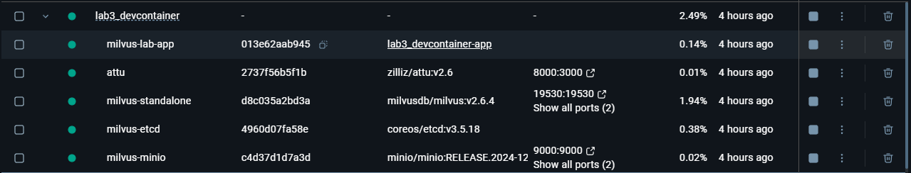
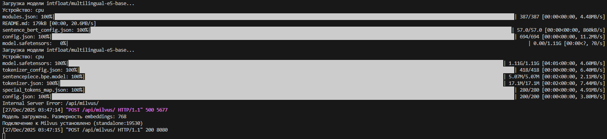
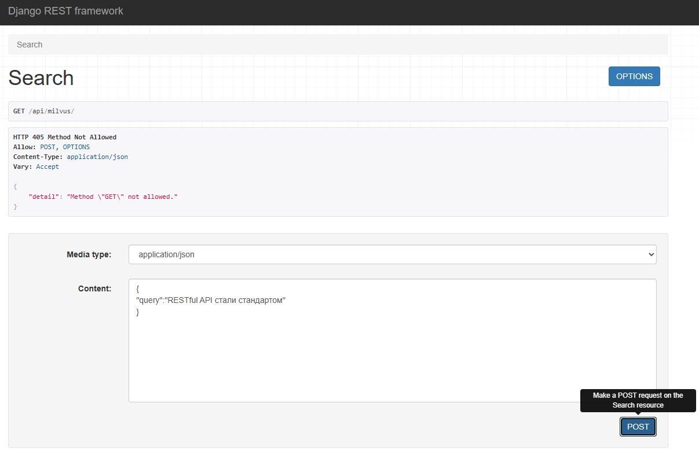
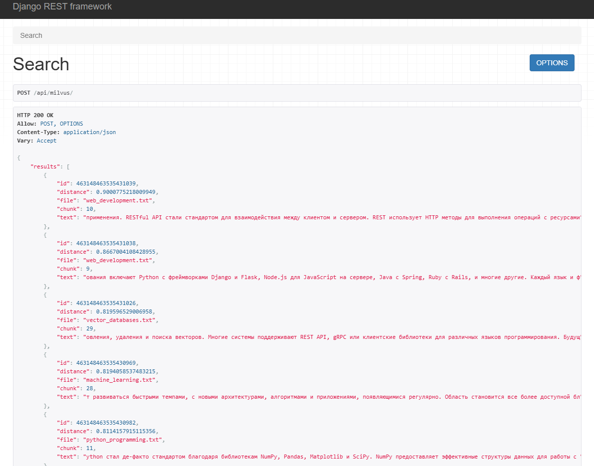
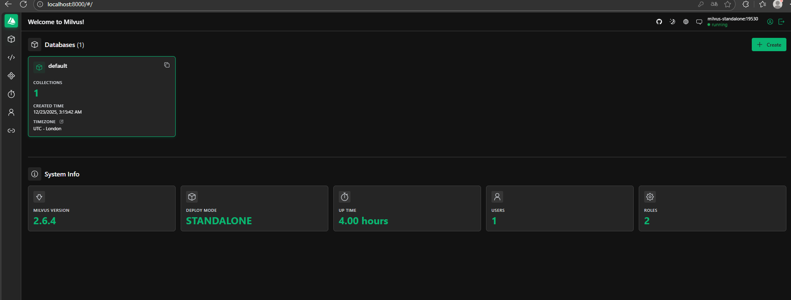
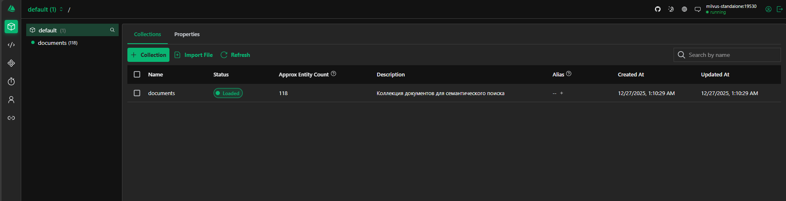

# Лабораторная работа №3. Векторные базы данных и семантический поиск

## Цель

Целью работы было научиться использовать векторные базы данных и семантический поиск для обработки текстовых данных и потенциальной интеграции с LLM (Large Language Models).

## План

1. Настройка окружения;
2. Создание модуля для работы с Milvus;
3. Парсинг текстовых файлов;
4. Задания.

## Ход работы

Для успешного выполнения лабораторной работы, первым делом был скачан архив со всеми необходимыми файлами. После чего, было принято решение открыть данную рабочую область в devcontainer и для того, чтобы двигаться дальше, нужно понять, для чего он вообще нужен.

`Devcontainer` — это инструмент для создания предсказуемых и портативных сред разработки внутри Docker-контейнеров. Он решает проблему «работает на моей машине»,
автоматически настраивая единое окружение (софт, зависимости, инструменты) для всего проекта.
Как это работает и зачем нужно:
- Изоляция и воспроизводимость: Все зависимости (библиотеки, версии Python, системные пакеты) упакованы в контейнер.
- Это гарантирует, что приложение будет одинаково работать у всех в команде и на сервере.
- Быстрый старт: Новый разработчик может начать работу одной командой (Reopen in Container), не тратя часы на ручную настройку окружения.
- Единая среда: Инструменты форматирования, линтеры, расширения редактора кода можно предустановить, обеспечивая единый стандарт кода.
- Безопасность экспериментов: Можно тестировать новые версии зависимостей, не ломая основную систему.

В ходе лабораторной работы была исследована векторная база данных, предназначенная для хранения и обработки текстовой информации, а также использован интерфейс пользователя, подключенный к этой базе.

После запуска окружения, для продолжения выполнения заданий, потребовалось заполнить базу данных данными из подготовленных текстовых файлов. Это было реализовано с помощью запуска скрипта example_usage.py, который автоматически обрабатывает текстовые файлы: преобразует информацию в векторные представления, разделяет текст на фрагменты (чанки) и загружает их в базу данных.

## Задание №1. Запуск проекта при помощи GPU.

Рабочая область была подготовлена, после чего docker-compose файл настроили для поддержки GPU. Путём раскомментирования параметра gpus: all была добавлена возможность использовать ресурсы видеокарты через CUDA для генерации эмбеддингов.


_Рисунок 1. Изменения конфигурации devcontainer.json_



_Рисунок 2. Успешно запущенный деф контейнер_

## Задание №2. Разработка API для взаимодействия с Milvus.
Реализовано API для работы с векторной базой данных Milvus с использованием Django Rest Framework для получения чанков, названия файла и текстового содержание файла, в котором содержится запрашиваемя часть текста.

Milvus — это специализированная база данных, созданная для работы с векторными данными (эмбеддингами), которые генерируют нейросетевые модели.
Главная задача и принцип работы:
- Решает проблему семантического поиска: Вместо поиска по точному совпадению слов (как в Google) Milvus ищет по смыслу. Например, по запросу «домашнее животное, которое ловит мышей» найдёт текст про кошек.
- Как это работает: Тексты, изображения или аудио с помощью моделей вроде sentence-transformers преобразуются в векторы — наборы чисел. Milvus хранит эти векторы и умеет молниеносно находить самые похожие (ближайшие соседи) по метрикам вроде косинусного расстояния.
- Ключевые преимущества: Высокая скорость поиска по миллиардам векторов, горизонтальная масштабируемость и удобная интеграция с современным ML-стеком (PyTorch, TensorFlow).

- Milvus имеет несколько главных структур, это:
- Collection (Коллекция). Аналог таблицы в реляционной БД. Это контейнер верхнего уровня для хранения векторов и связанных с ними данных;
- Partition (Раздел). Внутреннее разделение коллекции для оптимизации. Помогает организовать данные по логическим категориям для ускорения запросов (например, разделение по дате или категории товара);
- Field (Поле)
Отдельный элемент данных внутри коллекции. Бывает трёх основных типов:
  - Векторное поле (Vector Field): Хранит сами векторные эмбеддинги (например, поле embedding типа FloatVector);
  - Скалярное поле (Scalar Field): Хранит обычные метаданные — ID, текст, числа (например, book_title, year);
  - Первичный ключ (Primary Key): Специальное скалярное поле для уникальной идентификации каждой сущности (обычно целочисленное int64 или строковое VarChar).
- Entity (Сущность / Запись). Единая запись, соответствующая одному вектору и его связанным метаданным. Это полный набор значений всех полей схемы для одного объекта (например, один вектор + название одной книги + её год издания);
- Index (Индекс). Структура для ускорения поиска похожих векторов. Создаётся поверх векторного поля. Без индекса Milvus выполняет полный перебор (flat search), что медленно для больших объёмов;
- Segment (Сегмент). Базовая единица хранения и поиска внутри Milvus. Данные в коллекции автоматически разбиваются на сегменты для управления памятью и параллельной обработки;
- Alias (Псевдоним). Понятное имя для коллекции, которое можно динамически переназначать. Полезно для операций обновления без простоя: можно создать новую версию коллекции под тем же псевдонимом, и клиенты увидят её автоматически.



_Рисунок 3. Загрузка модели и получение response кодов от сервера_



_Рисунок 4. Выполнение POST запроса_



_Рисунок 5. Выполнение POST запроса_

Attu - графический веб-интерфейс для визуального управления коллекциями Milvus;





_Рисунок 6 ,7: Универсальный инструмент администрирования Milvus - ATTU_

## Организация проекта
Добавляем все файлы, которые были реализованы ранее (кроме example_usage.py) в папку core, чтобы спокойно их импортировать, когда они будут нам нужны.

Теперь создаём файл services.py, который отвечает за инициализацию основных компонентов системы. Создаём milvus_client, который является экземпляром клиента Milvus. Он нужен для подключения к базе данных и выполнению операций с коллекциями, вставки и поиска векторов. Далее создаём embedder, который нужен для генерации embeddings текстов и запросов. Затем создаём функцию embedding_fn для использования обработчика документов и добавляем document_processor, который объединяет возможности парсинга текстов, генерации embeddings и загрузки чанков в Milvus.

```python
from core.milvus_client import MilvusClient
from core.embedder import Embedder, create_embedding_function
from core.document_processor import DocumentProcessor

milvus_client = MilvusClient(host="standalone", port=19530)

embedder = Embedder(device="cuda")

embedding_fn = create_embedding_function(
    model_name="intfloat/multilingual-e5-base",
    batch_size=32
)

document_processor = DocumentProcessor(
    milvus_client=milvus_client,
    chunk_size=256,
    chunk_overlap=64,
    embedding_function=embedding_fn
)
```
Создаём файл serializers.py, который отвечает за валидацию и структурирование данных, поступающих через API. Так как в сценарии были создание коллекций, загрузку документов и семантический поиск, реализуем это с помощью сериализаторов CreateCollectionSerializer, UploadDocumentsSerializer и SearchSerializer.

CreateCollectionSerializer мы создаём для проверки данных, перед созданием коллекции в Milvus. Также как и в сценарии, добавляем force_delete для удаления существующей коллекции перед созданием новой.

```python
from rest_framework import serializers

class CreateCollectionSerializer(serializers.Serializer):
    name = serializers.CharField()
    dimension = serializers.IntegerField(default=768)
    metric_type = serializers.ChoiceField(
        choices=["COSINE", "L2", "IP"],
        default="COSINE"
    )
    force_delete = serializers.BooleanField(
        default=False)
```
UploadDocumentsSerializer создаём для загрузки документов в коллекцию. Как и в сценарии, проверяем указана ли директория с файлами или текст для загрузки, и передаём эти данные обработчику документов для чанкирования и генерации embeddings.

```python
class UploadDocumentsSerializer(serializers.Serializer):
    collection_name = serializers.CharField()
    directory = serializers.CharField(required=False)
    text = serializers.CharField(required=False)
```
SearchSerializer используется для семантического поиска. Он валидирует коллекцию для поиска, текст запроса и количество ближайших результатов.

```python
class SearchSerializer(serializers.Serializer):
    collection_name = serializers.CharField()
    query = serializers.CharField()
    top_k = serializers.IntegerField(default=3)
```
В файл views.py реализуем обработчики API-запросов, которые обеспечивают взаимодействие пользователя с системой через HTTP-запросы. Для этого были добавлены следующие классы: CreateCollectionView, UploadDocumentsView, SemanticSearchView, DocumentChunksView, CollectionInfoView.

CreateCollectionView создаёт коллекции в Milvus через POST-запрос. В нём мы используем ранее созданный CreateCollectionSerializer для валидации входных данных.
```python
from rest_framework.views import APIView
from rest_framework.response import Response
from rest_framework import status
from .serializers import CreateCollectionSerializer
from .services import milvus_client

class CreateCollectionView(APIView):
    """Создание коллекции в Milvus"""

    def post(self, request):
        serializer = CreateCollectionSerializer(data=request.data)
        serializer.is_valid(raise_exception=True)
        data = serializer.validated_data

        if data.get("force_delete"):
            milvus_client.delete_collection(data["name"])

        collection = milvus_client.create_collection(
            collection_name=data["name"],
            dimension=data["dimension"],
            metric_type=data["metric_type"]
        )

        return Response(
            {"message": f"Коллекция '{collection.name}' создана"},
            status=status.HTTP_201_CREATED
        )
```
UploadDocumentsView обрабатывает POST-запросы для загрузки документов или текста в коллекцию, используя ранее созданный UploadDocumentsSerializer. Также здесь вызывается DocumentProcessor для чанкирования текста и генерации embeddings, после чего данные вставляются в коллекцию Milvus.

```python
from .serializers import UploadDocumentsSerializer
from .services import document_processor
import os

class UploadDocumentsView(APIView):
    """Загрузка файлов или текста в Milvus"""

    def post(self, request):
        serializer = UploadDocumentsSerializer(data=request.data)
        serializer.is_valid(raise_exception=True)
        data = serializer.validated_data

        collection_name = data["collection_name"]
        directory = data.get("directory")

        if directory and os.path.exists(directory):
            txt_files = [
                f for f in os.listdir(directory)
                if f.endswith(".txt")
            ]

            results = []

            for txt_file in txt_files:
                file_path = os.path.join(directory, txt_file)

                result = document_processor.process_file(
                    file_path=file_path,
                    collection_name=collection_name
                )

                results.append({
                    "file": txt_file,
                    "success": result["success"],
                    "chunks_count": result.get("chunks_count", 0),
                    "error": result.get("error")
                })

            return Response({
                "directory": directory,
                "files_found": len(txt_files),
                "results": results
            })

        sample_text = data.get("text")
        if sample_text:
            result = document_processor.process_text(
                text=sample_text,
                collection_name=collection_name
            )
            return Response(result)

        return Response(
            {
                "error": "Директория не найдена и текст не передан"
            },
            status=status.HTTP_400_BAD_REQUEST
        )
```
В SemanticSearchView выполняются POST-запросы для семантического поиска по коллекции. Для этого используется также ранее созданный SearchSerializer. Генерирует embedding запроса с помощью embedder и вызывает метод поиска в Milvus.

```python
from .serializers import SearchSerializer
from .services import embedder, milvus_client

class SemanticSearchView(APIView):
    """Семантический поиск в Milvus"""

    def post(self, request):
        serializer = SearchSerializer(data=request.data)
        serializer.is_valid(raise_exception=True)
        data = serializer.validated_data

        query_vector = embedder.encode_query(data["query"])

        results = milvus_client.search(
            collection_name=data["collection_name"],
            query_vectors=[query_vector],
            top_k=data["top_k"]
        )

        return Response(results[0])
```
DocumentChunksView позволяет через GET запрос получить все чанки конкретного документа по его пути.

```python
class DocumentChunksView(APIView):
    """Получение всех чанков документа по пути"""

    def get(self, request, collection_name, file_path):
        try:
            chunks = milvus_client.get_document_chunks(
                collection_name, file_path)
            return Response(chunks)
        except Exception as e:
            return Response({"error": str(e)}, status=400)
```
CollectionInfoView позволяет через GET запрос вернуть информацию о коллекции: сколько записей, существование коллекции и другие метаданные. Так как данные из Milvus содержат сложные объекты, которые не могут быть автоматически преобразованы в JSON, создаём словари с простыми типами: строками, числами, списками и вложенными словарями. После преобразования всех компонентов в читаемый формат, данные возвращаются как JSON.

```python
class CollectionInfoView(APIView):
    """Информация о коллекции Milvus"""

    def get(self, request, name):
        try:
            info = milvus_client.get_collection_info(name)

            if not info['exists']:
                return Response({"error": f"Коллекция '{name}' не найдена"}, status=404)

            schema = info.get('schema')
            if schema:
                fields = []
                for field in getattr(schema, "fields", []):
                    fields.append({
                        "name": field.name,
                        "dtype": str(field.dtype),
                        "is_primary": getattr(field, "is_primary", False),
                        "auto_id": getattr(field, "auto_id", False),
                        "max_length": getattr(field, "max_length", None),
                        "description": getattr(field, "description", "")
                    })
                info['schema'] = {
                    "description": getattr(schema, "description", ""),
                    "fields": fields
                }

            indexes = info.get('indexes', [])
            serializable_indexes = []
            for index in indexes:
                serializable_indexes.append({
                    "field_name": getattr(index, "field_name", ""),
                    "index_type": getattr(index, "index_type", ""),
                    "params": getattr(index, "params", {})
                })
            info['indexes'] = serializable_indexes

            return Response(info)

        except Exception as e:
            return Response({"error": str(e)}, status=400)
```
Теперь в файле urls.py пропишем маршруты, которые HTTP-запросы пользователя с нужными API запросами. Добавляем путь collections/create/ для создания новой коллекции в Milvus, collections/<str:name>/info/ для получения информации о коллекции, documents/upload/ для загрузки текстовых файлов или произвольного текста в Milvus, documents/<str:collection_name>/chunks/<path:file_path>/ для получения всех чанков конкретного документа по его пути и добавляем search/ для выполнения семантического поиска по коллекции.

```python
from django.urls import path
from .views import (
    CreateCollectionView,
    UploadDocumentsView,
    SemanticSearchView,
    CollectionInfoView,
    DocumentChunksView
)

urlpatterns = [
    path("collections/create/", CreateCollectionView.as_view()),
    path("collections/<str:name>/info/", CollectionInfoView.as_view()),
    path("documents/upload/", UploadDocumentsView.as_view()),
    path("documents/<str:collection_name>/chunks/<path:file_path>/",
         DocumentChunksView.as_view()),
    path("search/", SemanticSearchView.as_view()),
]
```

### Вывод

В процессе выполнения лабораторной работы удалось ознакомиться с взаимодействием с векторной базой данных Milvus. Так же был получен практический опыт настройки docker-контейнера на использованите мощностей видеокарты, путем конфигурации docker-compose файла. Через интерфейс Attu успешно проведён поиск по коллекциям, что подтвердило работоспособность системы. Для взаимодействия с системой частично реализован REST API (архитектурный стиль, который используется для взаимодействия между клиентом и сервером через протокол HTTP).
