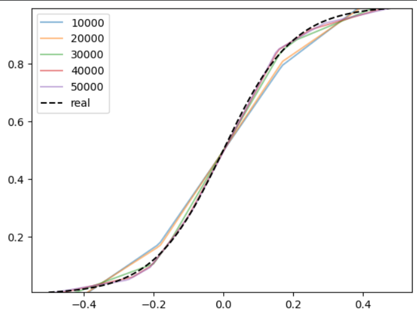
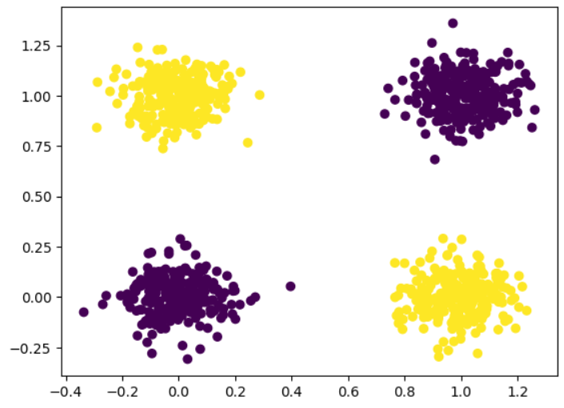
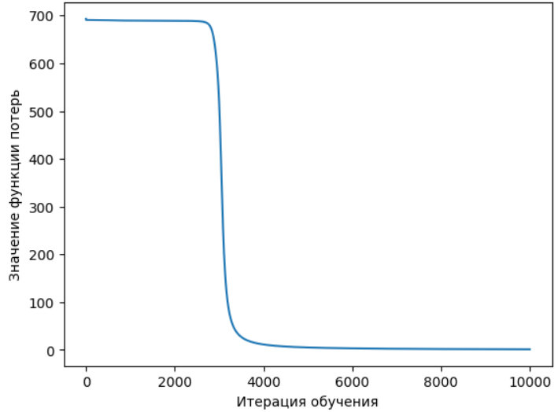
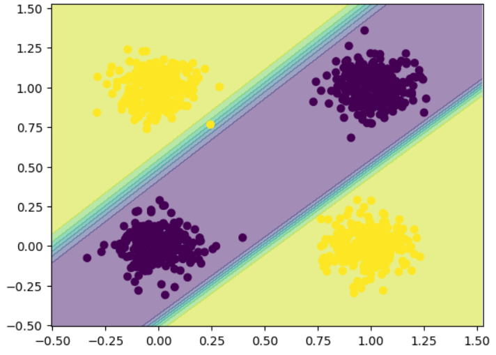
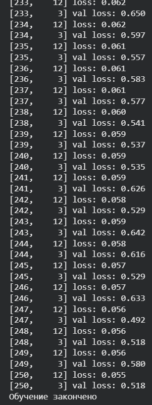
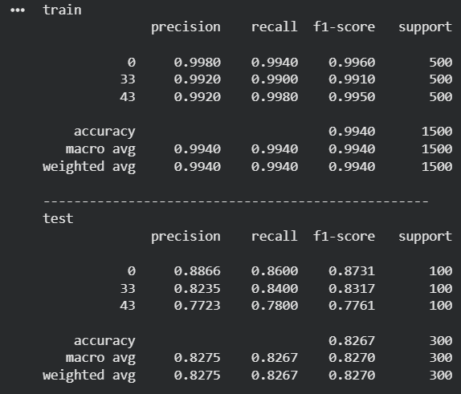

# Отчёт

**Лабораторная работа №1. Введение в глубокое обучение**

## Цель работы

Целью лабораторной работы является изучение основ глубокого обучения и знакомство с фреймворком **PyTorch**. В рамках работы были реализованы и исследованы три задачи:

- регрессия с использованием теоремы универсальной аппроксимации и ручного вычисления градиентов;
- бинарная классификация с применением автодифференцирования в PyTorch;
- классификация изображений из набора данных CIFAR-100 с помощью полносвязной нейронной сети.

## Задание №1. Регрессия с использованием теоремы универсальной аппроксимации и ручного дифференцирования

Теорема универсальной аппроксимации утверждает, что нейронная сеть с одним скрытым слоем и достаточным числом нейронов способна аппроксимировать(процесс приближённого восстановления зависимости между входными и выходными данными) любую непрерывную функцию с произвольной точностью. На основе данной теоремы в первом задании была реализована задача регрессии.

Суть задачи заключалась в обучении нейронной сети аппроксимировать заданную сигмоидальную функцию по зашумлённым данным. Поскольку задача является регрессионной, модель предсказывает непрерывные значения.

Для обучения использовался алгоритм **градиентного спуска**, при этом вычисление производных функции потерь по весам сети выполнялось **вручную**. Такой подход позволяет лучше понять внутренние механизмы обучения нейронных сетей.

Для реализации вычислений использовалась библиотека **PyTorch**, а для визуализации данных и результатов обучения — библиотека **matplotlib**.

### Результаты обучения

На первом графике показан этап подготовки обучающих данных. Точки представляют собой зашумлённые значения сигмоидальной функции, которые используются в качестве обучающей выборки для нейронной сети.

На втором графике показан процесс обучения нейронной сети. В ходе обучения веса модели обновляются на каждой итерации градиентного спуска. Для наглядности на графике отображены предсказания нейронной сети через каждые 10 000 итераций. Видно, что по мере обучения выход модели постепенно приближается к истинной сигмоидальной функции: предсказания становятся более гладкими, ошибка уменьшается, а влияние шума снижается. Это свидетельствует об успешной аппроксимации целевой функции.

## Задание №2. Бинарная классификация с использованием автодифференцирования в PyTorch

Во втором задании решалась задача **бинарной классификации**, в которой модель должна отнести каждый объект к одному из двух классов(0 или 1).

Для обучения была сгенерирована искусственная выборка, состоящая из точек двух классов. Нейронная сеть обучалась с использованием **автодифференцирования PyTorch**, что позволило автоматически вычислять градиенты функции потерь.

В качестве функции потерь была выбрана функция, подходящая для бинарной классификации, а также использована нелинейная функция активации, обеспечивающая лучшую сходимость модели.

### Результаты обучения

На первом изображении показано распределение исходных данных. Точки на графике — это объекты обучающей выборки.
Каждая точка описывается двумя признаками (ось X и ось Y), поэтому данные можно изобразить на плоскости.
Цвет точек соответствует истинному классу объекта: один класс отмечен жёлтым цветом, второй — фиолетовым.

На следующем графике отображено изменение значения функции потерь в процессе обучения. Ось X отображает количество итераций (шагов обучения), от 0 до 10,000. Ось Y показывает значение функции потерь, которая измеряет различие между истинными метками и предсказаниями модели. В начале обучения наблюдается резкое снижение ошибки, что указывает на быстрое улучшение качества модели. По мере обучения уменьшение функции потерь замедляется, что является типичным поведением для нейронных сетей.

На итоговом изображении показан результат работы обученной модели. Видно, что нейронная сеть успешно разделяет пространство признаков и корректно классифицирует объекты двух классов.

## Задание №3. Классификация изображений из набора данных CIFAR-100

В третьем задании рассматривалась задача классификации изображений из набора данных **CIFAR-100**. Данный датасет содержит 60 000 цветных изображений размером 32×32 пикселя, распределённых по 100 классам.

Для упрощения задачи были выбраны три класса:

- яблоки (класс 0),
- леса (класс 33),
- львы (класс 43).

После загрузки и предобработки данных была реализована модель **многослойного перцептрона (MLP)** с одним скрытым слоем. В качестве функции потерь использовалась **кросс-энтропия**, а обучение проводилось с помощью градиентного спуска.

### Результаты обучения

На изображении показан пример изображения одного из выбранных классов из обучающей выборки.

На следующем этапе была проведена процедура обучения модели. В процессе обучения отслеживалось значение функции потерь на обучающей и валидационной выборках, что позволяло контролировать качество обучения и предотвращать переобучение.

После завершения обучения была выполнена оценка качества модели.

Качество модели оценивалось отдельно на обучающей (train) и тестовой (test) выборках. Модель показала высокую точность на обучающей выборке (около 99%), что говорит о том, что она хорошо выучила обучающие данные. На тестовой выборке точность составила около 83%, что свидетельствует о способности модели обобщать знания на новых данных, однако также указывает на ограничения полносвязной архитектуры при работе с изображениями.

Анализ метрик по классам показал, что модель лучше всего распознаёт изображения класса 0, а хуже всего — класса 43, что связано с большей визуальной сложностью объектов данного класса. Полученные результаты показывают, что для повышения качества классификации изображений целесообразно использовать более подходящие архитектуры, такие как свёрточные нейронные сети.

**Пояснение метрик качества**

Precision (точность) — показывает, какая доля объектов, отнесённых моделью к данному классу, действительно принадлежит этому классу. Характеризует количество ложных срабатываний.

Recall (полнота) — показывает, какую долю объектов данного класса модель смогла правильно обнаружить. Характеризует количество пропущенных объектов.

F1-score — это гармоническое среднее между precision и recall. Используется как обобщённая метрика качества классификации и позволяет оценить баланс между точностью и полнотой.

## Выводы

В ходе лабораторной работы были изучены и реализованы основные подходы глубокого обучения с использованием библиотеки PyTorch. Были рассмотрены задачи регрессии, бинарной классификации и многоклассовой классификации изображений.

В процессе выполнения работы были изучены:

- ручное вычисление градиентов;
- механизм автодифференцирования;
- применение различных функций потерь;
- обучение полносвязных нейронных сетей.

Полученные результаты подтвердили, что нейронные сети способны эффективно решать задачи регрессии и классификации, а фреймворк PyTorch предоставляет удобные инструменты для их реализации и анализа.

**Ссылка на выполнение лабораторной работы в Google Colab:**
[https://colab.research.google.com/drive/1sdnqzi0pruL70lKpmJQ9ZsTUpFL2r8Nu?usp=sharing](https://colab.research.google.com/drive/1sdnqzi0pruL70lKpmJQ9ZsTUpFL2r8Nu?usp=sharing)
