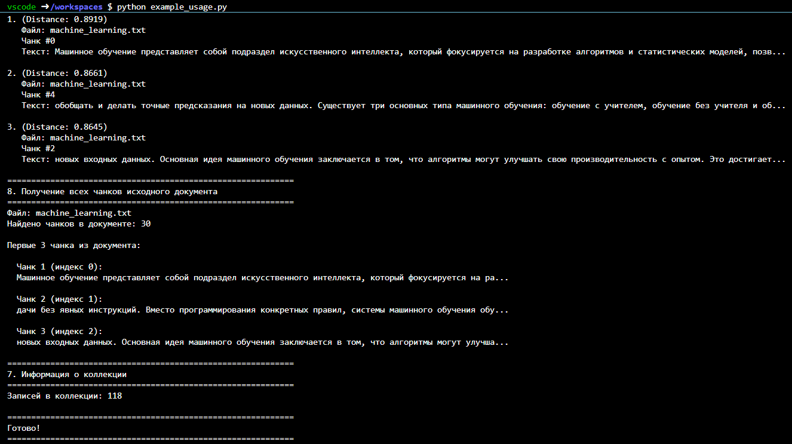
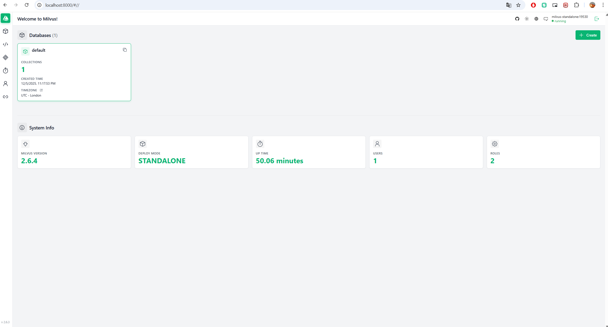
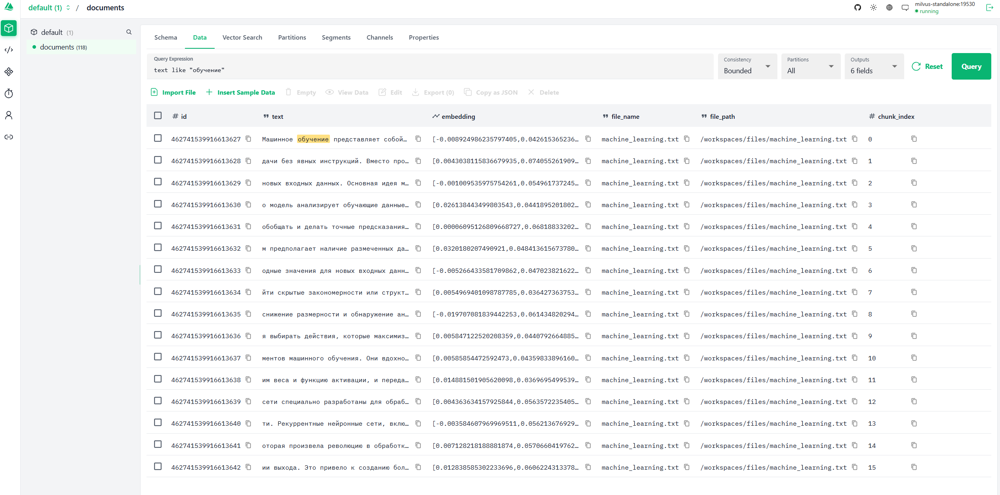
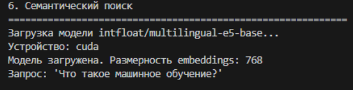
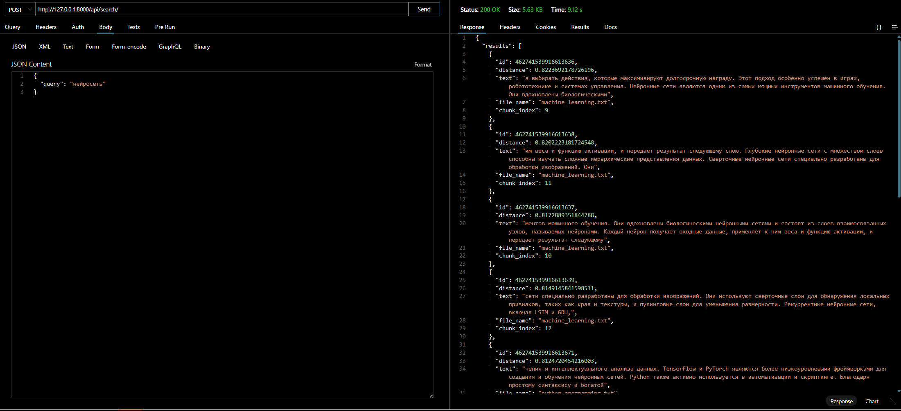

# Лабораторная работа №3. Векторные базы данных и семантический поиск

## Цель

Целью работы было научиться использовать векторные базы данных и семантический поиск для обработки текстовых данных и потенциальной интеграции с LLM (Large Language Models).

## План

1. Настройка окружения;
2. Создание модуля для работы с Milvus;
3. Парсинг текстовых файлов;
4. Задания.

## 1. Настройка окружения

Для выполнения работы использовался **devcontainer**, конфигурация которого была размещена по пути `../assets/lab3/.devcontainer/devcontainer.json`.

**Devcontainer** представляет собой контейнер, содержащий все необходимые компоненты для работы, включая:

* Python 3.12;
* Milvus;
* Attu.

Этот контейнер позволил работать с проектом в изолированном окружении, что исключило возможные конфликты зависимостей и упростило настройку. Для его запуска использовалась опция "Reopen in Container" в контекстном меню **VSCode** (Ctrl+Shift+P), при этом установленное расширение "Dev Containers" предоставило необходимую среду.

Контейнеры оказались достаточно объемными, и их загрузка потребовала более 2 ГБ данных. Конфигурация была изначально подготовлена для использования CPU-версии эмбеддера, а для работы с GPU-версией потребовались соответствующие изменения в конфиге.

## 2. Создание векторной базы данных

После настройки окружения был запущен контейнер с работающим Milvus и Attu. Для начала был инициализирован модуль для работы с Milvus, который обеспечил подключение к серверу:

```python
from pymilvus import connections, Collection, CollectionSchema, FieldSchema, DataType, utility

class MilvusClient:
    def __init__(self, host: str = "standalone", port: int = 19530, alias: str = "default"):
        self.host = host
        self.port = port
        self.alias = alias
        self._connect()
    
    def _connect(self):
        try:
            connections.connect(host=self.host, port=self.port)
            print(f"Подключение к Milvus установлено ({self.host}:{self.port})")
        except Exception as e:
            print(f"Ошибка подключения к Milvus: {e}")
            raise
```

Метод для подключения был успешно реализован, и подключение к Milvus было установлено.

Далее был разработан метод для создания коллекции в базе данных с такими параметрами, как имя коллекции, размерность векторов и тип метрики:

```python
def create_collection(self, collection_name: str, dimension: int, metric_type: str = "COSINE"):
    fields = [
        FieldSchema(name="id", dtype=DataType.INT64, is_primary=True, auto_id=True),
        FieldSchema(name="embedding", dtype=DataType.FLOAT_VECTOR, dim=dimension)
    ]
    schema = CollectionSchema(fields=fields)
    collection = Collection(name=collection_name, schema=schema)
    collection.create_index(field_name="embedding", index_params={"metric_type": metric_type, "index_type": "IVF_FLAT", "params": {"nlist": 128}})
    return collection
```

Этот метод создает коллекцию в Milvus с указанными параметрами и индексом для векторного поля. После этого была разработана функция для вставки данных в коллекцию:

```python
def insert_data(self, collection_name: str, texts: List[str], embeddings: List[List[float]]):
    collection = Collection(collection_name)
    collection.insert([texts, embeddings])
    collection.flush()
```

Этот метод позволяет вставлять данные в коллекцию после проверки на наличие коллекции и соответствие размерности эмбеддингов.

Кроме того, был реализован метод для поиска похожих векторов в коллекции:

```python
def search(self, collection_name: str, query_vectors: List[List[float]], top_k: int = 5):
    collection = Collection(collection_name)
    results = collection.search(query_vectors, anns_field="embedding", limit=top_k)
    return results
```

Поиск выполняется с использованием метрики cosine similarity, но также предусмотрена возможность использования других метрик, таких как L2 или IP.


## 3. Парсинг текстовых файлов

После того как была настроена работа с **Milvus**, был создан класс **TextParser**, предназначенный для парсинга текстовых файлов с разделением на чанки.

```python
import re
import os
from typing import List

class TextParser:
    """Парсер текстовых файлов с разбиением на чанки."""
    
    def __init__(self, chunk_size: int = 256, chunk_overlap: int = 64):
        if chunk_overlap >= chunk_size:
            raise ValueError("chunk_overlap должен быть меньше chunk_size")
        self.chunk_size = chunk_size
        self.chunk_overlap = chunk_overlap
        self.step_size = chunk_size - chunk_overlap
```

Этот класс позволил нормализовать текст, очищая его от лишних пробелов и переносов строк:

```python
def normalize_text(self, text: str) -> str:
    text = re.sub(r'\s+', ' ', text)
    return text.strip()
```

Для удобства работы с большими объемами данных текст был разделен на чанки с перекрытием, что сохраняло контекст:

```python
def chunk_text(self, text: str) -> List[str]:
    text = self.normalize_text(text)
    chunks = []
    start = 0
    while start < len(text):
        end = start + self.chunk_size
        chunk = text[start:end].strip()
        if chunk:
            chunks.append(chunk)
        start += self.step_size
    return chunks
```

Таким образом, каждый чанк содержал связанный текст, что позволяло эффективно работать с данными и обеспечивало их целостность.

После того как текст был разбит на чанки, использовался метод для обработки файлов, который возвращал подготовленные для загрузки в **Milvus** данные:

```python
def parse_file(self, file_path: str, encoding: str = "utf-8") -> List[str]:
    text = self.read_file(file_path, encoding)
    chunks = self.chunk_text(text)
    return chunks
```

Данный метод преобразовывал содержимое файла в список чанков, готовых для дальнейшей работы с базой данных.



После настройки всех компонентов, через адрес `localhost:8000` открылся веб-интерфейс **Attu** для работы с Milvus. **Attu** — это удобный графический интерфейс, который позволяет выполнять операции с базой данных Milvus, включая создание коллекций, управление данными и поиск по векторным представлениям.



Я смог найти коллекцию "documents", созданную с помощью кода, и перешел в раздел "Data", где отображались все доступные чанки.

Выполнив поиск с заданными параметрами, я убедился в эффективности интерфейса:



В итоге **Attu** оказался удобным инструментом для взаимодействия с Milvus, обеспечивая быстрый и понятный поиск и управление данными.


## 4. Задания

### 1. **Запуск сценария с использованием GPU**

После внесения изменений в конфигурацию **docker-compose.yaml** для включения использования графических процессоров, была добавлена строка `gpus: all` в контейнер **app**. Это позволяет контейнеру использовать все доступные GPU для ускорения вычислений, таких как генерация **embeddings**.

Пример измененного фрагмента конфигурации:

```yaml
version: '3.8'

services:
  app:
    build:
      context: ..
      dockerfile: .devcontainer/Dockerfile
    container_name: milvus-lab-app
    working_dir: /workspaces
    volumes:
      - ../:/workspaces
    command: sleep infinity
    gpus: all  # Строка для использования GPU
    depends_on:
      - standalone
    networks:
      - internal-network
```

### Дополнительные шаги для работы с GPU

Для корректной работы с графическими процессорами, также были установлены драйвера **NVIDIA Studio**, которые обеспечивают поддержку **CUDA**. Эти драйвера необходимы для использования графических процессоров в контейнерах **Docker** и позволяют эффективно выполнять вычисления на GPU, включая создание **embeddings** в **Milvus**.

### Перезапуск контейнеров

После добавления строки в конфигурацию для работы с GPU, был выполнен перезапуск всех контейнеров с помощью команды:

```bash
>Dev Containers: Rebuild Container
```

### Проверка работы GPU

После того как контейнер был перезапущен с настроенным доступом к GPU, был проведен тест, чтобы убедиться в корректности работы с **CUDA**. В ходе тестирования был запущен сценарий, использующий **GPU** для ускоренной обработки данных, и для генерации **embeddings** на графическом процессоре.



В результате все необходимые настройки для работы с графическими процессорами были выполнены успешно, и теперь система использует **GPU** для ускорения вычислений, что значительно улучшает производительность при обработке векторных данных в **Milvus**.

### 2. **Создание API для работы с Milvus**

### Создание проекта Django

На первом этапе была создана структура нового проекта на **Django** с использованием команды:

```bash
django-admin startproject milvus_project
```

### Интеграция с Django Rest Framework

Для удобной работы с **RESTful API** был добавлен пакет **Django Rest Framework (DRF)** с помощью команды:

```bash
pip install djangorestframework
```

После этого в проекте в файл **settings.py** была добавлена строка для подключения **DRF**:

```python
INSTALLED_APPS = [
    'rest_framework',
    # другие приложения
]
```

### Реализация поиска в Milvus

В файле **views.py** было реализовано API, которое обрабатывает запросы на поиск в **Milvus**. Основная логика включает:

1. Получение текстового запроса.
2. Генерация **embedding** с помощью модели **multilingual-e5-base**.
3. Подключение к **Milvus** для выполнения поиска.
4. Формирование ответа с результатами поиска.

Пример кода для обработки запроса:

```python
from rest_framework.views import APIView
from rest_framework.response import Response
from rest_framework import status
from .embedder import Embedder
from .milvus_client import MilvusClient
from .serializers import SearchQuerySerializer

milvus_client = MilvusClient()

class SearchView(APIView):
    """Представление для поиска в Milvus"""

    def post(self, request, *args, **kwargs):
        query = request.data.get("query", "")
        
        if not query:
            return Response({"error": "Запрос не может быть пустым"}, status=status.HTTP_400_BAD_REQUEST)

        try:
            embedder = Embedder(model_name="intfloat/multilingual-e5-base")
            query_embedding = embedder.encode_query(query)
        except Exception as e:
            return Response({"error": f"Ошибка при генерации embedding для запроса: {str(e)}"}, status=status.HTTP_500_INTERNAL_SERVER_ERROR)

        try:
            collection_name = "documents" 
            search_results = milvus_client.search(
                collection_name=collection_name,
                query_vectors=[query_embedding],
                top_k=10 
            )

            print(search_results)

            formatted_results = []
            for hit in search_results: 
                formatted_results.append({
                    "id": hit.get("id", ""),
                    "distance": hit.get("distance", 0),
                    "text": hit.get("text", "Нет текста"),
                    "file_name": hit.get("file_name", "N/A"),
                    "chunk_index": hit.get("chunk_index", -1)
                })

            return Response({"results": formatted_results}, status=status.HTTP_200_OK)

        except Exception as e:
            return Response({"error": f"Ошибка при выполнении поиска в Milvus: {str(e)}"}, status=status.HTTP_500_INTERNAL_SERVER_ERROR)
```

### Реализация сериализатора

Для обработки данных и валидации запросов был создан сериализатор в **serializers.py**:

```python
from rest_framework import serializers

class SearchQuerySerializer(serializers.Serializer):
    query = serializers.CharField()  
    top_k = serializers.IntegerField(default=5)
```

### Настройка маршрутов

Для обработки маршрутов API в приложении **milvus** был создан файл **urls.py**, который связывает URL с представлением:

```python
from django.urls import path
from .views import SearchView

urlpatterns = [
    path('search/', SearchView.as_view(), name='search'),
]

```

Затем эти маршруты были подключены в основной файл **urls.py** проекта:

```python
from django.contrib import admin
from django.urls import path, include

urlpatterns = [
    path('admin/', admin.site.urls),
    path('api/', include('milvus.urls')),
]
```

### Проверка через Thunder Client в VS Code

После реализации API был протестирован запрос с помощью **Thunder Client** в **VS Code**, отправив POST-запрос с телом:

```json
{
  "query": "нейросеть"
}
```



### Вывод

В ходе выполнения работы была успешно настроена система для работы с векторными данными, включая создание коллекций, обработку запросов и поиск по данным с использованием **Milvus**. Использование **Django Rest Framework** позволило легко организовать API для взаимодействия с системой. Веб-интерфейс **Attu** для **Milvus** также был настроен и протестирован. Все компоненты системы интегрированы, и поиск по данным теперь работает корректно.
