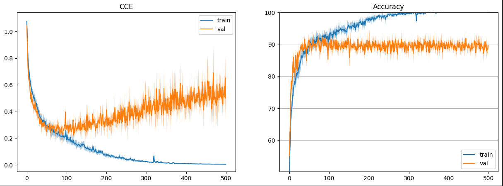
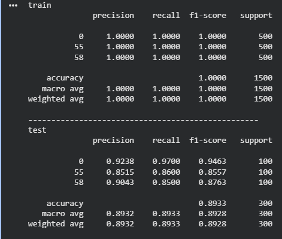
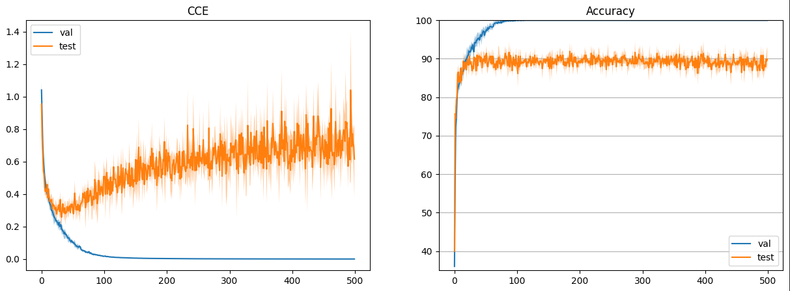
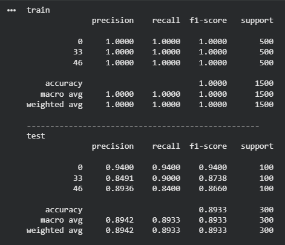
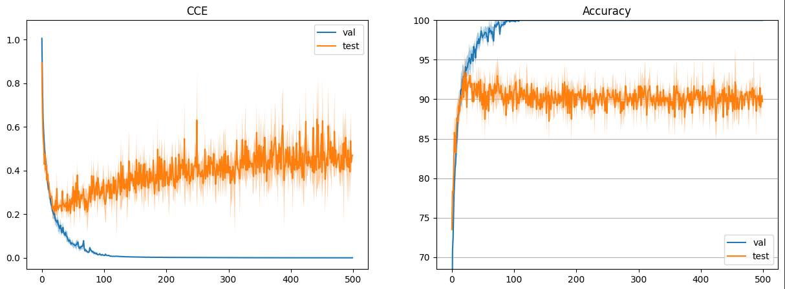
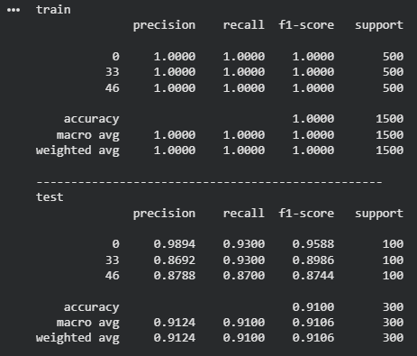
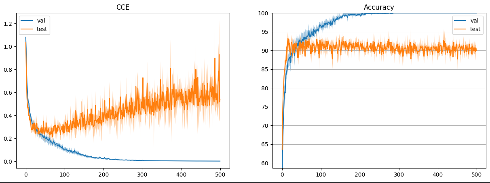
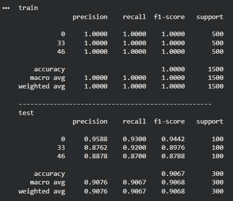
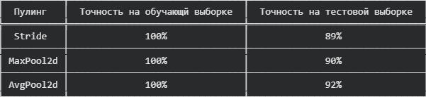

### Лабораторная работа №2. Сверточная нейросеть

**Задания:**

**`1.`**  Взять свои классы из прошлой лабораторной работы и обучить сверточную сеть используя GPU.

**`2.`**  Повысить точность модели, проведя три обучения для 3 разных тактик пуллинга.

### Часть 1. 

**Свёрточная нейросеть (CNN)** — это нейросеть, которая хорошо подходит для работы с изображениями, потому что она умеет находить локальные признаки: линии, края, текстуры, а затем собирать из них более сложные элементы (части объектов) и в итоге определять, что изображено на картинке.

**Основной элемент CNN — свёртка.** В ней используется ядро **(kernel, фильтр)** — небольшая матрица чисел, например 3×3 или 5×5. Ядро “скользит” по изображению: в каждой позиции оно умножает свои значения на соответствующие пиксели, суммирует результат и получает одно число. Так формируется карта признаков — новая “картинка”, где усилены нужные детали (например, границы). Значения ядра не задаются вручную: сеть обучается и сама подбирает фильтры, которые лучше всего помогают решать задачу.

Для того чтобы нейросеть обучалась быстрее нам нужно было использовать GPU.


_Рисунок 1: Смена апаратного ускорителя на GPU_

**Архитектура модели**

- `Вход: изображение 32×32×3 (NHWC)`
- `Свёрточный слой 1: Conv2d(3 → 32), kernel_size=5(матрица 5x5), stride=1, padding=2, активация ReLU`
- `Свёрточный слой 2: Conv2d(32 → 64), kernel_size=3(матрица 3x3), stride=1, padding=1, активация ReLU`
- `Flatten: преобразование 64×8×8 → 4096`
- `Выходной слой: Linear(4096 → 100)`

**Параметры обучения:**

- `optimizer = SGD(momentum=0.9)`
- `learning_rate = 0.005`
- `epochs = 500`
- `loss = CrossEntropyLoss`



_Рисунок 2: Графики изменения функции потерь и точности на эпохах_

На левом графике прд названием CCE (categorical cross-entropy) — значение функции потерь по эпохам: на обучающей выборке (синяя кривая) **loss** почти обнуляется, то есть модель отлично подгоняется под **train.** На валидации (оранжевая кривая) сначала тоже видно улучшение, но затем **loss** начинает расти и сильнее шуметь, что указывает на переобучение.

На правом графике показана **Accuracy** — доля правильных ответов: на train (синий) точность быстро достигает почти **100%**, а на **val** (оранжевый) поднимается примерно до **90–92%** и дальше почти не растёт. Из-за этого со временем увеличивается разница между результатами на обучении и валидации.



_Рисунок 3: Результаты_

### Часть 2. 

Следующим этапом нам нужно было провести тесты на 3 разных тактик пулинга

**Пуллинг за счёт шага свёртки (stride)**

В этом варианте пространственное разрешение уменьшается прямо внутри свёрточного слоя — достаточно взять stride > 1. Так мы одновременно извлекаем признаки и сжимаем размерность, можем сократить число слоёв и ускорить обучение. Минус в том, что при увеличенном шаге модель “просматривает” изображение реже, поэтому часть мелких деталей может теряться.

**Stride (шаг)** — это на сколько пикселей “сдвигается” окно свёртки/пулинга по высоте и ширине. Чем больше stride, тем сильнее уменьшается размер карты признаков.

- stride = 1 — окно свёртки/пулинга сдвигается на 1 пиксель, поэтому карта признаков почти не уменьшается (обычно сохраняется размер, если padding подобран).

- stride = 2 — сдвиг на 2 пикселя, из-за чего высота и ширина карты признаков обычно уменьшаются примерно в 2 раза (даунсэмплинг).

- stride = 3 — сдвиг на 3 пикселя, размер уменьшается ещё сильнее, модель быстрее теряет мелкие детали.

- stride = 4 (и больше) — агрессивное уменьшение разрешения: вычисления быстрее, но детализация заметно падает.

**Архитекутура сети с помощью stride:**
```   
nn.Conv2d(3, HIDDEN_SIZE, 5, stride=3, padding=2),
nn.ReLU(),
nn.Conv2d(HIDDEN_SIZE, HIDDEN_SIZE*2, 3, stride=3, padding=1),
nn.ReLU(),
nn.Flatten(),
nn.Linear(HIDDEN_SIZE*2*4*4, classes),
```

В данной архитектуре используется слудующие слои:

- Первый сверточный слойпринимает входное RGB-изображение и формирует 32 карты признаков с помощью фильтров (ядер) **5×5**. За счёт `stride=3` происходит уменьшение пространственного размера карты признаков. После слоя используется функция активации **ReLU.**
- Второй сверточный слой принимает карты признаков от первого слоя и формирует более сложные признаки. Количество карт признаков увеличивается в 2 раза ,и используется фильтр(ядер) свертки **3×3**, затем снова применяется `stride=3` для дальнейшего уменьшения размерности. После слоя также используется **ReLU.**
- Слой `Flatten` преобразует(разворачивает) выход свёрточной части в одномерный вектор , чтобы его передать на полносвязный слой
- Полносвязный слой `Linear` принимает полученный вектор и выдаёт выход размером **100** исходя из количество классов.



_Рисунок 4: Графики изменения функции потерь и точности на эпохах с помощью stride_

На рисунке 4 З модель stride уже в первые десятки эпох точность на **test** поднимается примерно до **88–90%** и дальше держится около этого уровня. При этом на **val** сеть продолжает улучшаться намного сильнее: к **~80–100** эпохам точность почти упирается в **100%**, а на графике CCE на **val** практически обнуляется. После этого начинается расхождение: **test-accuracy** почти не растёт, зато на графике CCE **test** постепенно ползёт вверх и становится более шумным — то есть модель всё больше подстраивается под валидацию и начинает выдавать более уверенные предсказания, но на тесте это не превращается в реальный прирост качества.



_Рисунок 5: Результаты обучения с помощью stride_

**Макс-пулинг (Max Pooling)**

Max-pooling — классический способ уменьшить размер карты признаков: из каждого локального окна берётся максимум. Это помогает выделять самые “сильные” признаки и делает модель более устойчивой к шуму и небольшим смещениям.

**Архитекутура сети с помощью MaxPool2d:**

```
nn.Conv2d(3, HIDDEN_SIZE, 5,stride=1),
nn.ReLU(),
nn.MaxPool2d(3),

nn.Conv2d(HIDDEN_SIZE, HIDDEN_SIZE*2, 3,stride=1),
nn.ReLU(),
nn.MaxPool2d(2),
  
nn.Flatten(),
nn.Linear(HIDDEN_SIZE*2*3*3, classes),
```

В данной архитектуре используется слудующие слои:

В этой архитектуре, **stride=1**, но добавляются два новых слоя **MaxPool** после прохода первого сверточного применяется max-пулинг с размерность **3**, то значит, что из матрицы  **3x3** пикселей будет выбираться 1 с наивысшим параметром. После прохода второго сверточного слоя, применяется еще один max-пулинг, но уже с размерностью **2** который уже выбирает 1 пиксель из матрицы **2x2**. Из-за этих изменений на выходе получается карта признаков другого размера, поэтому нужно пересчитать её размерность (число элементов) и под неё настроить входной размер полносвязного слоя.



_Рисунок 6: Графики изменения функции потерь и точности на эпохах с помощью MaxPool_

В первые **~10–20** эпох модель с использованием **max-pooling** быстро учится: функция потерь  падает, а точность на тесте быстро поднимается до **~91–93%**. Примерно после **~30–60** эпох начинается переобучение: на валидации CCE продолжает снижаться почти до нуля и точность растёт к **~100%**, но на тесте точность уже почти не улучшается (держится около ~90–92%), а test на графике CCE постепенно растёт и сильнее шумит.



_Рисунок 7: Результаты обучения с помощью MaxPool_

**Усредняющий пуллинг (Average Pooling)**

Average-pooling тоже уменьшает разрешение, но вместо максимума берёт среднее по окну. Он сильнее “сглаживает” информацию, снижает влияние шумов и лучше сохраняет общую структуру, но не так резко подчёркивает яркие признаки, как max-pooling.

**Архитекутура сети с помощью AvgPool2d:**

```
  nn.Conv2d(3, HIDDEN_SIZE, 5,stride=1),
nn.ReLU(),
nn.AvgPool2d(3),

nn.Conv2d(HIDDEN_SIZE, HIDDEN_SIZE*2, 3,stride=1),
nn.ReLU(),
nn.AvgPool2d(2),
  
nn.Flatten(),
nn.Linear(HIDDEN_SIZE*2*3*3, classes),
```

В данной архитектуре используется слудующие слои:

В этой архитекутуре все тоже самое, только вместо слоя **MaxPool** используется  AvgPool2d который берет среднее значени исходя из размера матрицы.



_Рисунок 8: Графики изменения функции потерь и точности на эпохах с помощью AvgPool_

В первые **~10–20** эпох при average сеть быстро снижает потерю ошибок и резко повышает точность: **test accuracy** выходит примерно на 90–92%, а **val accuracy** растёт дальше. Примерно после **~20–40** эпох тестовая точность почти перестаёт улучшаться и дальше колеблется вокруг **90–91%**, тогда как на валидации модель продолжает дожимать качество и к **~150–200**  эпохам выходит почти на **100%** при CCE, стремящемся к нулю. Одновременно тестовый CCE после раннего минимума начинает постепенно расти и становится более шумным — это признак переобучения: сеть становится слишком уверенной на **val**, но не получает реального выигрыша на **test**.



_Рисунок 9: Результаты обучения с помощью AvgPool_

**Итоговые результаты**


_Рисунок 10: Результаты тестов_

После проведения тестов , по всем трём вариантам видно одно и то же: модель очень быстро дожимает обучение и на точность на обучающей выборке равен **100%**, а на тестовой выборке спустя n-количество эпох качество почти не растёт  и появляется разрыв, то есть начинается переобучение. При сравнение итоговой точности на тестовой выборке исходя из 3 классов, то лучше всего сработал **MaxPooling**, у него точность на тестовой выборке оказался **91%.**
Так же у **MaxPooling**, при сравнении классов, смог добиться 99% на тестовой выборке на классе **0.** 
**AvgPooling** идёт очень близко следом, но чуть уступает — усреднение действительно сглаживает шум, однако иногда размывает сильные дискриминативные признаки. Вариант со **Stride-Pooling** показал худший результат и более заметное ухудшение **loss** на тесте, потому что такое сжатие чаще теряет часть информации и обобщение получается слабее.

### Вывод

В рамках лабораторной работы была реализована и обучена свёрточная нейронная сеть для классификации изображений из датасета CIFAR-100 по трём выбранным классам с использованием GPU. Также были экспериментально сравненены три способа уменьшения пространственного разрешения карт признаков: понижение размерности за счёт увеличенного шага свёртки (stride), максимальный пулинг (MaxPooling) и усредняющий пулинг (AvgPooling)  в котором MaxPoling показал себя лучше других.

