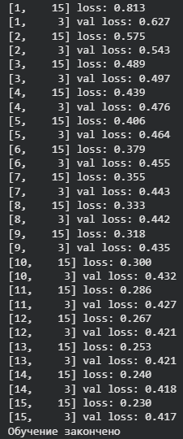
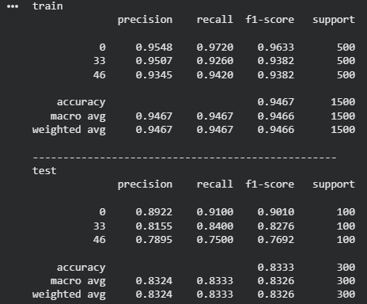
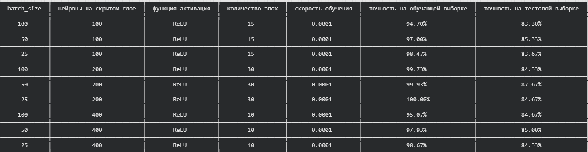

### Лабораторная работа №1. Введение в DL

**Цель работы:**
Необходимо познакомиться с фреймворком машинного обучения PyTorch и выполнить три задания.

**`1.`**  Регрессия по теореме универсальной аппроксимации, ручное дифференцирование.

**`2.`**  Бинарная классификация с помощью автодиффиренцирования PyTorch.

**`3.`**  Обучить полносвязную нейронную сеть классификации 3 классов изображений из набора данных CIFAR100 по варианту из примера и затем повысить точность на тестовой выборке.

### Часть 1. Задача регрессии по теореме универсальной аппроксимации, ручное дифференцирование

В первой задаче мы решали задачу регрессии: сначала сформировали набор входных значений 
**𝑋**, вычислили для них значения “истинной” сигмоиды **𝑦** , а затем добавили к ним случайный шум и получили зашумлённые наблюдения **𝑦𝑛**

После этого построили нейросеть с одним скрытым слоем из 64 нейронов и активационной функцией **ReLU**, которая по входу 
**𝑥** выдаёт предсказание **𝑦_pred** и тем самым аппроксимирует (приближает) исходную зависимость.

Далее сеть обучали методом градиентного спуска на протяжении 50 000 итераций. На каждой итерации выполняли прямой проход (получали 
**𝑦_pred**), вычисляли квадратичную ошибку между предсказанием и наблюдениями **𝑦𝑛**, затем выполняли обратное распространение ошибки вручную — находили градиенты по весам и смещениям обоих слоёв, учитывая, что для **ReLU** градиент равен нулю в области, где нейрон неактивен. После этого параметры обновляли небольшим шагом обучения и отслеживали, как предсказанная кривая постепенно приближается к сигмоидальной форме.

_Рисунок 1: Сигмоидальная зависимость с шумом и аппроксимация_

_Рисунок 2: Результат обучения нейронной сети_

На рисунке 2 мы выдим, что с увеличением числа итераций обучения предсказанная сетью кривая постепенно всё точнее аппроксимирует исходную сигмоидальную зависимость: линии для 10 000 – 20 000 итераций заметно отклоняются, а к 40 000 – 50 000 становятся почти совпадающими с сигмоидальной функцией. Это показывает, что по мере обучения ошибка уменьшается и модель всё лучше восстанавливает форму сигмоиды.

### Часть 2. Бинарная классификация с помощью автодиффиренцирования PyTorch

Во 2  части работы решалась задача бинарной классификации на синтетических данных типа **XOR**. Сначала была сгенерирована выборка из двух признаков 
**𝑋=(𝑥1,𝑥2)**, где каждый признак принимает значения *0* или *1*. Метки классов 𝑦 задавались по правилу **XOR:** **𝑦=1**, если ровно один из признаков равен 1, и 
иначе **𝑦=0**. Для приближения к реальным данным к точкам был добавлен гауссов шум, в результате чего сформировались четыре облака точек.

Поскольку задача **XOR** не является линейно разделимой, для классификации была использована нейросеть типа **MLP** (полносвязная сеть) с одним скрытым слоем состоящая из 16 нейронов и нелинейной функцией активации **sigmoid**. Выход сети интерпретируется как вероятность принадлежности к классу 1. В качестве функции потерь применялась **binary cross-entropy**, а обучение выполнялось методом градиентного спуска с шагом *0.001* на протяжении 10 000 итераций (эпох).

Градиенты параметров автоматически вычислялись с помощью механизма autograd в PyTorch.

После обучения была построена разделяющая поверхность: для сетки точек в пространстве признаков вычислялись предсказания модели и визуализировались области, относящиеся к разным классам, а также сравнивались с исходными точками обучающей выборки.

_Рисунок 3: Данные для бинарной классификации XOR_

_Рисунок 4: Обучение нейросети_

На рисунке 4 показано, как меняется значение функции потерь в процессе обучения. В начале значение **loss** составляет примерно **≈700**, что соответствует почти случайным предсказаниям модели. Примерно к 1500 – 2000 итерации наблюдается резкое снижение **loss** до **≈50** и ниже, то есть сеть быстро находит разделяющую зависимость. Далее уменьшение становится более плавным: после 3000 – 4000 итераций **loss** уже **<10**, а к концу обучения значение функции потерь становится близким к нулю, что указывает на хорошую сходимость и качественную классификацию на обучающей выборке.

_Рисунок 5: Результат обучения нейронной сети_

На рисунке 5 видно, что нейросеть построила нелинейную разделяющую поверхность и корректно разделила кластеры по правилу **XOR:** Жёлтые точки, расположенные в диагонально противоположных кластерах, относятся к одному классу, а два оставшихся кластера принадлежат другому классу. Это подтверждает, что модель успешно справилась с задачей.

### Часть 3. Классификация изображений CIFAR100

Итоговым заданием стала классификация изображений из датасета **CIFAR-100**. Это задача компьютерного зрения, в которой модель по входному изображению должна определить, к какому классу оно относится (в исходном наборе данных предусмотрено 100 классов).

Согласно варианту, для обучения и тестирования были выбраны **3 класса** из CIFAR-100:
- класс № **[Номер группы + 11]** — **[Название класса]**
- класс № **[Номер варианта + 37]** — **[Название класса]**
- класс № **[Произвольный третий класс]** — **[Название класса]**

_Рисунок 6: Пример из обучающей выборки_

Для решения задачи была реализована полносвязная нейронная сеть (MLP).

**Архитектура сети:**

- `Входной вектор размером 3072 (32×32×3)`
- `Скрытый слой: 100 нейронов, функция активации ReLU`
- `Выходной слой: 3 нейрона, линейный (без активации)`

**Параметры обучения**

- `batch_size = 100`
- `epochs = 15`
- `optimizer = Adam`
- `learning_rate = 0.0001`
- `loss = CrossEntropyLoss`

_Рисунок 7: Процесс обучения нейронной сети_

_Рисунок 8: Результат обучения нейронной сети_

После обучения, нейронной сети мы видим, что точность на обучающей выборке **94,7%**, а на тестовой **83,3%** , что считается неплохим результатом для данной архитектуры.

Далее нам нужно попробовать улучшить точность на тестовой выборке, изменяя некоторые параметры сети и заполнить итоговую таблицу.

_Рисунок 9: Результаты сравнения нейронных сетей_

В ходе экспериментов изменялись  размер **batch_size**, количество эпох и число нейронов в скрытом слое. По результатам сравнения точности на тестовой выборке лучшей оказалась модель со следующими параметрами: `batch_size = 50`, `neyrons = 200`, `epochs = 30` — она показала точность на тестовой выборке **87.67%** и точность на обучающей выборке **99.93%**.

По результатам таблицы видно, что при уменьшении **batch_size** точность на обучающей выборке стабильно растёт, и на тестовой выборке тоже появляется улучшение (например, при переходе со 100 на 50). Однако если уменьшить **batch_size** слишком сильно (до 25), тестовые показатели уже не растут и иногда даже ухудшаются — модель начинает сильнее подстраиваться под обучающие данные и обобщает хуже. Также заметно, что простое увеличение числа нейронов в скрытом слое не гарантирует прирост: переход с 100 до 200 нейронов дал прирост, но дальнейшее увеличение до четырехста нейронов почти не улучшает точность на тестовой выборке, хотя точность на обучающей становится почти **100%**, то есть усиливается переобучение. Аналогично ведут себя и эпохи: при увеличении числа эпох (например, до 30) модель почти полностью дожимает обучающую выборку, но  после определённого момента дополнительные эпохи повышают только точность на обучающей выборке , а на тестовой показатели ухудшаются.

### Вывод

В ходе выполнения лабораторной работы я познакомился с фреймворком машинного обучения **PyTorch** и научился использовать его для построения и обучения нейронных сетей для решений разныз задач.