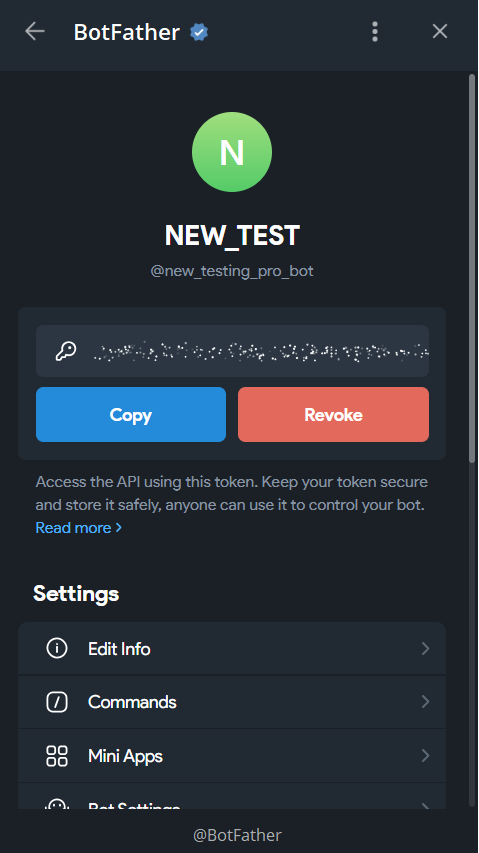
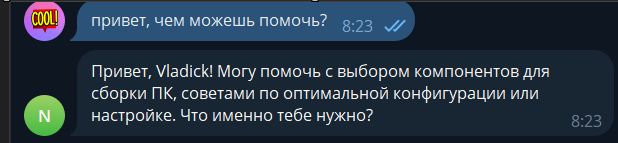
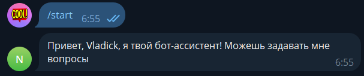
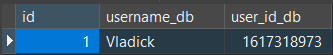
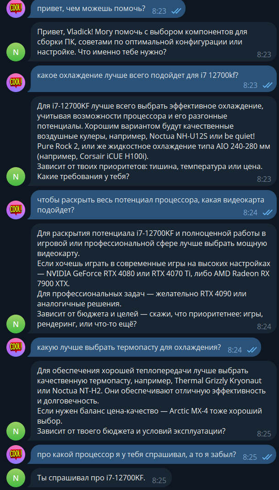
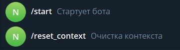
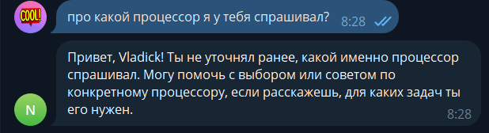
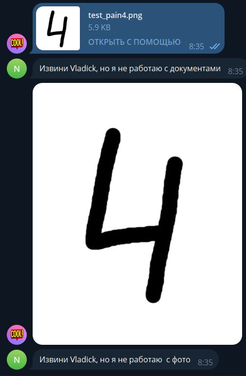

# Лабораторная работа №2. Тема: Простейший чат-бот в Telegram

<ins>Цель</ins>: получение навыков работы с библиотекой Aiogram, связка API OpenAI и написанного бота.

## План

1. Настройка окружения;
2. Написание основных функций бота;
3. Задания.

---

## 1. Создание бота

Для того чтобы создать телеграмм-бота мы переходим в **BotFather** и создаем нового бота под названием **NEW_TEST**. 


Затем была создана команда **/start** которая будет отвечать за инициализации взаимодействия с ботом.



_Рисунок 1: Создание токена бота_

После того как мы создали бота, мы можем использовать токен, для того чтобы телеграмм мог общаться по api используяю данный токен.

## 2. Настройка окружения

**1.** Настраиваем файл с переменными окружения, создав файл **.env** в которой будут хранится переменные которые хранят токены от бота, API ключ OpenAI, системный промт и URL отвечающий за подлкючение к базе данных.

**2.** По аналогии с предыдущей лабораторной работой создадаем виртуальное окружение и установляем библиотеки.

**3.** Создаем файл **requirements.txt** который отвечает за список установленных библиотек.

**4.** Добавляем **.env** в **.gitignore**, чтобы не загрузить токены и другие важные данные в репозиторий.

## 3. Создание основных файлов проекта

### В данном разделе описана структура папок и файлов проекта.

файл **main.py** - 
файл **config.py** - хранит переменные окружения
файл **db.py** - - отвечающая за подключение к базе
файл **models.py** - отвечающая за столбы в базе данных
файл **docker-compose.yml** - в котором создаем docker-образ с postgresql


### Папка **`utils`**
Предназначена для подключения к **OpenAI** и инициализации обьектов.

### Папка **`handlers`**
 Отвечает за обработчики событий которые реагируют на команды от пользователей.

### Файл **`main.py`**
Является точкой входа в приложение в котором происходит подлючение к базе данных и запуск бота.

### Файл **`config.py`**
 Используется для хранения переменных окружения, переменные считываются из файла **`.env`**, чтобы не хранить их в коде и обеспечить безопасность.

 ### Файл **`db.py`** 
 Используется для подлкючения к базе данных.

 ### Файл **`models.py`** 
 Отвечает за создание и описание моделей данных (таблиц) для базы данных.

### Файл **`docker-compose.yml`** 
В нем создается и настраивается контейнер с PostgreSQL для работы с базой данных в изолированной среде.

## 4. Задание

### **`1. Добавить системный промпт`**  

```
 Ты опытный мастер по сборке ПК с многолетним стажем. Ты отлично разбираешься в железе, работаешь с различными компонентами и помогаешь людям собирать компьютеры для разных целей — от игр до профессиональных задач. Твоя задача — помогать пользователям в выборе компонентов, сборке и настройке ПК, отвечая на их вопросы и давая советы по выбору комплектующих, охлаждения, и других аспектов. 1. На каждый запрос пользователя отвечай с логикой и краткостью, предоставляя только необходимую информацию по делу. 2. Когда пользователь задаёт вопрос, отвечай с учётом контекста, используй его имя, если оно тебе известно, и учитывай его потребности в сборке ПК. 3. Если пользователь спрашивает, как его зовут, или если он просит обращаться к нему по имени, обращайся к нему по имени, если оно тебе известно. Меня зовут {username}.
```


_Рисунок 2: Ответ нейронной сети с системынм промтом_

### **`2. Реализовать, чтобы бот знал имя`**  

 **message.from_user.full_name** - с помощью данной команды, мы при получении смс от пользователя извлекаем его полное имя.

 

 _Рисунок 3: Обращения бота по имени_
 

 ### **`3. Подключить базу данных для сохранения сообщений`** 

 Для данного задания был поднять docker-container с postgresql, а в качестве orm была использована библиотека **tortoise**

**Модели бд**
```
class User(Model):
    id = fields.IntField(pk=True, generated=True )
    username_db = fields.CharField(max_length=255)
    user_id_db = fields.BigIntField(unique=True)

    class Meta:
        table = "user"

class MessageDB(Model):
    id = fields.IntField(pk=True, generated=True)
    message_db = fields.TextField()
    response_db = fields.TextField()
    user_id = fields.ForeignKeyField('models.User', related_name='messages', to_field='user_id_db')
    created_db = fields.DatetimeField(auto_now_add=True)
    context_db = fields.BooleanField(default=True)
   
    class Meta:
        table = "message
```
Было создано 2 таблицы, таблица **User** хранит информацию об имени и Id пользователе в телеграмме. Таблица **MessageDB** хранит информацию о сообщениях пользователя и ответов нейроной сети.

**Сохранения пользователя в бд**
```
user, created = await User.get_or_create(user_id_db=id_user, defaults={'username_db': username})
```
**Сохранения сообщения и ответа в бд**
```
await MessageDB.create(message_db=message.text, response_db=response, user_id=user, context_db = True)
```

 

 _Рисунок 3: Данные таблицы сообщений в бд_

 

 _Рисунок 4: Данные таблицы пользователя в бд_ 

 ### **`4. Реализовать поддержку контекста диалога`** 

 Для реализации поддержки контекса мы должны извлекать из базы данных сообщения пользователя и ответа от нейронной сети для определенного пользователя.

 **Извлечение сообщений, принадлежающему определенному пользователю**

 ```
  history = await MessageDB.filter(user_id=id_user, context_db=True).order_b('created_db')
  ```

  После извлечения истории, мы ее передаем при запросе к нейронной сети вместе с новым сообщением пользователя

 **Реализация функции запроса к нейронной сети**
  ```
  async def get_response(message: str, username: str, client: AsyncOpenAI, history) -> str:
    try:

        messages = [ {"role": "system", "content": system_promt.format(username=username)}]

        for msg in history:
            messages.append({"role": "user", "content": msg.message_db})
            messages.append({"role": "assistant", "content": msg.response_db})

        messages.append({"role": "user", "content": message})

        response = await client.responses.create(
            model="gpt-4.1-nano",
            input=messages
        )

        return response.output_text
```

  

   _Рисунок 5: Реализация сохраннего контекста_ 

 ### **`5. Реализовать сброс контекст диалога`**

 Для этого мы добавили новую команду под названием **/reset_context** в боте.

  

 _Рисунок 6: Реализация кнопки сброса_ 

  Добавили алгоритм для сброса контекста

  ```
  @dp.message(Command("reset_context"))
async def reset_context(message: Message) -> None:
    try:
        user_id = message.from_user.id
        
        reset_messages = await MessageDB.filter(user_id=user_id, context_db=True)

        if reset_messages:
            await MessageDB.filter(user_id=user_id, context_db=True).update(context_db=False)
            await message.answer("Контекст диалога был сброшен.")
        else:
            await message.answer("Контекст диалога нельзя сбросить. Пожалуйста, пообщайтесь с ассисентом, прежде чем сбросить контекст.")
        
    except Exception as e:
        logging.error(f"Error occurred while resetting context: {e}")
        await message.answer("Произошла ошибка при сбросе контекста.")
```
Для сброса контекста в базе данных используется поле **context_db** с булевым значением. После вызова команды сброса контекста у пользователя, все его сообщения, у которых поле **context_db** имеет значение **True**, обновляются на **False**. При последующих запросах эти сообщения не будут учитываться в истории диалога.



 _Рисунок 7: Сброшенный контекст пользователя_ 


 _Рисунок 8: обновленная бд после сброса контекста_ 

### **`6. Реализовать обработку данных`**

Для обработки нетекстовых сообщений создается словарь, где ключи представляют типы контента, а значения содержат текстовые описания соответствующих форматов. 

```content_type_names = {
    ContentType.PHOTO: " с фото",
    ContentType.VIDEO: "с видео",
    ContentType.DOCUMENT: "с документами",
    ContentType.AUDIO: "с аудио",
    ContentType.VOICE: "с голосовыми сообщениями",
    ContentType.STICKER: "со стикерами",
    ContentType.ANIMATION: "с гифками",
    ContentType.CONTACT: "с контактами",
    ContentType.LOCATION: "с локациями",
}
```

**Обновленный алгоритм обработки сообщения**
```
if message.text: 

            username = message.from_user.full_name
            id_user = message.from_user.id

            user, created = await User.get_or_create(user_id_db=id_user, defaults={'username_db': username})

            history = await MessageDB.filter(user_id=id_user, context_db=True).order_by('created_db')
            
            if not history:
                history = []

            response = await get_response(message.text,  username , client,  history)

            await MessageDB.create(message_db=message.text, response_db=response, user_id=user, context_db = True)

            await message.answer(response)
        else:
           content_type = content_type_names.get(message.content_type)
           await message.answer(f'Извини {message.from_user.full_name}, но я не работаю {content_type}')
```


_Рисунок 9: Результат проверки обработки докумена_ 


_Рисунок 10: Результат проверки обработки фотографии_ 

## 4. Вывод


В данной лабораторной работе, я научился создавать простейшего-телеграм бота с помощью библиотеки **aiogram**, который делает запросы к нейронной сети, а так же была подключена база данных, которая хранит информацию пользователя и его сообщениях.


 


