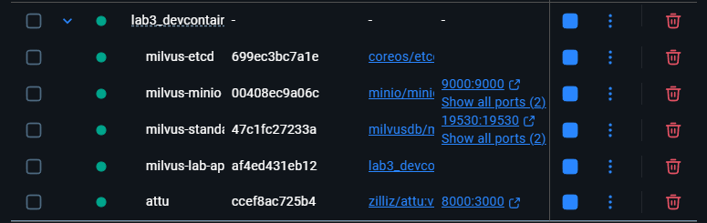
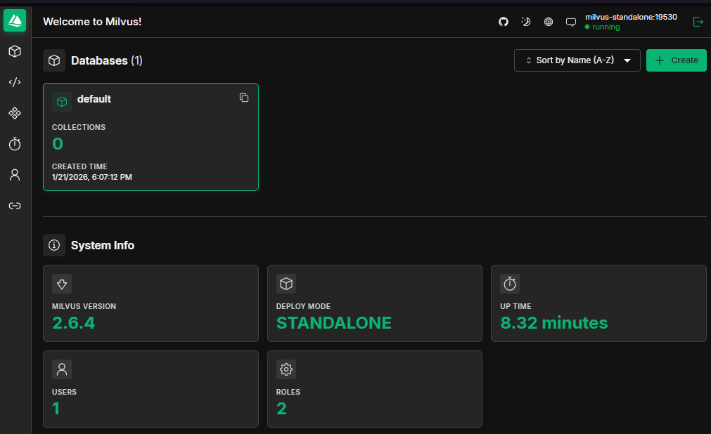
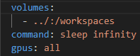
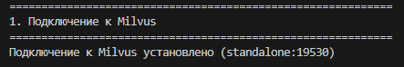
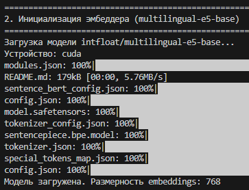
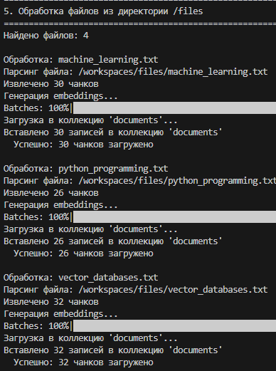
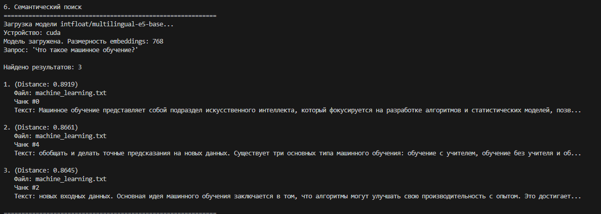
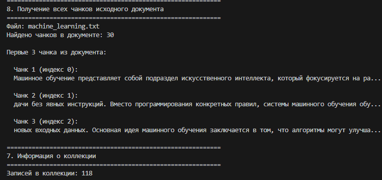
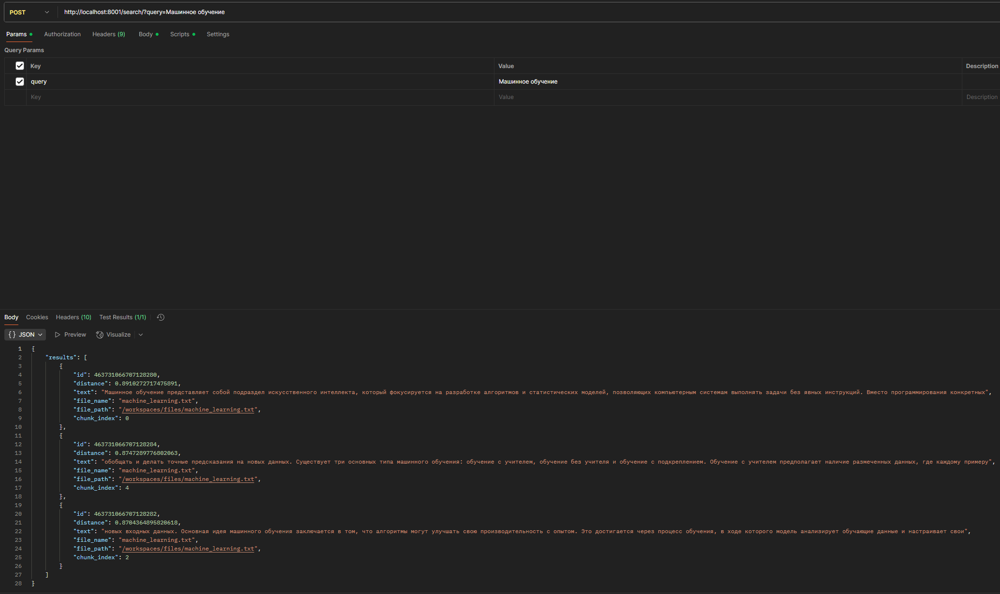

### Лабораторная работа №3. Векторные базы данных и семантический поиск

<ins>Цель</ins>: научиться использовать векторные базы данных и семантический поиск для обработки текстовых данных.

## План

1. Настройка окружения
2. Запустить проект который позволить использовать GPU
3. Реализация API для работы с Milvus

## 1. Настройка окружения

Для настройки окружения был настроен **devcontainer** — контейнер с уже готовой рабочей средой. В данном случае он включает:

- **Python 3.12**
- **Milvus**
- **Attu** 

**Devcontainer** позволяет нам работать с проектом в изолированном окружении, что позволяет избежать конфликтов между зависимостями и упрощает процесс установки и настройки окружения.

После скачивания проекта, его нужно запустить нажав (ctrl + shift + p ) и выбрать **Reopen in Container**, предварительно установив расширение **Dev containers** и дождаться загрузки.



_Рисунок 1: Развертывание проекта в Docker_

После загрузки и запуска всех необходимых контейнеров, мы провереям работоспособность web-интерфейса **Attu**.



_Рисунок 2: Запуск web-интерфейса atuu_

### 2.  Запустить проект который позволить использовать GPU

для перврого задания нам нужно разблокировать доступ к  GPU (видеокарте) для этого мы перед развертывание проекта раскоментили строку кода `gpus: all` в **docker-compose**, которая позволила реализовать данную задачу.



_Рисунок 3: Измение в docker-compose файла_

В нашем проекте есть файл `example_usage.py` который описывает сценарий работы с Milvus. И после его запуска выполняются следующие шаги:

**`1.`** Подключение к milvus



_Рисунок 4: Подключение_

**`2.`** Загрузка модели для эмбединга



_Рисунок 5: загрузка модели_

При вызове фунцкции начинается загрузка модели **multilingual-e5-base** которая нужна для преоброзования текста в вектор размерностью 768.

**`3.`** Создание обработчика документов

Данный обработчик парсит файлы, нормалирует данные, разбивет их на чанки c перекрытием, , генерирует вектора (embeddings) для чанков, добавляет метаданные и загружает всё в созданную коллекцию Milvus.



_Рисунок 6: обработка и загрузка файлов_

**`4.`** Семантический поиск



_Рисунок 7: результат семантического поиска_

**`5.`** Результаты загрузки данных в milvus



_Рисунок 8: Итог загрузки файлов в milvus_

На рисунке 8 при вызове соответствующих функций можно получить информацию о коллекции в Milvus — в частности, количество записей (чанков/векторов), сохранённых в базе. 

Также можно определить, на сколько чанков был разбит исходный файл, извлечь все его чанки по `file_path` и вывести их метаданные (имя файла, путь, индекс чанка).


_Рисунок 9: Пример записей в коллекции Milvus_

### 3.  Реализация API для работы с Milvus

Для того чтобы реализовать третие задание, были выполнены следующие этапы:

**`1.`** Установка библиотеки для работы с api

`pip install djangorestframework`

**`2.`** Создание проекта 

`django-admin startproject lab3API` - создание Django-проекта

`python manage.py startapp API` - создание Django-приложения

**`3.`** Подключение приложения в Settings.py 

```
INSTALLED_APPS = [
    "django.contrib.admin",
    "django.contrib.auth",
    "django.contrib.contenttypes",
    "django.contrib.sessions",
    "django.contrib.messages",
    "django.contrib.staticfiles",
    "rest_framework",
    "API" # подключение нашего созданного приложения
]
```
**`4.`** Создали milvus.py

В данном файле мы создаем экземляры классов **milvus_client**  для подключения и извлечения данных, и **embedder** для преобразования запроса вектор.

```
from mil.milvus_client import MilvusClient
from mil.embedder import Embedder

connect_milvus = MilvusClient(host="standalone", port=19530)

embedder = Embedder(model_name="intfloat/multilingual-e5-base",batch_size=32)

def search(query: str, top_k: int, collection_name: str ):
    query_embedding = embedder.encode_query(query)

    responce = connect_milvus.search(
       collection_name=collection_name,
        query_vectors=[query_embedding],
        top_k=top_k,
    )

    return responce[0] if responce else []

def collection_info(collection_name: str) -> dict:

    return connect_milvus.get_collection_info(collection_name)

def document_chunks(collection_name: str, file_path: str, order_by_index: bool = True) -> list[dict]:
   
    return connect_milvus.get_document_chunks(
        collection_name=collection_name,
        file_path=file_path,
        order_by_index=order_by_index
    )
```   

**`5.`** Создание serializers.py

Создаём файл serializers.py, который отвечает за валидацию и структурирование данных, поступающих через API

```
from rest_framework import serializers

class SearchSerializer(serializers.Serializer):
    query = serializers.CharField(allow_blank=False)
    collection_name = serializers.CharField(required=False, default="documents",)
    top_k = serializers.IntegerField(required=False,default=3,)

class CollectionInfoSerializer(serializers.Serializer):
    collection_name = serializers.CharField(required=False, default="documents")

class DocumentChunksSerializer(serializers.Serializer):
    collection_name = serializers.CharField(required=False, default="documents")
    file_path = serializers.CharField(allow_blank=False)
    order_by_index = serializers.BooleanField(required=False, default=True)
```

**`6.`** Создание views.py

views.py - нужен для обработки запросов

```
class SearchView(APIView):
    def post(self, request):
        serializer = SearchSerializer(data=request.data)
        serializer.is_valid(raise_exception=True)

        data = serializer.validated_data
        hits = search(
            query=data["query"],
            top_k=data["top_k"],
            collection_name=data["collection_name"],
        )

        return Response(
            {"results": hits},
            status=status.HTTP_200_OK
        )
    
class CollectionInfoView(APIView):
    def get(self, request):
        serializer = CollectionInfoSerializer(data=request.query_params)
        serializer.is_valid(raise_exception=True)

        data = serializer.validated_data
        info = collection_info(collection_name=data["collection_name"])

        return Response(info, status=status.HTTP_200_OK)


class DocumentChunksView(APIView):
    def get(self, request):
        serializer = DocumentChunksSerializer(data=request.query_params)
        serializer.is_valid(raise_exception=True)

        data = serializer.validated_data
        chunks = document_chunks(
            collection_name=data["collection_name"],
            file_path=data["file_path"],
            order_by_index=data["order_by_index"],
        )

        return Response({"chunks": chunks}, status=status.HTTP_200_OK)
```

**`7.`** Создание urls.py

urls.py - urls.py нужен, чтобы связать URL-адреса с view.

```
urlpatterns = [
    path("search/", SearchView.as_view(), name="search"),
    path("collection-info/", CollectionInfoView.as_view(), name="collection-info"),
    path("document-chunks/", DocumentChunksView.as_view(), name="document-chunks"),
]
```

**`8.`** Запуск сервера и проверка

Далее мы запуситили сервер и проверили как работают запросы через **Postman**



_Рисунок 10: Пример запроса_

### 4.  Вывод

В ходе выполнения лабораторной работы я освоил принципы работы с векторными базами данных и технологию семантического поиска, а так же внедрил небольшое API на django.


