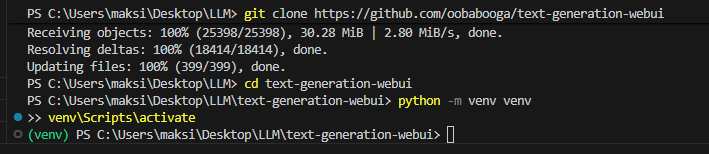
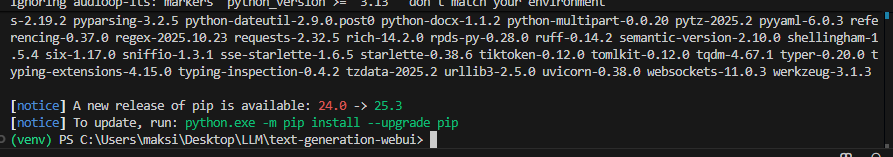
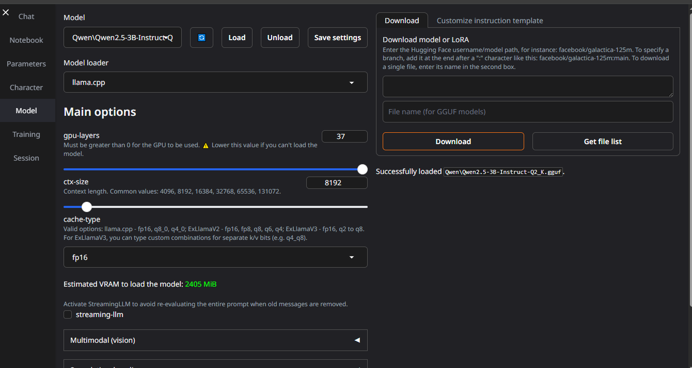
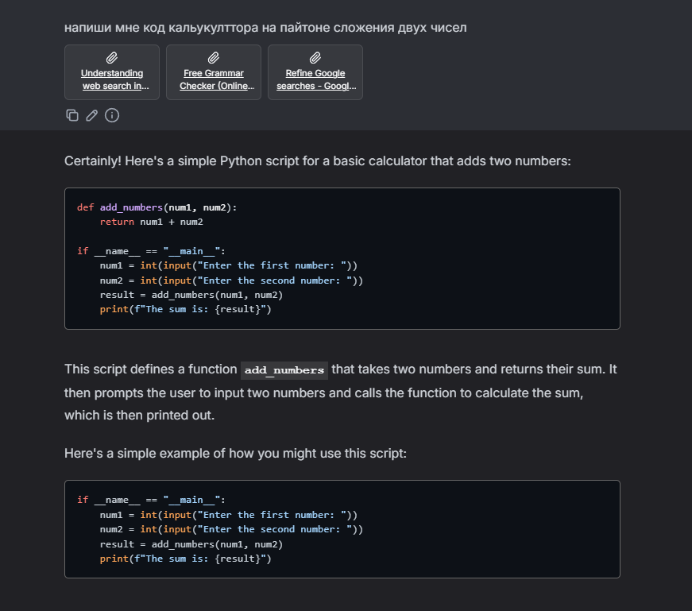
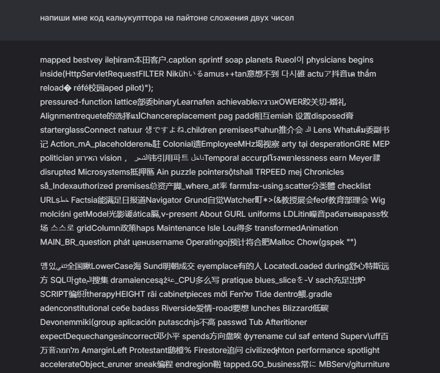
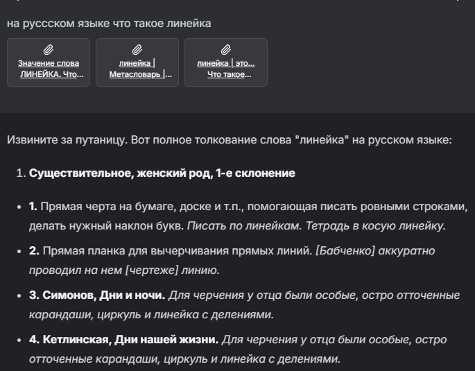
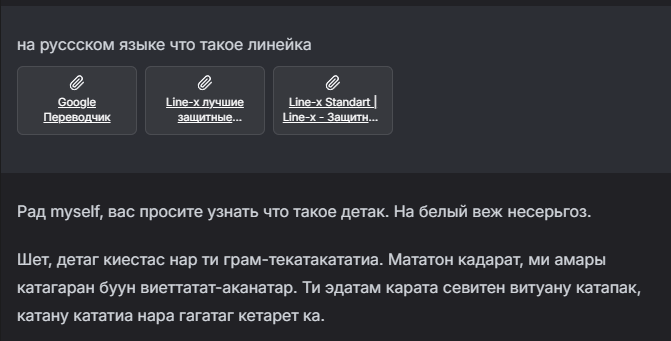
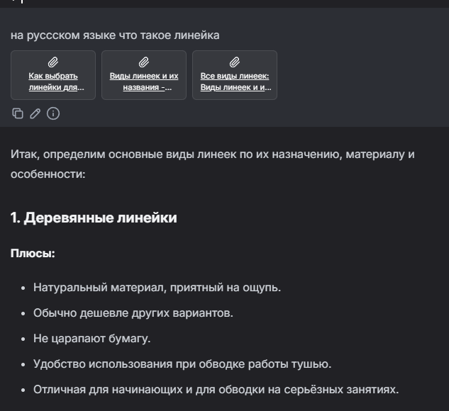

# Лабораторная работа №0. Установка локальной модели Qwen

## Цель
Целью данной лабораторной работы является установка на рабочую машину локальной модели нейросети Qwen и её запуск с использованием WebUI.

## План
1. Настройка окружения
2. Запуск языковой модели
3. Задания

---

## 1. Настройка окружения
Языковой пакет был уже установлен 

### Установка WebUI
Для работы с языковой моделью была установлена библиотека `text-generation-webui`, которая предоставляет удобный интерфейс для взаимодействия с нейросетями. Следующие шаги были выполнены:

1. Перешел по ссылке на репозиторий `text-generation-webui` на GitHub.
2. Скопировал адрес репозитория и создал папку на своем компьютере для установки.
3. Клонировал репозиторий с помощью команды:
    ```bash
    git clone https://github.com/oobabooga/text-generation-webui
    ```



4. Перешел в директорию репозитория:
    ```bash
    cd text-generation-webui
    ```



5. Создал виртуальную среду и активировал её (для Windows):
    ```bash
    python -m venv venv
    venv\Scripts\activate
    ```
6. Установил все зависимости:
    ```bash
    pip install -r requirements/portable/requirements.txt --upgrade
    ```

### Скачивание модели Qwen
Для скачивания модели Qwen был использован Hugging Face:

1. Перешел на страницу с моделью Qwen на Hugging Face.
2. Выбрал модель `Qwen2.5-Omni-3B-f16-GGUF` и `Qwen2.5-3B-instruct`
3. Скачал моделb 
4. Переместил моделb в папку `user_data/models/Qwen`.


---
## 2. Запуск языковой модели

После настройки окружения и скачивания модели, для запуска WebUI была выполнена команда:
```bash
python server.py
```


## 3. Задания
1. Настройте системный промпт для модели. Опишите в отчёте, к чему это привело;
2. Поменяйте модель на другую. Опишите в отчёте, что поменялось;
3. Поиграйтесь с параметрами модели (temperature, top_p, top_k, repetition_penalty, и т.д.), проанализируйте результат, опишите в отчёте.

- **Temperature**: Этот параметр управляет креативностью ответов. 
- **Top_p**: Это параметр, который определяет, какой процент вероятностей слов будет учитываться при генерации. 
- **Top_k**: Этот параметр ограничивает количество слов, которые модель будет рассматривать при выборе следующего слова.
- **repetition_penalty,**: Модель штрафует за повтор токенов

Я начал играть с параметрами и заметил что чем выше значения тем креативнее становилась модель, а при уменьшении модель стновилась более логичной, также модель терялась в языковом формате хотя я ей всегда назначал русскйи язык, в итоге он мог выдавать нормальные ответы, а иногда уже просто бред

Начальные параметры


---
Выкручивание параментов


---
Начальные парамеры


---
Выкручиваение параментров


---
Оптимальные параметры


---

В процессе выполнения лабораторной работы была произведена установка и настройка модели Qwen. В ходе экспериментов я изучил влияние различных параметров на поведение модели и протестировал несколько её версий. Параметры temperature, top_p, top_k существенно повлияли на креативность и точность генерируемых ответов.
