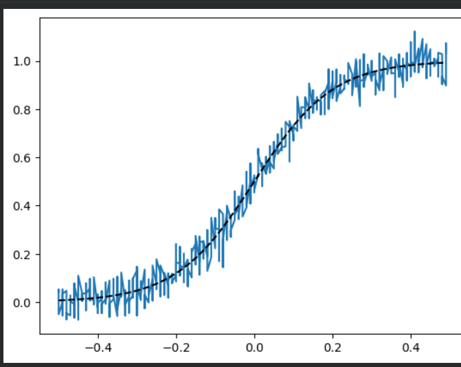
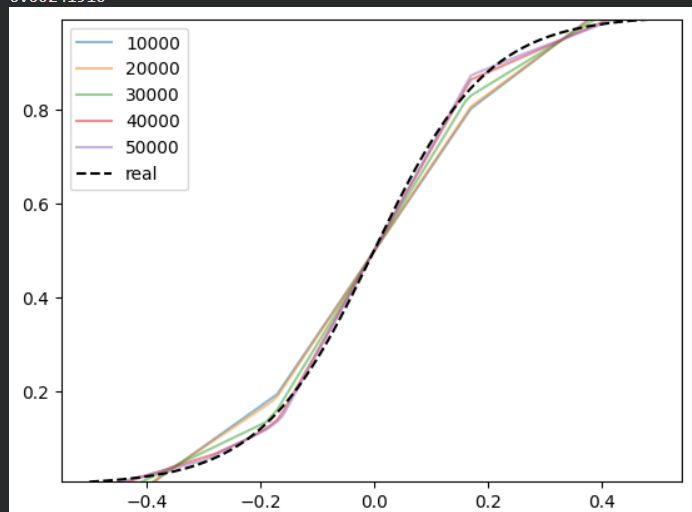
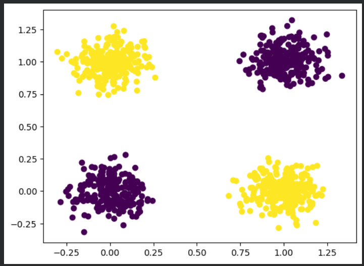
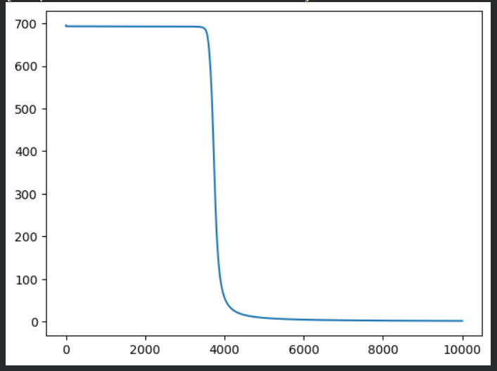
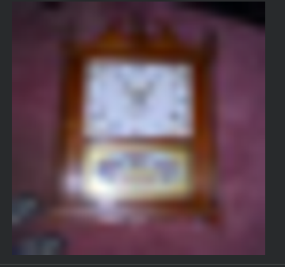
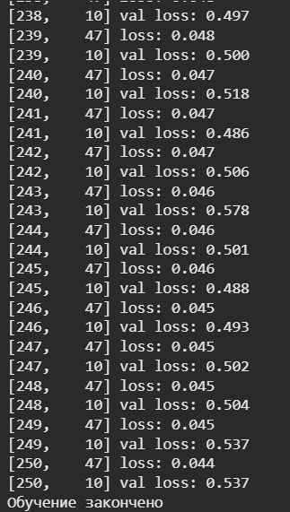
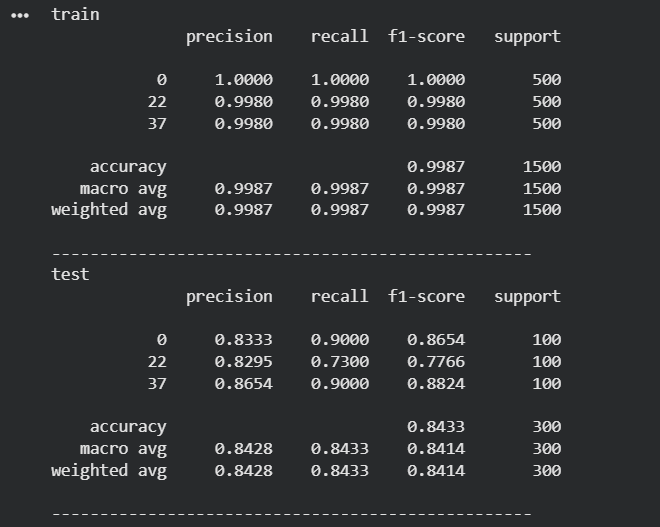
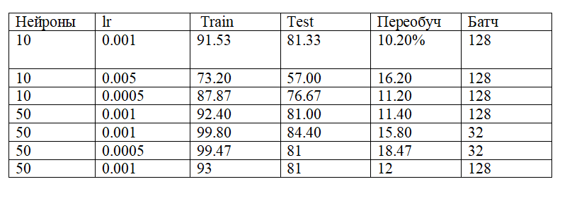

## Часть 1: Регрессия. Суть задачи: Нужно научить нейронную сеть повторять заданную функцию

1. Формирование входных данных - `X = (np.arange(100)/100 - 0.5).repeat(5)`
2. Функция сигмоиды - `y = 1/(1+np.exp(-10\*X))`

3) Добавление шума - `yn = np.random.normal(scale=0.05, size=y.size) + y`
4) Визуализация - `plt.plot(X, yn) plt.plot(X, y, linestyle='--', c='k')`



## Обучения нейронной сети

- Архитектура - HIDDEN_SIZE = 64
- На скрытом слое фукнция активации Relu

  1. Прямой проход

  ```
     forward = lambda x: (
     weights_2.t() * relu((weights_1*x) + bias_1)
     ).sum(axis=-1, keepdims=True) + bias_2`
  ```

  2. функция потерь - `loss = lambda y, y*: ((y-y*)\*\*2).sum(axis=-1)`
     MSE - для каждой точки

  3)  обучение 50.000 итераций градиентного спуска - `for i in range(50000):`
      На графике видно:
      - Кривые на 10k, 20k, 30k, 40k, 50k итерациях
      - как сеть постепенно приближается к истинной сигмоиде
      - чёрный пунктир — настоящая функция

  

## Часть 2 Бинарная классификация

1.  Генерация данных `X = np.random.randint(2, size=(1000, 2))`

2) Формирование меток XOR - `y = (X[:, 0] + X[:, 1]) % 2`
3) Добавление шума - `X = X + np.random.normal(0, scale=0.1, size=X.shape)`
4) Визуализация - `plt.scatter(X[:, 0], X[:, 1], c=y)`



## Часть 2. Обучение нейронной сети

1. функциЯ сигмойды - `def sigmoid(x): return 1/(1+torch.exp(-x))`

Используется:

- в скрытом слое
- в выходном слое (бинарная классификация)

2. прямой проход

```py
  def forward(x):
    hidden = torch.mm(x, weights_1) + bias_1
    hidden_nonlin = sigmoid(hidden)
    output = (weights_2.t()*hidden_nonlin).sum(axis=-1,keepdims=True) + bias_2
    return sigmoid(output)

```

3. Функция потерь

```py
  def loss(y_true, y_pred):
    return -1*(y_true*torch.log(y_pred)+(1-y_true)*torch.log(1-y_pred)).sum()
```

4. Цикл обучения - `for i in range(iters):`

В начале обучения функция потерь резко снижается, что говорит о значительном улучшении модели, после чего график плавно выравнивается и продолжает снижаться, что свидетельствует о постепенном улучшении предсказаний модели. Это типичная картина для обучения нейронной сети, где на первых этапах модель быстро достигает улучшений, а на более поздних шагах коррекции становятся менее заметными.



## 3. Классификация изображений CIFAR100.

Классификация изображений CIFAR-100 — это классический набор данных (датасет), используемый для обучения и тестирования алгоритмов компьютерного зрения. Датасет CIFAR-100 содержит 60 000 цветных изображений.

3.1 Загрузка датасета

```py
  wget https://www.cs.toronto.edu/~kriz/cifar-100-python.tar.gz
  tar -xvzf cifar-100-python.tar.gz
```

- Скачивает и распаковывает CIFAR-100 (60k цветных изображений 32×32 пикселя, 100 классов).

  3.2 Загрузка train и test

```py
  with open('cifar-100-python/train', 'rb') as f:
    data_train = pickle.load(f, encoding='latin1')
  with open('cifar-100-python/test', 'rb') as f:
      data_test = pickle.load(f, encoding='latin1')
```

3.3 Определение интересующих классов

```py
   CLASSES = [0, 22, 37]
```



3.4 Обработка обучаюющих данных

```py
  train_X = data_train['data'].reshape(-1, 3, 32, 32)
  train_X = np.transpose(train_X, [0, 2, 3, 1])
```

3.6 Фильтруем изображения оставляя только нужные классы

```py
  train_y = np.array(data_train['fine_labels'])
  mask = np.isin(train_y, CLASSES)
  train_X = train_X[mask].copy()
  train_y = train_y[mask].copy()
  train_y = np.unique(train_y, return_inverse=1)[1]
```

- Удаляются изображения, не относящиеся к выбранным классам
- В обучающей выборке остаются только изображения трёх классов

  3.7 Подготовка обучающих данных

```py
  train_X = data_train['data'].reshape(-1, 3, 32, 32)
  train_X = np.transpose(train_X, [0, 2, 3, 1])
```

- Преобразование изображений в формат (N, 32, 32, 3)

- Приведение данных к стандартному виду для работы с изображениями

  3.8 Кодировка меток

```py
    tensor_y = F.one_hot(
      torch.Tensor(y).to(torch.int64),
      num_classes=len(CLASSES)
  ) / 1.
```

3.9 Создание DataLoader

```
batch_size = 32
dataset = TensorDataset(tensor_x, tensor_y)
dataloader = DataLoader(dataset, batch_size=batch_size, shuffle=True)
```

- Используется перемешивание данных

- Обеспечивается удобная подача данных в модель

  3.10 Архитектура нейроннойсети - `class Normalize(nn.Module):`

  3.11 Функция потерь и отптимизатор

  ```
    criterion = nn.CrossEntropyLoss()
    optimizer = optim.SGD(model.parameters(), lr=0.001)
  ```

  3.12 Обучение модели

  

## Результаты эксперементов





## Заключение:

В ходе лабораторной работы была продемонстрирована реализация техник глубокого обучения с использованием PyTorch для задач регрессии, бинарной классификации и классификации изображений.
Лучши результат был показан тесте под номером 4, он показл лучшие результаты на обучающей и на тестовой выборке с заданными параметрами скорости обучения 0.001, 50 нейронов на скрытом слое, и батчем 32.
