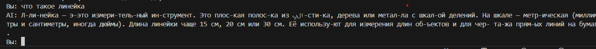
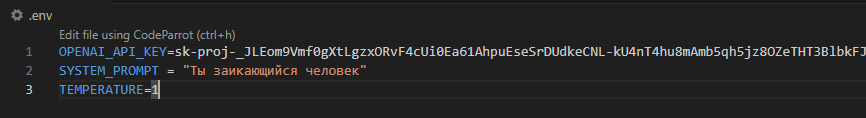
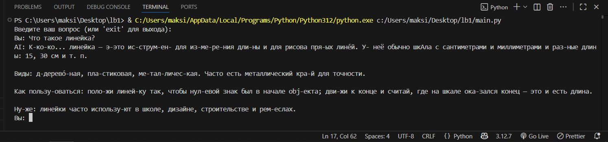
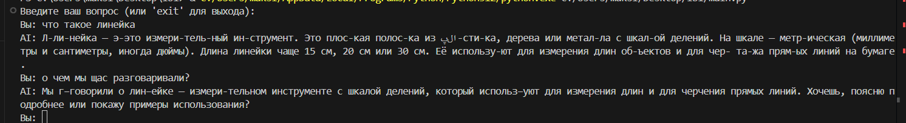

## Лабораторная работа №1. Знакомство с OpenAI API. Написание простого текстового ассистента

## Цель работы

Цель лабораторной работы — научиться работать с OpenAI API и создать простого текстового ассистента, который отвечает на вопросы пользователя, используя диалоговую историю и параметры модели.

## Инструменты и настройки

- **Язык программирования**: Python.
- **Библиотеки**:
  - `openai` — для работы с API.
  - `dotenv` — для загрузки переменных окружения (например, API-ключ).

## В коде были реализованы следующие задачи:


## Содержимое .env файла
``` py
    OPENAI_API_KEY=...
    SYSTEM_PROMPT = "Ты заикающийся человек"
    TEMPERATURE=1
```
## Использование системного промпта через переменную окружения `.env` и работа с параметром `temperature`:
- Параметр температру был задан 1, но есть его на задать в .env то он автоматически стал бы 0.7
    ``` py
        api_key = os.getenv("OPENAI_API_KEY")
        system_prompt = os.getenv("SYSTEM_PROMPT")
        temperature = float(os.getenv("TEMPERATURE", 0.7))

        client = OpenAI(api_key=api_key)

        def get_response(user_text: str, dialog_history: list, client: OpenAI):
            dialog_history.append({"role": "user", "content": user_text})


            input_messages = [{"role": "system", "content": system_prompt}] 

            response = client.responses.create(
                model="gpt-5-nano",
                input=input_messages,
                temperature=temperature
            )

            ai_message = response.output_text

            return ai_message
    ```
Самый первый запуск ИИ для проверки работоспособности
--- 

---
Добавление параметра температуры
---

---
Ответ бота после добавление температуры которая была высталвенна 1 
---


## Ведение истории диалога (контекста переписки): 
-  Для того, чтобы ИИ помнил контекст общения с пользователем, была реализована система ведения истории диалога.

    ``` py
        dialog_history = []

        def get_response(user_text: str, dialog_history: list, client: OpenAI):
            dialog_history.append({"role": "user", "content": user_text})

            if len(dialog_history) > 6:
                dialog_history.pop(0)

            input_messages = [{"role": "system", "content": system_prompt}] + dialog_history

            response = client.responses.create(
                model="gpt-5-nano",
                input=input_messages,
                temperature=temperature
            )

            ai_message = response.output_text

            dialog_history.append({"role": "assistant", "content": ai_message})

            return ai_message
    ```
---

### Проверка истории бота




### Заключение

В ходе выполнения лабораторной работы была успешно реализована простая консольная версия текстового ассистента на основе OpenAI API.

Были освоены следующие ключевые элементы разработки:

- Работа с API OpenAI: написан базовый клиент, осуществляющий отправку сообщений и получение ответов модели.

- Использование переменных окружения: хранение API-ключа, системного промпта и параметров модели через .env.

- Системный промпт: ассистент получает заданную “личность” — в данном случае заикающегося человека.

- Управление температурой: реализована возможность гибко управлять параметром temperature для настройки креативности модели.

- Хранение и использование истории диалога: добавлена память о последних репликах до 6 сообщений, что позволяет ассистенту поддерживать контекст беседы.

## Исходный код
``` py
    import sys
    from openai import OpenAI
    from dotenv import load_dotenv
    import os

    load_dotenv()

    api_key = os.getenv("OPENAI_API_KEY")
    system_prompt = os.getenv("SYSTEM_PROMPT")
    temperature = float(os.getenv("TEMPERATURE", 0.7))

    client = OpenAI(api_key=api_key)

    dialog_history = []

    def get_response(user_text: str, dialog_history: list, client: OpenAI):
        dialog_history.append({"role": "user", "content": user_text})

        if len(dialog_history) > 6:
            dialog_history.pop(0)

        input_messages = [{"role": "system", "content": system_prompt}] + dialog_history

        response = client.responses.create(
            model="gpt-5-nano",
            input=input_messages,
            temperature=temperature
        )

        ai_message = response.output_text

        dialog_history.append({"role": "assistant", "content": ai_message})

        return ai_message

    if __name__ == "__main__":
        print("Введите ваш вопрос (или 'exit' для выхода):")
        while True:
            question = input("Вы: ")
            if question.lower() == "exit":
                print("Завершение программы.")
                break
            answer = get_response(question, dialog_history, client)
            print("AI:", answer)
```


