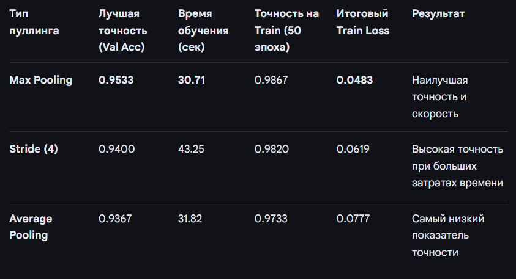
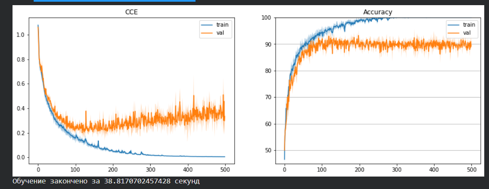

# Отчёт. Лабораторная работа №2.

1. Первым шагом был выбор конкретных классов из датасета CIFAR-100.

```
CLASSES = [0, 55, 58]

mask = np.isin(train_y, CLASSES)
train_X = train_X[mask].copy()
train_y = train_y[mask].copy()

train_y = np.unique(train_y, return_inverse=1)[1]

```

2. Архитектура модели и реализация трех типов пуллинга

Пуллинг — это операция уменьшения пространственных размеров карт признаков в сверточных нейронных сетях. Основные цели:

1.  Уменьшение вычислительной сложности
2.  Контроль переобучения
3.  Выделение наиболее важных признаков из локальных областей.

```
    class Cifar100_CNN(nn.Module):
    def **init**(self, pooling_type='max'):

            if pooling_type == 'stride':
                self.pool = nn.Conv2d(..., stride=2, ...)
            elif pooling_type == 'max':
                self.pool = nn.MaxPool2d(2)
            elif pooling_type == 'avg':
                self.pool = nn.AvgPool2d(2)
```

Max Pooling - выбирает нейроны с максимальной активацией в окне, что позволяет модели сосредотачиваться на самых важных признаках.

Average Pooling - усредняет значения в окне, что сглаживает данные и уменьшает влияние выбросов.

Stride Pooling - использует обучаемые параметры (веса и смещения), что позволяет модели самостоятельно решать, как лучше уменьшать размерность данных.


Архитектурные:

- BatchNormalization в нейронных сетях, который нормализует данные прямо в процессе обучения.

- Dropout (nn.Dropout(0.3)) — случайным образом "отключает" 30% нейронов во время обучения, что предотвращает переобучение.

1. Сверточна модель использует два способа уменьшения картинки:

   - Conv2d со stride=4: Слой «прыгает» через 4 пикселя. Это уменьшает размер картинки с 32x32 до 8x8 сразу.

   - Conv2d (32 -> 64): Второй слой не уменьшает размер, но увеличивает «глубину» (количество фильтров).
   - ReLU: Функции активации, позволяя ей выучивать сложные нелинейные зависимости.

2. Параметры обучения

   - EPOCHS = 500
   - REDRAW_EVERY = 20
   - Вход модели (1, 32, 32, 3) batch = 1 изображение 32×32 3 канала (RGB)

3. Этап обучения

   - model.train(): Переводит модель в режим обучения (активирует Dropout и BatchNormalization).

   - Обнуление градиентов: optimizer.zero_grad() очищает результаты предыдущего шага, чтобы они не накапливались.

   - Прямой проход (Forward): Данные пропускаются через сеть для получения предсказаний.
   - Расчет ошибки: Вычисляется функция потерь CrossEntropy.
   - Обратный проход (Backward): Рассчитываются градиенты — «направления», в которых нужно изменить веса.
   - Оптимизация: optimizer.step() обновляет веса модели.



График: - Левый — loss, Правый — Accuracy (точность)

Синяя линия — train (обучающая выборка)
Оранжевая линия — val (тестовая)

Ось X — эпохи (от 0 до 500)
Ось Y — значение метрики

Оценка результатов


# Заключение

В ходе выполнения лабораторной работы была спроектирована и обучена сверточная нейронная сеть (CNN)
Были проведены эксперементы с пулингами который показал лучший результаты на maxpooling/
