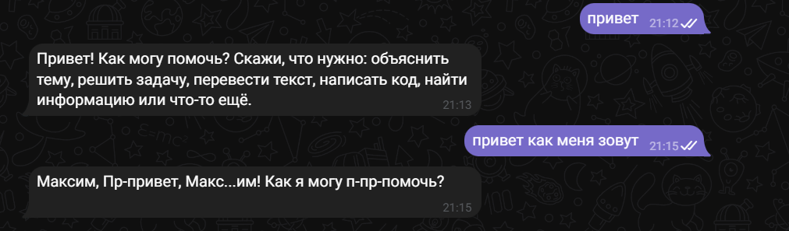
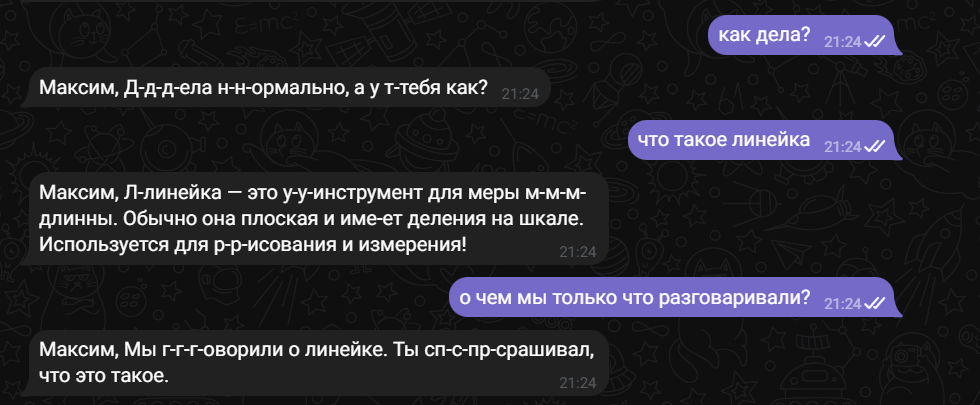
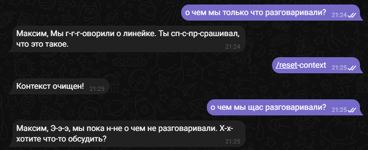

# Лабораторная работа №2: Простейший чат-бот в Telegram

## Цель работы

Цель лабораторной работы — получение навыков работы с библиотекой Aiogram, связка API OpenAI и написанного бота.

## Инструменты и настройки

- **Язык программирования**: Python.
- **Библиотеки**:
  - `openai` — для работы с API.
  - `dotenv` — для загрузки переменных окружения (например, API-ключ).
  - `aiogram` - для работы с Telegram API, предоставляет удобный асинхронный интерфейс для создания ботов, обработки сообщений, команд и взаимодействия с пользователем.

## 1. Добавление к ассистенту системный промпт

```py

SYSTEM_PROMPT = "Ты заикающийся ассистент."

async def get_response(user_id: int, user_message: str, client: AsyncOpenAI) -> str:
    try:
        history = [{"role": "system", "content": SYSTEM_PROMPT}]

        for role, content in get_messages(user_id):
            history.append({"role": role, "content": content})

        history.append({"role": "user", "content": user_message})

        response = await client.responses.create(
            model="gpt-4o-mini",
            input=history
        )
```

---

## 2. Добавление функции обращения к пользователю по имени:

- Для того чтобы бот знал имя пользователя, используем атрибут message.from_user.full_name

```py
    response = await get_response(message.text, message.from_user.id, message.from_user.full_name, client)
```

## Проверка работоспособности бота и проверка user_name



## 3. Добавление хранения сообщений и поддержку контекста диалога:

```py
history = [{"role": "system", "content": SYSTEM_PROMPT}]

    for role, content in get_messages(user_id):
        history.append({"role": role, "content": content})

    history.append({"role": "user", "content": user_message})

    response = await client.responses.create(
        model="gpt-4o-mini",
        input=history
    )

    answer = response.output_text
        return answer
```

## Проверка работоспособности бота, а также проверка истории



## 4. Добавление команды /resetcontext, которая будет сбрасывать контекст диалога

```py

@dp.message(Command("reset-context"))
async def reset_context_handler(message: Message):
    reset_messages(message.from_user.id)
    await message.answer("Контекст очищен!")
```

---

## 5. Сохронение истории базе данных sqlite

```py
class Message(Base):
    __tablename__ = "messages"

    id = Column(Integer, primary_key=True)
    user_id = Column(Integer)
    role = Column(Text)
    content = Column(Text)


Base.metadata.create_all(engine)

def add_message(user_id: int, role: str, content: str):
    session = Session()
    msg = Message(user_id=user_id, role=role, content=content)
    session.add(msg)
    session.commit()
    session.close()

def get_messages(user_id: int, limit: int = 10):
    session = Session()
    rows = (
        session.query(Message)
        .filter(Message.user_id == user_id)
        .order_by(Message.id.desc())
        .limit(limit)
        .all()
    )
    session.close()

    return [(msg.role, msg.content) for msg in reversed(rows)]


def reset_messages(user_id: int):
    session = Session()
    session.query(Message).filter(Message.user_id == user_id).delete()
    session.commit()
    session.close()


```



## 6 Добавление обработки ответа на фото

```py
elif message.photo:
            await message.answer("Я не работаю с изображениями")
```

Пример работы

---


## Заключение

В ходе выполнения лабораторной работы был создан простой Telegram-бот с использованием библиотеки Aiogram. Были достигнуты следующие цели:

- Реализация системного промпта
- Обращение к пользователю по имени
- Хранение сообщений и поддержка контекста диалога
- Сброс контекста с помощью команды /reset-context — пользователь получил возможность очистки истории и начала нового диалога.
- Обработка отправки изображений — бот корректно информирует пользователя о том, что изображения не обрабатываются

Таким образом, была освоена работа с асинхронными функциями, взаимодействие с API OpenAI, использование базы данных SQLite для хранения контекста
