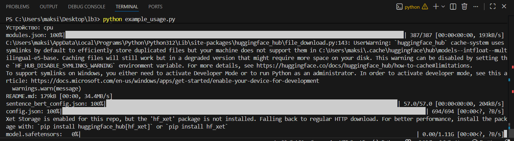
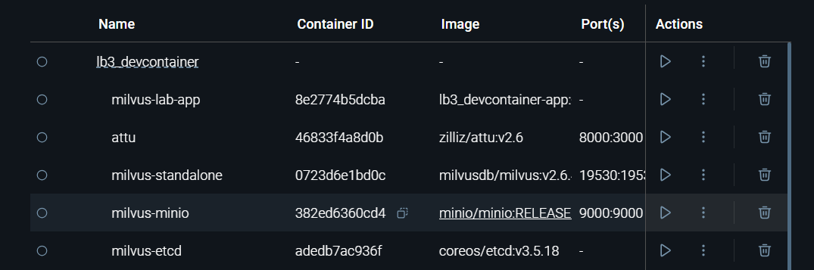
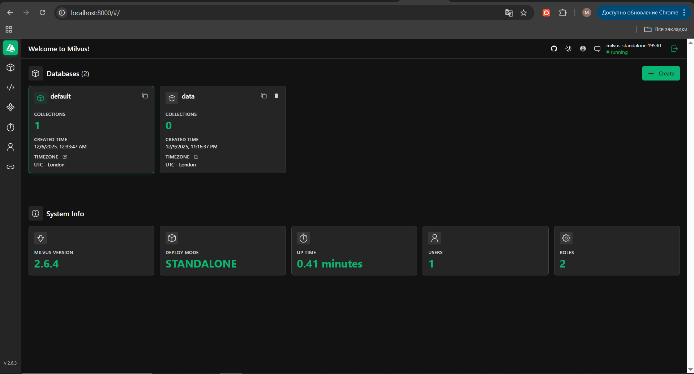
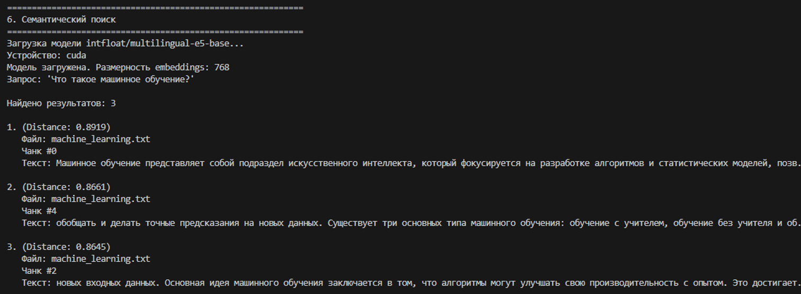
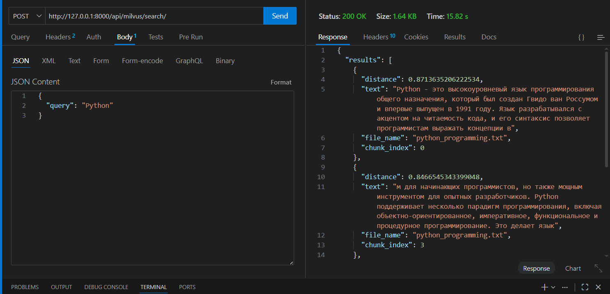

# Лабораторная работа №3 — Векторные базы данных и семантический поиск

**Цель:** научиться использовать векторные базы данных (Milvus) и семантический поиск для обработки текстовых данных и потенциальной интеграции с LLM.

---

## 1. Настройка окружения

Для выполнения работы использовался Dev Container, который предоставляет изолированное окружение со всеми необходимыми компонентами:

- Python 3.12

- Milvus (векторная БД)

- Attu (веб-интерфейс для Milvus)

Порядок настройки:

1. Открытие проекта в Dev Container через VSCode (Ctrl+Shift+P → "Reopen in Container")

2. Загрузка и настройка контейнера (~2 ГБ данных)

3. Проверка доступности сервисов:

   - Milvus: порт 19530

   - Attu: порт 8000

---

## 2. Окружение (devcontainer)

В работе используется **devcontainer** (конфиг: `assets/lab3/.devcontainer/devcontainer.json`). Основные компоненты:

- Python 3.12
- Milvus (standalone в docker-compose)
- Attu (веб-интерфейс для Milvus, обычно на порту 8000)
- CPU-версия sentence-transformers по умолчанию (для GPU требуется поменять конфиг)

Как пользоваться:

1. Откройте проект в VS Code.
2. Установите расширение "Dev Containers".
3. Ctrl+Shift+P → "Reopen in Container".

---

## 3. Модуль для работы с Milvus — разбор кода

Класс MilvusClient
Реализован класс для взаимодействия с векторной базой данных Milvus

```python
from pymilvus import connections

class MilvusClient:
    def __init__(self, host='standalone', port=19530, alias='default'):
        self.host = host
        self.port = port
        self.alias = alias
        self._connect()

    def _connect(self):
        connections.connect(alias=self.alias, host=self.host, port=self.port)
```

- `host` и `port` — параметры подключения (в docker-compose hostname часто `standalone`).
- `alias` — именованный alias для `pymilvus.connections`.

### Далее был реализован метод для создания коллекции в базе данных

```python
   def create_collection(self, collection_name: str, dimension: int, metric_type: str = "COSINE"):
      fields = [
         FieldSchema(name="id", dtype=DataType.INT64, is_primary=True, auto_id=True),
         FieldSchema(name="embedding", dtype=DataType.FLOAT_VECTOR, dim=dimension)
      ]
      schema = CollectionSchema(fields=fields)
      collection = Collection(name=collection_name, schema=schema)
      collection.create_index(field_name="embedding", index_params={"metric_type": metric_type, "index_type": "IVF_FLAT", "params": {"nlist": 128}})
      return collection
```

Что делает:

- Создает новую "таблицу" в БД с именем collection_name

- dimension - сколько чисел в одном векторе (например, 768 для multilingual-e5-base)

- Пример: Если dimension=3, то вектор [0.1, 0.2, 0.3] будет храниться как 3 числа

Параметры индекса:

- IVF_FLAT - разбитие на разделы

- nlist=128 - создает 128 разделов (кластеров)

- COSINE - использует косинусное расстояние (лучше для текста)

## Вставка данных

```py
   def insert_data(self, collection_name: str, texts: List[str], embeddings: List[List[float]]):
      collection = Collection(collection_name)
      collection.insert([texts, embeddings])
      collection.flush()
```

Что делает:

- Добавляет записи в коллекцию

- texts = список текстов: ["привет мир", "как дела"]

- embeddings = список векторов: [[0.1, 0.2, 0.3], [0.4, 0.5, 0.6]]

- Каждый текст связан со своим вектором по индексу в списке

## Поиск

```py
   def search(self, collection_name: str, query_vectors: List[List[float]], top_k: int = 5):
      collection = Collection(collection_name)
      results = collection.search(query_vectors, anns_field="embedding", limit=top_k)
      return results
```

Что делает:

- Ищет top_k (по умолчанию 5) самых похожих векторов

- query_vectors - вектор запроса (например, вектор слова "Python")

- Использует созданный ранее индекс для быстрого поиска

---

## 4. Парсер текстовых файлов — разбор кода

Класс `TextParser` разбивает текст на чанки с перекрытием.

```py
class TextParser:
    def __init__(self, chunk_size: int = 256, chunk_overlap: int = 64):
        if chunk_overlap >= chunk_size:
            raise ValueError("chunk_overlap должен быть меньше chunk_size")
        self.chunk_size = chunk_size
        self.chunk_overlap = chunk_overlap
        self.step_size = chunk_size - chunk_overlap
```

Основные параметры:

- `chunk_size` — максимальная длина чанка в символах (например, 256);
- `chunk_overlap` — сколько символов перекрывается между соседними чанками (например, 64);
- `step_size = chunk_size - chunk_overlap`.

Класс позволил нормализовать текст, удаляя лишние пробелы и переносы строк:

```py
   def normalize_text(self, text: str) -> str:
      text = re.sub(r'\s+', ' ', text)
      return text.strip()
```

Метод разделил текст на чанки, что обеспечило эффективную работу с большими объемами данных и контекстуальность каждого чанка.

```py
   def parse_file(self, file_path: str, encoding: str = "utf-8") -> List[str]:
      text = self.read_file(file_path, encoding)
      chunks = self.chunk_text(text)
      return chunks
```

### Запуск при python example_usage.py

## 

## 

### Контейнеры в докер

## 

Attu — это графический интерфейс для работы с Milvus, который позволяет выполнять различные операции с базой данных, такие как создание коллекций, управление данными и поиск по векторным представлениям.

## 

## 5. Задания

1. Запуск сценария с использованием GPU.
   Изменение конфигурации Docker для использования GPU

В файле docker-compose.yaml есть закоментированная строка gpus: all для работы с видео картой.

```py
   services:
      app:
         build:
            context: ..
            dockerfile: .devcontainer/Dockerfile
         container_name: milvus-lab-app
         working_dir: /workspaces
         volumes:
            - ../:/workspaces
         command: sleep infinity
         gpus: all # чтобы эмбеддер видел видеокарту
         depends_on:
            - standalone
         networks:
            - internal-network
```

## 

---

## 2. Создание API для работы с Milvus.

Создание проекта Django
Для создания нового проекта на джанго требуется команда:

```py
   django-admin startproject milvus_api
```

Было созданно новое приложение, в которая содержит логику работы с Milvus:

```py
   python manage.py startapp milvus
```

### Создание views.py для обработки запроса

Основная логика обработки запроса заключается в следующем:

- Получение запроса от пользователя.
- Генерация embedding для текста с помощью модели multilingual-e5-base.
- Подключение к Milvus и выполнение поиска по векторному представлению текста.
- Формирование ответа с результатами поиска.

Пример кода в views.py:

```py
class SearchView(APIView):
    def post(self, request, *args, **kwargs):
        query = request.data.get("query", "")

        if not query:
            return Response({"error": "Запрос не может быть пустым"}, status=status.HTTP_400_BAD_REQUEST)

        try:
            embedder = Embedder(model_name="intfloat/multilingual-e5-base")
            query_embedding = embedder.encode_query(query)
        except Exception as e:
            return Response({"error": f"Ошибка при генерации embedding для запроса: {str(e)}"}, status=status.HTTP_500_INTERNAL_SERVER_ERROR)

        try:
            milvus = MilvusClient(host="standalone", port=19530)
        except Exception as e:
            return Response({"error": f"Ошибка при подключении к Milvus: {str(e)}"}, status=status.HTTP_500_INTERNAL_SERVER_ERROR)

        collection_name = "documents"
        try:
            search_results = milvus.search(
                collection_name=collection_name,
                query_vectors=[query_embedding],
                top_k=3
            )

            print(search_results)

            formatted_results = []
            for hit in search_results[0]:
                formatted_results.append({
                    "distance": hit.get("distance", 0),
                    "text": hit.get("text", "Нет текста"),
                    "file_name": hit.get("file_name", "N/A"),
                    "chunk_index": hit.get("chunk_index", -1)
                })

            return Response({"results": formatted_results}, status=status.HTTP_200_OK)

```

### Создание сериализатора в serializers.py

Для обработки входных данных в виде векторов и получения правильного формата ответа Это позволяет API безопасно принимать запросы и передавать их Milvus в структурированном виде

```py
class SearchSerializer(serializers.Serializer):
    query_vectors = serializers.ListField(child=serializers.ListField(child=serializers.FloatField()))
    top_k = serializers.IntegerField(default=5)
    expr = serializers.CharField(required=False, allow_blank=True)
```

- query_vectors представляет собой список векторов числами с плавающей точкой, параметр
- top_k - является целым числом
- expr — корректной строкой для фильтрации.

### Создание маршрутов в urls.py

```py
urlpatterns = [
    path('search/', SearchView.as_view(), name='search'),
]
```



## Заключение

В ходе работы была настроена среда в devcontainer, создан модуль для взаимодействия с Milvus, реализован парсинг и чанкирование текстов, а также генерация эмбеддингов с помощью модели multilingual-e5-base. Данные были загружены в векторную базу, после чего выполнен семантический поиск. Дополнительно был разработан REST API для удобной работы с Milvus. Таким образом, была построена полноценная система семантического поиска и закреплены навыки работы с векторными базами данных.
