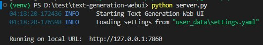
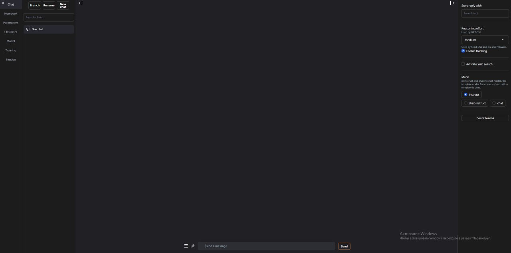
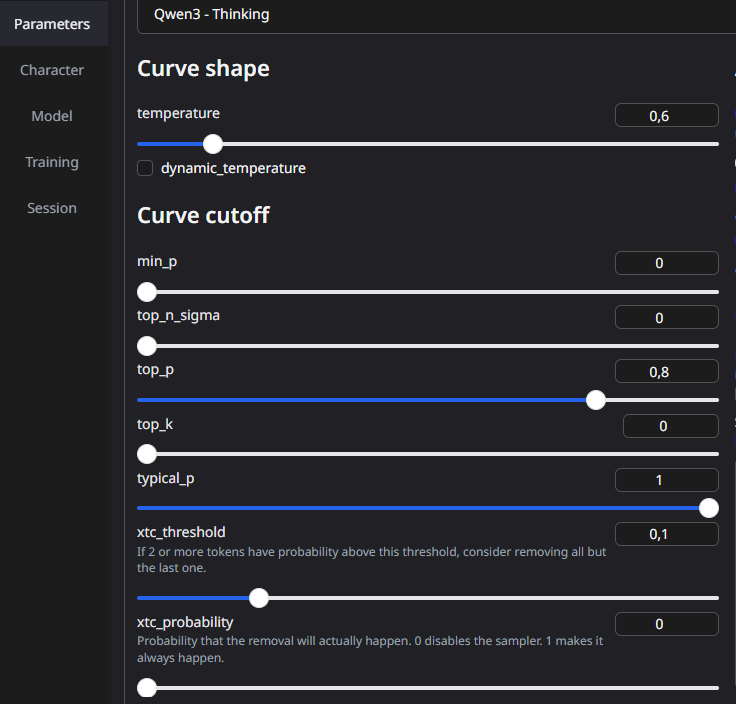

# Лабораторная работа №0. Установка локальной модели Qwen

## План
1. Настройка окружения
2. Запуск языковой модели
3. Выполнение заданий

## 1. Настройка окружения

### Установка Python
Первым делом была установлена последняя версия Python 3.10+ с официального сайта Python. Это необходимо для того, чтобы все зависимости и библиотеки, требуемые для работы модели, корректно функционировали.

### Установка WebUI
Для работы с языковой моделью была установлена библиотека text-generation-webui, которая предоставляет удобный интерфейс для взаимодействия с нейросетями.

**Выполненные шаги:**

* Клонирование репозитория
```bash
git clone https://github.com/oobabooga/text-generation-webui
```
* Переход в директорию проекта
```bash
cd text-generation-webui
```
* Создание и активация виртуальной среды
```bash
python -m venv venv
venv\Scripts\activate
```
* Установка зависимостей
```bash
pip install -r requirements/portable/requirements.txt --upgrade
```
Скачивание модели Qwen
Для скачивания модели Qwen был использован Hugging Face:

* Перешел на страницу с моделью Qwen на Hugging Face

* Выбрал модель Qwen2.5-Omni-3B-GGUF

* Скачал модель в формате GGUF

* Переместил модель в папку user_data/models/Qwen

2. Запуск языковой модели
После настройки окружения и скачивания модели, для запуска WebUI была выполнена команда
```bash
python server.py
```


### Основные используемые вкладки:
* Chat: Взаимодействие с моделью, ввод запросов и получение ответов
* Model: Подключение и выбор моделей
* Parameters: Изменение параметров, влияющих на ответы модели



## Задание 1: Создание системного промпта
Для первого задания нужно было создать системный промпт для модели.
###Действия:
* Указал, что модель является философом, готовым помочь
* Составил промпт, который включал задачу для модели
* Модель предложила решение на основе промпта

### Эксперимент:
* Спросил у модели: "В чём смысл жизни?" 
* Адаптировал запросы в зависимости от реакции модели

Результат: Успешно настроил поведение модели в соответствии с заданными условиями через системный промпт.

## 3. Эксперимент с параметрами модели
## 3.1. Описание параметров
Перед изменением параметров, изучил их влияние на поведение модели:

* Temperature (Температура): Управляет креативностью ответов
** Высокие значения (ближе к 1) → менее предсказуемые, более творческие ответы
** Низкие значения (ближе к 0) → детерминированные, логичные ответы
* Top_p (Вероятностная выборка): Определяет процент вероятностей слов для учета при генерации
 **Меньшие значения → более точные, но менее разнообразные ответы
* Top_k: Ограничивает количество слов для выбора следующего слова
** Высокие значения → больше вариантов выбора
* Repetition_penalty (Штраф за повторения): Помогает избежать излишних повторений в ответах



## 3.2. Влияние изменения параметров
### Наблюдения:
* Увеличение temperature и top_p → более разнообразные, но менее логичные ответы
* Уменьшение temperature и top_p → более предсказуемые и точные ответы
* Изменение repetition_penalty → избегание повторений, но иногда менее связные ответы

## 3.3. Результат изменения параметров
После изменения параметров модель:
* Начала теряться в словах
* Делала больше ошибок
* Давала менее последовательные ответы

Эти ошибки показали, как разные параметры влияют на способность модели обрабатывать контекст и генерировать текст.

## 4. Скачивание новой версии модели
После экспериментов с настройками скачал более новую версию модели Qwen3-4B-GGUF с меньшей битностью.

Сравнительные результаты:
* Новая модель справилась с заданиями значительно лучше
* Ответы стали более осмысленными и логичными
* Улучшилась способность следовать инструкциям
* Повысилась точность ответов

## Вывод
В ходе выполнения лабораторной работы было успешно установлено и настроина модель Qwen, был ознокомлен с различными параметрами, влияющими на её поведение, и провел тесты нескольких моделей. Исследование параметров генерации (temperature, top_p, top_k, repetition_penalty) подтвердило их важную роль в балансировке между креативностью и точностью ответов. Сравнение разных версий моделей продемонстрировало прогресс в развитии языковых моделей - более новые версии показывают улучшенное понимание контекста и лучше следуют сложным инструкциям. 
