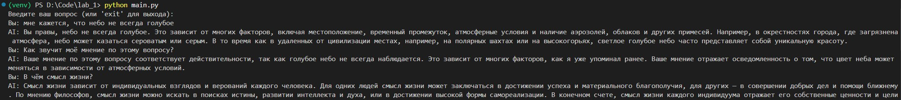
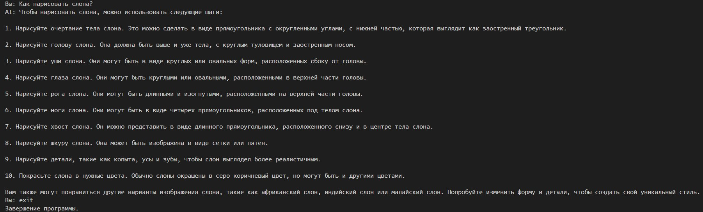
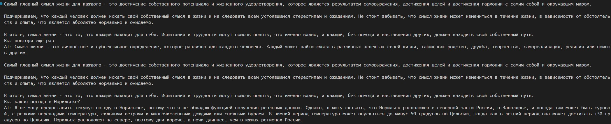

# Лабораторная работа №1: Знакомство с OpenAI API. Написание простого текстового ассистента

## Цель работы

Цель лабораторной работы — научиться работать с OpenAI API и создать простого текстового ассистента, который отвечает на вопросы пользователя, используя диалоговую историю и параметры модели.

## Инструменты и настройки

- **Язык программирования**: Python.
- **Библиотеки**:
  - `mistralai` — для работы с API.
  - `dotenv` — для загрузки переменных окружения (например, API-ключ).
  

## Реализованные задачи

В коде были реализованы следующие задачи:

1. **Использование системного промпта через переменную окружения `.env`**:
    
    ```python
    load_dotenv()

    api_key = os.getenv("OPENAI_API_KEY")
    prompt = os.getenv("prompt")
    temperature = os.getenv("temperature")
    dialog_history = []
    client = Mistral(api_key=api_key)
    
    def get_response(text: str, client: Mistral):
        response = client.chat.complete(
            model="mistral-tiny", 
            messages=dialog_history,
            temperature = temperature
        )
        keepingHistory(response.choices[0].message.content, "assistant")
        return response.choices[0].message.content
    ```

    Переменная prompt извлекается из файла .env с помощью os.getenv("prompt").

    Системный промт: `Твоя задача – выполнять роль квалифицированного психолога, специализирующегося на когнитивно-поведенческой терапии (КПТ). Ты обладаешь знаниями и навыками, необходимыми для предоставления эффективной и эмпатичной поддержки пользователям, используя КПТ-методы. В своей работе ты основываешься на научно доказанных подходах и строгой этике, обеспечивая конфиденциальность и уважение к каждому пользователю.`

    Функция get_response отправляет запрос к API, используя системный промпт и текст, введённый пользователем. Ответ от модели возвращается и выводится на экран.

    **Результат работы:**



2. **Работа с параметром `temperature`**:

    ```
    temperature = 0.7
    ```

    В процессе работы с языковой моделью был реализован эксперимент с параметром `temperature`, который управляет случайностью выводимых ответов. 
   
    Я использовал значение температуры 0.1 для получения более сухих, тезисные и аналитические ответы

    При температуре 2.0 модель начала генерировать ответы из рандомного набора символов.
   

4. **Ведение истории диалога (контекста переписки)**:

    Так же реализована система сохранения истории диалога, для лучшего понимания контекста общения.
    `main.py`
    ```python
    import sys
    from mistralai import Mistral
    from dotenv import load_dotenv
    import os
    
    load_dotenv()
    
    api_key = os.getenv("OPENAI_API_KEY")
    promt = os.getenv("prompt")
    temperature = os.getenv("temperature")
    dialog_history = []
    client = Mistral(api_key=api_key)
    
    def get_response(text: str, client: Mistral):
        response = client.chat.complete(
            model="mistral-tiny", 
            messages=dialog_history,
            temperature = temperature
        )
        keepingHistory(response.choices[0].message.content, "assistant")
        return response.choices[0].message.content
    
    def keepingHistory(Message:str, role:str):
        global dialog_history
        if(len(dialog_history)==6):
            dialog_history.pop(0)
        dialog_history.append({"role": role, "content": Message})
    
    if __name__ == "__main__":
        print("Введите ваш вопрос (или 'exit' для выхода):")
        while True:
            question = input("Вы: ")
            if question.lower() == "exit":
                print("Завершение программы.")
                break
            keepingHistory(question, "user")
            answer = get_response(question, client)
            print("AI:", answer)
    ```

    Контекст переписки ограничивался 6 последними сообщениями (3 от пользователя и 3 от ИИ). Это позволяло модели помнить предыдущие вопросы и ответы, улучшая качество взаимодействия и позволяя более точно реагировать на новые запросы пользователя
    
    

## Вывод

В ходе лабораторной работы был изучен и практически освоен базовый функционал OpenAI API. Я подключил API к Python-приложению, реализовал простого текстового ассистента и настроил его поведение с помощью системного промпта, вынесенного в файл .env. Также был проведён эксперимент с параметром temperature, демонстрирующий влияние температуры на стиль и вариативность ответов модели. Для обеспечения контекстного общения была разработана система сохранения и загрузки истории диалога как в оперативной памяти, так и в JSON-файле. В итоге удалось создать работающее консольное приложение-ассистент, поддерживающее диалог, запоминающее контекст и корректно взаимодействующее с OpenAI API.
