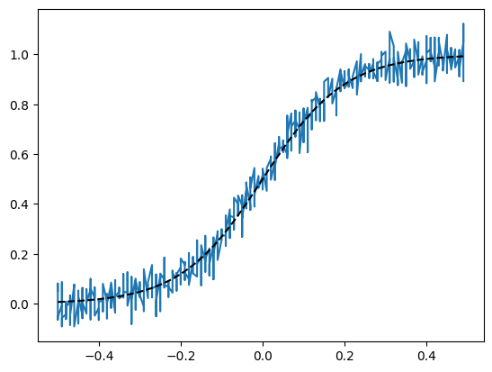
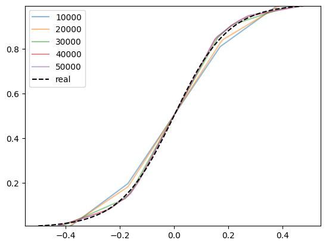
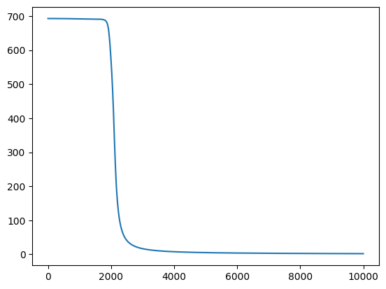
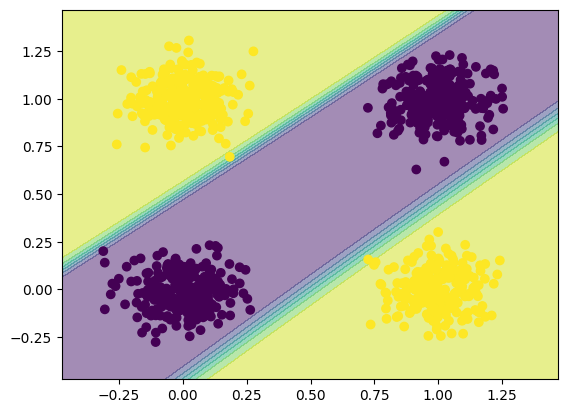

# Отчёт. Лабораторная работа №1. Введение в DL.
## Задание
Необходимо познакомиться с фреймворком машинного обучения PyTorch и выполнить три задания:
 - Регрессия по теореме универсальной аппроксимации, ручное дифференцирование
 - Бинарная классификация с помощью автодиффиренцирования PyTorch
 - Обучить полносвязную нейронную сеть классификации 3 классов изображений из набора данных CIFAR100 по варианту из примера и затем повысить точность на тестовой выборке.

## Задание 1. Регрессия по теореме универсальной аппроксимации, ручное дифференцирование
В рамках данного задания была проверена теорема универсальной аппроксимации, которая утверждает, что нейронная сеть с одним скрытым слоем и достаточным количеством нейронов способна аппроксимировать любую непрерывную функцию с произвольной точностью. Задача была представлена как классическая задача регрессии — предсказание непрерывного значения на основе входных данных.
### Подготовка набора данных
Была создана выборка на основе сигмоидальной функции с добавлением случайного шума.



Архитектура сети включает:
- Скрытый слой: 64 нейрона.
- Функция активации: ReLU (в скрытом слое).
- Функция потерь: MSE (среднеквадратичная ошибка).

### Реализация алгоритма обучения:
Обучение реализовано на архитектуре нейронной сети прямого распространения. Процесс оптимизации включает 50 000 итераций и базируется на двух этапах:
- Forward pass (Прямой проход): Последовательное преобразование входных данных через веса слоев и функцию активации для получения предсказания.
- Backpropagation (Обратное распространение ошибки): Ключевой этап, реализованный через ручное дифференцирование. Мы аналитически вычислили градиенты функции потерь по всем параметрам сети, что позволило корректировать веса методом градиентного спуска.

### Результаты
На графиках зафиксирован процесс сходимости: каждые 10 000 итераций модель точнее приближается к эталонной функции.
- Итог: Сеть успешно отфильтровала шум и восстановила исходную зависимость.
- Вывод: Низкое финальное значение функции потерь `0.0022573825` подтверждает корректность ручного вычисления градиентов и применимость теоремы универсальной аппроксимации.



## Задание №2. Бинарная классификация с помощью автодифференцирования PyTorch

Цель: Реализация нейронной сети для решения задачи нелинейной классификации (XOR) с использованием механизмов автоматического вычисления градиентов.

### Подготовка данных и специфика задачи
В данном задании рассматривается задача классификации данных, распределенных по принципу исключающего ИЛИ (XOR).
- Особенности: Данные не являются линейно разделимыми (нельзя провести одну прямую, чтобы отделить один класс от другого).
- Входные данные: Двумерные векторы с добавлением шума.
- Целевая переменная: Бинарный признак (0 или 1).

### Архитектура сети и функция активации
- Входной слой: 2 нейрона (координаты точки).
- Скрытый слой: 16 нейронов.
- Функция активации: В этой работе использовалась сигмоида. Она «сжимает» выходные значения в диапазон от 0 до 1, что идеально подходит для предсказания вероятности принадлежности к классу.
- Функция потерь: Использовалась Logloss (Binary Cross-Entropy), которая является стандартной для задач бинарной классификации.

### Автоматическое дифференцирование (Autograd)
В отличие от первого задания, расчет градиентов выполнялся встроенным механизмом PyTorch — loss.backward().

### Анализ результатов
- Функция потерь: На графике Loss заметно резкое снижение ошибки на начальных этапах, что говорит о хорошем подборе параметров обучения.


- Разделяющая поверхность: Для визуализации работы сети была построена сетка (contourf). На графике видно, как нейронная сеть сформировала нелинейные границы, четко отделяющие области классов 0 и 1.



## Задание №3. Классификация изображений CIFAR-100
В рамках задания была реализована полносвязная нейронная сеть (MLP) для классификации цветных изображений (32×32 RGB) трех выбранных классов. Архитектура модели включает входной слой на 3072 признака, скрытый слой с активацией ReLU и выходной слой с кросс-энтропийной функцией потерь. Перед обучением данные были нормализованы и распределены по мини-батчам с помощью DataLoader. Оптимизация весов проводилась методом стохастического градиентного спуска (SGD) в течение заданного количества эпох.

### Реализация алгоритма:
1. Формирование обучающей и тестовой выборки из изображений определенных классов.

Пример изображения:


2. Для эффективной подачи данных в модель использовался DataLoader. Данные были преобразованы в формат One-Hot векторов и разбиты на мини-батчи. Это позволило оптимизировать использование памяти и обеспечить перемешивание обучающей выборки для повышения обобщающей способности сети.

3. Сама сеть состоит из входного вектора, скрытого и  выходного слоя и использует ReLU как функцию активации. Для оптимизации весов использовался метод стохастического градиентного спуска (SGD). Для обучения использовалась функция потерь кросс-ентропии.

4. После прогонки основного цикла обучения, можно оцень ошибки на обучающей и тестовой выборке:
```
[241,    12] loss: 0.075
[241,     3] val loss: 0.589
[242,    12] loss: 0.075
[242,     3] val loss: 0.514
[243,    12] loss: 0.074
[243,     3] val loss: 0.525
[244,    12] loss: 0.074
[244,     3] val loss: 0.546
[245,    12] loss: 0.074
[245,     3] val loss: 0.573
[246,    12] loss: 0.074
[246,     3] val loss: 0.534
[247,    12] loss: 0.073
[247,     3] val loss: 0.562
[248,    12] loss: 0.072
[248,     3] val loss: 0.523
[249,    12] loss: 0.072
[249,     3] val loss: 0.560
[250,    12] loss: 0.071
[250,     3] val loss: 0.558
```
Анализ динамики потерь показал наличие переобучения: итоговый тренировочный loss составил 0.071, в то время как валидационный — 0.558. Модель демонстрирует высокую точность на знакомых данных, но имеет ограниченную обобщающую способность.

### Рзультаты работы сети:
```
train
              precision    recall  f1-score   support

           0     0.9940    0.9960    0.9950       500
          33     0.9900    0.9920    0.9910       500
          50     0.9920    0.9880    0.9900       500

    accuracy                         0.9920      1500
   macro avg     0.9920    0.9920    0.9920      1500
weighted avg     0.9920    0.9920    0.9920      1500

--------------------------------------------------
test
              precision    recall  f1-score   support

           0     0.8257    0.9000    0.8612       100
          33     0.8137    0.8300    0.8218       100
          50     0.7865    0.7000    0.7407       100

    accuracy                         0.8100       300
   macro avg     0.8086    0.8100    0.8079       300
weighted avg     0.8086    0.8100    0.8079       300

--------------------------------------------------
```
1. Подтверждение переобучения
- Train Accuracy: 99.20%. Модель практически вызубрила тренировочный набор.
- Test Accuracy: 81.00%. На новых данных точность ниже на 18%.

2. Разбор по классам
- Класс 0 - Лучший результат (f1-score 0.86). У этого класса  самый высокий recall (0.90). Это значит, что сеть находит 90% всех изображений данного класса.
- Класс 33 - Средний результат (f1-score 0.82). Precision и Recall сбалансированы.
- Класс 50 - Худший результат (f1-score 0.74). Самые низкие Precision и Recall.

### Эксперементы:

1. Изменил размер батча в 4 раза (32 вместо 128) и кол-во эпох в 4 раза (62 вмест 250)(кол-вл итераций сохранилось):
```
train
              precision    recall  f1-score   support

           0     0.9900    0.9900    0.9900       500
          33     0.9939    0.9760    0.9849       500
          50     0.9705    0.9880    0.9792       500

    accuracy                         0.9847      1500
   macro avg     0.9848    0.9847    0.9847      1500
weighted avg     0.9848    0.9847    0.9847      1500

--------------------------------------------------
test
              precision    recall  f1-score   support

           0     0.8349    0.9100    0.8708       100
          33     0.8632    0.8200    0.8410       100
          50     0.8021    0.7700    0.7857       100

    accuracy                         0.8333       300
   macro avg     0.8334    0.8333    0.8325       300
weighted avg     0.8334    0.8333    0.8325       300

--------------------------------------------------
```

Уменьшение батча до 32 повысило точность на тесте с 81% до 83.3%. Это произошло благодаря «шумным» обновлениям весов, которые сработали как регуляризатор: модель стала меньше зубрить тренировочные фото и лучше находить общие признаки объектов.

2. Уменьшил скорость обучений в 5 раз, увеличил кол-во эпох в ~8 раз:
```
train
              precision    recall  f1-score   support

           0     1.0000    0.9860    0.9930       500
          33     0.9980    0.9960    0.9970       500
          50     0.9823    0.9980    0.9901       500

    accuracy                         0.9933      1500
   macro avg     0.9934    0.9933    0.9933      1500
weighted avg     0.9934    0.9933    0.9933      1500

--------------------------------------------------
test
              precision    recall  f1-score   support

           0     0.8350    0.8600    0.8473       100
          33     0.8384    0.8300    0.8342       100
          50     0.7755    0.7600    0.7677       100

    accuracy                         0.8167       300
   macro avg     0.8163    0.8167    0.8164       300
weighted avg     0.8163    0.8167    0.8164       300

--------------------------------------------------
```

Снижение скорости обучения до 0.001 при увеличении количества эпох позволило модели достичь высокой точности на тренировочной выборке (99.33%), однако на тестовой выборке точность составила 81.67%. Это ниже результата предыдущего этапа, что свидетельствует о достижении "потолка" текущей архитектуры: малый шаг обучения привел к избыточной специализации весов под тренировочные данные (переобучению), не улучшив распознавание новых объектов.

3. Увеличение числа нейронов на скрытом слое:

- оригинальные 10:
```
train
              precision    recall  f1-score   support

           0     1.0000    0.9960    0.9980       500
          33     1.0000    1.0000    1.0000       500
          50     0.9960    1.0000    0.9980       500

    accuracy                         0.9987      1500
   macro avg     0.9987    0.9987    0.9987      1500
weighted avg     0.9987    0.9987    0.9987      1500

--------------------------------------------------
test
              precision    recall  f1-score   support

           0     0.8519    0.9200    0.8846       100
          33     0.8384    0.8300    0.8342       100
          50     0.8065    0.7500    0.7772       100

    accuracy                         0.8333       300
   macro avg     0.8322    0.8333    0.8320       300
weighted avg     0.8322    0.8333    0.8320       300

--------------------------------------------------
```

- 32:
```
train
              precision    recall  f1-score   support

           0     1.0000    1.0000    1.0000       500
          33     1.0000    0.9980    0.9990       500
          50     0.9980    1.0000    0.9990       500

    accuracy                         0.9993      1500
   macro avg     0.9993    0.9993    0.9993      1500
weighted avg     0.9993    0.9993    0.9993      1500

--------------------------------------------------
test
              precision    recall  f1-score   support

           0     0.8878    0.8700    0.8788       100
          33     0.8137    0.8300    0.8218       100
          50     0.7700    0.7700    0.7700       100

    accuracy                         0.8233       300
   macro avg     0.8238    0.8233    0.8235       300
weighted avg     0.8238    0.8233    0.8235       300

--------------------------------------------------
```

- 5:
```
train
              precision    recall  f1-score   support

           0     0.9920    0.9860    0.9890       500
          33     0.9960    0.9920    0.9940       500
          50     0.9822    0.9920    0.9871       500

    accuracy                         0.9900      1500
   macro avg     0.9900    0.9900    0.9900      1500
weighted avg     0.9900    0.9900    0.9900      1500

--------------------------------------------------
test
              precision    recall  f1-score   support

           0     0.8208    0.8700    0.8447       100
          33     0.7961    0.8200    0.8079       100
          50     0.7582    0.6900    0.7225       100

    accuracy                         0.7933       300
   macro avg     0.7917    0.7933    0.7917       300
weighted avg     0.7917    0.7933    0.7917       300

--------------------------------------------------
```

- 128:
```
train
              precision    recall  f1-score   support

           0     1.0000    1.0000    1.0000       500
          33     1.0000    1.0000    1.0000       500
          50     1.0000    1.0000    1.0000       500

    accuracy                         1.0000      1500
   macro avg     1.0000    1.0000    1.0000      1500
weighted avg     1.0000    1.0000    1.0000      1500

--------------------------------------------------
test
              precision    recall  f1-score   support

           0     0.9082    0.8900    0.8990       100
          33     0.8485    0.8400    0.8442       100
          50     0.7864    0.8100    0.7980       100

    accuracy                         0.8467       300
   macro avg     0.8477    0.8467    0.8471       300
weighted avg     0.8477    0.8467    0.8471       300

--------------------------------------------------
```
При увелечении числа нейронов на скрытом слое, точность немного учеличивается, но нейросеть может быстрее переобучаться и также увеличивается время обучения.

При увеличении кол-ва скрытых слоев, точность также увеличивается.
```
train
              precision    recall  f1-score   support

           0     0.9545    0.9640    0.9592       500
          33     0.9458    0.9080    0.9265       500
          50     0.9068    0.9340    0.9202       500

    accuracy                         0.9353      1500
   macro avg     0.9357    0.9353    0.9353      1500
weighted avg     0.9357    0.9353    0.9353      1500

--------------------------------------------------
test
              precision    recall  f1-score   support

           0     0.8571    0.9000    0.8780       100
          33     0.8511    0.8000    0.8247       100
          50     0.7822    0.7900    0.7861       100

    accuracy                         0.8300       300
   macro avg     0.8301    0.8300    0.8296       300
weighted avg     0.8301    0.8300    0.8296       300

--------------------------------------------------
```