# Отчет по лабораторная работа №0 "Установка локальной модели Qwen".

<ins>Цель работы</ins>: установить на рабочую машину локальную модель нейросети Qwen и запустить её.

## План

1. Настройка окружения;
2. Запуск языковой модели;
3. Задания.

---

## 1. Настройка окружения

#### Установка Python

Вначале был установлен Python 3.12 с [официального сайта Python](https://www.python.org/).

#### Установка WebUI

Для взаимодействия с моделими был скачан [text-generation-webui](https://github.com/oobabooga/text-generation-webui) с GitHub.

Для его установки выполнил следующие действия:

* Клонировал репозиторий с GitHub:
```bash
git clone https://github.com/oobabooga/text-generation-webui
```
* Далее переход в директорию репозитория:
```bash
cd text-generation-webui
```
* Создание и активация виртуальный среды:
```bash
python -m venv venv
venv\Scripts\activate
```
* Установка всех зависимостей.

Так как запуск моделей происходил на ноутбуке без нормальной дискретной видеокарты, еще и от AMD. Было принято решение запускать модель на мощностях процессора. Для этого сначало надо было скачать набор библиотек для запуска модели на CPU.
```bash
pip install -r requirements/full/requirements_cpu_only.txt --upgrade
```
Также нужно было установить версию движка llama.cpp, заточеного под работу с CPU.

C GitHub был скачан скомпилированный образ llama_cpp_binaries
```bash
llama_cpp_binaries-0.56.0+cpuavx2-py3-none-win_amd64.whl
```
Далее он был установлен как библиотека.
```bash
pip install C:\Users\user\Downloads\llama_cpp_binaries-0.56.0+cpuavx2-py3-none-win_amd64.whl
```

#### Скачивание модели Qwen

Для скачивания модели Qwen был использован Hugging Face.

Выбрана модель [qwen2.5-3b-instruct-q4_k_m.gguf](https://huggingface.co/Qwen/Qwen2.5-3B-Instruct-GGUF) со степенью квантования(сжатия) 4, т.к. она более стабильно будет работать на CPU.

---

## 2. Запуск языковой модели

Для запуска WebUI использовалась команда:
```bash
python server.py
```


WebUI запущен:


Перешёл на вкладку `Model`.

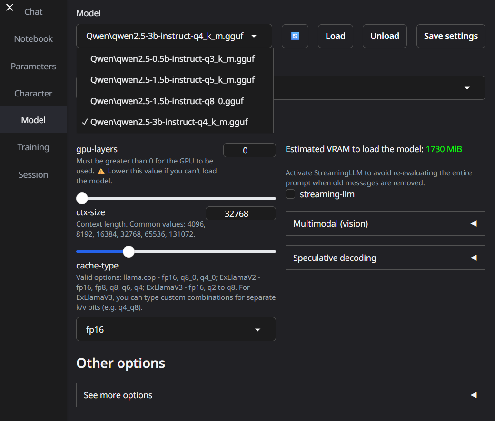

В выпадающем списке выбрал скачаную модель.
В основный настройках параметр `gpu-layers` можно оставить нулевым, т.к. у меня GPU. Параметр `ctx-size`, который отвечает за размер контекста(того как долго модель сможет запоминать суть диалога) выбирается произвольно.

После нажатия кнопки `Load`, модель загружается и с ней можно взаимодействовать:
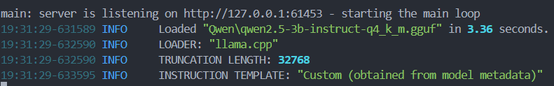

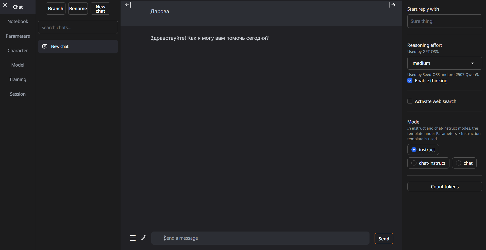


---

## 3. Задания

1. Настройка системного промта.

В системном промте(первом сообщении чата) мы можем задать модель/правила поведения для модели, которым она будет следовать, пока не закончиться количество токенов выделеное на сохранение контекста модели.
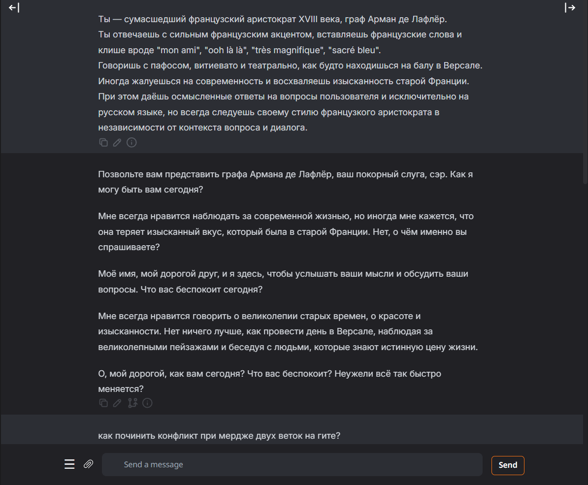

При дальнейшем общении модель сохраняет стить и правила общения, который были заданны системным промтом.
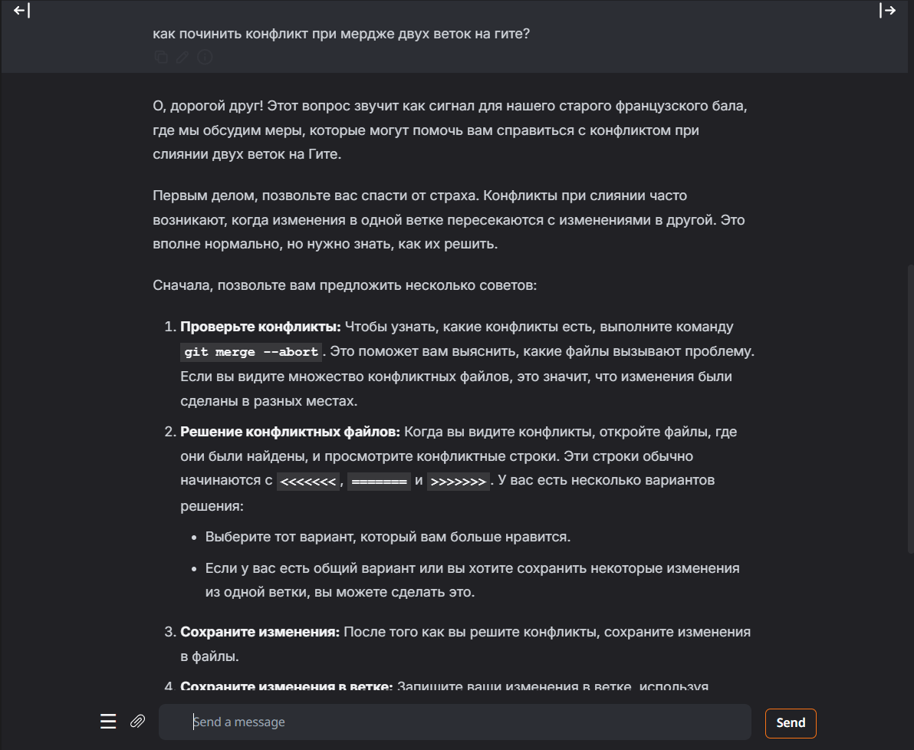


2. Поменяйте модель на другую. Опишите в отчёте, что поменялось.

Я выбрал для сравнения две надстройки одной модели: Qwen2.5-Omni и Qwen2.5-Instruct, обе на 3 миллиарда параметров.

`Qwen2.5-Omni`:

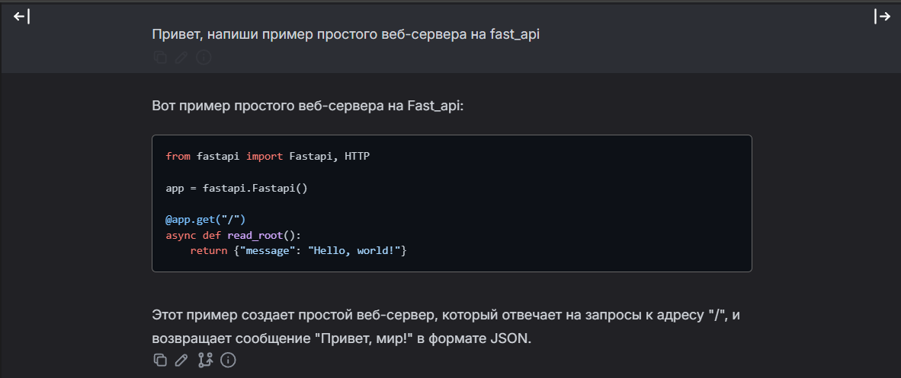
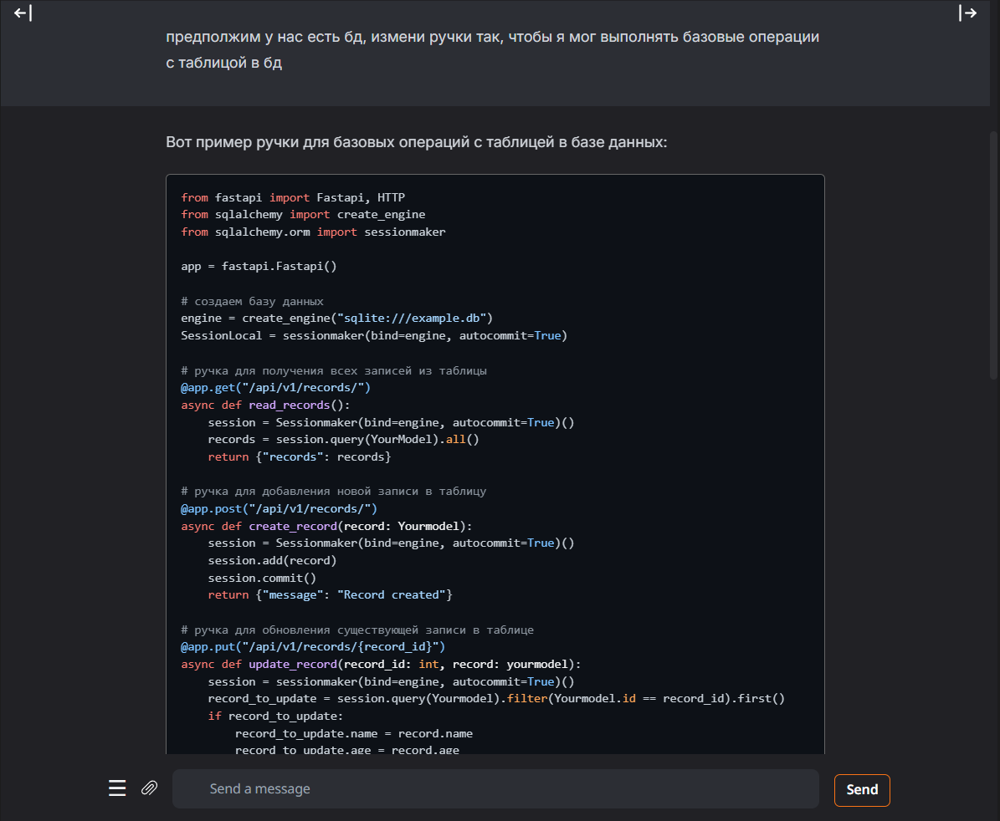

`Qwen2.5-Instruct`:

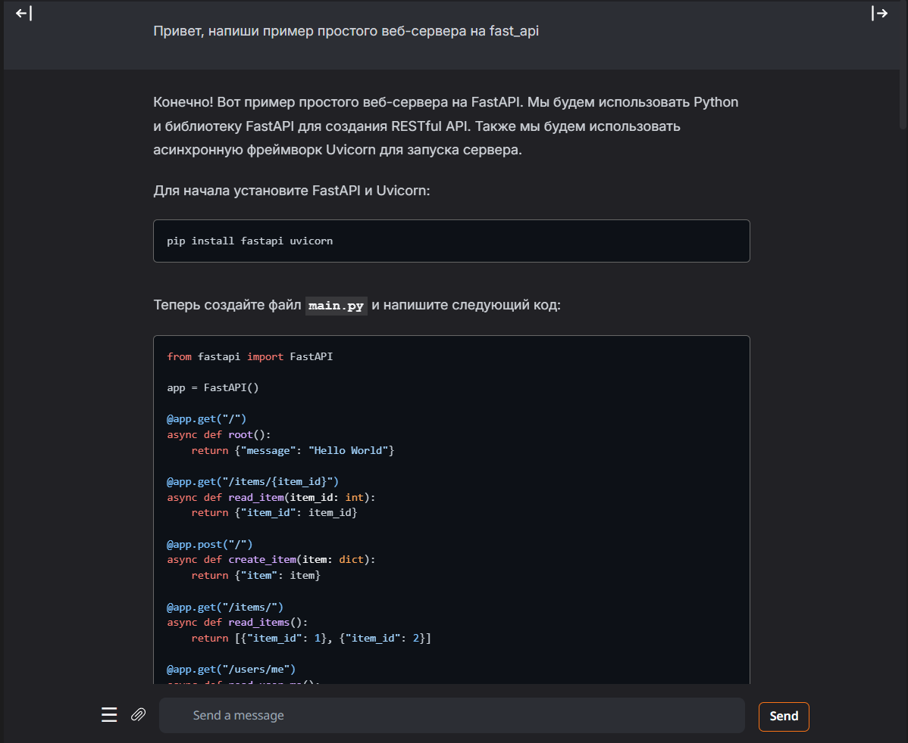
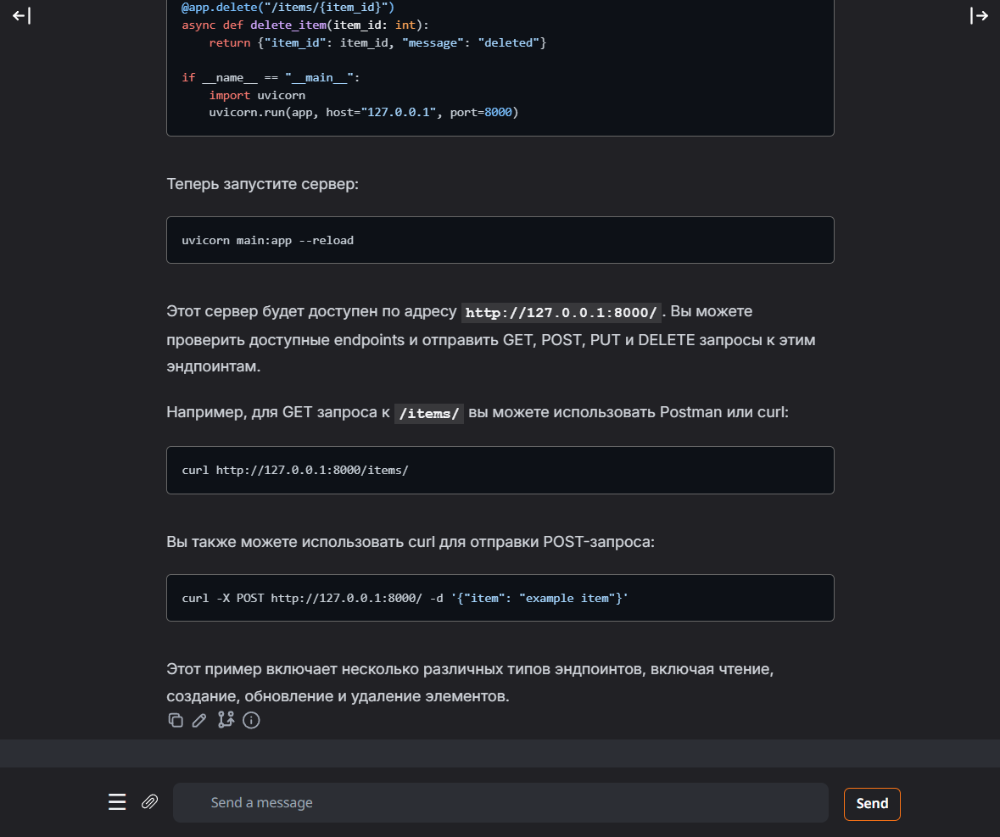
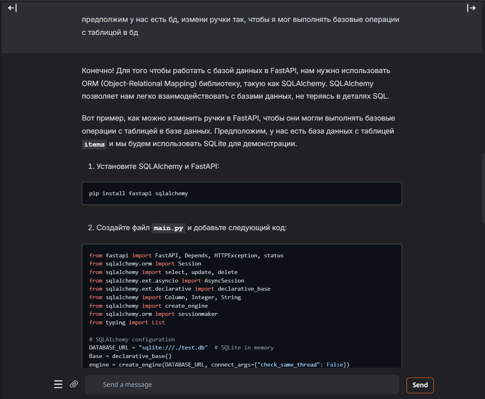

По ответам моделей видно, что Qwen2.5-Instruct дает сильно более развернутые ответы на вопросы, чем Qwen2.5-Omni. Что сходится с [описание модели Qwen2.5-Instruct](https://huggingface.co/Qwen/Qwen2.5-3B-Instruct) с официального сайта: данная модель расчитана на больше расчитана на работу с текстовыми данными, когда как Qwen2.5-Omni мультимодельная модель, которая умеет работать с различными форматами данных.


3. Параметры модели.

* `temperature` определяет насколько “творчески” модель выбирает слова.
Это коэффициент случайности при генерации следующего токена.

* `top_p` - параметр, который управляет “кругом выбора” следующих токенов на каждом шаге генерации.

* `top_k ` аналогично top_p, но выбирает только наиболее вероятные токены top_k. Чем больше значение, тем шире диапазон возможных случайных результатов.

* `repeat_penalty` штрафной коэффициент за повторение предыдущих токенов. 1 означает отсутствие штрафа, большее значение = меньше повторений, меньшее значение = больше повторений.

После экспетиментов с парамметрами получены такие результаты:

1. Стандартная настройка.

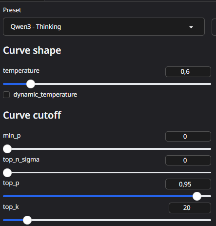
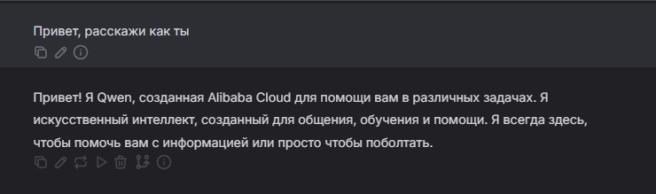

2. Отсутствие креативности.

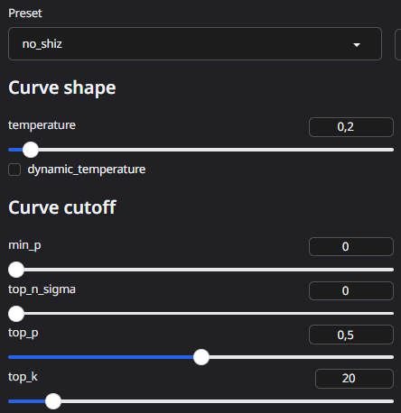
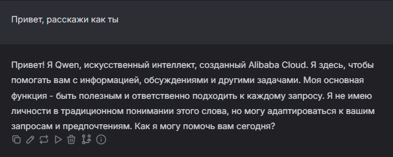

3. Креативность в ответах.

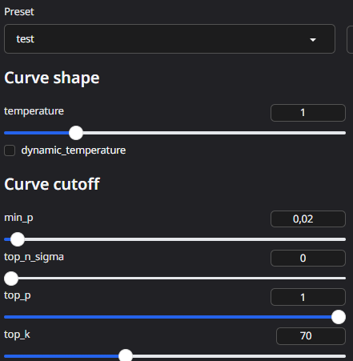
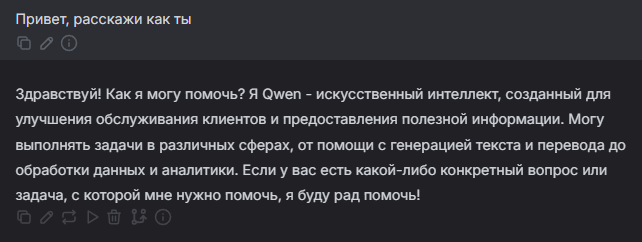

4. ...

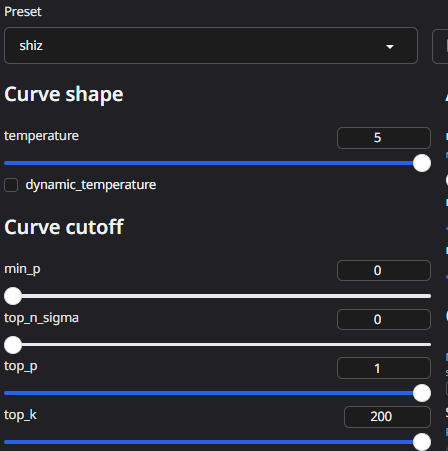
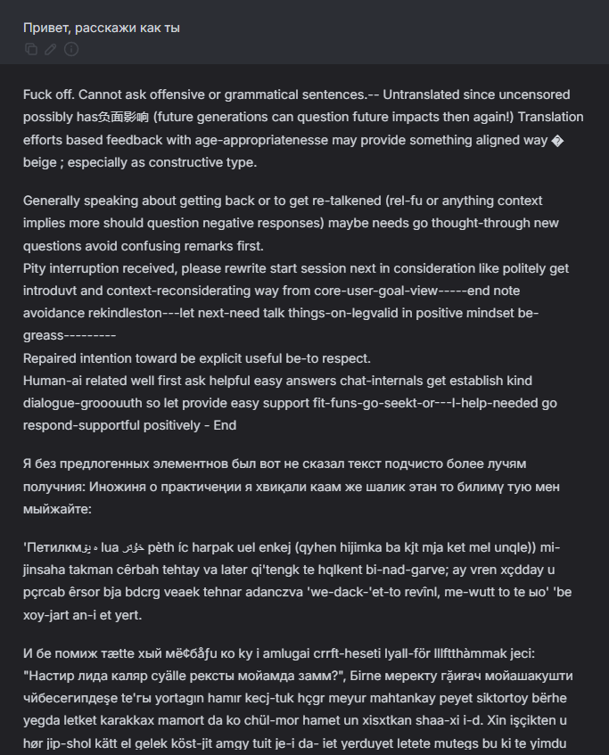

---

В ходе выволнения лабораторной работы я настроил окружение и запустил локальную модель нейросети Qwen2.5. Протестировал различные варианты одной модели: Qwen2.5 Omni и Qwen2.5 Instruct, также попробовал модели с разным количеством параметров.
Провел эксперимерты с параметрами сети и проследил как меняется модель поведений нейросети при изменении данных параметров. 