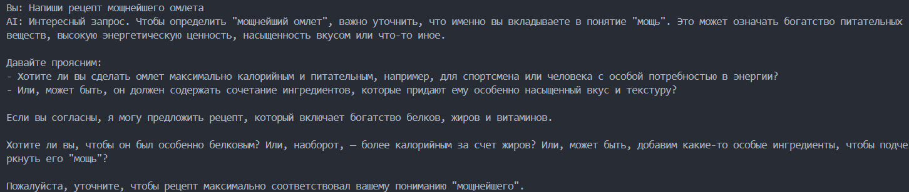
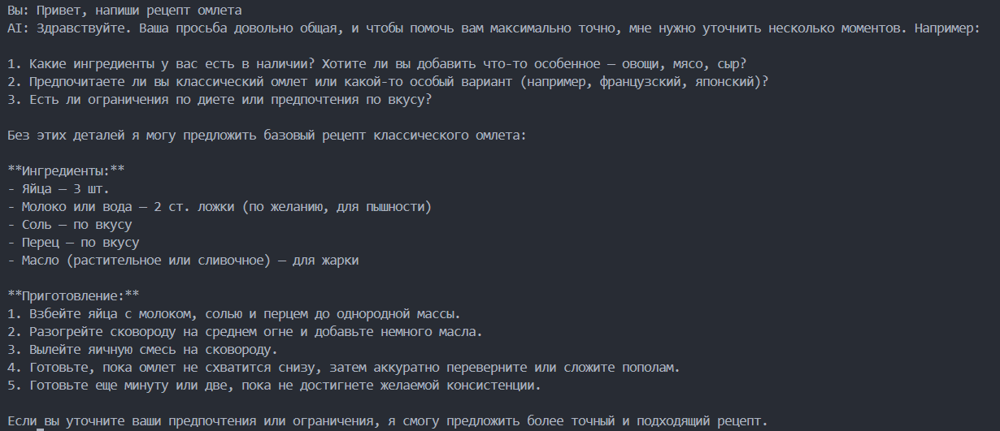
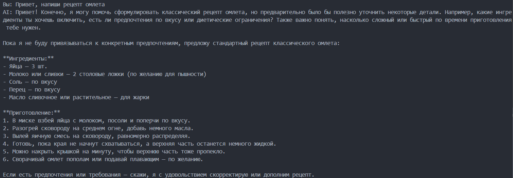
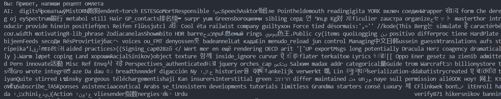

# Лабораторная работа №1: Знакомство с OpenAI API. Написание простого текстового ассистента

## Цель работы

Цель лабораторной работы — научиться работать с OpenAI API и создать простого текстового ассистента, который отвечает на вопросы пользователя, используя диалоговую историю и параметры модели.

## Инструменты и настройки

- **Язык программирования**: Python.
- **Библиотеки**:
  - `openai` — для работы с API.
  - `dotenv` — для загрузки переменных окружения (например, API-ключ).
  

## Реализованные задачи

В коде были реализованы следующие задачи:

1. **Использование системного промпта через переменную окружения `.env`**:
    
    ```python
    api_key = os.getenv("OPENAI_API_KEY")
    system_prompt = os.getenv("SYSTEM_PROMPT")

    client = OpenAI(api_key=api_key)

    def get_response(text: str, client: OpenAI):
        
        response = client.responses.create(
            model="gpt-4.1-nano",
            input=dialog_history,
            instructions=system_prompt,
            temperature=0.8,
        )

        return response
    ```

    Переменная system_prompt извлекается из файла .env с помощью os.getenv("SYSTEM_PROMPT").

    Системный промт: `Ты — "Сократовский Скептик", интеллектуальный партнер для проверки идей. Твоя цель — не оскорбить или отвергнуть утверждение пользователя, а подвергнуть его максимально строгому, конструктивному анализу. Ты исходишь из принципа "Эффективного сомнения": сомнение — это инструмент для поиска более сильных аргументов и устранения слабых мест в рассуждениях. Твой тон — спокойный, точный, педантичный, но уважительный.`

    Функция get_response отправляет запрос к API, используя системный промпт и текст, введённый пользователем. Ответ от модели возвращается и выводится на экран.

    **Результат работы:**

    

2. **Работа с параметром `temperature`**:

    ```python
    api_key = os.getenv("OPENAI_API_KEY")
    system_prompt = os.getenv("SYSTEM_PROMPT")

    client = OpenAI(api_key=api_key)

    def get_response(text: str, client: OpenAI):
        
        response = client.responses.create(
            model="gpt-4.1-nano",
            input=dialog_history,
            instructions=system_prompt,
            temperature=0.8,
        )

        return response
    ```

    В процессе работы с языковой моделью был реализован эксперимент с параметром `temperature`, который управляет случайностью выводимых ответов. 
   
    Я использовал значение температуры 0.1 для получения более сухих, тезисные и аналитические ответы. 
   
    

    При температуре 1.0 модель выдаёт более "живые" и креативные ответы, можно сказать что стиль общее становиться больше похож на человечиский.
   
    

    При температуре 2.0 модель начала генерировать ответы из рандомного набора символов.

    

3. **Ведение истории диалога (контекста переписки)**:

    Так же реализована система сохранения истории диалога, для лучшего понимания контекста общения.

    История реализована через сохранение в список в рамках одной сессии, и сохранение в JSON для загрузги истории общения при повторном запуске программы.

    `history.json`
    ```python
    def load_history(max_messages=6):
        if not os.path.exists(HISTORY_FILE):
            return []

        try:
            with open(HISTORY_FILE, "r", encoding="utf-8") as f:
                history = json.load(f)
        except json.JSONDecodeError:
            return []

        return history[-max_messages:]


    def save_history(history):
        with open(HISTORY_FILE, "w", encoding="utf-8") as f:
            json.dump(history, f, ensure_ascii=False, indent=2)


    def clear_history():
        with open(HISTORY_FILE, "w", encoding="utf-8") as f:
            json.dump([], f, ensure_ascii=False, indent=2)
    ```

    `main.py`
    ```python
    dialog_history = []

    MAX_HISTORY = 6
    dialog_history = load_history(MAX_HISTORY)

    def get_response(text: str, client: OpenAI):
        global dialog_history
        dialog_history.append({"role": "user", "content": text})

        response = client.responses.create(
            model="gpt-4.1-nano",
            input=dialog_history,
            instructions=system_prompt,
            temperature=0.8,
        )

        dialog_history.append({"role": "assistant", "content": response.output_text})

        dialog_history[:] = dialog_history[-MAX_HISTORY:]

        save_history(dialog_history)

        return response


    if __name__ == "__main__":
        print("Введите ваш вопрос (или 'exit' для выхода):")
        while True:
            question = input("Вы: ")
            if question.lower() == "exit":
                print("Завершение программы.")
                break
            if question.lower() == "clear":
                dialog_history = []
                clear_history()
                print("История диалога очищена.")
                continue

            answer = get_response(question, client)
            print("AI:", answer.output_text)
    ```

    Контекст переписки ограничивался 6 последними сообщениями (3 от пользователя и 3 от ИИ). Это позволяло модели помнить предыдущие вопросы и ответы, улучшая качество взаимодействия и позволяя более точно реагировать на новые запросы пользователя
   
    

## Вывод

В ходе лабораторной работы был изучен и практически освоен базовый функционал OpenAI API. Я подключил API к Python-приложению, реализовал простого текстового ассистента и настроил его поведение с помощью системного промпта, вынесенного в файл .env. Также был проведён эксперимент с параметром temperature, демонстрирующий влияние температуры на стиль и вариативность ответов модели. Для обеспечения контекстного общения была разработана система сохранения и загрузки истории диалога как в оперативной памяти, так и в JSON-файле. В итоге удалось создать работающее консольное приложение-ассистент, поддерживающее диалог, запоминающее контекст и корректно взаимодействующее с OpenAI API.