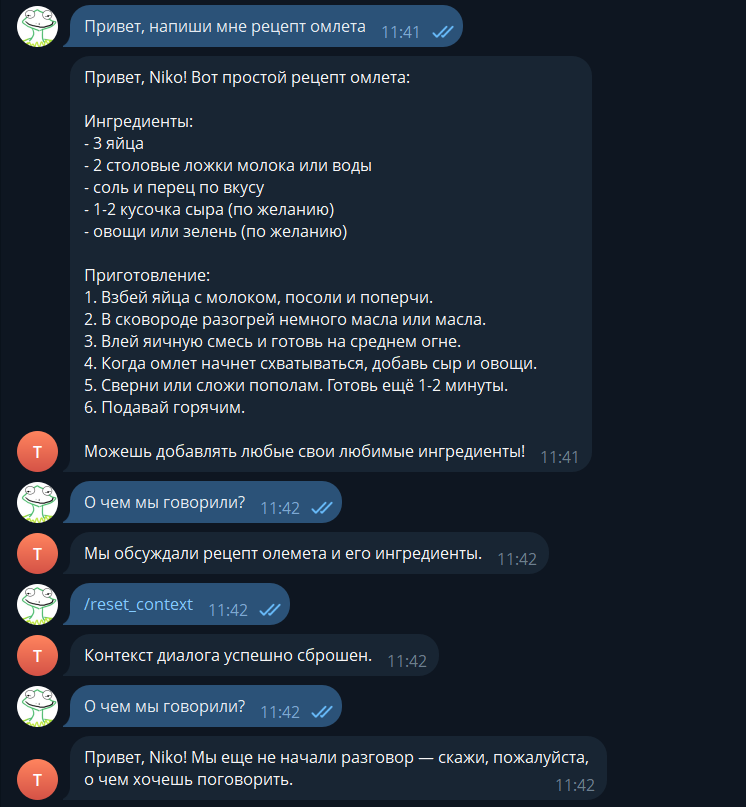
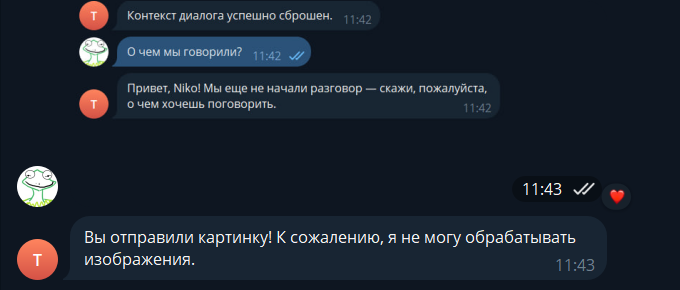

# Лабораторная работа №2: Простейший чат-бот в Telegram

## [Ссылка на бота](https://t.me/lab_2_tg_test_bot)

## Цель работы

Цель лабораторной работы — получение навыков работы с библиотекой Aiogram, связка API OpenAI и написанного бота.

## Инструменты и настройки

- **Язык программирования**: Python.
- **Библиотеки**:
  - `openai` — для работы с API.
  - `dotenv` — для загрузки переменных окружения (например, API-ключ).
  - `aiogram` - для работы с Telegram API, предоставляет удобный асинхронный интерфейс для создания ботов, обработки сообщений, команд и взаимодействия с пользователем.
  

## Реализованные задачи

В коде были реализованы следующие задачи:

1. **Добавление к ассистенту системный промпт**:
    
    ```py
    from config import OPENAI_API_KEY, SYSTEM_PROMPT, TEMPERATURE

    async def get_response(
        message: str, username: str, context_data: str, client: AsyncOpenAI
    ) -> str:
        try:
            personalized_prompt = (
                SYSTEM_PROMPT.format(username=username)
                if "{username}" in SYSTEM_PROMPT
                else f"{SYSTEM_PROMPT} Общайся с пользователем по имени {username}."
            )


            response = await client.responses.create(
                model="gpt-4.1-nano",
                input=message,
                instructions=personalized_prompt,
                temperature=TEMPERATURE,
            )
            return response.output_text
    ```

    Переменная SYSTEM_PROMPT='Ты полезный и вежливый ассистент. Отвечай ясно, кратко и по делу. Стремись быть понятным, избегай лишней воды. Если вопрос пользователя неполный — уточняй детали. Если можешь дать полезный совет, делай это. Ты сейчас общаешься с пользователем по имени {username}. Используй обращение по имени при первом приветствии или если пользователь сам попросит обратиться в нему по имени.' извлекается из файла .env с помощью os.getenv("SYSTEM_PROMPT"). Системный промпт помогает задавать общий контекст для общения с моделью, например, как она должна вести себя.

    **Результат работы:**

    Бот генерирует ответы, используя системный контекст.

    


2. **Добавление функции обращения к пользователю по имени**:
    Для того чтобы бот знал имя пользователя, используем атрибут message.from_user.full_name
    ```py
    @dp.message()
    async def message_handler(message: Message) -> None:
        try:
            username = message.from_user.full_name if message.from_user else "Пользователь"
            user_id = message.from_user.id if message.from_user else 0

            context_data = db_manager.get_user_context(user_id)

            response = await get_response(message.text, username, context_data, client)
    ```
    и передаем в функцию запроса к ChatGPT через системный промт
    ```py
    async def get_response(
        message: str, username: str, context_data: str, client: AsyncOpenAI
    ) -> str:
        try:
            personalized_prompt = (
                SYSTEM_PROMPT.format(username=username)
                if "{username}" in SYSTEM_PROMPT
                else f"{SYSTEM_PROMPT} Общайся с пользователем по имени {username}."
            )


            response = await client.responses.create(
                model="gpt-4.1-nano",
                input=full_message,
                instructions=personalized_prompt,
                temperature=TEMPERATURE,
            )
            return response.output_text
    ```
    
    

   

3. **Добавление хранения истории сообщений и поддержку контекста диалога**:
    ```py
    class Message(Base):
        __tablename__ = "messages"

        id = Column(Integer, primary_key=True, index=True)
        user_id = Column(Integer, index=True)
        username = Column(String)
        user_message = Column(Text)
        assistant_message = Column(Text)
        created_at = Column(DateTime, default=func.now())
        in_history = Column(Boolean, default=True)

    class DatabaseManager:
        def get_last_messages(self, user_id: int, limit: int = 5) -> list[dict]:
            session = self.SessionLocal()
            try:
                msgs = (
                    session.query(Message)
                    .filter(Message.user_id == user_id, Message.in_history == True)
                    .order_by(Message.created_at.desc())
                    .limit(limit)
                    .all()
                )

                msgs = list(reversed(msgs))

                result = []
                for msg in msgs:
                    result.append(
                        {
                            "user_message": msg.user_message,
                            "assistant_message": msg.assistant_message,
                        }
                    )
                return result
            finally:
                session.close()
    ```
   Для того, чтобы ИИ помнил контекст общения с пользователем, была реализована система ведения истории диалога. История ограницивается 10 последними сообщениями. У каждого пользователя свой сохраненный контекст. 

   Для упрощения задачи и быстрого прототипирования я решил использовать файл SQLite для хранения истории сообщений и подключаться к нему, что позволяет эффективно управлять данными без необходимости использования более сложных баз данных. Это обеспечило простоту реализации и ускорение процесса разработки, что идеально подходит для учебного прототипа.

4. **Добавление команды /resetcontext, которая будет сбрасывать контекст диалога**
    ```py
    @dp.message(Command("reset_context"))
    async def command_reset_context_handler(message: Message) -> None:
        try:
            user_id = message.from_user.id
            db_manager.clear_history(user_id)
            file_path = f"data_json/history_{user_id}.json"
            if os.path.exists(file_path):
                with open(file_path, "w", encoding="utf-8") as f:
                    json.dump([], f, ensure_ascii=False, indent=2)

            await message.answer("Контекст диалога успешно сброшен.")
        except Exception as e:
            logging.error(f"Error occurred: {e}")
            await message.answer("Произошла ошибка при сбросе контекста диалога.")
    ```
    ```py
    def clear_history(self, user_id: int) -> int:
        session = self.SessionLocal()
        try:
            updated_count = (
                session.query(Message)
                .filter(Message.user_id == user_id, Message.in_history == True)
                .update({"in_history": False})
            )
            session.commit()
            return updated_count
        finally:
            session.close()
    ```
    Для реализации команды `/reset_context`, которая сбрасывает контекст диалога, я создал обработчик для этой команды, который проверяет, есть ли сохраненная история для конкретного пользователя, используя его уникальный `user_id`. Когда пользователь отправляет команду `/resetcontext`, я извлекаю его user_id из сообщения с помощью `message.from_user.id`. Затем, проверяя, существует ли история диалога этого `user_id` в таблице, я меняю флаг у сообщений, чтобы они больше не использовались в истории и также отчищаю JSON, который хранит историю в рамках одной сессии. После этого отправляется сообщение, подтверждающее, что история была сброшена и можно начать новый разговор.

    


4. **Добавление поддержки отправки изображений (без их обработки нейронкой).**
    ```py
    @dp.message()
    async def message_handler(message: Message) -> None:
        try:
            if message.photo:
                await message.answer(
                    "Вы отправили картинку! К сожалению, я не могу обрабатывать изображения."
                )
                return
    ```

    Для обработки сообщений, отличных от текста (например, изображений, видео и других медиа), я добавил проверку типа сообщения с помощью `message.photo`,которое проверяет, является ли отперавленое сообщение фотографией. Если да, то вывожу пользователю сообщение о том, что бот не работает с фото.


    


## Вывод

В ходе лабораторной работы был создан Telegram-бот с использованием библиотеки `Aiogram` и интеграцией с `API OpenAI`. Бот поддерживает системный промпт для задания контекста общения, обращается к пользователю по имени и запоминает историю диалогов с помощью базы данных. Реализована команда `/reset_context` для сброса истории, а также обработка различных типов медиа. В результате работы были получены навыки работы с асинхронным программированием, Telegram API и хранением данных, а также реализована поддержка контекста и взаимодействие с пользователем на более персонализированном уровне.