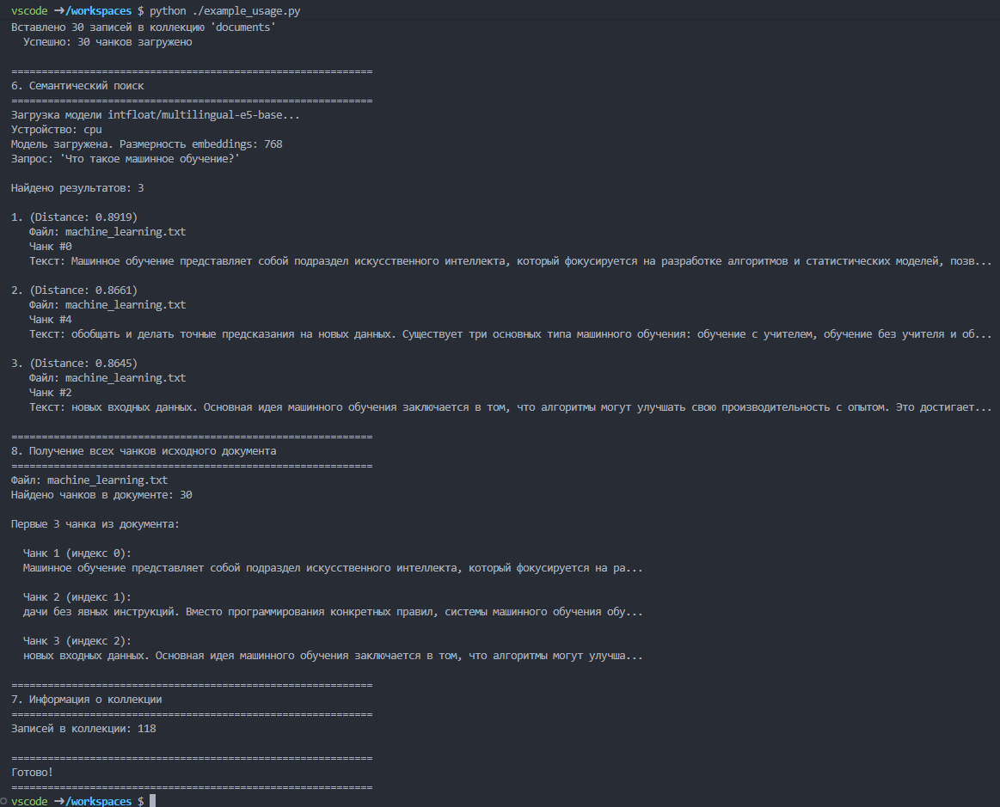
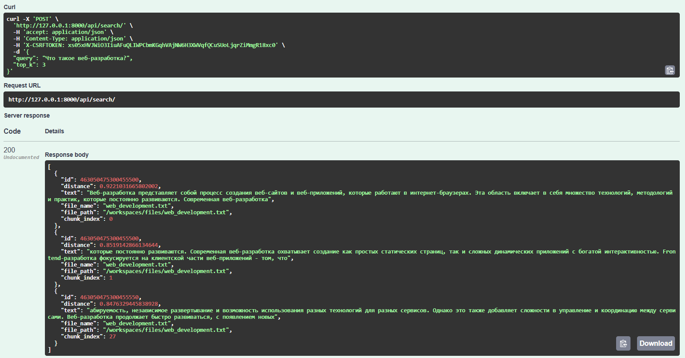
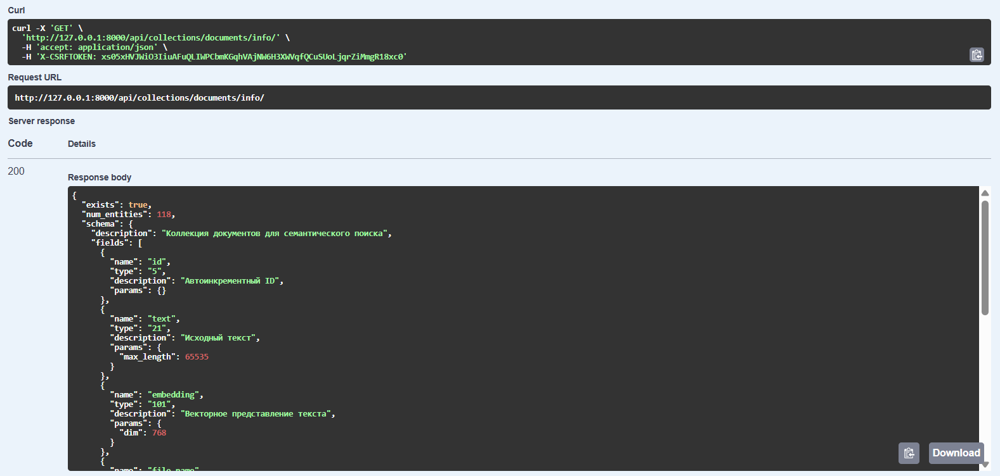
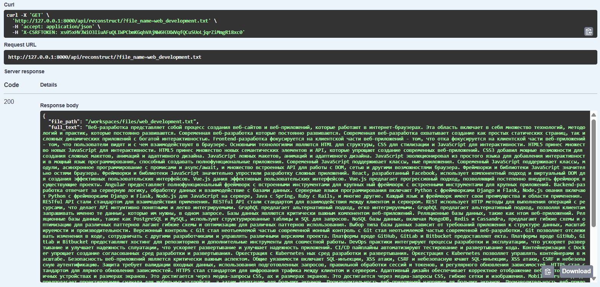

# Лабораторная работа №3. Векторные базы данных и семантический поиск

<ins>Цель</ins>: научиться использовать векторные базы данных и семантический поиск для обработки текстовых данных и потенциальной интеграции с LLM.

## План

1. Настройка окружения;
2. Создание модуля для работы с милвусом;
3. Парсинг текстовых файлов;
4. Реализация API для работы с Milvus;

## 1. Настройка окружения
Для выполнения работы использовалась технология Devcontainer. Это позволило развернуть изолированную среду разработки с помощью Docker, обеспечив идентичность окружения на разных устройствах.

#### Основные компоненты среды:
- Python 3.12;
- Milvus - высокопроизводительная векторная база данных, предназначенная для хранения и поиска по эмбеддингам;
- Attu - графический веб-интерфейс для визуального управления коллекциями Milvus;

Конфигурация девконтейнера настраивалась под работу с CPU, т.к. железа для работы с CUDA - нет.


## 2. Создание векторной базы данных

#### Инициализация и подключение модуля Milvus.
```py
class MilvusClient:
    def __init__(
        self, host: str = "standalone", port: int = 19530, alias: str = "default"
    ):
        self.host = host
        self.port = port
        self.alias = alias
        self._connect()

    def _connect(self):
        try:
            connections.connect(alias=self.alias, host=self.host, port=self.port)
            print(f"Подключение к Milvus установлено ({self.host}:{self.port})")
        except Exception as e:
            print(f"Ошибка подключения к Milvus: {e}")
            raise
```

#### Реализация метода создания колекции.
В данный метод передаются параметры колекции: имя, размерность векторов, описание и тип метрики расстояния.
```py
    def create_collection(self, collection_name: str, dimension: int, description: str = "", metric_type: str = "COSINE") -> Collection:
        fields = [
            FieldSchema(name="id", dtype=DataType.INT64, is_primary=True, auto_id=True, description="Автоинкрементный ID"),
            ...
            ...
        ]
        schema = CollectionSchema(fields=fields, description=description)
        collection = Collection(name=collection_name, schema=schema, using=self.alias)
        
        index_params = {
            "metric_type": metric_type,
            "index_type": "IVF_FLAT",
            "params": {"nlist": 128}
        }
        collection.create_index(field_name="embedding", index_params=index_params)
        return collection
```

#### Реализация метода вставки данных.
Метод формирует список сущностей (entities) из текстов, векторов и метаданных, после чего выполняет их загрузку в коллекцию.
```py
    def insert_data(self, collection_name, texts, embeddings, file_names, file_paths, chunk_indices):
        collection = Collection(collection_name)
        collection.load()

        entities = [
            texts,
            embeddings,
            file_names or [""] * len(texts),
            file_paths or [""] * len(texts),
            chunk_indices or list(range(len(texts)))
        ]

        insert_result = collection.insert(entities)
        collection.flush()
        
        return insert_result.primary_keys
```
Данный метод принимает:
- collection_name - имя коллекции;
- texts - список исходных фрагментов текста;
- embeddings - список векторов. Embeddings — это числовые представлени(вектора)я смысла текста, полученные с помощью нейросети, которые позволяют базе данных сравнивать фрагменты математически;
- file_names - список имен файлов;
- file_paths - список путей к файлам;
- chunk_indices - список индексов чанков. Chank - небольшой фрагмент или «отрывок» исходного текстового документа, выделенный для того, чтобы модель могла эффективно обработать его и создать точный векторный образ.

В данном методе происходит следующее:
- Проверка готовности коллекции к работе;
- Формирование структуры данных, соответствующей схеме коллекции;
- Непосредственно вставка (insert) и фиксация изменений (flush) для немедленной доступности данных для поиска.

#### Реализация метода семантического поиска.
Метод выполняет поиск наиболее релевантных векторов в базе на основе входящего запроса.
```py
    def search(self, collection_name, query_vectors, top_k=5, expr=None):
        collection = Collection(collection_name)
        collection.load()
        
        # Параметры поиска
        search_params = {
            "metric_type": "COSINE",
            "params": {"nprobe": 10}
        }
        
        # Выполнение поиска по векторному полю
        results = collection.search(
            data=query_vectors,
            anns_field="embedding",
            param=search_params,
            limit=top_k,
            expr=expr,
            output_fields=["text", "file_name", "file_path", "chunk_index"]
        )
        
        # Форматирование вывода в список словарей
        formatted_results = []
        for result in results:
            hits = []
            for hit in result:
                hits.append({
                    "id": hit.id,
                    "distance": hit.distance,
                    "text": hit.entity.get("text", ""),
                    "file_name": hit.entity.get("file_name", ""),
                    "chunk_index": hit.entity.get("chunk_index", -1)
                })
            formatted_results.append(hits)
        
        return formatted_results
```
Данный метод принимает:
- query_vectors - векторное представление поискового запроса пользователя;
- top_k - количество результатов поиска;
- expr - выражение для предварительной фильтрации данных (например, поиск только в конкретном файле).

В данном методе происходит следующее:
- Загрузка коллекции;
- Формирование параметров поиска;
- Выполнение поиска по векторному полю;
- Форматирование результатов в список словарей.

В данном методе мы загружаем коллекцию, определяем параметры поиска и преобразуем технический ответ Milvus в удобный для API формат. Поиск осуществляется по метрике cosine similarity.

## 3. Парсинг текстовых файлов

Для наполнения базы данными необходимо преобразовать исходные документы в формат, пригодный для векторизации. Был реализован класс TextParser, выполняющий разбиение файлов на фрагменты.
```py
class TextParser:    
    def __init__(self, chunk_size: int = 256, chunk_overlap: int = 64):
        self.chunk_size = chunk_size
        self.chunk_overlap = chunk_overlap
        self.step_size = chunk_size - chunk_overlap
```
#### Ключевые понятия и параметры:
- Chunk - кусок текста фиксированной длины, используемый как единица поиска;
- Chunk Overlap - область перекрытия между соседними чанками. Необходима для того, чтобы контекст на границах разреза не терялся и смысловая связь сохранялась;
- Step Size - фактическое смещение окна парсинга при генерации следующего фрагмента.

Такой подход позволяет избежать ситуации, когда важное предложение разрывается пополам, теряя свой изначальный смысл для нейросети.

#### Чтение и нормализация данных:
Перед разбиением на чанки текст необходимо извлечь из файла и привести к чистому виду.
```py
    def read_file(self, file_path: str, encoding: str = "utf-8") -> str:
        with open(file_path, "r", encoding=encoding) as f:
            content = f.read()
        return content
    
    def normalize_text(self, text: str) -> str:
        text = re.sub(r'\s+', ' ', text)
        return text.strip()
```
- Нормализация - очистка текста от "шума" (лишние пробелы, символы табуляции и переноса строк).

#### Метод разбиения на фрагменты:
Алгоритм проходит по тексту с заданным шагом, стараясь обрывать чанки на границах слов или предложений для сохранения семантической целостности.
```py
    def chunk_text(self, text: str) -> List[str]:
        text = self.normalize_text(text)
        if len(text) <= self.chunk_size:
            return [text]
        
        chunks = []
        start = 0
        while start < len(text):
            end = start + self.chunk_size
            if end < len(text):
                chunk_slice = text[start:end]
                break_point = max(chunk_slice.rfind(' '), chunk_slice.rfind('.'))
                
                if break_point > self.chunk_size * 0.7:
                    end = start + break_point + 1
            
            chunk = text[start:end].strip()
            if chunk:
                chunks.append(chunk)
            
            start += self.step_size
        return chunks
```
Процесс чанкирования — разбиение текста на куски. Использование step_size (разница между размером чанка и перекрытием) обеспечивает плавный переход между фрагментами, сохраняя контекст для векторной модели.

#### Полный парсинг документа:
```py
    def parse_file(self, file_path: str, encoding: str = "utf-8") -> List[str]:
        text = self.read_file(file_path, encoding)
        return self.chunk_text(text)
```
Данный метод является точкой входа для обработки конкретного текстового документа, возвращая готовый список чанков для последующей векторизации и загрузки в Milvus.

#### Обработка множества документов:
Для массовой обработки файлов и их загрузки в векторную БД был создан класс DocumentProcessor.
```py
class DocumentProcessor:
    def __init__(self, milvus_client, chunk_size=256, chunk_overlap=64, embedding_function=None):
        self.milvus_client = milvus_client
        self.parser = TextParser(chunk_size=chunk_size, chunk_overlap=chunk_overlap)
        self.embedding_function = embedding_function
```
Класс берет текстовые файлы, прогоняет их через парсер, отправляет полученные чанки на векторизацию и, наконец, сохраняет результат в Milvus.

#### Работа с эмбеддингами:
Для преобразования текста в векторы в данной работе используется многоязычная модель multilingual-e5-base.
```python
class Embedder:
    def __init__(
        self,
        model_name: str = "intfloat/multilingual-e5-base",
        device: str = None,
        batch_size: int = 32
    ):
```
- batch_size - количество текстов, обрабатываемых нейросетью одновременно. Позволяет значительно ускорить векторизацию при больших объемах данных;

Архитектура E5 требует префиксов:
- "passage: " - для документов;
- "query: "- для запросов.

Метода генерации векторов документов:
```py
    def encode(self, texts: List[str], normalize: bool = True, show_progress: bool = True) -> List[List[float]]:
        prefixed_texts = [f"passage: {text}" for text in texts]
        
        embeddings = self.model.encode(
            prefixed_texts,
            batch_size=self.batch_size,
            normalize_embeddings=normalize,
            show_progress_bar=show_progress,
            convert_to_numpy=True
        )
        return embeddings.tolist()
```
Метод используется для генерации embeddings документов. Он принимает список текстов, добавляет к каждому префикс "passage: ", а затем генерирует векторы.

Метода генерации векторов документов:
```py
def encode_query(self, query: str) -> List[float]:
    prefixed_query = f"query: {query}"
    embedding = self.model.encode(
        prefixed_query,
        normalize_embeddings=True,
        convert_to_numpy=True
    )
    return embedding.tolist()
```
Используется префикс "query: ". Отдельный метод необходим для оптимизации векторов под задачу поиска в общем векторном пространстве.

# 4. Запуск программы
Полсе реализации необходимых классов и методов, программа была запущена.




- Программа успешно обработала 4 файла с текстом, разбила их по 26-32 чанка, перевела их в вектора и сохранила в базу данных Milvus.
- Далее система по запросу 'Что такое машинное обучение?' система вернула наиболее релевантные фрагменты.
- Distance - показывает уровень совпадения смысла запроса и найденного текста.

# 5. Реализация API для работы с Milvus
Создал Django проект, реализованый классы и методы я добавил как Сервисный слой в проект.

Изначально создан файл api/services.py
```py
milvus_client = MilvusClient(
    host=MILVUS_HOST,
    port=MILVUS_PORT,
)

embedder = Embedder(
    model_name="intfloat/multilingual-e5-base",
    batch_size=32,
)

def semantic_search(query: str, top_k: int = 5):
    query_embedding = embedder.encode_query(query)

    results = milvus_client.search(
        collection_name=COLLECTION_NAME,
        query_vectors=[query_embedding],
        top_k=top_k,
    )

    return results[0]
```
В данном модуле венысены создания объектов milvus_client и embedder, что позволяет избежать повторного создания объектов при каждом запросе.

Далее были реализованы сериализаторы для валидации данных, поступающих от пользователя.
```py
class SearchRequestSerializer(serializers.Serializer):
    query = serializers.CharField(
        required=True, help_text="Текст запроса для семантического поиска"
    )
    top_k = serializers.IntegerField(
        required=False,
        default=3,
        min_value=1,
        help_text="Количество результатов (по умолчанию 3)",
    )

class DocumentReconstructRequestSerializer(serializers.Serializer):
    file_name = serializers.CharField(
        required=True, 
        help_text="Полный путь к файлу-источнику для восстановления его текста"
    )
    collection_name = serializers.CharField(
        required=False,
        help_text="Имя коллекции (если не указано, используется значение по умолчанию)",
    )
```

#### Реализация представлений:
Было реализовано 3 базовый предствления для работы с Milvus:

- SearchAPIView: Принимает POST-запрос, валидирует его через сериализатор и вызывает сервис семантического поиска.
```py
class SearchAPIView(APIView):
    @swagger_auto_schema(request_body=SearchRequestSerializer)
    def post(self, request):
        serializer = SearchRequestSerializer(data=request.data)
        serializer.is_valid(raise_exception=True)

        query = serializer.validated_data["query"]
        top_k = serializer.validated_data.get("top_k", 3)

        results = semantic_search(query=query, top_k=top_k)

        return Response(results, status=status.HTTP_200_OK)
```



- CollectionInfoAPIView: Позволяет проверить состояние коллекции в Milvus и узнать информацию о ней.
```py
class CollectionInfoAPIView(APIView):
    def get(self, request, name):
        info = milvus_client.get_collection_info(name)
        
        if not info.get("exists"):
            return Response(
                {"error": f"Collection '{name}' not found"}, 
                status=status.HTTP_404_NOT_FOUND
            )
        
        if "error" in info:
            return Response(
                {"error": info["error"]}, 
                status=status.HTTP_500_INTERNAL_SERVER_ERROR
            )

        formatted_info = {
            "exists": info["exists"],
            "num_entities": info["num_entities"],
            "schema": {
                "description": info["schema"].description,
                "fields": [
                    {
                        "name": f.name,
                        "type": str(f.dtype),
                        "description": f.description,
                        "params": f.params
                    } for f in info["schema"].fields
                ]
            },
            "indexes": [
                {
                    "field_name": idx.field_name,
                    "index_name": idx.index_name,
                    "params": idx.params
                } for idx in info["indexes"]
            ]
        }
        
        return Response(formatted_info, status=status.HTTP_200_OK)
```



- DocumentReconstructAPIView: Демонстрирует возможность обратной сборки чанков в единый текст.
```py
class DocumentReconstructAPIView(APIView):
    @swagger_auto_schema(query_serializer=DocumentReconstructRequestSerializer)
    def get(self, request):
        serializer = DocumentReconstructRequestSerializer(data=request.query_params)
        
        if not serializer.is_valid():
            return Response(serializer.errors, status=status.HTTP_400_BAD_REQUEST)
        
        file_path = '/workspaces/files/' + serializer.validated_data['file_name']
        collection = serializer.validated_data.get('collection_name') or COLLECTION_NAME

        try:
            full_text = milvus_client.reconstruct_document(
                collection_name=collection, 
                file_path=file_path
            )

            if not full_text:
                return Response(
                    {"error": "Документ не найден"}, 
                    status=status.HTTP_404_NOT_FOUND
                )

            return Response({
                "file_path": file_path,
                "full_text": full_text
            }, status=status.HTTP_200_OK)

        except Exception as e:
            return Response(
                {"error": str(e)}, 
                status=status.HTTP_500_INTERNAL_SERVER_ERROR
            )
```


# 6. Вывод
В ходе выполнения лабораторной работы я освоил принципы работы с векторными базами данных и технологию семантического поиска.
- Поработал с Devcontainer для настройки окружения.
- Реализован механизм парсинга и чанкирования текстовых документов для сохранения контекста при поиске.
- Настроил интеграция с моделью multilingual-e5-base, которая преобразует текст в математические векторы.
- Разработан клиент для автоматического создания коллекций, индексации векторов и выполнения семантического поиска.
- Реализован просто API для работы с векторной бд с помощью Django.