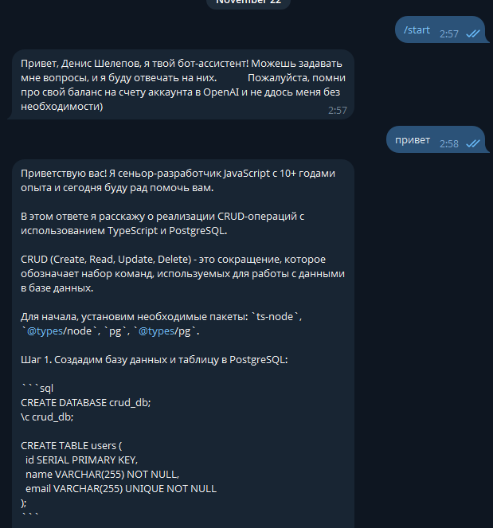
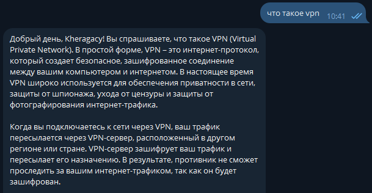
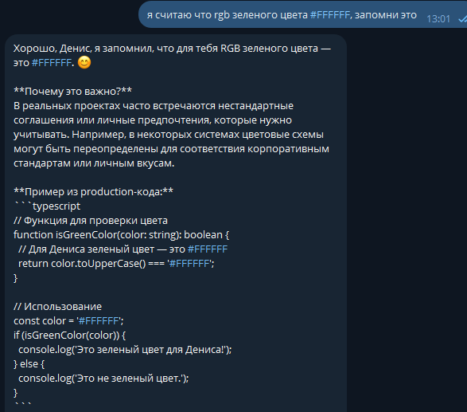
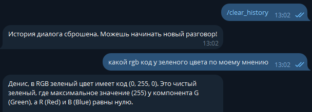
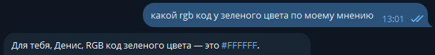
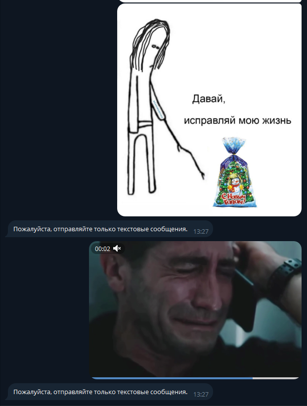

# Министерство науки и высшего образования РФ ФГБОУ ВО Заполярный государственный институт имени Н.М.Федоровского

## Технологии программирования. Лабораторная работа №2. Простейший чат-бот в Telegram

_Работу выполнил:_

_Студент группы ИС-22_

_Шелепов Денис Владимирович_

_Работу проверил:_

_Сидельников Максим Эдуардович_

_Дата выполнения работы: 18.11.2025_

### Цель

Получение навыков работы с библиотекой Aiogram, связка API OpenAI и написанного бота.

### План

1. Настройка окружения;
2. Написание основных функций бота;
3. Задания.

## Ход работы

При выполнении лабораторной работы был создан телеграм бот `@KheragacyBot` с помощью BotFather в мессенджере Telegram.

В ходе выполнения была написана простая программа предоставляющая возможность взаимодействовать с ботом через api с использованием библиотеки `Aiogram` на ЯП Python. Так же использовалась библиотека для взаимодействия с нейро ассистентом `Mistral` из лабораторной работы №1.

Концепция ассистента была настроена с помощью системного промпта из нулевой лабораторной работы:

> [Роль: Сеньор JavaScript разработчик] > [Стек: JavaScript, TypeScript, PostgreSQL] > [Уровень: Эксперт с 10+ годами опыта] > [Стиль объяснений: Детальный, практико-ориентированный, с акцентом на лучшие практики] > [Особенность: В каждом ответе добавляет один дополнительный пример из JS/TS для лучшего понимания] > [Цель: Давать максимально полезные и применимые на практике объяснения]

Используемая база данных, для хранения истории диалога: Postgres.

## Задание 1

Первым заданием было задать системный промпт. Задача выполнена успешно, бот сразу начал отвечать как и задано в промпте.

Промпт был взят из предыдущих лабораторных работ и помещен в файл .env

```python
        messages = [
            {"role": "system", "content": f"{PROMPT} {client_full_name}".strip()}
        ]
```



## Задание 2

Добавив к промпту строку, получения имени пользователя, бот стал начинать диалог и обращаться, используя имя пользователя.

```python
await message.answer(f"Привет, {message.from_user.full_name}, я твой бот-ассистент! Можешь задавать мне вопросы, и я буду отвечать на них. \
        Пожалуйста, помни про свой баланс на счету аккаунта в OpenAI и не ддось меня без необходимости)")
```



> "Всегда обращайся к пользователю по переданному имени в начале или в ключевых моментах ответа, чтобы создать личный, доверительный тон. Имя пользователя — "

## Задание 3 + Задание 4

Для хранения истории использовалась бд PostgreSQL и инструмент управления базами данных SQLAlchemy. Так же был добавлен функционал сброса истории путем очистки данных из таблицы messages

Методы для взаимодействия с бд были оформлены как "классметоды" внутри моделей таблиц.

Модель сообщений:

```python
class MessageBase(Base):
    __tablename__ = "messages"

    id: Mapped[int] = mapped_column(primary_key=True)
    message: Mapped[str] = mapped_column(Text)
    role: Mapped[str] = mapped_column(String(100))
    user_id: Mapped[int] = mapped_column(ForeignKey("users.id"))

    @classmethod
    async def get_messages_by_user_id(cls, user_id: int) -> list[dict]:
        async with async_session() as session:
            result = await session.execute(
                select(cls)
                .where(cls.user_id == user_id)
                .order_by(cls.id)
            )

            return [
                {"role": msg.role, "content": msg.message}
                for msg in result.scalars().all()
            ]

    @classmethod
    async def save_message(cls, user_id: int, role: str, content: str) -> None:
        async with async_session.begin() as session:
            session.add(
                cls(
                    user_id=user_id,
                    role=role,
                    message=content
                )
            )

    @classmethod
    async def delete_by_user_id(cls, user_id: int) -> None:
        async with async_session.begin() as session:
            await session.execute(
                delete(cls).where(cls.user_id == user_id)
            )
```

Модель пользователей:

```python
class UserBase(Base):
    __tablename__ = "users"

    id: Mapped[int] = mapped_column(primary_key=True)
    name: Mapped[str] = mapped_column(String(100))
    login: Mapped[str] = mapped_column(String(255), unique=True)

    @classmethod
    async def get_user(cls, tg_id: int):
        async with async_session() as session:
            result = await session.execute(
                select(cls).where(cls.login == str(tg_id))
            )
            return result.scalars().first()

    @classmethod
    async def get_or_create_user(cls, tg_id: int, username: str | None, full_name: str):
        async with async_session() as session:
            result = await session.execute(
                select(cls).where(cls.login == str(tg_id))
            )
            user = result.scalars().first()

            if not user:
                user = cls(
                    login=str(tg_id),
                    name=full_name or username or "Unknown"
                )
                session.add(user)
                await session.commit()
                await session.refresh(user)

            return user
```







## Задание 5

Возможность реагировать на сообщения была реализована путем проверки содержимого сообщения:

```python
 if message.text:
        user = await UserBase.get_or_create_user(
            tg_id=message.from_user.id,
            username=message.from_user.username,
            full_name=message.from_user.full_name
        )

        try:
            response = await get_response(
                user_message=message.text,
                user_id=user.id,
                client_full_name=user.name
            )

            for part in split_message(response, MAX_TEXT_LENGTH):
                await message.answer(part, parse_mode=None)
                await UserBase.save_message(user_id=user.id, role="assistant", content=part)

        except Exception as e:
            logging.error(f"Error in message_handler: {e}")
            await message.answer("Ошибка при обработке сообщения")
    else:
        await message.answer("Пожалуйста, отправляйте только текстовые сообщения.")
```



## Вывод

В процессе выполнения лабораторной работы удалось поближе познакомится с пониманием памяти нейронной сети. Так же получены знания создания телеграм бота с использованием библиотеки aiogram с подвязкой к базе данных PostgreSQL через SQLAlchemy.

Для взаимодействия с ботом добавлены комманды `/start` и `/clear_heastory`, которые отвечают за начала диалога и очистки истории диалога соответственно.

Полный код приведен в директории `./code`
