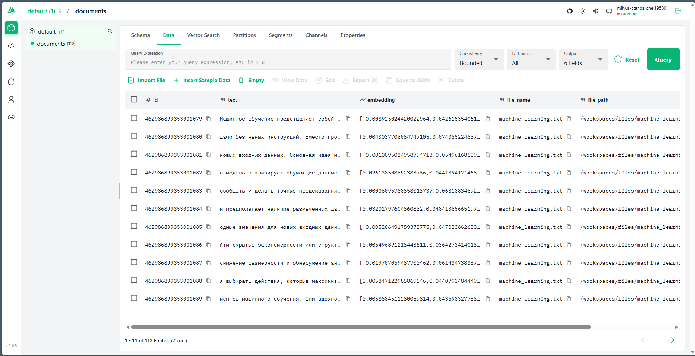
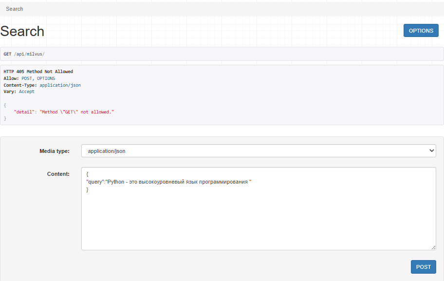
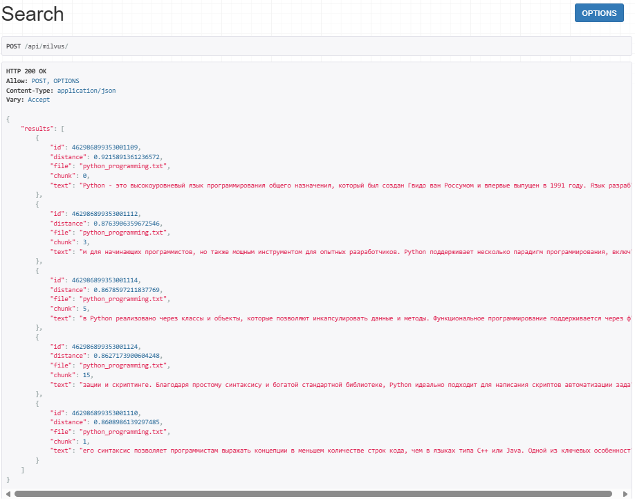

# Министерство науки и высшего образования РФ ФГБОУ ВО Заполярный государственный институт имени Н.М.Федоровского

## Технологии программирования. Лабораторная работа №3. Векторные базы данных и семантический поиск

_Работу выполнил:_

_Студент группы ИС-22_

_Шелепов Денис Владимирович_

_Работу проверил:_

_Сидельников Максим Эдуардович_

_Дата выполнения работы: 20.12.2025_

### Цель

Научиться использовать векторные базы данных и семантический поиск для обработки текстовых данных и потенциальной интеграции с LLM.

### План

1. Настройка окружения;
2. Создание модуля для работы с милвусом;
3. Парсинг текстовых файлов;
4. Задания.

## Ход работы

### Подготовка

В процессе выполнения лабораторной работы была изучена векторая база данных для хранения текстовой информации и использована UI, подключеная к этой базе.

Первым этам выполнения был запуск окружения в формате dev container. Используя предоставленные конфигурационные файлы и средства VS Code данный процесс был пройден быстро.

После запуска окружения, для дальнейшего выполнения заданий, необходимо было заполнить базу данных информацией о содержимом в так же предоставленных файлах. Это было произведено при помощи запуска скрипта example_usage.py, который автоматически считывает текстовые файлы, предобразует информацию в векторное представление, разделяет на чанки и записывает в базу.



### Задание 1

После подготовки рабочей площади была произведена модификация docker-compose файла для использования мощностей gpu при помощи cuda зависимостей. Данная настройка была произведена путем раскоментирования в исходном docker-compose файле, флага `gpus: all`. Данный флаг позволяет приложению использовать мощности видеокарты для генерации embeddings.


```yaml
app:
  build:
    context: ..
    dockerfile: .devcontainer/Dockerfile
  container_name: milvus-lab-app
  working_dir: /workspaces
  volumes:
    - ../:/workspaces
  command: sleep infinity
  gpus: all
  depends_on:
    - standalone
  networks:
    - internal-network
```

### Задание 2

В рамках второго задания достаточно было написать api с единственным контроллером, для получения чанков, названия файла и текстовое содержание файла, в котором содержится запрашиваемя часть текста.

<ins>**_*Пример запроса:*_**</ins>



<ins>**_*Ответ:*_**</ins>



## Исходный код контроллера

```python
from django.shortcuts import render
from rest_framework.response import Response
from rest_framework.views import APIView
from rest_framework import status
from .embedder import Embedder
from .milvus_client import MilvusClient


class SearchView(APIView):
    def post(self, request):
        query = request.data.get("query", "")
        if not query:
            return Response({"error": "Query parameter is required."}, status=400)

        try:
            embedder = Embedder()
            query_embedding = embedder.encode_query(query)
        except Exception as e:
            return Response({"error": str(e)}, status=500)

        try:
            collection_name = 'documents'
            milvus = MilvusClient(host="standalone", port=19530)
            search_results = milvus.search(
                collection_name=collection_name,
                query_vectors=[query_embedding],
                top_k=5
            )

            formatted_results = []
            # search_results — список списков (по одному на query vector)
            for i, hit in enumerate(search_results[0], 1):
                formatted_results.append({
                    "id": hit["id"],
                    "distance": hit['distance'],
                    "file": hit.get('file_name', 'N/A'),
                    "chunk": hit.get('chunk_index', -1),
                    "text": hit['text'][:150]
                })

            return Response({"results": formatted_results}, status=status.HTTP_200_OK)

        except Exception as e:
            return Response({"error": str(e)}, status=status.HTTP_500_INTERNAL_SERVER_ERROR)
```

## Вывод

В процессе выполнения лабораторной работы удалось ознакомится с взаимодействем с векторной базой данных milvus. Так же был получен практический опыт настройки docker-контейнера на использованите мощностей видеокарты, путем конфигурации docker-compose файла.
