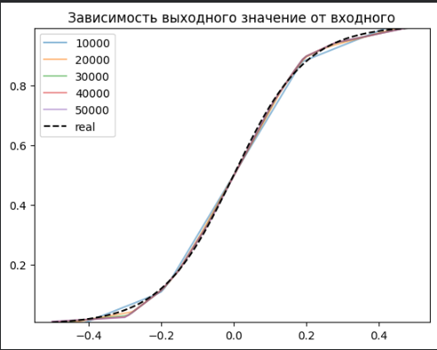
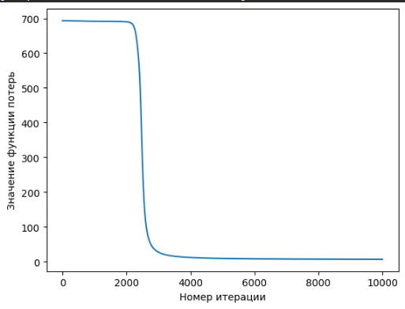
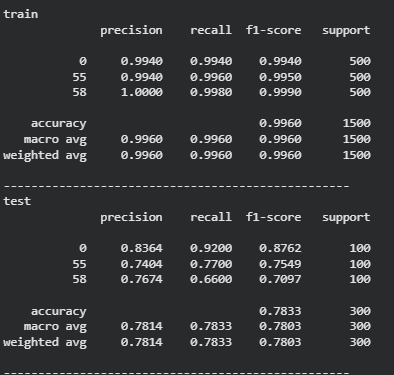

# Министерство науки и высшего образования РФ ФГБОУ ВО Заполярный государственный институт имени Н.М.Федоровского

## Технологии программирования. Лабораторная работа №1(4)

_Работу выполнил:_

_Студент группы ИС-22_

_Шелепов Денис Владимирович_

_Работу проверил:_

_Сидельников Максим Эдуардович_

_Дата выполнения работы: 18.11.2025_

## Задание

1. Регрессия по теореме универсальной аппроксимации, ручное дифференцирование
2. Бинарная классификация с помощью автодиффиренцирования PyTorch
3. Обучить полносвязную нейронную сеть классификации 3 классов изображений из набора данных CIFAR100 по варианту из примера и затем повысить точность на тестовой выборке.

## Ход работы

### Задание 1

Для выполнения задания 1 необходимо было провести апрроксимацию функции используя средства языка программирования Python и его библиотеки PyTorch. Цель апроксимации функции "угадывание" значения функции в зависимости от входного параметра что является одной из задач обучения нейронных сетей.

На рисунке представлен график зависимости значения вода от выхода. Предположительно функция нам не известна, есть лишь коллекция значений типа "вход-выход". Обучение сети для получения аппроксимации функции заключается в нахождении взаимосвязи этих параметров для продолжения построения графика.

Размерность скрытого слоя была выствлена в 1024, что дало уменьшению дельты между значениеми графиков различного количества эпох.

### Задание 2

Бинарная классификация заключается в определнии различия между двумя объектами.
Для примера решения задач использовалась задача XOR.

Однослойный персептрон не способен решить данную задачу, ввиду своей линейности, в отличии от многослойного персептрона.

Процесс обучения заключается в минимизации функции потерь. Данная задача была выполнена, что подтверждает следующее изображение.

Результат классификации:

### Задание 3

Финальным задание была классификация изображений из выборки CIFAR100.

Пример изображения из выборки CIFAR100:

Результат обучения классификации образов:

Сравнение результатов:

## Вывод

При выполнении лабораторной работы удалось ознакомится с библиотекой PyTorch, позволяющей строить нейронные сети и взаимодействовать с ними. Так же произошло ознакомление с базой данных изображений CIFAR100, которая в отличии от MNIST содержит фотографии в RGB формате.
