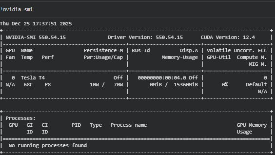
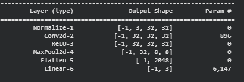
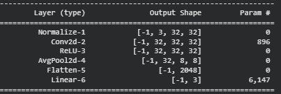
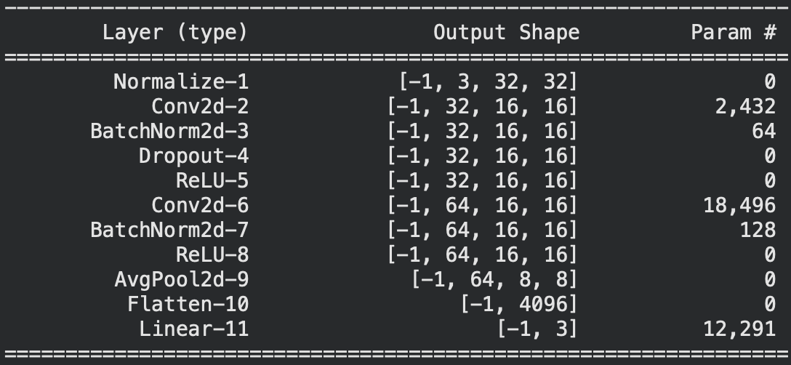

# Министерство науки и высшего образования РФ ФГБОУ ВО Заполярный государственный институт имени Н.М.Федоровского

## Технологии программирования. Лабораторная работа №2(5)

_Работу выполнил:_

_Студент группы ИС-22_

_Шелепов Денис Владимирович_

_Работу проверил:_

_Сидельников Максим Эдуардович_

_Дата выполнения работы: 18.11.2025_

## Задание

1. Выбрать свои классы и обучить сверточную нейронную сеть из примера, используя GPU
2. Повысить точность модели.
3. Провести три обучения для 3 разных тактик пуллинга. Сравнить достигнутое качество, время обучения и степень переобучения:
   1. Пуллинг с помощью шага свёртки stride,
   2. Макс пуллинг,
   3. Усредняющий пуллинг.
4. Выбрать лучшую конфигурацию.
5. Сохранить модель.

## Ход работы



## Задание 2

Повысить точность модели с 88.00% до 91% путем добавления слоев BancNorm2d и изменения аргументов stride и padding в первом сверточном слое.

## Задание 3

Для создания новых моделей были добавлены следующие методы:

```python
# Пуллинг с помощью шага свёртки stride
def stridePulling(self):
   return nn.Sequential(
      Normalize([0.5074,0.4867,0.4411],[0.2011,0.1987,0.2025]),
      nn.Conv2d(3, self.hidden_size, 5, stride=4, padding=2),
      nn.ReLU(),
      nn.Flatten(),
      nn.Linear(self.hidden_size * 8 * 8, self.classes),
   ).to(device)

```

```python
# Макс пуллинг
def maxPulling(self):
   return nn.Sequential(
      Normalize([0.5074,0.4867,0.4411],[0.2011,0.1987,0.2025]),
      nn.Conv2d(3, self.hidden_size, kernel_size=3, padding=1),
      nn.ReLU(),
      nn.MaxPool2d(4),
      nn.Flatten(),
      nn.Linear(self.hidden_size * 8 * 8, self.classes),
   ).to(device)
```

```python
# Усредняющий пуллинг
def averagePulling(self):
   return nn.Sequential(
      Normalize([0.5074,0.4867,0.4411],[0.2011,0.1987,0.2025]),
      nn.Conv2d(3, self.hidden_size, kernel_size=3, padding=1),
      nn.ReLU(),
      nn.AvgPool2d(4),
      nn.Flatten(),
      nn.Linear(self.hidden_size * 8 * 8, self.classes),
   ).to(device)
```

В результате были собраны 4 модели:

1. Пуллинг с помощью шага свёртки stride

   

2. Макс пуллинг

   

3. Усредняющий пуллинг

   

> Далее ориетнация по моделям будет происходит согласно их номерам

Для обучения моделей использовался метод который так же отображает процесс обучения:

```python
criterion = nn.CrossEntropyLoss()
  optimizer = optim.SGD(model.parameters(), lr=5e-3, momentum=0.9)

  EPOCHS = 500
  REDRAW_EVERY = 20
  steps_per_epoch = len(dataloader['train'])
  steps_per_epoch_val = len(dataloader['test'])
  pbar = tqdm(total=EPOCHS*steps_per_epoch)
  losses = []
  losses_val = []
  passed = 0
  for epoch in range(EPOCHS):
      tmp = []
      model.train()
      for i, batch in enumerate(dataloader['train'], 0):
          inputs, labels = batch
          inputs, labels = inputs.to(device), labels.to(device)

          optimizer.zero_grad()

          outputs = model(inputs)
          loss = criterion(outputs, labels)
          loss.backward()
          optimizer.step()

          accuracy = (labels.detach().argmax(dim=-1)==outputs.detach().argmax(dim=-1)).\
                      to(torch.float32).mean().cpu()*100
          tmp.append((loss.item(), accuracy.item()))
          pbar.update(1)
      losses.append((np.mean(tmp, axis=0),
                    np.percentile(tmp, 25, axis=0),
                    np.percentile(tmp, 75, axis=0)))
      tmp = []
      model.eval()
      with torch.no_grad():
          for i, data in enumerate(dataloader['test'], 0):
              inputs, labels = data
              inputs, labels = inputs.to(device), labels.to(device)

              outputs = model(inputs)
              loss = criterion(outputs, labels)
              accuracy = (labels.argmax(dim=-1)==outputs.argmax(dim=-1)).\
                          to(torch.float32).mean().cpu()*100
              tmp.append((loss.item(), accuracy.item()))

      losses_val.append((np.mean(tmp, axis=0),
                        np.percentile(tmp, 25, axis=0),
                        np.percentile(tmp, 75, axis=0)))
      if (epoch+1) % REDRAW_EVERY != 0:
          continue
      clear_output(wait=False)
      passed += pbar.format_dict['elapsed']
      pbar = tqdm(total=EPOCHS*steps_per_epoch, miniters=5)
      pbar.update((epoch+1)*steps_per_epoch)
      x_vals = np.arange(epoch+1)
      _, ax = plt.subplots(1, 2, figsize=(15, 5))
      stats = np.array(losses)
      stats_val = np.array(losses_val)
      ax[1].set_ylim(stats_val[:, 0, 1].min()-5, 100)
      ax[1].grid(axis='y')
      for i, title in enumerate(['CCE', 'Accuracy']):
          ax[i].plot(x_vals, stats[:, 0, i], label='train')
          ax[i].fill_between(x_vals, stats[:, 1, i],
                            stats[:, 2, i], alpha=0.4)
          ax[i].plot(x_vals, stats_val[:, 0, i], label='val')
          ax[i].fill_between(x_vals,
                            stats_val[:, 1, i],
                            stats_val[:, 2, i], alpha=0.4)
          ax[i].legend()
          ax[i].set_title(title)
      plt.show()
```

В результате тестирования из трех моделей задания, самой быстрой оказалась модель `1`. Самый большой процент ответов был у модели `2`. Все представленные модели оказались сильно переобучены о чем говорит разница между большая разница между test_accuracy и train_accuracy. Это значит что модель сконцентрировалась на шумах тестовых изображений.

## Задание 4

Наилучая модель с точностью 0.91 была выбрана со следующими параметрами:


Данная модель является модификацией модели из примера с добавлением слоев dropout и BanchNorm2D, она же и будет использоваться для последующего сохранения, так как ее точность оказалась наивысшей, а именно 91%.

## Задание 5

Модель была сохранена с сохранением всей архитектуры

## Вывод

В процессе выполнения работы удалось познакомится с новой архитектурой нейронных сетей. Сверточные нейронные сети. Так же в рамках выполнение были изучены способы свертки сети и способы сохранения модели для последующего переиспользования.

Для возможности переноса модели использовалась библиотека onnx. С ее помощью была экспортирована сохраненная модель, что потенциально позволяет использовать ее в таких фреймворках как Tensorflow или scikit-learn.
