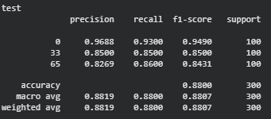
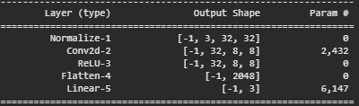

# Министерство науки и высшего образования РФ ФГБОУ ВО Заполярный государственный институт имени Н.М.Федоровского

## Технологии программирования. Лабораторная работа №2(5)

_Работу выполнил:_

_Студент группы ИС-22_

_Шелепов Денис Владимирович_

_Работу проверил:_

_Сидельников Максим Эдуардович_

_Дата выполнения работы: 18.11.2025_

## Задание

1. Выбрать свои классы и обучить сверточную нейронную сеть из примера, используя GPU
2. Повысить точность модели.
3. Провести три обучения для 3 разных тактик пуллинга:
   1. Пуллинг с помощью шага свёртки stride,
   2. Макс пуллинг,
   3. Усредняющий пуллинг.
4. Сравнить достигнутое качество, время обучения и степень переобучения.
5. Выбрать лучшую конфигурацию.
6. Сохранить модель.

## Ход работы


## Задание 2

Повысить точность модели на 1.

Точность модели до улучшения:



Для создания новых моделей были добавлены следующие методы:

```python
# Пуллинг с помощью шага свёртки stride
def stridePulling(self):
   return nn.Sequential(
      Normalize([0.5074,0.4867,0.4411],[0.2011,0.1987,0.2025]),
      nn.Conv2d(3, self.hidden_size, 5, stride=4, padding=2),
      nn.ReLU(),
      nn.Flatten(),
      nn.Linear(self.hidden_size * 8 * 8, self.classes),
   ).to(device)

```

```python
# Макс пуллинг
def maxPulling(self):
   return nn.Sequential(
      Normalize([0.5074,0.4867,0.4411],[0.2011,0.1987,0.2025]),
      nn.Conv2d(3, self.hidden_size, kernel_size=3, padding=1),
      nn.ReLU(),
      nn.MaxPool2d(4),
      nn.Flatten(),
      nn.Linear(self.hidden_size * 8 * 8, self.classes),
   ).to(device)
```

```python
# Усредняющий пуллинг
def averagePulling(self):
   return nn.Sequential(
      Normalize([0.5074,0.4867,0.4411],[0.2011,0.1987,0.2025]),
      nn.Conv2d(3, self.hidden_size, kernel_size=3, padding=1),
      nn.ReLU(),
      nn.AvgPool2d(4),
      nn.Flatten(),
      nn.Linear(self.hidden_size * 8 * 8, self.classes),
   ).to(device)
```

В результате были собраны 4 модели:

1. Модель из примера

   

2. Пуллинг с помощью шага свёртки stride

   

3. Макс пуллинг

   

4. Усредняющий пуллинг

   

> Далее ориетнация по моделям будет происходит согласно их номерам

По результатам тестирования на тестовой выборке из 300 элементов наибольшую точность в 88.33% показала модель `1`

Из моделей задания наибольшую точность на тестовой выборке показала модель `3` с результатом 85.33%

## Вывод
