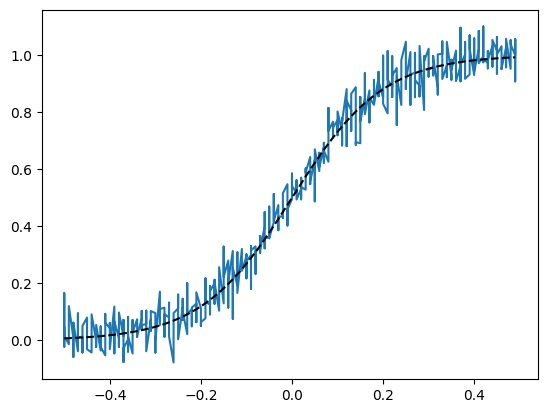
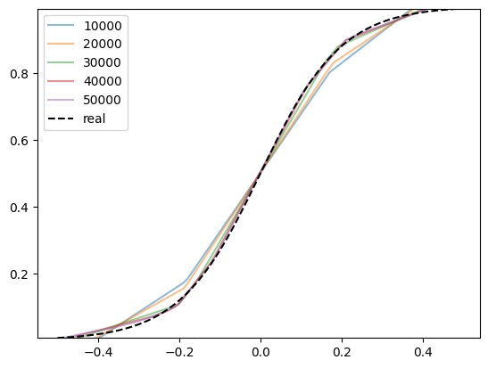
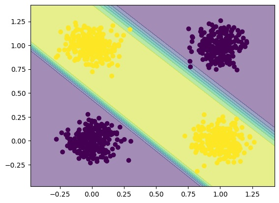
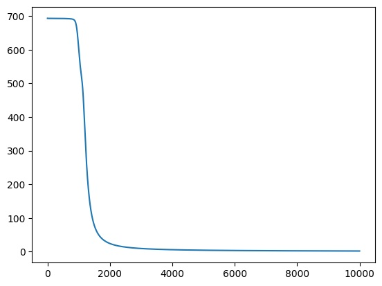
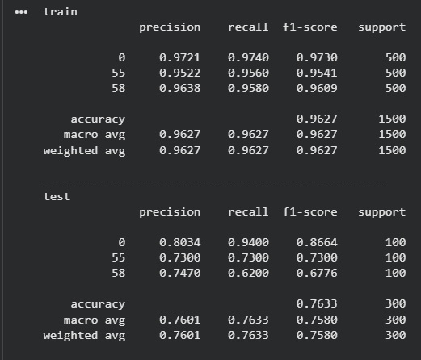
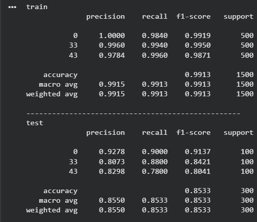

# Лабораторная работа № 1.1

## План: Необходимо познакомиться с фреймворком машинного обучения PyTorch и выполнить три задания:

1. Регрессия по теореме универсальной аппроксимации, ручное дифференцирование
2. Бинарная классификация с помощью автодиффиренцирования PyTorch
3. Обучить полносвязную нейронную сеть классификации 3 классов изображений из набора данных CIFAR100 по варианту из примера и затем повысить точность на тестовой выборке.

## Задание №1. Регрессия по теореме универсальной аппроксимации, ручное дифференцирование.

### Теорема универсальной аппроксимации

- Теорема универсальной аппроксимации утверждает, что нейронная сеть с одним скрытым слоем может приблизить любую непрерывную функцию. Обучение проводится методом градиентного спуска с вычислением производных через обратное распространение ошибки.

### Данные

- Целевая функция: сигмоида y = 1/(1+exp(-10X))

- Добавлен гауссовский шум

### Модель и обучение
- Архитектура: 1 → 64 → 1 (ReLU)

- 50,000 итераций градиентного спуска

- Learning rate: 0.0001

- Ручное вычисление градиентов

### Результаты

- График демонстрирует четкую сигмоидальную зависимость, искаженную добавленным шумом, что создает реалистичную задачу регрессии

- На рисунке 2 показан процесс обучения: предсказания модели после 10,000, 20,000, 30,000, 40,000 и 50,000 итераций.

- Можно наблюдать, как с каждой новой порцией итераций предсказания модели (цветные кривые) становятся все ближе к целевой функции (черная пунктирная линия). После 50 000 итераций кривая практически совпадает с исходной сигмоидой, демонстрируя успешность аппроксимации.

## Вывод
Модель успешно аппроксимировала сигмоидальную функцию, что подтверждает теорему универсальной аппроксимации и эффективность градиентного спуска с ручным дифференцированием, о чём наглядно свидетельствует процесс обучения, отражённый на графиках

## Часть 2. Бинарная классификация с помощью автодиффиренцирования PyTorch

- Задача бинарной классификации, в данном случае реализация логической функции XOR, представляет собой классический пример линейно неразделимой задачи. Для ее решения требуется модель, способная улавливать нелинейные зависимости между признаками. Автоматическое дифференцирование (autograd) в PyTorch позволяет автоматически вычислять градиенты для всех параметров модели, упрощая процесс реализации обратного распространения ошибки.

### Данные 

- Сгенерирован набор данных для задачи XOR (1000 точек)

- Класс определяется как результат операции XOR между бинарными координатами точки

- Добавлен гауссовский шум (σ = 0.1) 

- На рисунке 1 представлены исходные данные задачи XOR

- График показывает четыре кластера точек в шахматном порядке: класс 0 (синие) и класс 1 (желтые) чередуются, наглядно демонстрируя линейную неразделимость задачи. Добавленный шум делает распределение более реалистичным.

- На рисунке 2 показана динамика функции потерь в процессе обучения.

- График отображает быстрое уменьшение ошибки в первые 2,000 итераций с последующей плавной сходимостью. К 10,000 итерациям значение функции потерь стабилизируется на низком уровне, что свидетельствует об успешном обучении модели.

## Вывод 
Модель успешно решила линейно неразделимую задачу XOR с использованием автоматического дифференцирования PyTorch, о чем свидетельствуют корректное распределение точек на рисунке 1 и сходящаяся кривая обучения на рисунке 2, демонстрирующая эффективность алгоритма оптимизации.

# Часть 3. Классификация изображений CIFAR100

- Классификация изображений CIFAR-100 — это задача компьютерного зрения, в которой модель должна определить, к какому из 100 классов относится изображение. Датасет CIFAR-100 содержит 60 000 цветных изображений размером 32×32 пикселя, равномерно распределённых по 100 классам (по 600 изображений на класс: 500 для обучения и 100 для тестирования). Классы объединены в 20 суперкатегорий (например, "животные", "транспорт", "растения").

-далее я ознакомился с реализацией данной задачи из медодических рекомендаций :

Архитектурные параметры:

- Тип сети: Однослойный перцептрон (MLP)

- Структура: 3072 → 10 → 3 нейронов

- Активация: ReLU только в скрытом слое

Нормализация: Стандартная по каналам RGB ([0.5074,0.4867,0.4411]/[0.2011,0.1987,0.2025])

Параметры обучения:

- Оптимизатор: SGD (Stochastic Gradient Descent)

- Learning rate: 0.005

- Batch size: 128

- Количество эпох: 100

- Функция потерь: CrossEntropyLoss

На рисунке ниже преведены результаты после тестирования

- Далее по заданию требовалось ("Обучить полносвязную нейронную сеть классификации 3 классов изображений из набора данных CIFAR100 по варианту из примера и затем повысить точность на тестовой выборке.") 

- Я решил сократить количество эпох но добавить Dense слоя, Dropout слоя, и BatchNormalization слоя а также увеличить число нейронов до 3

Архитектурные параметры:

- Тип сети: Многослойный персептрон

- Активация: ReLU во всех скрытых слоях

- Нормализация: BatchNorm

Параметры обучения:

- Оптимизатор: Adam (Adaptive Moment Estimation)

- Learning rate: 0.001

- Batch size: 128

- Количество эпох: 100

- Функция потерь: CrossEntropyLoss

На рисунке ниже преведены результаты после тестирования

# Вывод
Новая многослойная модель с применением современных методов (таких как BatchNorm, Dropout и оптимизатор Adam) показала качественный рост по сравнению с базовой. Её итоговая точность повысилась на 4–9%, а качество классификации по всем категориям стало заметно более сбалансированным.

