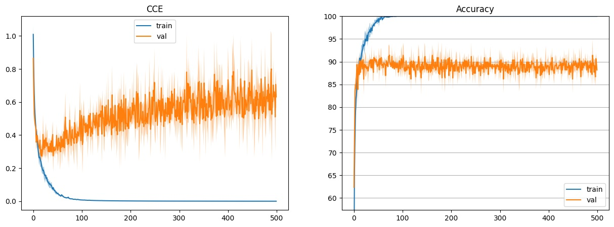
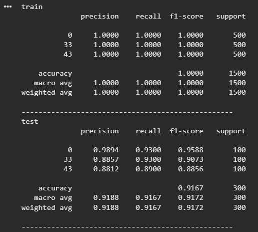
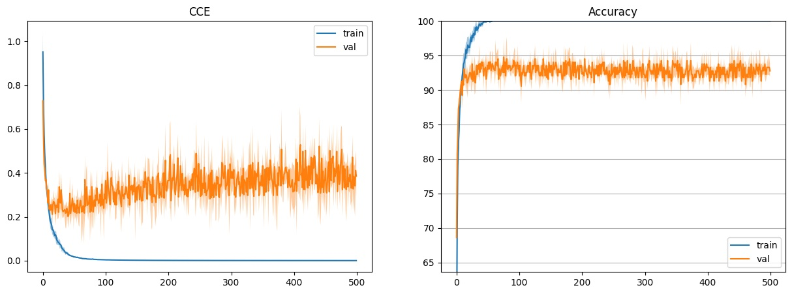
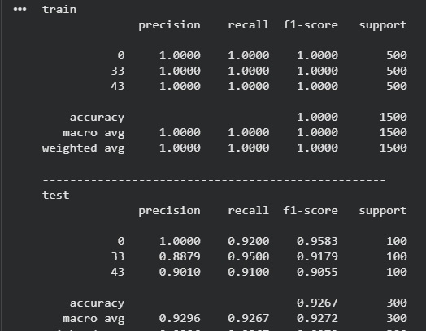
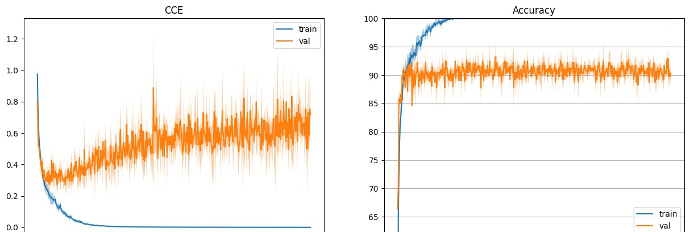
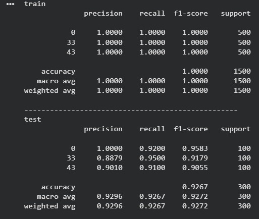

# Лабораторная работа №2.2


Задание: Выбрать собственные классы изображений и обучить на них свёрточную нейронную сеть (CNN), используя GPU для ускорения расчётов, после чего применить методы для повышения итоговой точности модели; провести три цикла обучения с разными типами операций пулинга — пулинг через увеличение шага свёртки (stride), максимальный пулинг (max pooling) и усредняющий пулинг (average pooling) — и сравнить их по ключевым показателям: достигнутому качеству классификации, времени обучения и степени переобучения, чтобы выбрать лучшую конфигурацию, сохранить окончательную модель и, наконец, перезапустить среду выполнения, что приведёт к очистке всех текущих переменных.


- Используются бибилиотеки для:
Импортируются библиотеки для:

1 Работы с тензорами и нейронными сетями (torch)

2 Визуализации (matplotlib)

3 Оценки качества (sklearn.metrics)

4 Прогресс-бара (tqdm)

5 Обработки изображений (PIL)


- Определяем видеокарту GPU, чтобы на ней учить нейронную сеть

```
device = torch.device('cuda' if torch.cuda.is_available() else 'cpu')
```
- Загрузка данных CIFAR-100
```
!wget https://www.cs.toronto.edu/~kriz/cifar-100-python.tar.gz
!tar -xvzf cifar-100-python.tar.gz
```
- Чтение и подготовка данных

```
CLASSES = [0, 55, 58]
```
- Загружаются тренировочные и тестовые данные

- Выбираются только изображения указанных классов

- Данные нормализуются и преобразуются в тензоры PyTorch

- Создаются DataLoader для пакетной обработки


- Архитектура модели CNN

```python
class Cifar100_CNN(nn.Module):
    def __init__(self, hidden_size=32, classes=100):
        super(Cifar100_CNN, self).__init__()
        # https://blog.jovian.ai/image-classification-of-cifar100-dataset-using-pytorch-8b7145242df1
        self.seq = nn.Sequential(
            Normalize([0.5074,0.4867,0.4411],[0.2011,0.1987,0.2025]),
           
            nn.Conv2d(3, HIDDEN_SIZE, 5, stride=4, padding=2),
            nn.ReLU(),
            
            nn.Conv2d(HIDDEN_SIZE, HIDDEN_SIZE*2, 3, stride=1, padding=1),
            nn.ReLU(),
            nn.AvgPool2d(4),#nn.MaxPool2d(4),
            nn.Flatten(),
            nn.Linear(HIDDEN_SIZE*8, classes),
        )

    def forward(self, input):
        return self.seq(input)

```

-  Обучение модели

```python
criterion = nn.CrossEntropyLoss()
optimizer = optim.SGD(model.parameters(), lr=5e-3, momentum=0.9)
```

- Оценка качества модели
```python
print(classification_report(...))
```
- Сохранение модели

```python
torch.onnx.export(model, x, "cifar100_CNN.onnx", ...)
```

## Далее нужно было выбрать свои классы и обучить сверточную нейронную сеть из примера, используя GPU, а затем провести три обучения для 3 разных тактик пуллинга: пуллинг с помощью шага свёртки stride, макс пуллинг, усредняющий пуллинг. Сравнить достигнутое качество, время обучения и степень переобучения. Выбрать лучшую конфигурацию. Сохранить модель. Перезапустить среду выполнения - теряются все текующие переменные.

```
CLASSES = [0, 33, 43]
```


### Пуллинг с помощью шага свёртки stride

- Это увеличение шага в свёрточном слое: фильтр перепрыгивает через пиксели, пропуская информацию между ними для быстрого уменьшения размерности.

```python
class Cifar100_CNN(nn.Module):
    def __init__(self, hidden_size=32, classes=100):
        super(Cifar100_CNN, self).__init__()
        self.seq = nn.Sequential(
            Normalize([0.5074,0.4867,0.4411],
                      [0.2011,0.1987,0.2025]),

            nn.Conv2d(3, hidden_size, kernel_size=5, stride=4, padding=2),
            nn.ReLU(),

            nn.Conv2d(hidden_size, hidden_size*2, kernel_size=3, stride=1, padding=1),
            nn.ReLU(),

            nn.Flatten(),
            nn.Linear(hidden_size*2 * 8 * 8, classes),
        )

    def forward(self, x):
        return self.seq(x)


```
Ниже представлен график кривые обучения свёрточной нейронной сети при использовании шага свёртки в качестве метода уменьшения размерности через stride



- По графикам функции потерь и точности видно, что модель очень быстро сходится на обучающей выборке: значение функции потерь стремится к нулю, а точность достигает 100%. При этом на валидационной выборке наблюдается рост значения функции потерь после начального снижения и стабилизация точности на уровне около 89–91%. Это свидетельствует о выраженном переобучении модели, обусловленном уменьшением размерности изображения за счёт увеличенного шага свёртки, что приводит к потере части пространственной информации.

Время: 
- Обучение закончено за 38.17748737335205 секунд

Результаты проверки



- Из таблицы классификационных метрик видно, что на обучающей выборке модель демонстрирует идеальные показатели точности, полноты и F1-меры для всех классов. Однако на тестовой выборке общая точность снижается до 91.67%, при этом качество классификации заметно различается между классами. Наиболее слабые результаты наблюдаются для одного из классов, что подтверждает низкую обобщающую способность модели при использовании уменьшения размерности через шаг свёртки.


### Макс-пуллинг (Max Pooling)

Это отдельный слой, который берёт квадрат пикселей и оставляет только самый яркий/важный, выбрасывая всё остальное.

```python
class Cifar100_CNN(nn.Module):
    def __init__(self, hidden_size=32, classes=100, nn=None):
        super(Cifar100_CNN, self).__init__()
        self.seq = nn.Sequential(
            Normalize([0.5074, 0.4867, 0.4411],
                      [0.2011, 0.1987, 0.2025]),

            nn.Conv2d(3, hidden_size, kernel_size=5, stride=1, padding=2),
            nn.ReLU(),

            nn.Conv2d(hidden_size, hidden_size * 2, kernel_size=3, stride=1, padding=1),
            nn.ReLU(),


            nn.MaxPool2d(kernel_size=4),

            nn.Flatten(),
            nn.Linear(hidden_size * 2 * 8 * 8, classes),
        )

    def forward(self, x):
        return self.seq(x)

```
- Ниже представлен график кривые обучения свёрточной нейронной сети при использовании MaxPooling




Графики показывают устойчивое снижение функции потерь и рост точности на обучающей выборке до 100%. На валидационной выборке значение функции потерь остаётся значительно ниже по сравнению с вариантом со stride, а точность стабилизируется на уровне 92–94%. Разрыв между обучающей и тестовой кривыми выражен слабее, что указывает на более эффективное обобщение и меньшую степень переобучения при использовании MaxPooling.


Время: 
- Обучение закончено за 98.3698422908783 секунд

Результаты проверки



Таблица классификационных метрик подтверждает высокое качество модели с MaxPooling: на тестовой выборке достигается точность 92.67%, а значения precision, recall и F1-меры являются высокими и более равномерными для всех классов по сравнению с первым вариантом. Это указывает на способность MaxPooling сохранять наиболее значимые признаки изображения и повышать устойчивость модели к вариациям входных данных.

## Усредняющий пуллинг (Average Pooling) 
Это отдельный слой, который берёт квадрат пикселей и вычисляет их среднее значение, сохраняя общую картину.

```python
class Cifar100_CNN(nn.Module):
    def __init__(self, hidden_size=32, classes=100):
        super(Cifar100_CNN, self).__init__()
        self.seq = nn.Sequential(
            Normalize([0.5074,0.4867,0.4411],
                      [0.2011,0.1987,0.2025]),

            nn.Conv2d(3, hidden_size, kernel_size=5, stride=1, padding=2),
            nn.ReLU(),

            nn.Conv2d(hidden_size, hidden_size*2, kernel_size=3, stride=1, padding=1),
            nn.ReLU(),

            nn.AvgPool2d(kernel_size=4),

            nn.Flatten(),
            nn.Linear(hidden_size*2 * 8 * 8, classes),
        )

    def forward(self, x):
        return self.seq(x)

```
Ниже представлен график кривые обучения свёрточной нейронной сети при использовании AveragePooling



На графиках обучения видно, что модель с AveragePooling также успешно обучается и достигает высокой точности на обучающей выборке. Однако значение функции потерь на валидационной выборке выше и демонстрирует более заметные колебания по сравнению с вариантом с MaxPooling. Это свидетельствует о том, что усредняющий пуллинг приводит к сглаживанию признаков, что снижает способность модели выделять наиболее информативные детали изображения.

Время: 
- Обучение закончено за Обучение закончено за 99.91791105270386 секунд

Результаты проверки



Из таблицы метрик следует, что модель с AveragePooling демонстрирует точность 92.67% на тестовой выборке, что сопоставимо с вариантом MaxPooling. Тем не менее, значения F1-меры по отдельным классам несколько ниже и менее устойчивы, что указывает на более слабое выделение ключевых признаков при использовании усредняющего пуллинга по сравнению с максимальным.

# Вывод
В ходе лабораторной работы была разработана и обучена свёрточная нейронная сеть для классификации изображений датасета CIFAR-100 по трём выбранным классам с использованием графического ускорителя. Были исследованы три способа уменьшения пространственной размерности карт признаков: с помощью шага свёртки, MaxPooling и AveragePooling. Экспериментальные результаты показали, что уменьшение размерности через шаг свёртки обеспечивает более быстрое обучение, однако приводит к выраженному переобучению и снижению обобщающей способности модели. Использование усредняющего пуллинга позволяет получить более стабильное обучение, но уступает по точности классификации. Наилучшие результаты по качеству и устойчивости модели были достигнуты при использовании MaxPooling, что обусловлено сохранением наиболее значимых признаков изображения и снижением влияния шума.