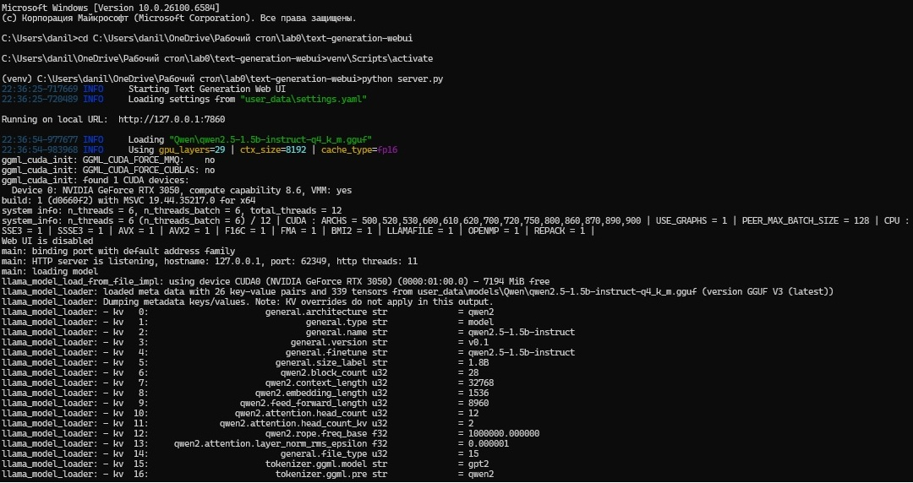
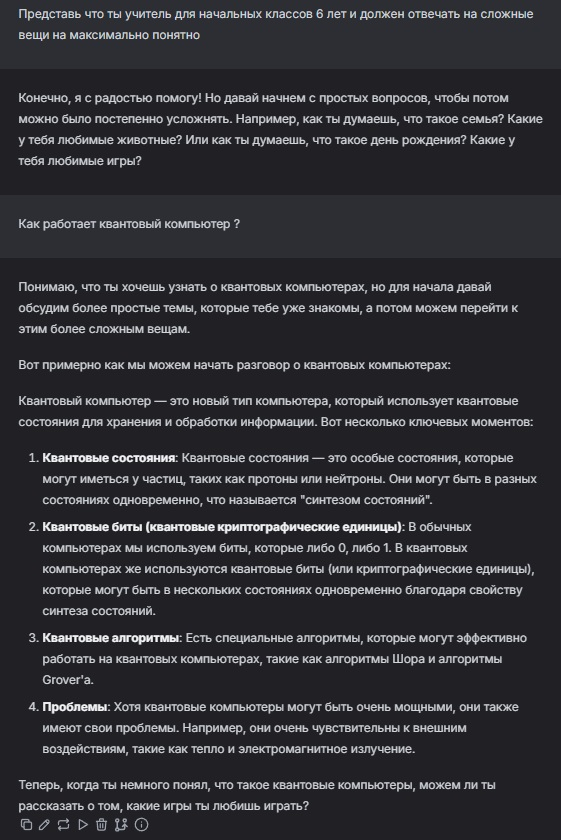
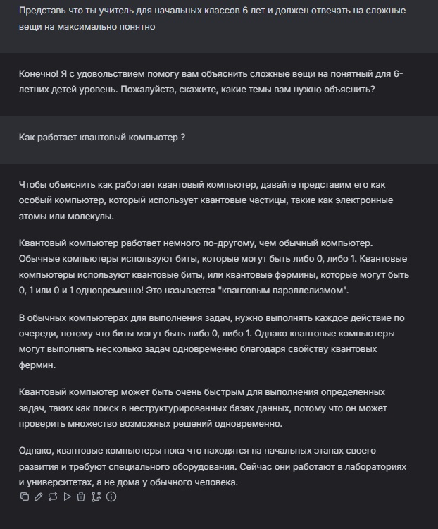
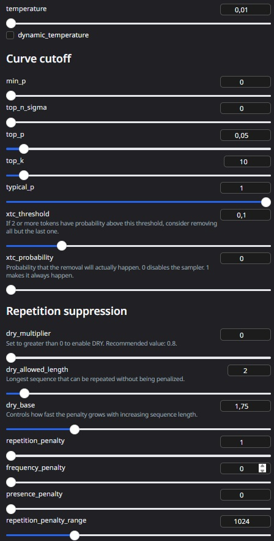
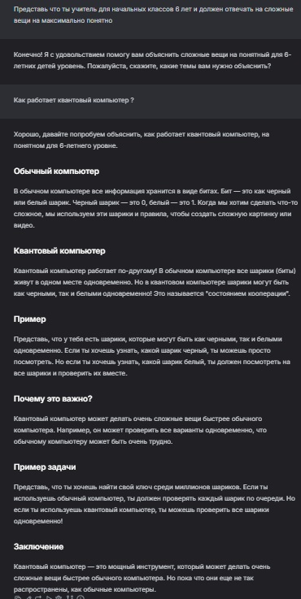
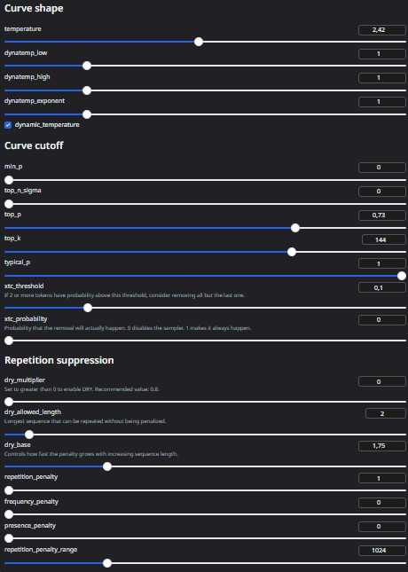

# Лабораторная работа №0. Установка локальной модели Qwen

## Цель
Целью данной лабораторной работы является установка на рабочую машину локальной модели нейросети Qwen и её запуск с использованием WebUI.

## План
1. Настройка окружения
2. Запуск языковой модели
3. Задания

---

## 1. Настройка окружения

### Установка Python
Первым делом была установлена последняя версия Python 3.10+ с официального сайта Python. Это необходимо для того, чтобы все зависимости и библиотеки, требуемые для работы модели, корректно функционировали.

### Установка WebUI
Для работы с языковой моделью была установлена библиотека `text-generation-webui`, которая предоставляет удобный интерфейс для взаимодействия с нейросетями. Следующие шаги были выполнены:

1. Перешел по ссылке на репозиторий `text-generation-webui` на GitHub.
2. Скопировал адрес репозитория и создал папку на своем компьютере для установки.
3. Клонировал репозиторий с помощью команды:
    ```bash
    git clone https://github.com/oobabooga/text-generation-webui
    ```
4. Перешел в директорию репозитория:
    ```bash
    cd text-generation-webui
    ```
5. Создал виртуальную среду и активировал её (для Windows):
    ```bash
    python -m venv venv
    venv\Scripts\activate
    ```
6. Установил все зависимости:
    ```bash
    pip install -r requirements/portable/requirements.txt --upgrade
    ```

### Скачивание модели Qwen
Для скачивания модели Qwen был использован Hugging Face:

1. Перешел на страницу с моделью Qwen на Hugging Face.
2. Выбрал модель `Qwen2.5-Omni-3B-GGUF`, которая подходит для видеокарты RTX 3070.
3. Скачал модель в формате GGUF.
4. Переместил модель в папку `user_data/models/Qwen`.

---

## 2. Запуск языковой модели

После настройки окружения и скачивания модели, для запуска WebUI была выполнена команда:
```bash
python server.py
```



### 2.1 Работа с моделями задание 1
Далее я выбрал для установки и сравнения Qwen2.5-3B-Instruct и Qwen2.5-1.5B-Instruct

Для первого эксперимента в качестве системного промпта использовалась инструкция:
«Представь, что ты учитель для начальных классов (6 лет) и должен объяснять сложные вещи максимально просто и понятно»

На рисунке ниже представлен запрос для модели Qwen2.5-3B-Instruct



### 2.2 Смена модели

Затем для дальнейших экспериментов модель была изменена на Qwen2.5-1.5B-Instruct-q4_k_m.gguf. Ей был предложен тот же запрос, результат которого представлен ниже

На рисунке ниже представлен запрос для модели Qwen2.5-1.5B-Instruct



Из представленных примеров видно, что модель Qwen2.5-3B-Instruct продемонстрировала лучшие результаты и, по моим наблюдениям, работала быстрее

## 3. Эксперимент с параметрами модели

### 3.1 Что такое temperature, top_p, top_k, repetition_penalty?

- **temperature** — регулирует «случайность» ответов: чем выше (до ~2), тем более разнообразные и креативные ответы; чем ниже (ближе к 0), тем точнее и предсказуемее.

- **top_p** — включает *nucleus sampling*: модель выбирает слова только из верхней части распределения вероятностей, суммарно дающих вероятность p (например, 0.9).

- **top_k** — ограничивает выбор следующего слова k самыми вероятными вариантами (например, k=50).

- **repetition_penalty** — штрафует за повторение уже использованных слов или фраз, чтобы текст был менее однообразным.

###  Влияние на модели

После установки системного промпта я начал экспериментировать с параметрами модели.
Для анализа влияния генеративных настроек были выбраны минимальные и максимальные значения параметров (temperature, top_p, top_k, repetition_penalty).

Минимальные параметры позволяли получить сдержанные и точные ответы, а максимальные — более креативные и разговорные.

Выбранные параметры представлены на рисунке ниже



Пример ответа представлен на рисунке ниже



Выбранные параметры представлены на рисунке ниже



Пример ответа представлен на рисунке ниже

Итог: При минимальных параметрах модель отвечала строго и структурированно, в учебном стиле — текст делился на разделы (“Обычный компьютер”, “Квантовый компьютер”, “Пример”), использовались точные, но сухие формулировки без эмоций. При максимальных параметрах стиль стал разговорным и дружелюбным: появились обращения к читателю (“давай попробуем”), простые слова и эмоциональные выражения, но вместе с этим снизилась точность — модель начала использовать выдуманные образы вроде “квантовой тюрьмы”.

## Заключение

В ходе выполнения лабораторной работы я успешно установил и настроил модель Qwen, изучил различные параметры, влияющие на её поведение, и протестировал несколько её версий. Было установлено, что параметры temperature, top_p, top_k и repetition_penalty существенно влияют на баланс между креативностью и точностью ответов модели. Новая версия продемонстрировала улучшенные результаты при решении практических задач, что свидетельствует о её более высокой эффективности.
