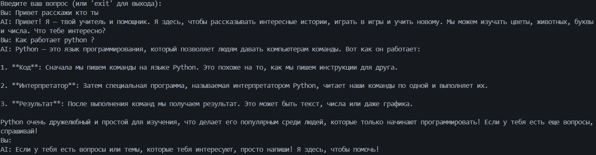
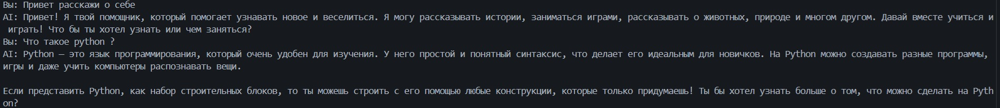
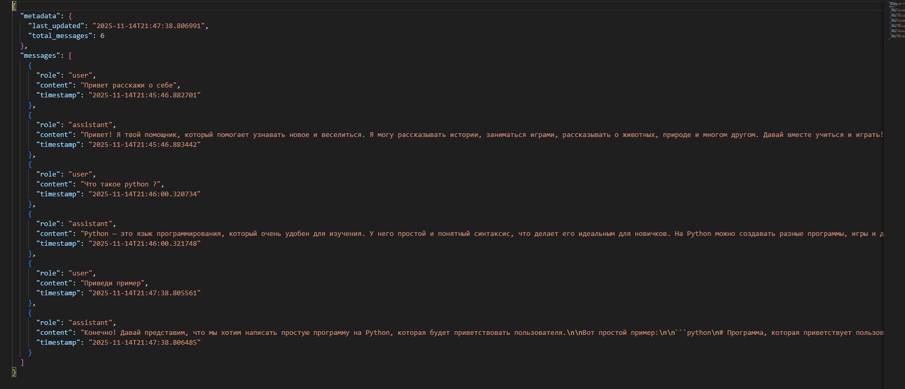

# Лабораторная работа №1. Знакомство с OpenAI API. Написание простого текстового ассистента

<ins>Цель</ins>: научиться работать с OpenAI API, чтобы создать простого текстового ассистента, который может отвечать на ваши вопросы.

---

## План

1. ✅ Настройка окружения;
2. ✅ Обращение к OpenAI Responses API;
3. ✅ Главный цикл;
4. ✅ Troubleshooting;
5. ✅ Задания.

---

## Процесс выполнения

### 1. Настройка окружения

- Создано виртуальное окружение `venv`
- Окружение активировано
- Установлена библиотека `openai`
- Создан файл `requirements.txt` с зависимостями
- Создан файл `.env` для безопасного хранения API-ключа
- Добавлен `.env` в `.gitignore`

### 2. Обращение к OpenAI Responses API

- Создан файл `main.py` с базовой структурой
- Реализована функция `get_response()` для взаимодействия с API
- Настроена загрузка переменных окружения из `.env`
- Создан клиент OpenAI с использованием API-ключа

### 3. Главный цикл

- Реализован интерактивный цикл общения
- Добавлена возможность выхода из программы по команде `exit`
- Настроен вывод вопросов пользователя и ответов AI

### 4. Дальше требовалось реализовать Использование системного промпта через переменную окружения `.env`

- В функции main() системный промпт считывается напрямую:

```
system_prompt = os.getenv("SYSTEM_PROMPT")

```

- Использование системного промпта в запросе к модели

```
messages = [{"role": "system", "content": system_prompt}]
messages.extend(dialogue_history.get_messages())
messages.append({"role": "user", "content": question})
```

- Системный промпт всегда включён в messages, а значит — используется моделью при каждом запросе.

```
response = client.responses.create(
    model="gpt-4o-mini",
    input=messages
)

```


## 5. Изменение параметра TEMPERATURE

- Параметр temperature управляет степенью «креативности» и вариативности ответа языковой модели.

```
temperature = float(os.getenv("TEMPERATURE"))
```

```
response = client.responses.create(
    model="gpt-4o-mini",
    input=messages
)
```

- Ниже приведён пример ответов с **значением temperature по умолчанию** и с **увеличенным значением**, чтобы продемонстрировать разницу в стиле и вариативности генерации текста.

- TEMPERATURE=0.7



- TEMPERATURE=1.3



## 6. Ведение истории диалога

- Реализована функция сохранения истории переписки пользователя с ассистентом. История сообщений хранится и используется для поддержания контекста диалога: модель «помнит» предыдущие сообщения и учитывает их при формировании новых ответов. Это позволяет улучшить качество взаимодействия, делая ответы более релевантными и последовательными, а также обеспечивает возможность анализа предыдущих диалогов.

- История диалога реализована в отдельном классе

```
class DialogueHistory:
    def __init__(self, max_messages: int = 6, filename: str = "dialogue_history.json"):
        self.max_messages = max_messages
        self.filename = filename
        self.history: List[Dict] = []
        self.load_history()
```

- Добавление нового сообщения

```
def add_message(self, role: str, content: str):
    message = {
        "role": role,
        "content": content,
        "timestamp": datetime.now().isoformat()
    }
    self.history.append(message)
    
    if len(self.history) > self.max_messages:
        self.history = self.history[-self.max_messages:]
    
    self.save_history()

```

- Сохранение истории в JSON

```
def load_history(self):
    if os.path.exists(self.filename):
        with open(self.filename, 'r', encoding='utf-8') as f:
            data = json.load(f)
            self.history = data.get("messages", [])

```

Загрузка истории при старте

```
def load_history(self):
    if os.path.exists(self.filename):
        with open(self.filename, 'r', encoding='utf-8') as f:
            data = json.load(f)
            self.history = data.get("messages", [])

```

- Пример json файла



## Заключение

- В ходе выполнения задания была реализована консольная версия чат-бота на Python с использованием OpenAI API, которая позволяет задавать системный промпт через файл .env, вести историю диалога с ограничением до последних 6 сообщений (3 пользовательских и 3 ответа ИИ) и управлять креативностью ответов с помощью параметра temperature; в результате ИИ сохраняет контекст переписки, корректно реагирует на системный промпт и демонстрирует различное поведение при изменении температуры, что полностью соответствует поставленным требованиям и обеспечивает удобство использования и гибкость настройки модели.
