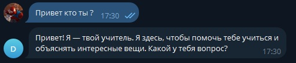
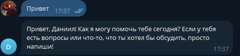
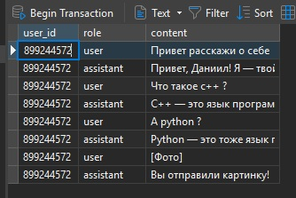
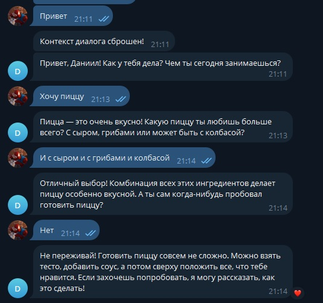
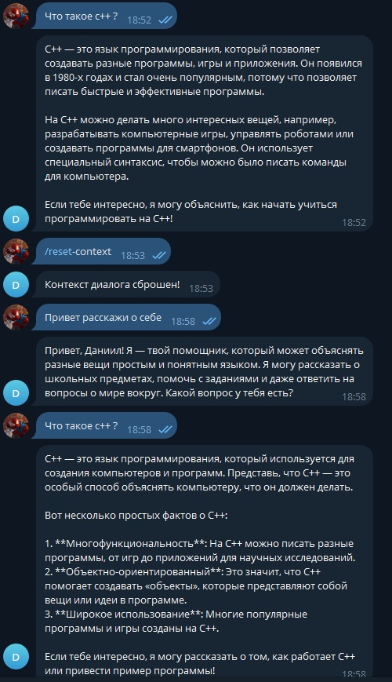

# Лабораторная работа №2. Лабораторная работа №2. Простейший чат-бот в Telegram

## План

1. Настройка окружения;
2. Написание основных функций бота;
3. Задания.

## Процесс выполнения

- Выполнив все действия, указанные в методичке ко второй лабораторной работе, я приступил к реализации заданий

### 1 Добавление к ассистенту системного промпта

- В файле config.py добавлена переменная SYSTEM_PROMPT:

```

SYSTEM_PROMPT = "Ты Учитель для детей младших классов и все объясняешь понятно"

```

В функции get_response (файл utils/gpt.py) системный промпт используется при формировании запроса к модели:

```python

from config import SYSTEM_PROMPT

async def get_response(message: str, client: AsyncOpenAI, user_id: int, user_name: str = "") -> str:
    try:
        prompt = f"{SYSTEM_PROMPT}\nПользователь: {user_name}\nВопрос: {message}"
        response = await client.responses.create(
            model="gpt-4o-mini",
            input=prompt
        )
        return response.output_text
    except Exception as e:
        logging.error(f"Error occurred: {e}")
        return "Произошла ошибка при получении ответа"


```

Пример представлен на рисунке ниже



### 2 Реализация функционала персонализированного обращения бота к пользователю по имени

- В функции обработки сообщений (handlers/messages.py) получаем имя пользователя из объекта Message

```python

user_name = message.from_user.full_name

```

- Имя пользователя передаётся в функцию get_response для формирования запроса к модели:

```python

response = await get_response(message.text, client, message.from_user.id, user_name)

```

- В utils/gpt.py системный промпт и имя пользователя используются при формировании запроса к модели

```python


prompt = f"{SYSTEM_PROMPT}\nПользователь: {user_name}\nВопрос: {message}"

```

Пример обращения представлен на рисунке ниже



### 3 Добавил базу данных для хранения сообщений

- Для реализации хранения сообщений пользователя и ответов бота была выбрана база данных SQLite, а для работы с ней использованы SQLAlchemy ORM и Alembic.


```python
from sqlalchemy import Column, Integer, String
from sqlalchemy.orm import declarative_base

Base = declarative_base()

class Message(Base):
    __tablename__ = "messages"

    id = Column(Integer, primary_key=True, autoincrement=True)
    user_id = Column(Integer, nullable=False)
    role = Column(String, nullable=False)
    content = Column(String, nullable=False)


```

```python
from typing import Sequence, Union

from alembic import op
import sqlalchemy as sa


# revision identifiers, used by Alembic.
revision: str = 'fa9bc0f46e59'
down_revision: Union[str, Sequence[str], None] = None
branch_labels: Union[str, Sequence[str], None] = None
depends_on: Union[str, Sequence[str], None] = None


def upgrade() -> None:
    """Upgrade schema."""
    # ### commands auto generated by Alembic - please adjust! ###
    op.create_table('messages',
    sa.Column('id', sa.Integer(), autoincrement=True, nullable=False),
    sa.Column('user_id', sa.Integer(), nullable=False),
    sa.Column('role', sa.String(), nullable=False),
    sa.Column('content', sa.String(), nullable=False),
    sa.PrimaryKeyConstraint('id')
    )
    # ### end Alembic commands ###


def downgrade() -> None:
    """Downgrade schema."""
    # ### commands auto generated by Alembic - please adjust! ###
    op.drop_table('messages')
    # ### end Alembic commands ###
```

Пример хранения сообщений представлен на рисунке ниже



### 4 Добавил поддержку контекста диалога

- Перед формированием запроса к модели бот извлекает историю диалога

```python

def get_user_messages(user_id: int):
    cursor.execute(
        "SELECT role, content FROM messages WHERE user_id=? ORDER BY rowid",
        (user_id,)
    )
    return cursor.fetchall()

```

- Формирование запроса к OpenAI с учётом контекста

```python

history = get_user_messages(user_id)
context_text = "\n".join([f"{role}: {content}" for role, content in history])

prompt = f"{SYSTEM_PROMPT}\nПользователь: {user_name}\n{context_text}\nAI:"
response = await client.responses.create(
    model="gpt-4o-mini",
    input=prompt
)
reply = response.output_text

save_message(user_id, "assistant", reply)


```

Пример диалога с контекстом представлен на рисунке ниже



### 5 Добавил команду /reset-context

- Создана функция для сброса истории пользователя (utils/db.py):

```python

def reset_user_context(user_id: int):
    cursor.execute("DELETE FROM messages WHERE user_id=?", (user_id,))
    conn.commit()


```

- В handlers/commands.py добавлен обработчик команды

```python

from aiogram.filters import Command
from utils.db import reset_user_context

@dp.message(Command("reset-context"))
async def reset_context_handler(message: Message):
    reset_user_context(message.from_user.id)
    await message.answer("Контекст диалога сброшен!")

```

Пример работы команды представлен на рисунке ниже



### 6 Добавьте поддержку отправки изображений

- В обработчик входящих сообщений (handlers/messages.py) добавлена проверка, содержит ли сообщение изображение

```python

async def message_handler(message: Message):
    user_id = message.from_user.id

    
    if message.photo:
        await message.answer("Вы отправили картинку!")

        
        save_message(user_id, "user", "[Фото]")
        save_message(user_id, "assistant", "Вы отправили картинку!")
        return

```

## Заключение

В ходе выполнения лабораторной работы был создан и расширен функциональный Telegram-бот на основе модели GPT. В процессе работы было настроено окружение, реализован системный промпт для формирования роли ассистента, а также добавлено персонализированное обращение к пользователю по имени.

Была интегрирована база данных SQLite для хранения истории сообщений, что позволило реализовать поддержку контекста диалога. Кроме того, добавлена команда /reset-context для сброса истории общения. Реализована обработка изображений, что расширяет возможности взаимодействия пользователя с ботом.

В результате проделанной работы бот стал более «умным», гибким и удобным в использовании, а также приближенным к реальным продуктовым решениям, использующим диалоговые модели и память о пользователе.
